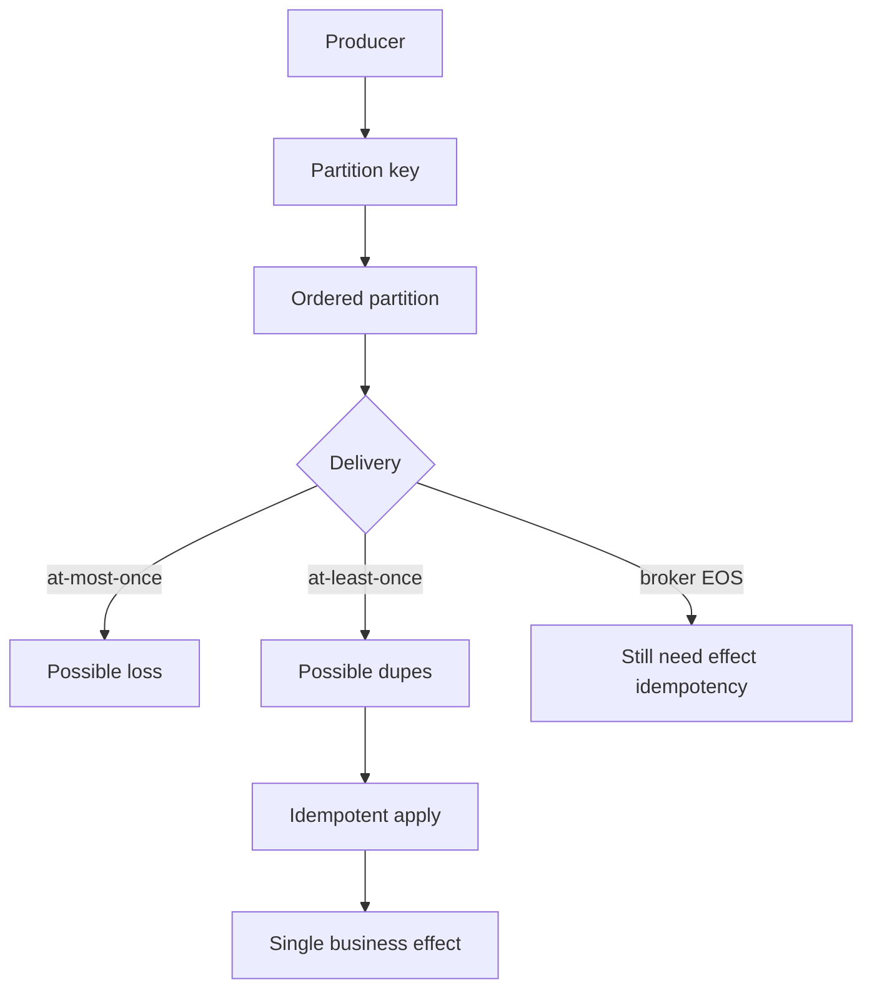
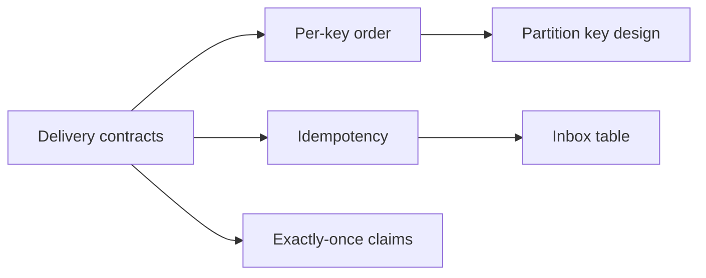
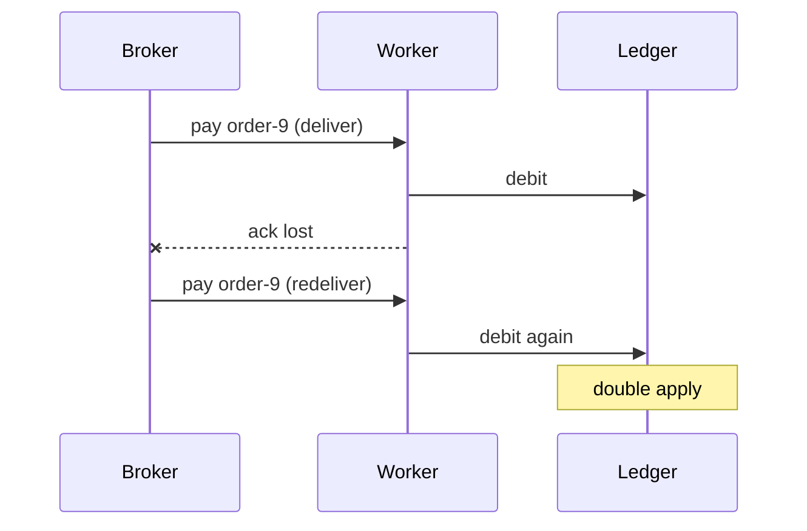

# Ordering Partitions Idempotency and Exactly-Once Claims

## Overview

**Ordering** in distributed messaging is almost always **per partition/key**, not global. **Idempotency** makes retries safe when at-least-once delivery duplicates messages. Marketing “exactly-once” usually means **effectively once**—dedupe + transactional side effects—or broker features with sharp caveats (EOS, transactional producers). Product design must state the real guarantee: at-most-once, at-least-once, or effectively-once under defined failure modes—not a slogan.

## Learning Objectives

- Explain total vs partial order and why global order kills scale
- Choose partition keys for causal chains (per user, per order)
- Design idempotent consumers (keys, upserts, outbox/inbox)
- Critique exactly-once claims in broker marketing vs end-to-end effects
- Specify delivery guarantees in API/ADR language

## Prerequisites

- [[09-System-Design/06-Messaging-Streams-and-Async-Topologies/Queue vs Log vs Pub-Sub Topology Choice|Queue vs Log vs Pub-Sub Topology Choice]]
- [[09-System-Design/03-Consistency-Models-and-CAP/Strong Eventual Causal and Read-Your-Writes|Strong Eventual Causal and Read-Your-Writes]]

## Difficulty

`expert`

## Estimated Time

- Reading: 3 hours
- Exercises: 4 hours
- Mini project: 5 hours

## History

MQ systems offered FIFO queues with throughput limits. Kafka made partition order the scalable unit. Exactly-once debates intensified with Kafka transactions and cloud FIFO queues. Incidents showed: **broker EOS ≠ business exactly-once** if the consumer side effect is a non-idempotent HTTP call.

## Problem It Solves

- **Out-of-order payments** when keys are wrong
- **Double charges** under at-least-once without idempotency
- **False confidence** in “exactly-once” checkboxes
- **Hot partitions** from over-coarse ordering keys

## Internal Implementation



| Guarantee | Meaning | Typical cost |
| --- | --- | --- |
| At-most-once | May lose | Simple, risky |
| At-least-once | May dupe | Retries + idempotency |
| Effectively-once | Dupes don’t double-apply | Inbox/idempotency store |
| Broker EOS | No dupe inside broker tx scope | Complexity; limited scope |

## Mermaid Diagrams

### Structure



### Sequence / Lifecycle — dupe without idempotency



## Examples

### Minimal Example — partition key for order causality

```typescript
export function partitionKeyForOrderEvent(orderId: string): string {
  // All events for one order share a key → per-order total order within the topic.
  return orderId;
}
```

### Production-Shaped Example — idempotent consumer with inbox

```typescript
export interface Inbox {
  tryInsert(messageId: string): Promise<"new" | "duplicate">;
}

export async function handlePayment(
  msg: { messageId: string; orderId: string; amountCents: number },
  inbox: Inbox,
  ledger: { debitOnce: (orderId: string, amountCents: number) => Promise<void> },
): Promise<"applied" | "duplicate"> {
  const gate = await inbox.tryInsert(msg.messageId);
  if (gate === "duplicate") return "duplicate";
  // Prefer transactional outbox/inbox with DB; shown as logical steps.
  await ledger.debitOnce(msg.orderId, msg.amountCents);
  return "applied";
}

/** Producer side: stable messageId = hash(orderId + eventType + version) */
export function stableMessageId(orderId: string, type: string, version: number): string {
  return `${orderId}:${type}:v${version}`;
}
```

## Trade-offs

| Dimension | Upside | Downside | When it matters |
| --- | --- | --- | --- |
| Per-key order | Scalable causality | Cross-key races remain | Orders, accounts |
| Global FIFO | Simple mental model | Throughput ceiling | Low volume only |
| At-least-once + idempotency | Practical reliability | Inbox storage | Default production |
| Broker EOS | Fewer dupes in pipeline | False end-to-end safety | Narrow scopes |

### When to Use

- Partition by entity id for causal event chains
- At-least-once + idempotent effects as the default contract
- Explicit “unordered” for high-volume telemetry
- Broker transactions only when you understand the failure scope

### When Not to Use

- Do not require global order across all users
- Do not trust EOS to make non-idempotent webhooks safe
- Outbox pattern → [[09-System-Design/06-Messaging-Streams-and-Async-Topologies/Outbox at System Scale Cross-Service Contracts|Outbox at System Scale Cross-Service Contracts]]
- Fencing for dual writers → [[09-System-Design/08-Coordination-Consensus-and-Locks/Distributed Locks Leases and Fencing Tokens|Distributed Locks Leases and Fencing Tokens]]

## Exercises

1. Break order causality with a bad partition key; fix it.
2. Implement inbox dedupe; prove redelivery is safe.
3. List end-to-end failure modes where broker EOS still double-applies.
4. Measure hot partition risk if key = `country`.
5. Write delivery guarantee text for an external partner API.

## Mini Project

**Effectively-once worker.** At-least-once broker simulator + inbox + ledger; chaos redelivery tests must pass.

## Portfolio Project

Messaging guarantees ADR in [[09-System-Design/projects/Distributed Systems Workbench/README|Distributed Systems Workbench]].

## Interview Questions

1. Why is global ordering expensive?
2. How do partition keys create partial order?
3. At-least-once vs exactly-once in practice?
4. How do idempotency keys work?
5. What does Kafka EOS actually guarantee?

### Stretch / Staff-Level

1. Design exactly-once effect across DB + outbound HTTP with inbox and fencing.
2. Compare SQS FIFO vs Kafka partition order for payment events.

## Common Mistakes

- Random keys for events that must be causal
- Ack before side effect completes
- Unique constraint missing on inbox message id
- Assuming consumer group = global order

## Best Practices

- Document **order scope** (per key) in every topic ADR
- Make message ids stable and business-meaningful when possible
- Prefer upserts / conditional writes for state materialization
- Pair with lag budgets → [[09-System-Design/06-Messaging-Streams-and-Async-Topologies/Backpressure Consumer Lag and Load Shedding|Backpressure Consumer Lag and Load Shedding]]
- Backend inbox/outbox pedagogy → [[07-Backend/07-Caching-Jobs-and-Messaging/Transactional Outbox and Inbox Patterns|Transactional Outbox and Inbox Patterns]]

## Summary

Ordering is per partition key; duplicates are normal under at-least-once; exactly-once is an end-to-end effect property built from idempotency and careful transactions—not a broker checkbox. Design keys for causality, consumers for dedupe, and ADRs for honest guarantees.

## Further Reading

- [[00-References/System Design/README|System Design References]]
- Kafka exactly-once semantics docs (read the caveats)
- Idempotent receiver patterns

## Related Notes

- [[09-System-Design/06-Messaging-Streams-and-Async-Topologies/Queue vs Log vs Pub-Sub Topology Choice|Queue vs Log vs Pub-Sub Topology Choice]]
- [[09-System-Design/06-Messaging-Streams-and-Async-Topologies/Outbox at System Scale Cross-Service Contracts|Outbox at System Scale Cross-Service Contracts]]
- [[07-Backend/07-Caching-Jobs-and-Messaging/Transactional Outbox and Inbox Patterns|Transactional Outbox and Inbox Patterns]]
- [[09-System-Design/README|System Design]]

## Progress Checklist

- [ ] Explained from first principles
- [ ] Drew at least one Mermaid diagram
- [ ] Implemented a minimal version
- [ ] Documented trade-offs and non-goals
- [ ] Completed exercises
- [ ] Practiced interview questions aloud
- [ ] Linked prerequisites and dependents
