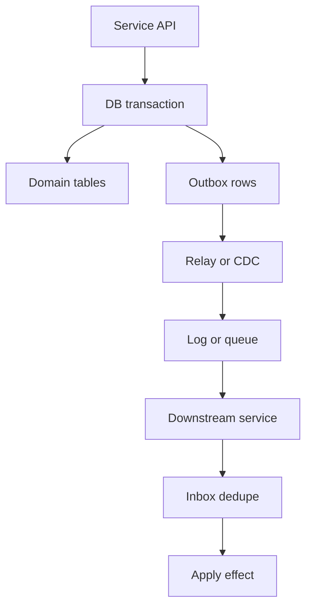
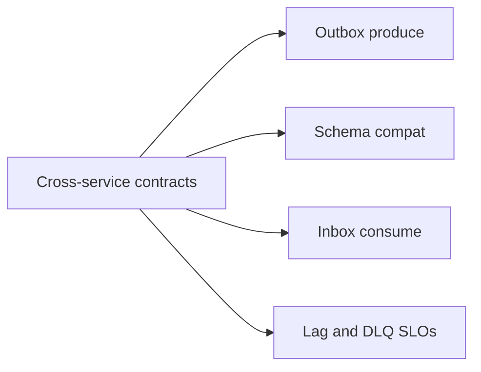
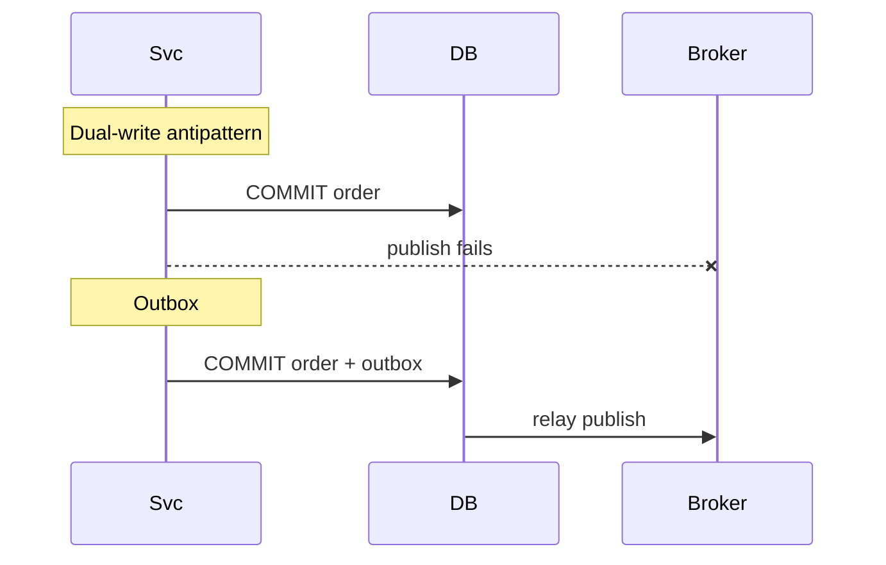

# Outbox at System Scale Cross-Service Contracts

## Overview

The **transactional outbox** atomically records domain state changes and intended messages in one database transaction; a **relay** publishes to the broker; consumers apply **inbox** dedupe. At system scale the pattern becomes a **cross-service contract**: schema evolution, ordering keys, lag SLOs, multi-region relays, and ownership of poison messages. Backend owns the single-service implementation; this note owns fleet topology—many services, shared platforms, and failure policy.

## Learning Objectives

- Restate why dual-write (DB then broker) fails under crashes
- Design outbox relay topology (polling CDC, per-service vs platform)
- Specify event contracts (idempotency keys, compatibility, PII)
- Budget outbox lag and backlog under partition/region failure
- Define consumer inbox and DLQ ownership across teams

## Prerequisites

- [[07-Backend/07-Caching-Jobs-and-Messaging/Transactional Outbox and Inbox Patterns|Transactional Outbox and Inbox Patterns]]
- [[09-System-Design/06-Messaging-Streams-and-Async-Topologies/Ordering Partitions Idempotency and Exactly-Once Claims|Ordering Partitions Idempotency and Exactly-Once Claims]]

## Difficulty

`expert`

## Estimated Time

- Reading: 2.5 hours
- Exercises: 4 hours
- Mini project: 5 hours

## History

Dual-write bugs plagued microservices: order committed, message lost (or vice versa). Outbox + Debezium/CDC popularized reliable integration. Platforms then faced thousands of outbox tables, relay contention, and schema wars. Multi-region added “which relay is leader?” questions.

## Problem It Solves

- **Lost or double integrations** after partial failures
- **Silent drift** between services without contract tests
- **Relay hotspots** scanning huge outbox tables
- **Cross-region duplicate publishes** without fencing

## Internal Implementation



**Scale concerns beyond the toy pattern:**

| Concern | Single service | System scale |
| --- | --- | --- |
| Relay | Cron poller | CDC platform, sharding by id |
| Schema | App migration | Compat windows, contract registry |
| Lag | Best effort | SLO + pages |
| Multi-region | N/A | Leader relay / region affinity |
| Ownership | One team | Producer + consumer runbooks |

## Mermaid Diagrams

### Structure



### Sequence / Lifecycle — dual-write failure vs outbox



## Examples

### Minimal Example — outbox row shape

```typescript
export interface OutboxRow {
  id: string; // message id / idempotency key
  aggregateType: string;
  aggregateId: string; // partition key hint
  eventType: string;
  payload: unknown;
  createdAt: number;
  publishedAt?: number;
}
```

### Production-Shaped Example — relay with fencing + lag metric

```typescript
export interface OutboxStore {
  claimBatch(relayId: string, limit: number): Promise<OutboxRow[]>;
  markPublished(ids: string[]): Promise<void>;
}

export async function relayOnce(
  store: OutboxStore,
  broker: { publish: (topic: string, key: string, body: unknown, id: string) => Promise<void> },
  relayId: string,
  topicFor: (row: OutboxRow) => string,
): Promise<{ published: number; oldestAgeSec: number }> {
  const batch = await store.claimBatch(relayId, 100);
  if (batch.length === 0) return { published: 0, oldestAgeSec: 0 };
  const now = Date.now();
  const oldestAgeSec = (now - Math.min(...batch.map((b) => b.createdAt))) / 1000;
  for (const row of batch) {
    await broker.publish(topicFor(row), row.aggregateId, row.payload, row.id);
  }
  await store.markPublished(batch.map((b) => b.id));
  return { published: batch.length, oldestAgeSec };
}
```

## Trade-offs

| Dimension | Upside | Downside | When it matters |
| --- | --- | --- | --- |
| Polling outbox | Simple | Lag, DB load | Small fleets |
| CDC relay | Low lag, scalable | Platform complexity | Many services |
| Per-service relay | Team autonomy | Duplicated ops | Early stage |
| Shared platform | Uniform SLOs | Central bottleneck | Large orgs |
| Strict schemas | Safe evolve | Slow change | Public events |

### When to Use

- Any cross-service reaction to committed state
- CDC when outbox volume or service count grows
- Contract registry + compatibility checks in CI
- Per-aggregate ordering via partition key = aggregate id

### When Not to Use

- Do not dual-write “temporarily”
- Do not share one global outbox table without shard key
- Single-service pattern depth → [[07-Backend/07-Caching-Jobs-and-Messaging/Transactional Outbox and Inbox Patterns|Transactional Outbox and Inbox Patterns]]
- Engine WAL as CDC source mechanics → [[08-Databases/07-Replication-Mechanics/Physical vs Logical Replication|Physical vs Logical Replication]]

## Exercises

1. Enumerate dual-write crash windows; show outbox closes them.
2. Design outbox partitioning for 10k writes/s.
3. Write a schema compatibility policy (add-only vs breaking).
4. Multi-region: single relay leader vs region-local publish.
5. ADR: DLQ ownership between producer and consumer teams.

## Mini Project

**Outbox platform sketch.** Multiple services → shared relay → consumers with inbox; chaos kill relay mid-batch.

## Portfolio Project

Cross-service contracts in [[09-System-Design/projects/Distributed Systems Workbench/README|Distributed Systems Workbench]] and Backend [[07-Backend/projects/Job Worker and Outbox Lab/README|Job Worker and Outbox Lab]].

## Interview Questions

1. Why is dual-write unsafe?
2. How does transactional outbox work?
3. Polling vs CDC relays?
4. What belongs in a cross-service event contract?
5. How do you measure outbox lag?

### Stretch / Staff-Level

1. Design multi-region outbox without duplicate global publishes (fencing tokens).
2. Compare outbox vs listen-to-yourself from the write model for event sourcing.

## Common Mistakes

- Publishing before commit
- Mutable event payloads without versioning
- No inbox on consumers → duplicate effects
- Treating relay lag as “async, ignore”

## Best Practices

- Stable message ids equal to outbox ids
- Partition keys = aggregate ids for causality
- Alert on outbox oldest age, not only publish errors
- Explicit producer/consumer ownership in runbooks
- Tie to ordering → [[09-System-Design/06-Messaging-Streams-and-Async-Topologies/Ordering Partitions Idempotency and Exactly-Once Claims|Ordering Partitions Idempotency and Exactly-Once Claims]]

## Summary

Outbox turns reliable messaging into a commit-coupled produce path; at system scale it is a platform of relays, contracts, lag SLOs, and inbox discipline across teams. Dual-write remains the antipattern. Backend implements the pattern locally; System Design specifies the fleet contract.

## Further Reading

- [[00-References/System Design/README|System Design References]]
- Microservices outbox / CDC articles
- Schema registry compatibility modes

## Related Notes

- [[07-Backend/07-Caching-Jobs-and-Messaging/Transactional Outbox and Inbox Patterns|Transactional Outbox and Inbox Patterns]]
- [[09-System-Design/06-Messaging-Streams-and-Async-Topologies/Queue vs Log vs Pub-Sub Topology Choice|Queue vs Log vs Pub-Sub Topology Choice]]
- [[09-System-Design/06-Messaging-Streams-and-Async-Topologies/Backpressure Consumer Lag and Load Shedding|Backpressure Consumer Lag and Load Shedding]]
- [[09-System-Design/07-Multi-Region-and-Geo/Multi-Region Active-Passive Active-Active Patterns|Multi-Region Active-Passive Active-Active Patterns]]
- [[09-System-Design/README|System Design]]

## Progress Checklist

- [ ] Explained from first principles
- [ ] Drew at least one Mermaid diagram
- [ ] Implemented a minimal version
- [ ] Documented trade-offs and non-goals
- [ ] Completed exercises
- [ ] Practiced interview questions aloud
- [ ] Linked prerequisites and dependents
