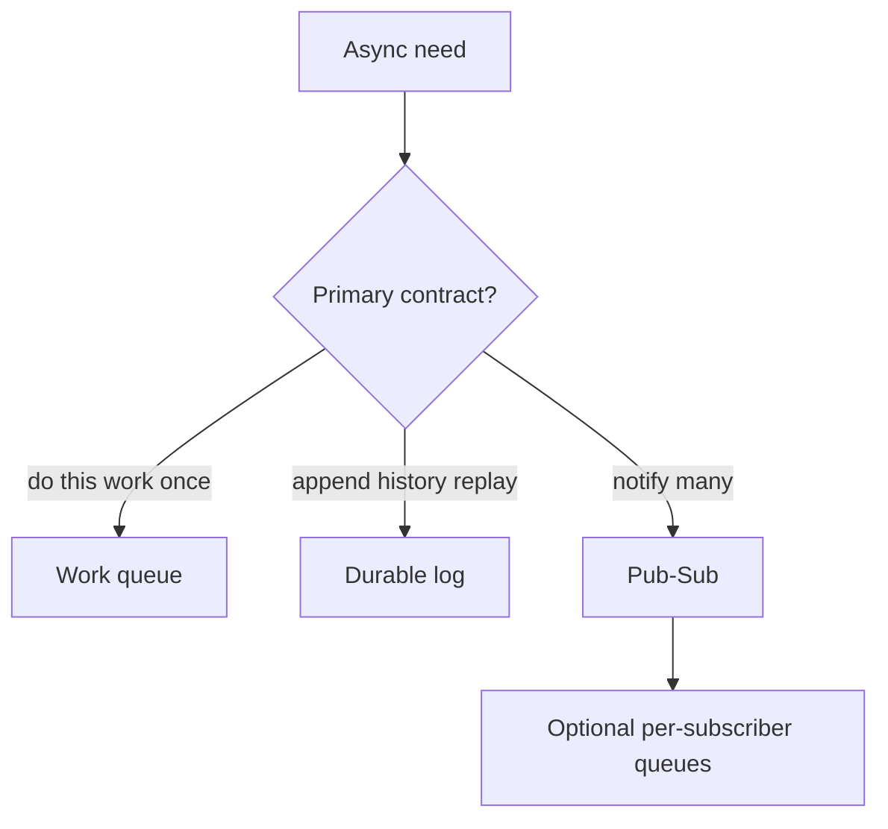
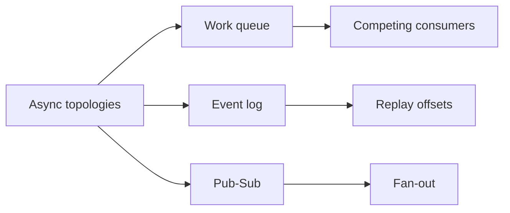
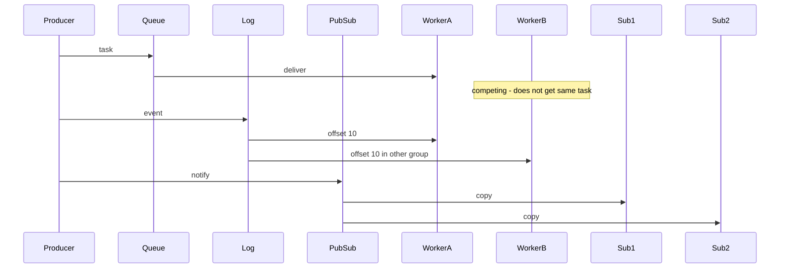

# Queue vs Log vs Pub-Sub Topology Choice

## Overview

Three async topologies dominate product design: **work queues** (competing consumers drain tasks), **logs/streams** (durable ordered partitions with offset cursors), and **pub-sub** (fan-out of notifications to many subscribers). Brokers blur lines (Kafka can look like all three), but the **product contract**—who consumes, retention, ordering, replay—must be chosen deliberately. Backend owns client ack/retry patterns; this note owns topology selection at system scale.

## Learning Objectives

- Contrast queue, log, and pub-sub semantics for producers and consumers
- Select topology from workload: jobs, event sourcing, notifications, CDC
- Reason about retention, replay, and backpressure implications
- Avoid dual-write antipatterns when bridging topologies
- Write an ADR that names the topology and non-goals

## Prerequisites

- [[09-System-Design/01-Capacity-Latency-and-Bottlenecks/Throughput Queuing and Littles Law Intuition|Throughput Queuing and Littles Law Intuition]]
- [[07-Backend/07-Caching-Jobs-and-Messaging/Message Queue Client Patterns|Message Queue Client Patterns]]

## Difficulty

`advanced`

## Estimated Time

- Reading: 2 hours
- Exercises: 3 hours
- Mini project: 4 hours

## History

MQ series and JMS normalized work queues. Kafka reframed messaging as an append-only log for replay and fan-out via consumer groups. Cloud buses (SNS/SQS, Pub/Sub) productized pub-sub+queue compositions. Failures taught that picking Kafka “because scale” for simple job queues adds operational tax without benefit.

## Problem It Solves

- **Wrong abstraction**: using a log when you needed competing consumers only
- **No replay** when audit/debug needs historical events
- **Accidental fan-out storms** from pub-sub without rate control
- **Split-brain processing** when two topologies both claim ownership

## Internal Implementation



| Topology | Delivery shape | Retention | Typical use |
| --- | --- | --- | --- |
| Queue | Competing consumers | Until ack (short) | Jobs, emails, thumbnails |
| Log | Consumer groups + offsets | Hours–forever | CDC, event streams, analytics |
| Pub-sub | Fan-out to subscriptions | Topic policy | Notifications, cache invalidate |

## Mermaid Diagrams

### Structure



### Sequence / Lifecycle — same event, three shapes



## Examples

### Minimal Example — topology selector

```typescript
export type Topology = "queue" | "log" | "pubsub";

export function chooseTopology(req: {
  needReplay: boolean;
  competingWork: boolean;
  fanoutSubscribers: number;
}): Topology {
  if (req.needReplay) return "log";
  if (req.fanoutSubscribers > 1 && !req.competingWork) return "pubsub";
  return "queue";
}
```

### Production-Shaped Example — compose SNS→SQS style fan-out

```typescript
/** Product pattern: pub-sub for fan-out, queue per subscriber for isolation. */
export interface Topic {
  publish(event: unknown): Promise<void>;
}

export interface Queue {
  send(job: unknown): Promise<void>;
  receive(): Promise<{ id: string; body: unknown } | null>;
  ack(id: string): Promise<void>;
}

export class NotificationTopology {
  constructor(
    private readonly topic: Topic,
    private readonly emailQ: Queue,
    private readonly pushQ: Queue,
  ) {}

  async onUserSignup(userId: string): Promise<void> {
    // Prefer outbox in real systems; shown as intent:
    await this.topic.publish({ type: "user.signup", userId });
    // Subscribers materialize into isolated queues (broker wiring).
    await Promise.all([
      this.emailQ.send({ template: "welcome", userId }),
      this.pushQ.send({ template: "welcome", userId }),
    ]);
  }
}
```

## Trade-offs

| Dimension | Upside | Downside | When it matters |
| --- | --- | --- | --- |
| Queue | Simple workers | Weak replay | Task processing |
| Log | Replay, multi-group | Ops + partitioning skill | Event-driven platforms |
| Pub-sub | Easy fan-out | Fan-out storms, weaker per-sub isolation | Notifications |
| Pub-sub→queue | Isolation + fan-out | More moving parts | Production notify |

### When to Use

- Queue for idempotent jobs with competing consumers
- Log when multiple independent consumers need the same history
- Pub-sub for ephemeral notify; add per-subscriber queues for reliability
- Compose deliberately rather than stretching one broker metaphor

### When Not to Use

- Do not use a multi-week retained log as a job queue without lag SLOs
- Do not pub-sub directly to fragile HTTP webhooks without buffering
- Client ack/retry depth → [[07-Backend/07-Caching-Jobs-and-Messaging/Message Queue Client Patterns|Message Queue Client Patterns]]
- Ordering/idempotency → [[09-System-Design/06-Messaging-Streams-and-Async-Topologies/Ordering Partitions Idempotency and Exactly-Once Claims|Ordering Partitions Idempotency and Exactly-Once Claims]]

## Exercises

1. Classify 8 product events (signup, clickstream, invoice, invalidate) into topologies.
2. Cost retention: 100 MB/s log for 7 days vs queue with 1h redrive.
3. Design poison-pill handling for queue vs log.
4. Sketch migration from queue-only to log+consumer groups.
5. ADR for “Kafka everywhere” vs mixed SQS+Kafka.

## Mini Project

**Topology chooser CLI.** Given workload JSON, recommend topology and justify with capacity numbers.

## Portfolio Project

Messaging module in [[09-System-Design/projects/Distributed Systems Workbench/README|Distributed Systems Workbench]].

## Interview Questions

1. Queue vs log vs pub-sub—when each?
2. How do consumer groups relate to competing consumers?
3. Why compose pub-sub with queues?
4. What does retention mean for replay?
5. When is Kafka the wrong default?

### Stretch / Staff-Level

1. Design a platform that offers all three as product APIs on one substrate.
2. Compare RabbitMQ exchange types to Kafka topics for designer-level intuition.

## Common Mistakes

- One topic for all event types without partition key strategy
- Using pub-sub for work that must be done exactly once by one worker
- Infinite retention without compaction/cost controls
- Dual-writing DB and broker without outbox → [[09-System-Design/06-Messaging-Streams-and-Async-Topologies/Outbox at System Scale Cross-Service Contracts|Outbox at System Scale Cross-Service Contracts]]

## Best Practices

- Name the **consumer contract** in the ADR (compete vs broadcast vs replay)
- Set lag and retention SLOs on day one
- Isolate subscriber failures with per-sub queues
- Backpressure → [[09-System-Design/06-Messaging-Streams-and-Async-Topologies/Backpressure Consumer Lag and Load Shedding|Backpressure Consumer Lag and Load Shedding]]
- Fan-out notify architectures → [[09-System-Design/06-Messaging-Streams-and-Async-Topologies/Fan-out Broadcast and Notification Architectures|Fan-out Broadcast and Notification Architectures]]

## Summary

Queues compete, logs remember, pub-sub fans out. Brokers can implement mixtures, but product topology choice must start from delivery, retention, and replay needs. Compose patterns deliberately and hand client mechanics to Backend while keeping system-scale contracts here.

## Further Reading

- [[00-References/System Design/README|System Design References]]
- Kafka design docs — log abstraction
- Cloud messaging composition guides (SNS+SQS)

## Related Notes

- [[09-System-Design/06-Messaging-Streams-and-Async-Topologies/Ordering Partitions Idempotency and Exactly-Once Claims|Ordering Partitions Idempotency and Exactly-Once Claims]]
- [[09-System-Design/06-Messaging-Streams-and-Async-Topologies/Backpressure Consumer Lag and Load Shedding|Backpressure Consumer Lag and Load Shedding]]
- [[07-Backend/07-Caching-Jobs-and-Messaging/Background Jobs and Workers|Background Jobs and Workers]]
- [[09-System-Design/README|System Design]]

## Progress Checklist

- [ ] Explained from first principles
- [ ] Drew at least one Mermaid diagram
- [ ] Implemented a minimal version
- [ ] Documented trade-offs and non-goals
- [ ] Completed exercises
- [ ] Practiced interview questions aloud
- [ ] Linked prerequisites and dependents
