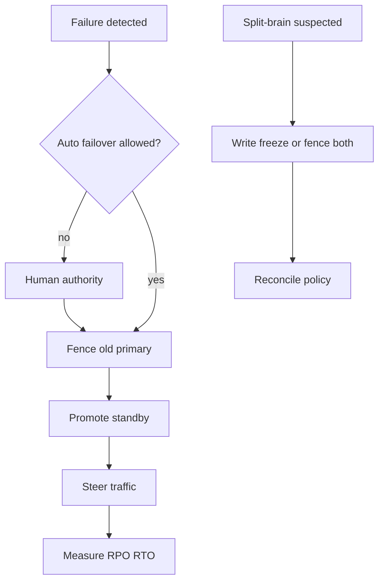
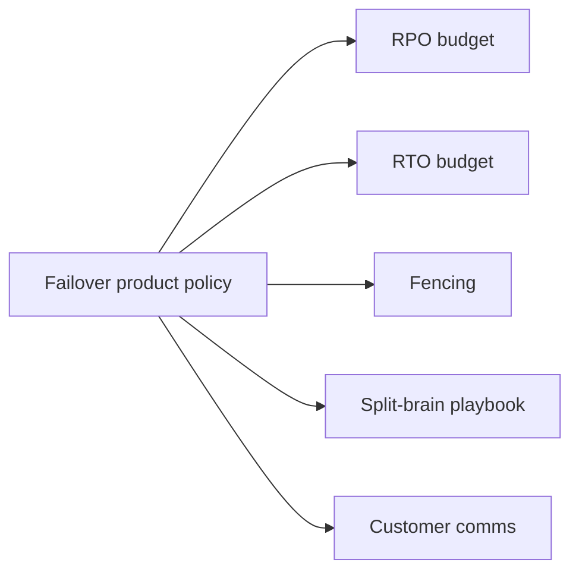
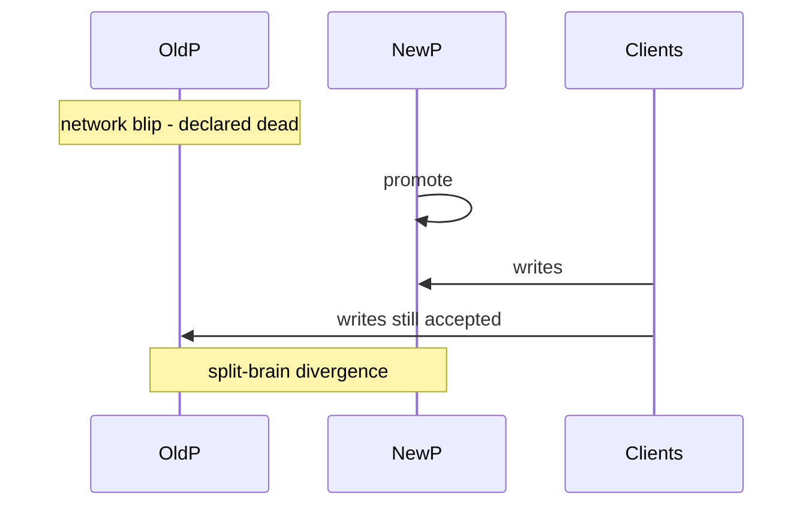

# Failover RPO RTO and Split-Brain Product Policy

## Overview

**RPO (Recovery Point Objective)** is the maximum acceptable data loss measured in time (or transactions) on failover. **RTO (Recovery Time Objective)** is the maximum acceptable time until service is usable again. **Split-brain product policy** decides what the product does if two regions accept writes divergently—fence, freeze, merge, or require human authority. Engines implement promote/fencing; System Design states **customer-visible budgets and decision trees** before incidents.

## Learning Objectives

- Define RPO/RTO as product SLOs tied to sync/async topology
- Design failover decision trees (auto vs human-gated)
- Specify split-brain detection, fencing, and reconciliation UX
- Rehearse drills that measure real RPO/RTO, not aspirational docs
- Separate control-plane failures from data-plane divergence

## Prerequisites

- [[09-System-Design/07-Multi-Region-and-Geo/Multi-Region Active-Passive Active-Active Patterns|Multi-Region Active-Passive Active-Active Patterns]]
- [[08-Databases/07-Replication-Mechanics/Failover Promote and Split-Brain Mechanics|Failover Promote and Split-Brain Mechanics]]

## Difficulty

`expert`

## Estimated Time

- Reading: 2.5 hours
- Exercises: 4 hours
- Mini project: 5 hours

## History

DR binders listed RPO/RTO long before cloud. Automated failover shortened RTO but increased split-brain risk when health checks lied. Famous outages taught: **without fencing and product policy, faster failover creates worse divergence**.

## Problem It Solves

- **Undefined loss** after promote (“we might have lost… something”)
- **Flip-flop failovers** from flappy health checks
- **Divergent customer state** with no merge story
- **Legal/comms gaps** when RPO is breached

## Internal Implementation



| Policy element | Question answered |
| --- | --- |
| RPO | How much loss can we admit? |
| RTO | How long can we be down/degraded? |
| Auto vs manual | Who flips the switch? |
| Fencing | How do we stop dual writes? |
| Split-brain | Freeze, LWW, CRDT, or offline merge? |
| Comms | What do we tell customers? |

## Mermaid Diagrams

### Structure



### Sequence / Lifecycle — unsafe failover without fence



## Examples

### Minimal Example — budgets

```typescript
export interface FailoverBudgets {
  rpoSec: number;
  rtoSec: number;
  autoFailover: boolean;
}

export const PAYMENTS: FailoverBudgets = { rpoSec: 0, rtoSec: 300, autoFailover: false };
export const SOCIAL_FEED: FailoverBudgets = { rpoSec: 60, rtoSec: 120, autoFailover: true };
```

### Production-Shaped Example — go/no-go + split-brain action

```typescript
export type SplitBrainAction = "fence-old" | "freeze-writes" | "human-merge";

export function failoverGoNoGo(input: {
  lagSec: number;
  budgets: FailoverBudgets;
  fenceReady: boolean;
  humanApproved: boolean;
}): { go: boolean; reason: string } {
  if (input.lagSec > input.budgets.rpoSec) {
    return { go: false, reason: "lag exceeds RPO; promoting loses too much" };
  }
  if (!input.fenceReady) {
    return { go: false, reason: "cannot fence old primary" };
  }
  if (!input.budgets.autoFailover && !input.humanApproved) {
    return { go: false, reason: "requires human authority" };
  }
  return { go: true, reason: "ok" };
}

export function onSplitBrainSuspected(severity: "likely" | "confirmed"): SplitBrainAction {
  return severity === "confirmed" ? "freeze-writes" : "fence-old";
}
```

## Trade-offs

| Dimension | Upside | Downside | When it matters |
| --- | --- | --- | --- |
| Auto failover | Low RTO | Split-brain risk | Commodity tiers |
| Human-gated | Safer authority | Higher RTO | Money/identity |
| RPO 0 | No loss promise | Sync latency cost | Ledger |
| Freeze on split | Stops divergence | Hard downtime | Suspected dual primary |

### When to Use

- Publish RPO/RTO per product tier in status/runbooks
- Require fencing proof before auto promote
- Human-gate failovers that can lose money or violate residency
- Freeze writes when dual-primary is confirmed

### When Not to Use

- Do not auto-failover on a single failed health check
- Do not promise RPO 0 with async replication
- Engine STONITH/promote mechanics → [[08-Databases/07-Replication-Mechanics/Failover Promote and Split-Brain Mechanics|Failover Promote and Split-Brain Mechanics]]
- Coordination fencing tokens → [[09-System-Design/08-Coordination-Consensus-and-Locks/Distributed Locks Leases and Fencing Tokens|Distributed Locks Leases and Fencing Tokens]]

## Exercises

1. Write RPO/RTO for three tiers of a SaaS product.
2. Decision tree: lag 5s, RPO 0—what do you do?
3. Design customer comms templates for RPO breach vs RTO breach.
4. Simulate flappy health; require multi-signal detection.
5. ADR: auto vs manual for primary region loss.

## Mini Project

**Policy engine.** Implement go/no-go with injected lag/fence/human flags; unit-test forbidden promotes.

## Portfolio Project

Playbooks in [[09-System-Design/projects/Multi-Region Failover Playbook Lab/README|Multi-Region Failover Playbook Lab]].

## Interview Questions

1. Define RPO and RTO with examples.
2. Why is fencing required before promote?
3. When should failover be human-gated?
4. What is split-brain product policy?
5. How do you measure RPO/RTO in drills?

### Stretch / Staff-Level

1. Design multi-signal failure detection that balances RTO vs false promote.
2. Compare cloud managed failover policies vs self-operated Patroni for product SLOs.

## Common Mistakes

- RPO/RTO copied from vendor marketing, never drilled
- Promote without fence “because primary is probably dead”
- No reconciliation UX for divergence
- Silent auto-failover customers notice first via wrong data

## Best Practices

- Drill quarterly; publish measured RPO/RTO
- Tie RPO to replication ack mode → [[09-System-Design/07-Multi-Region-and-Geo/Sync Async and Semi-Sync as Latency SLOs|Sync Async and Semi-Sync as Latency SLOs]]
- Prefer freeze over dual-write hope
- Keep authority matrix (who can flip) short and practiced
- Incident playbooks → [[09-System-Design/09-Failure-Modes-at-Product-Scale/Multi-Service Incident Playbooks|Multi-Service Incident Playbooks]]

## Summary

RPO and RTO are customer promises; split-brain policy is how you avoid making divergence worse. Failover without fencing and budgets is gambling. Measure in drills, gate appropriately, and freeze when two writers appear.

## Further Reading

- [[00-References/System Design/README|System Design References]]
- Disaster recovery planning guides
- Split-brain and fencing case studies

## Related Notes

- [[09-System-Design/07-Multi-Region-and-Geo/Multi-Region Active-Passive Active-Active Patterns|Multi-Region Active-Passive Active-Active Patterns]]
- [[09-System-Design/07-Multi-Region-and-Geo/Sync Async and Semi-Sync as Latency SLOs|Sync Async and Semi-Sync as Latency SLOs]]
- [[08-Databases/07-Replication-Mechanics/Failover Promote and Split-Brain Mechanics|Failover Promote and Split-Brain Mechanics]]
- [[09-System-Design/08-Coordination-Consensus-and-Locks/Distributed Locks Leases and Fencing Tokens|Distributed Locks Leases and Fencing Tokens]]
- [[09-System-Design/README|System Design]]

## Progress Checklist

- [ ] Explained from first principles
- [ ] Drew at least one Mermaid diagram
- [ ] Implemented a minimal version
- [ ] Documented trade-offs and non-goals
- [ ] Completed exercises
- [ ] Practiced interview questions aloud
- [ ] Linked prerequisites and dependents
