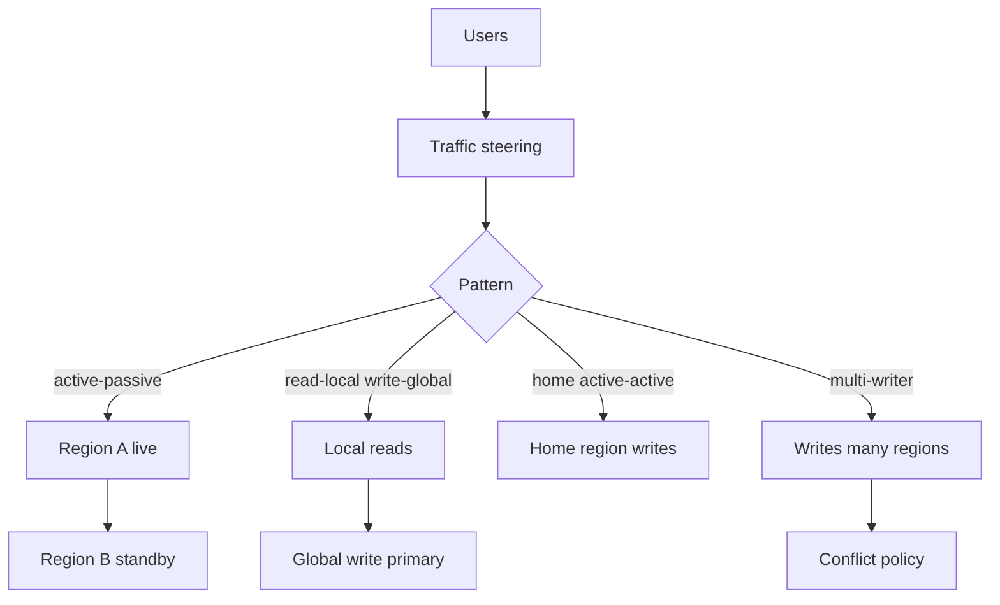
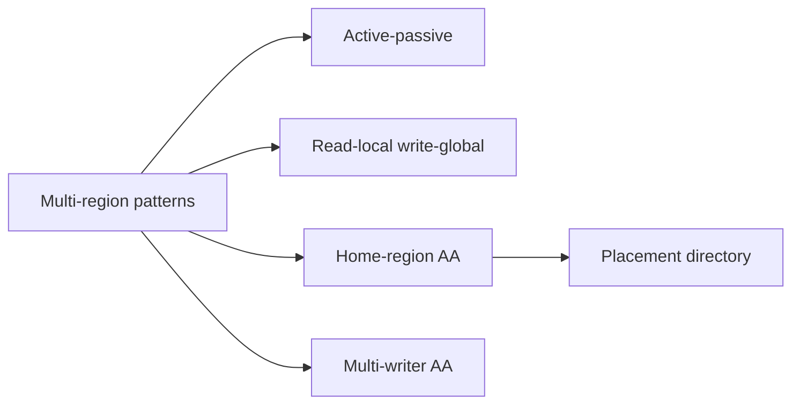
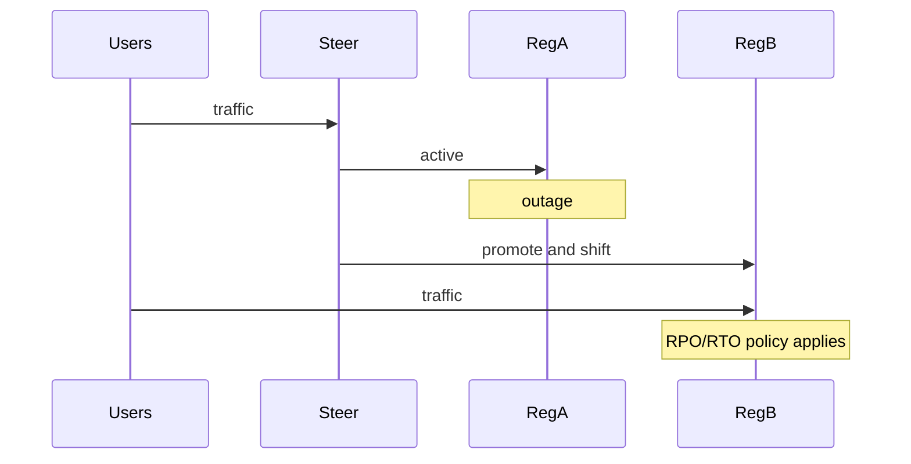

# Multi-Region Active-Passive Active-Active Patterns

## Overview

**Active-passive** serves user traffic from one region while another stands by (warm/cold) for failover. **Active-active** serves traffic from multiple regions concurrently—either **read-local/write-global**, **home-region active-active**, or **true multi-writer active-active**. Patterns differ in traffic steering, data plane, conflict policy, and operational drills. This note owns product topology patterns; engine HA promote is a dependency, not the pattern itself.

## Learning Objectives

- Distinguish cold/warm/hot passive and flavors of active-active
- Design DNS/anycast/steering with health and stickiness
- Combine locality (home region) with active-active serving
- Cost capacity: N-region active-active is not 1/N efficient
- Write pattern ADRs with failure and conflict sections

## Prerequisites

- [[09-System-Design/07-Multi-Region-and-Geo/Single-Primary Multi-Primary and Leaderless Product Views|Single-Primary Multi-Primary and Leaderless Product Views]]
- [[09-System-Design/04-Partitioning-Sharding-and-Placement/Data Locality Geo Placement and Affinity|Data Locality Geo Placement and Affinity]]

## Difficulty

`expert`

## Estimated Time

- Reading: 3 hours
- Exercises: 4 hours
- Mini project: 6 hours

## History

DR sites were classic active-passive. Internet products pushed active-active for latency. Many “active-active” deployments were really active-passive for writes with active reads everywhere—until marketing blurred terms. Clear pattern language (and drills) separates survivors from aspirational diagrams.

## Problem It Solves

- **Regional outage** taking the whole product offline
- **Fake active-active** that still pins writes unsafely
- **Capacity shortfalls** when one region must absorb 100% after peer loss
- **Sticky users** stranded on a dead region

## Internal Implementation



| Pattern | Reads | Writes | Hard part |
| --- | --- | --- | --- |
| Active-passive | One region | One region | RTO drills, data freshness of standby |
| Read-local / write-global | Many | One primary | Remote write latency, RYW |
| Home-region active-active | Many | Home cell | Directory, rehome, failover |
| Multi-writer active-active | Many | Many | Conflicts, testing |

## Mermaid Diagrams

### Structure



### Sequence / Lifecycle — active-passive failover



## Examples

### Minimal Example — pattern labeler

```typescript
export type MultiRegionPattern =
  | "active-passive"
  | "read-local-write-global"
  | "home-region-active-active"
  | "multi-writer-active-active";

export function label(pattern: MultiRegionPattern): string {
  return pattern;
}
```

### Production-Shaped Example — capacity headroom check

```typescript
export function canSurviveRegionLoss(params: {
  regions: number;
  perRegionCapQps: number;
  steadyGlobalQps: number;
  pattern: MultiRegionPattern;
}): { ok: boolean; reason: string } {
  if (params.pattern === "active-passive") {
    // Passive must be sized for 100% (hot) or accept longer RTO (cold).
    return {
      ok: params.perRegionCapQps >= params.steadyGlobalQps,
      reason: "passive must absorb full load when hot",
    };
  }
  // Active-active: remaining regions share load (imperfectly).
  const remaining = params.regions - 1;
  const ok = remaining * params.perRegionCapQps >= params.steadyGlobalQps * 1.2; // 20% surge
  return { ok, reason: ok ? "headroom ok" : "insufficient N+1 capacity" };
}
```

## Trade-offs

| Dimension | Upside | Downside | When it matters |
| --- | --- | --- | --- |
| Active-passive | Simpler data plane | Failover RTO, wasted capacity if hot | Regulated / simple HA |
| Read-local write-global | Fast reads | Write RTT to primary | Content-heavy |
| Home-region AA | Local writes for most | Directory + rehome | Global consumer apps |
| Multi-writer AA | Lowest write latency | Conflicts / complexity | Collaboration |

### When to Use

- Active-passive when conflict avoidance > latency
- Home-region AA when users have stable homes and residency needs
- Read-local write-global when writes are rare vs reads
- Multi-writer only with tested conflict policy

### When Not to Use

- Do not call read replicas in one region “multi-region active-active”
- Do not run active-active without N+1 capacity math
- Steering details → [[09-System-Design/02-Load-Balancing-and-Edge-Entry/Edge Admission Control and Global Traffic Steering|Edge Admission Control and Global Traffic Steering]]
- Split-brain policy → [[09-System-Design/07-Multi-Region-and-Geo/Failover RPO RTO and Split-Brain Product Policy|Failover RPO RTO and Split-Brain Product Policy]]

## Exercises

1. Draw all four patterns for a SaaS CRM; pick one with ADR.
2. Size hot passive for 30k QPS steady + 2× failover surge.
3. Design home directory with rehome and sticky cookies.
4. List user-visible symptoms of read-local write-global after POST.
5. Chaos plan: lose one region for each pattern—expected UX.

## Mini Project

**Steering simulator.** Health flips regions; measure RTO and sticky breakage under each pattern.

## Portfolio Project

[[09-System-Design/projects/Multi-Region Failover Playbook Lab/README|Multi-Region Failover Playbook Lab]].

## Interview Questions

1. Active-passive vs active-active?
2. What are flavors of active-active?
3. How do you capacity-plan for region loss?
4. How does home-region routing work?
5. When is multi-writer justified?

### Stretch / Staff-Level

1. Design cell-based home-region AA with blast-radius budgets.
2. Compare DNS failover vs Anycast vs application directory for steering.

## Common Mistakes

- Under-sized passive “because DR is unlikely”
- Active-active without conflict or home semantics
- Steering without draining connections
- Ignoring cache islands after failover → [[09-System-Design/05-Caching-at-Product-Scale/When Caching Lies Read-Your-Writes Cross-Region|When Caching Lies Read-Your-Writes Cross-Region]]

## Best Practices

- Name the pattern explicitly in architecture docs
- Drill failovers on a calendar; measure real RPO/RTO
- Keep N+1 capacity or accept degraded mode consciously
- Pair with sync/async SLO choices → [[09-System-Design/07-Multi-Region-and-Geo/Sync Async and Semi-Sync as Latency SLOs|Sync Async and Semi-Sync as Latency SLOs]]
- Reshard/rehome windows → [[09-System-Design/04-Partitioning-Sharding-and-Placement/Resharding Rebalancing and Dual-Write Windows|Resharding Rebalancing and Dual-Write Windows]]

## Summary

Active-passive and active-active are families of multi-region serving patterns, not binary checkboxes. Choose based on write locality, conflict tolerance, capacity headroom, and operational drills. Most products land on home-region or read-local/write-global before true multi-writer.

## Further Reading

- [[00-References/System Design/README|System Design References]]
- Google SRE / cell-based architecture writings
- Cloud multi-region reference architectures

## Related Notes

- [[09-System-Design/07-Multi-Region-and-Geo/Single-Primary Multi-Primary and Leaderless Product Views|Single-Primary Multi-Primary and Leaderless Product Views]]
- [[09-System-Design/07-Multi-Region-and-Geo/Failover RPO RTO and Split-Brain Product Policy|Failover RPO RTO and Split-Brain Product Policy]]
- [[09-System-Design/04-Partitioning-Sharding-and-Placement/Data Locality Geo Placement and Affinity|Data Locality Geo Placement and Affinity]]
- [[09-System-Design/02-Load-Balancing-and-Edge-Entry/Edge Admission Control and Global Traffic Steering|Edge Admission Control and Global Traffic Steering]]
- [[09-System-Design/README|System Design]]

## Progress Checklist

- [ ] Explained from first principles
- [ ] Drew at least one Mermaid diagram
- [ ] Implemented a minimal version
- [ ] Documented trade-offs and non-goals
- [ ] Completed exercises
- [ ] Practiced interview questions aloud
- [ ] Linked prerequisites and dependents
