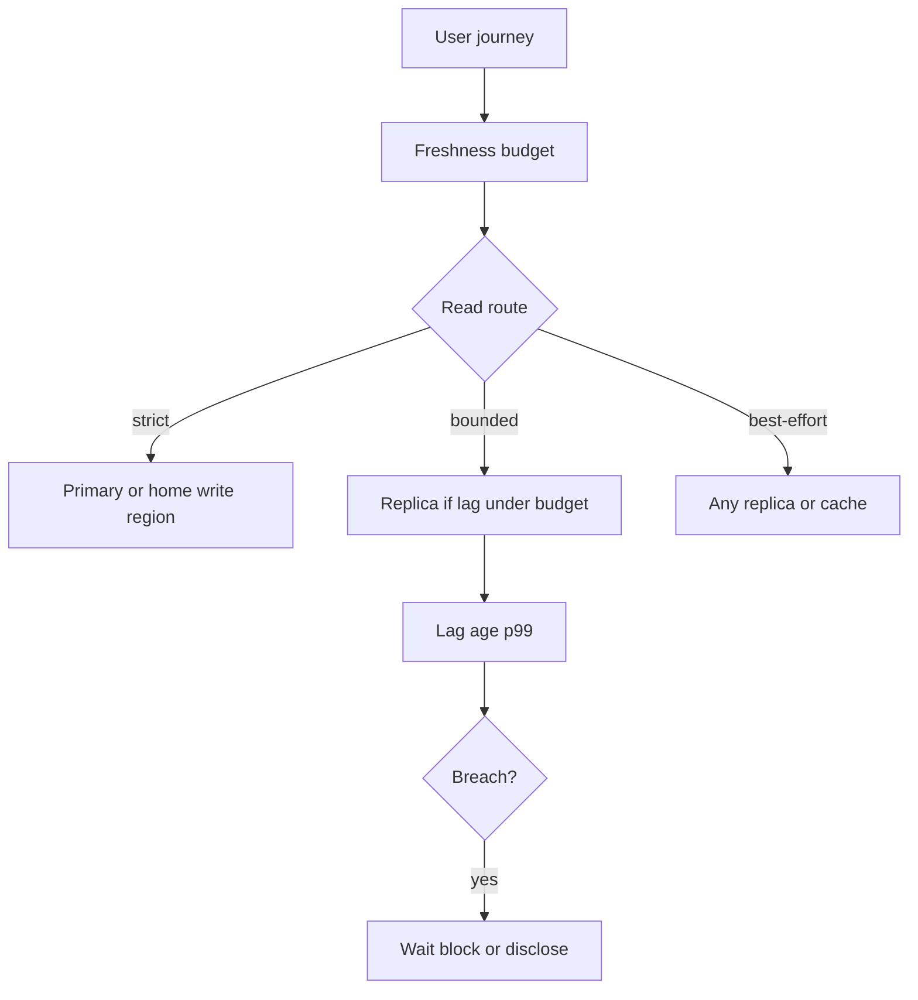
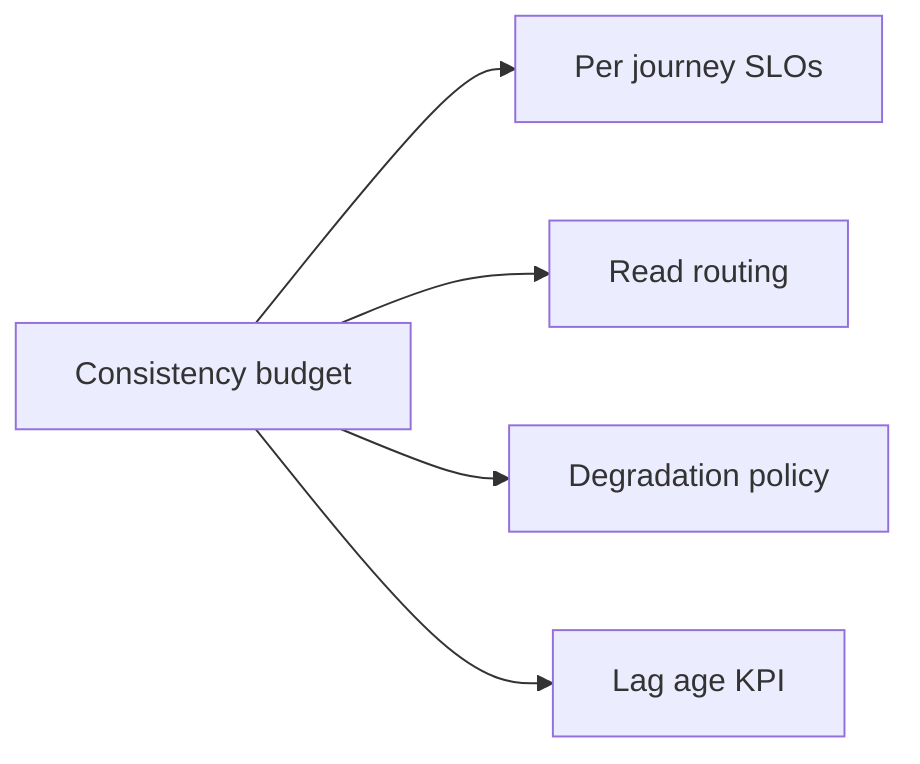
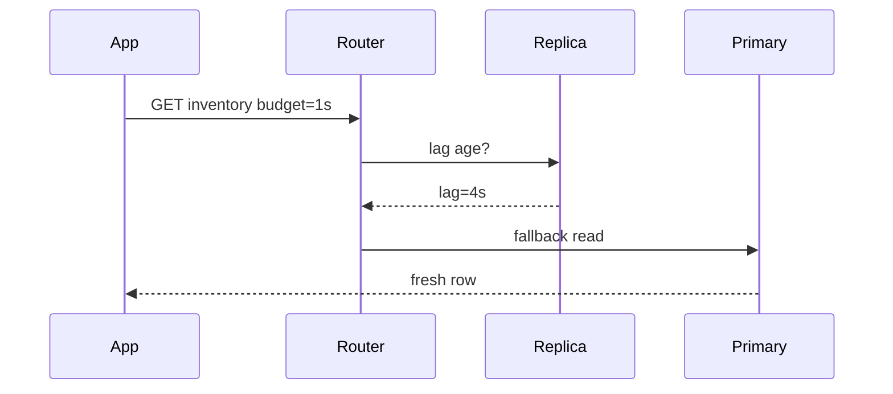

# Replica Lag as User-Facing Consistency Budget

## Overview

**Replica lag** becomes a **user-facing consistency budget** when product reads may hit asynchronous replicas or remote regions: the maximum staleness the UX and business rules may tolerate (time, version, or percentile). Unlike engine monitoring alone, this budget is published per journey (feed browse vs checkout vs admin), enforced with routing (primary/home/version-wait), and alerted when breached. Databases own lag metrics; System Design owns the budget and the UX contract.

## Learning Objectives

- Translate replica lag into per-journey freshness SLOs
- Route reads by budget class (primary, home replica, any replica)
- Combine lag budgets with cache freshness policies
- Design degradation when lag exceeds budget (block, wait, disclose)
- Instrument lag as a product KPI, not only a DB dashboard

## Prerequisites

- [[09-System-Design/07-Multi-Region-and-Geo/Sync Async and Semi-Sync as Latency SLOs|Sync Async and Semi-Sync as Latency SLOs]]
- [[08-Databases/07-Replication-Mechanics/Replica Lag and Read-Your-Writes at Connection Level|Replica Lag and Read-Your-Writes at Connection Level]]

## Difficulty

`advanced`

## Estimated Time

- Reading: 2 hours
- Exercises: 3 hours
- Mini project: 4 hours

## History

Ops teams watched replication lag for HA. Product teams later realized lag was the actual consistency model users experienced. Version tokens, “eventual” banners, and read-after-write routing turned lag from a graph into a **budget** similar to latency error budgets.

## Problem It Solves

- **Stale checkouts / permissions** from lagging replicas
- **Support tickets** without a named freshness SLO
- **Autoscaling replicas** that worsen lag under load
- **Cache + replica double lag** exceeding unspoken expectations

## Internal Implementation



| Journey | Example budget | Enforcement |
| --- | --- | --- |
| Browse feed | 30s stale OK | Any replica + cache |
| Own profile after edit | RYW / 0–2s | Primary or version wait |
| Inventory at checkout | ≤1s or strong | Primary / sync path |
| Admin audit | Strong | Primary only |

## Mermaid Diagrams

### Structure



### Sequence / Lifecycle — budget breach handling



## Examples

### Minimal Example — budget check

```typescript
export function withinBudget(lagSec: number, budgetSec: number): boolean {
  return lagSec <= budgetSec;
}
```

### Production-Shaped Example — journey-aware read router

```typescript
export type Journey = "feed" | "profile_ryw" | "checkout_inventory" | "admin";

export const LAG_BUDGET_SEC: Record<Journey, number> = {
  feed: 30,
  profile_ryw: 0,
  checkout_inventory: 1,
  admin: 0,
};

export async function readForJourney<T>(
  journey: Journey,
  lagSec: number,
  readReplica: () => Promise<T>,
  readPrimary: () => Promise<T>,
  waitForLag?: (maxSec: number) => Promise<boolean>,
): Promise<T> {
  const budget = LAG_BUDGET_SEC[journey];
  if (budget === 0) return readPrimary();

  if (withinBudget(lagSec, budget)) return readReplica();

  if (waitForLag && (await waitForLag(budget))) return readReplica();

  // Degradation: fall back to primary rather than serve over-budget stale.
  return readPrimary();
}
```

## Trade-offs

| Dimension | Upside | Downside | When it matters |
| --- | --- | --- | --- |
| Tight budgets | Correct UX | Primary load | Money / authz |
| Loose budgets | Scale reads | Stale UX | Browse |
| Wait-for-lag | Keep replica path | Tail latency | Near-budget cases |
| Disclose stale | Honest UX | Extra UI | Rarely for core commerce |

### When to Use

- Publish lag budgets next to latency SLOs per journey
- Default breach action: route to primary or home region
- Combine with cache freshness classes → [[09-System-Design/05-Caching-at-Product-Scale/Cache Coherence vs Acceptable Staleness|Cache Coherence vs Acceptable Staleness]]
- Alert on journey budget burn, not only absolute lag

### When Not to Use

- Do not use a single global lag SLO for all reads
- Do not serve checkout from replicas “until lag looks fine” without enforcement
- Engine measurement details → [[08-Databases/07-Replication-Mechanics/Replica Lag and Read-Your-Writes at Connection Level|Replica Lag and Read-Your-Writes at Connection Level]]
- Cross-region cache lies → [[09-System-Design/05-Caching-at-Product-Scale/When Caching Lies Read-Your-Writes Cross-Region|When Caching Lies Read-Your-Writes Cross-Region]]

## Exercises

1. Assign budgets to 10 endpoints of an e-commerce API.
2. Model primary overload if 20% of reads escalate on lag breach.
3. Design a “waiting for sync…” UX under 2s budget with wait.
4. Combine Redis TTL 10s + replica lag 20s—what’s true freshness?
5. ADR: consistency budget error budget (when to page).

## Mini Project

**Budget router.** Inject lag; verify journeys escalate correctly; load-test primary under breach.

## Portfolio Project

Consistency budgets in [[09-System-Design/projects/Consistency and Quorum Demo/README|Consistency and Quorum Demo]] and [[09-System-Design/projects/Multi-Region Failover Playbook Lab/README|Multi-Region Failover Playbook Lab]].

## Interview Questions

1. What is a user-facing consistency budget?
2. How does replica lag become UX?
3. How do you enforce budgets at read time?
4. What do you do on breach?
5. How do caches interact with lag budgets?

### Stretch / Staff-Level

1. Design percentile freshness SLOs (99% of feed reads ≤ 15s stale).
2. Compare version-token waits vs primary fallback under multi-region lag.

## Common Mistakes

- Monitoring lag without journey mapping
- Escalating all reads to primary permanently after one spike
- Ignoring cache layer in the budget math
- Promising RYW while routing randomly to remote replicas

## Best Practices

- Name budgets in API docs (`consistency: eventual|bounded|strong`)
- Chart lag age p99 **and** fraction of reads escalated
- Prefer home-region reads for RYW sessions
- Tie failover RPO to the same language → [[09-System-Design/07-Multi-Region-and-Geo/Failover RPO RTO and Split-Brain Product Policy|Failover RPO RTO and Split-Brain Product Policy]]
- Choosing invariants → [[09-System-Design/03-Consistency-Models-and-CAP/Choosing Consistency from User-Visible Invariants|Choosing Consistency from User-Visible Invariants]]

## Summary

Replica lag is not only an ops metric—it is the consistency users experience. Convert it into per-journey budgets, enforce with routing and waits, degrade explicitly on breach, and account for caches. Engines measure lag; products spend the budget.

## Further Reading

- [[00-References/System Design/README|System Design References]]
- Client-centric consistency models
- Multi-region read routing case studies

## Related Notes

- [[09-System-Design/07-Multi-Region-and-Geo/Sync Async and Semi-Sync as Latency SLOs|Sync Async and Semi-Sync as Latency SLOs]]
- [[09-System-Design/07-Multi-Region-and-Geo/Multi-Region Active-Passive Active-Active Patterns|Multi-Region Active-Passive Active-Active Patterns]]
- [[09-System-Design/05-Caching-at-Product-Scale/When Caching Lies Read-Your-Writes Cross-Region|When Caching Lies Read-Your-Writes Cross-Region]]
- [[08-Databases/07-Replication-Mechanics/Replica Lag and Read-Your-Writes at Connection Level|Replica Lag and Read-Your-Writes at Connection Level]]
- [[09-System-Design/README|System Design]]

## Progress Checklist

- [ ] Explained from first principles
- [ ] Drew at least one Mermaid diagram
- [ ] Implemented a minimal version
- [ ] Documented trade-offs and non-goals
- [ ] Completed exercises
- [ ] Practiced interview questions aloud
- [ ] Linked prerequisites and dependents
