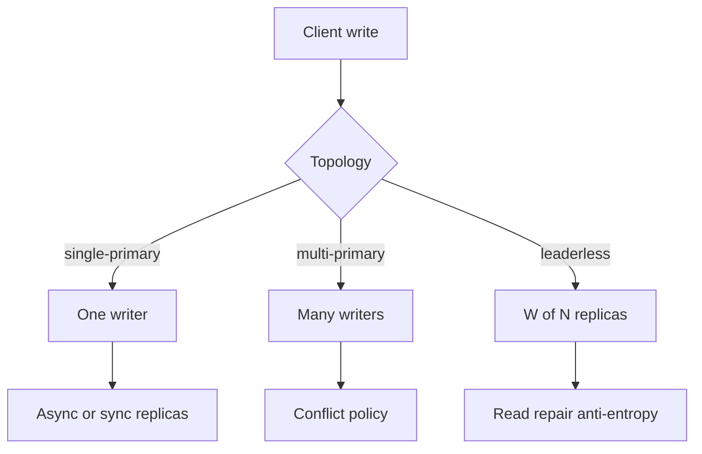
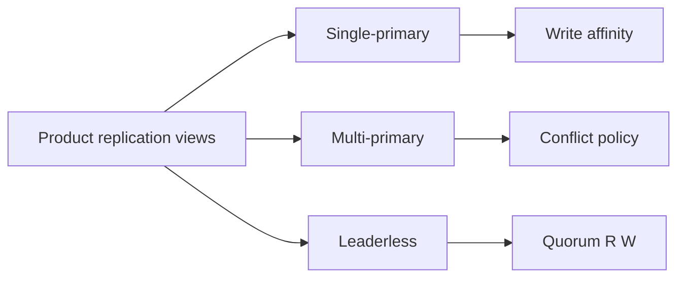
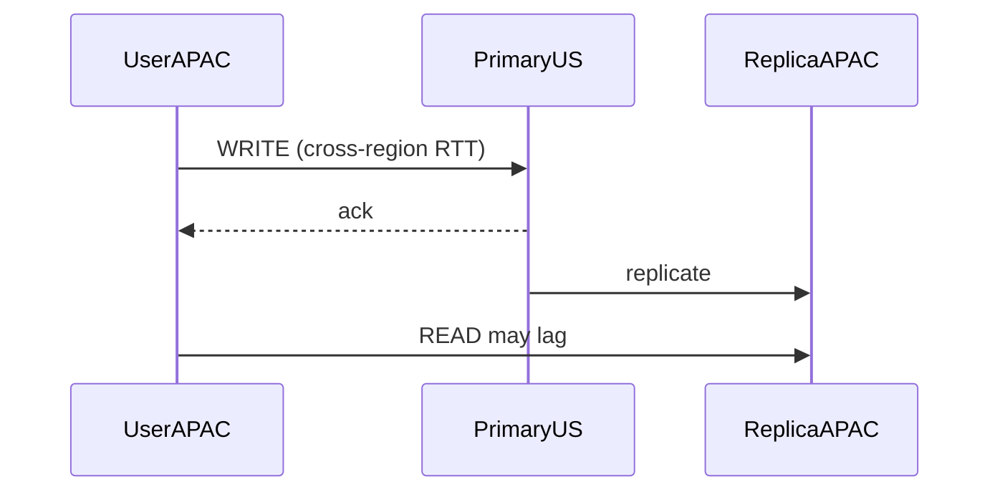

# Single-Primary Multi-Primary and Leaderless Product Views

## Overview

Replication topology from a **product view**: **single-primary** (one writer region/node, many readers), **multi-primary** (multiple writers with conflict policy), and **leaderless** (quorum R/W without a sticky primary). Engines implement the wires (WAL, hinted handoff); System Design chooses which view matches user invariants, latency SLOs, and operational maturity. Wrong choice creates either global write latency or conflict hell.

## Learning Objectives

- Contrast the three topologies as user-visible write paths
- Map topologies to CAP/PACELC product constraints
- Identify conflict surfaces in multi-primary/leaderless designs
- Choose topologies per data class (not one global mode)
- Hand off engine failover mechanics to Databases cleanly

## Prerequisites

- [[09-System-Design/03-Consistency-Models-and-CAP/CAP and PACELC as Product Constraints|CAP and PACELC as Product Constraints]]
- [[08-Databases/07-Replication-Mechanics/WAL Shipping and Streaming Replication|WAL Shipping and Streaming Replication]]

## Difficulty

`advanced`

## Estimated Time

- Reading: 2.5 hours
- Exercises: 3 hours
- Mini project: 4 hours

## History

Primary/standby dominated RDBMS HA. Multi-master appeared in directories and geo DBs, then in Dynamo-style leaderless stores. Cloud “global tables” and CRDT-backed APIs revived multi-writer interest—and revived conflict incidents when product policy was missing.

## Problem It Solves

- **Cross-region write latency** forced by a distant single primary
- **Lost updates** when multi-writer lacks conflict rules
- **Confusing runbooks** mixing engine roles with product write affinity
- **One-size topology** applied to both inventory and avatars

## Internal Implementation



| Topology | Write path | Conflict | Typical product fit |
| --- | --- | --- | --- |
| Single-primary | Route to primary region | None at write | Strong invariants, payments |
| Multi-primary | Local write | LWW/CRDT/merge | Collaborative, presence |
| Leaderless | Quorum W | On read/repair | High avail KV |

## Mermaid Diagrams

### Structure



### Sequence / Lifecycle — single-primary remote write



## Examples

### Minimal Example — topology picker by invariant

```typescript
export type Topology = "single-primary" | "multi-primary" | "leaderless";

export function pickTopology(invariant: "unique-balance" | "avatar- Prefer" | "session-kv"): Topology {
  switch (invariant) {
    case "unique-balance":
      return "single-primary";
    case "avatar- Prefer":
      return "multi-primary"; // LWW ok
    case "session-kv":
      return "leaderless";
  }
}
```

### Production-Shaped Example — write router

```typescript
export class WriteRouter {
  constructor(
    private readonly mode: Topology,
    private readonly primaryRegion: string,
    private readonly localRegion: string,
    private readonly conflict: (a: unknown, b: unknown) => unknown,
  ) {}

  routeWrite(entity: { id: string; body: unknown }): { region: string; needsConflictMerge: boolean } {
    if (this.mode === "single-primary") {
      return { region: this.primaryRegion, needsConflictMerge: false };
    }
    if (this.mode === "multi-primary") {
      return { region: this.localRegion, needsConflictMerge: true };
    }
    // leaderless: client or coordinator picks replica set; region local preferred
    return { region: this.localRegion, needsConflictMerge: true };
  }

  merge(a: unknown, b: unknown): unknown {
    return this.conflict(a, b);
  }
}
```

## Trade-offs

| Dimension | Upside | Downside | When it matters |
| --- | --- | --- | --- |
| Single-primary | Simple conflicts | Remote write RTT / failover | Strong correctness |
| Multi-primary | Local writes | Conflict policy + testing | Geo collaboration |
| Leaderless | Availability under partitions | Quorum/repair complexity | KV / session |
| Mixed by table | Fit per invariant | Cognitive load | Mature platforms |

### When to Use

- Single-primary for money, inventory, identity uniqueness
- Multi-primary when conflict policy is explicit (LWW/CRDT) → [[09-System-Design/03-Consistency-Models-and-CAP/Conflict Policies LWW and CRDT Product Use|Conflict Policies LWW and CRDT Product Use]]
- Leaderless for high-availability opaque data with quorum math → [[09-System-Design/03-Consistency-Models-and-CAP/Quorums R plus W and Tunable Consistency|Quorums R plus W and Tunable Consistency]]
- Mixed topologies by bounded contexts

### When Not to Use

- Do not multi-primary “for latency” without conflict UX
- Do not pretend leaderless is strongly consistent with W=1/R=1
- Engine promote/split-brain mechanics → [[08-Databases/07-Replication-Mechanics/Failover Promote and Split-Brain Mechanics|Failover Promote and Split-Brain Mechanics]]

## Exercises

1. Classify 12 entities in a marketplace into topologies.
2. Estimate APAC write p99 under US primary vs regional multi-primary.
3. Design LWW vs CRDT for a collaborative checklist.
4. Sketch quorum N=3,R=2,W=2 user-visible behavior under one AZ loss.
5. ADR: single global primary with regional read replicas—non-goals.

## Mini Project

**Topology matrix.** Config-driven router + conflict stubs; tests encode invariants.

## Portfolio Project

Multi-region topology ADR in [[09-System-Design/projects/Multi-Region Failover Playbook Lab/README|Multi-Region Failover Playbook Lab]].

## Interview Questions

1. Single-primary vs multi-primary vs leaderless?
2. Why do conflicts appear in multi-writer systems?
3. How does PACELC influence the choice?
4. Can you mix topologies in one product?
5. What do users experience when the primary is remote?

### Stretch / Staff-Level

1. Design home-primary per tenant with global directory (single-primary per shard).
2. Compare Spanner-style synch vs Dynamo leaderless for designer trade-offs.

## Common Mistakes

- Global multi-primary by default
- Ignoring read-your-writes under single-primary + regional cache
- Confusing engine “multi-AZ HA” with multi-region multi-primary
- No product conflict UX for merges

## Best Practices

- Pick topology **per data class** in the ADR
- Pair single-primary with write affinity / home region → [[09-System-Design/04-Partitioning-Sharding-and-Placement/Data Locality Geo Placement and Affinity|Data Locality Geo Placement and Affinity]]
- Document conflict examples as user stories
- Sync latency SLOs → [[09-System-Design/07-Multi-Region-and-Geo/Sync Async and Semi-Sync as Latency SLOs|Sync Async and Semi-Sync as Latency SLOs]]
- Active-active patterns → [[09-System-Design/07-Multi-Region-and-Geo/Multi-Region Active-Passive Active-Active Patterns|Multi-Region Active-Passive Active-Active Patterns]]

## Summary

Single-primary centralizes writes and conflicts; multi-primary and leaderless localize writes at the cost of conflict or quorum complexity. Product views must follow invariants and latency budgets, not engine buzzwords. Mix carefully, document conflicts, and leave promotion mechanics to Databases.

## Further Reading

- [[00-References/System Design/README|System Design References]]
- Dynamo / PACELC literature
- Cloud global database topology guides

## Related Notes

- [[09-System-Design/07-Multi-Region-and-Geo/Sync Async and Semi-Sync as Latency SLOs|Sync Async and Semi-Sync as Latency SLOs]]
- [[09-System-Design/07-Multi-Region-and-Geo/Multi-Region Active-Passive Active-Active Patterns|Multi-Region Active-Passive Active-Active Patterns]]
- [[09-System-Design/03-Consistency-Models-and-CAP/Conflict Policies LWW and CRDT Product Use|Conflict Policies LWW and CRDT Product Use]]
- [[08-Databases/07-Replication-Mechanics/Synchronous vs Asynchronous Durability|Synchronous vs Asynchronous Durability]]
- [[09-System-Design/README|System Design]]

## Progress Checklist

- [ ] Explained from first principles
- [ ] Drew at least one Mermaid diagram
- [ ] Implemented a minimal version
- [ ] Documented trade-offs and non-goals
- [ ] Completed exercises
- [ ] Practiced interview questions aloud
- [ ] Linked prerequisites and dependents
