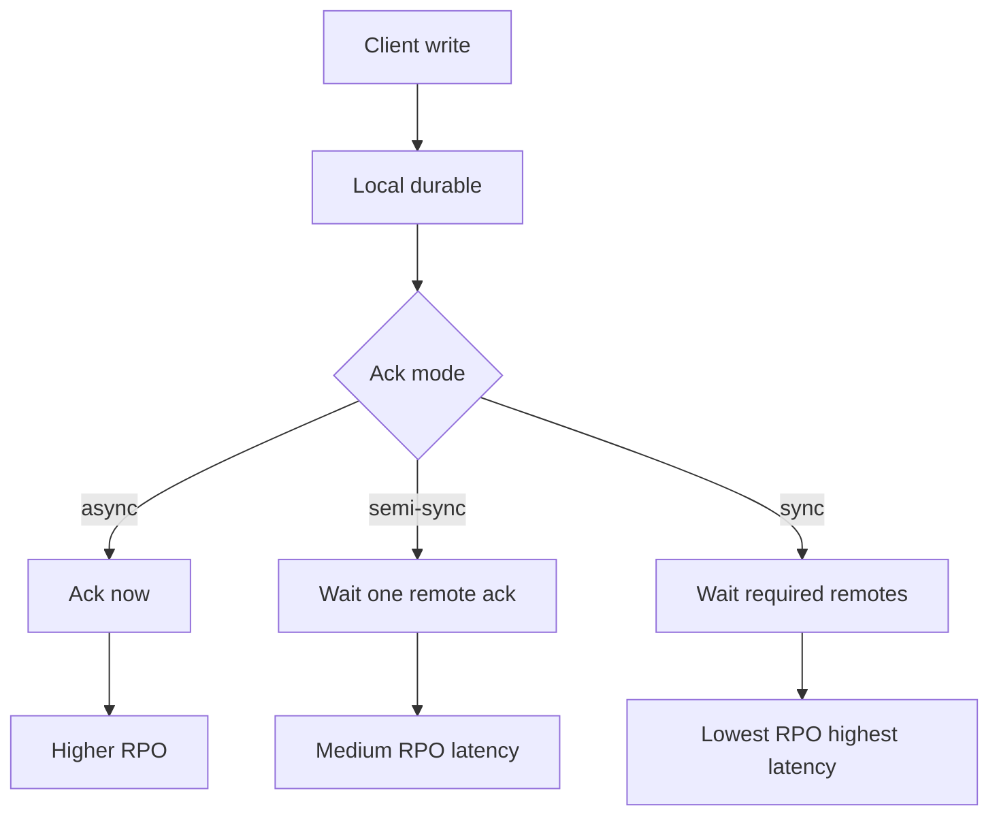
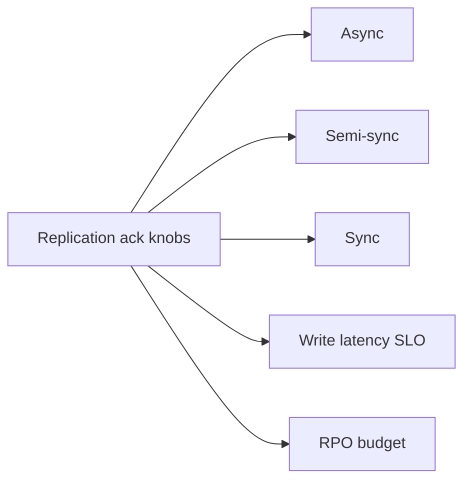
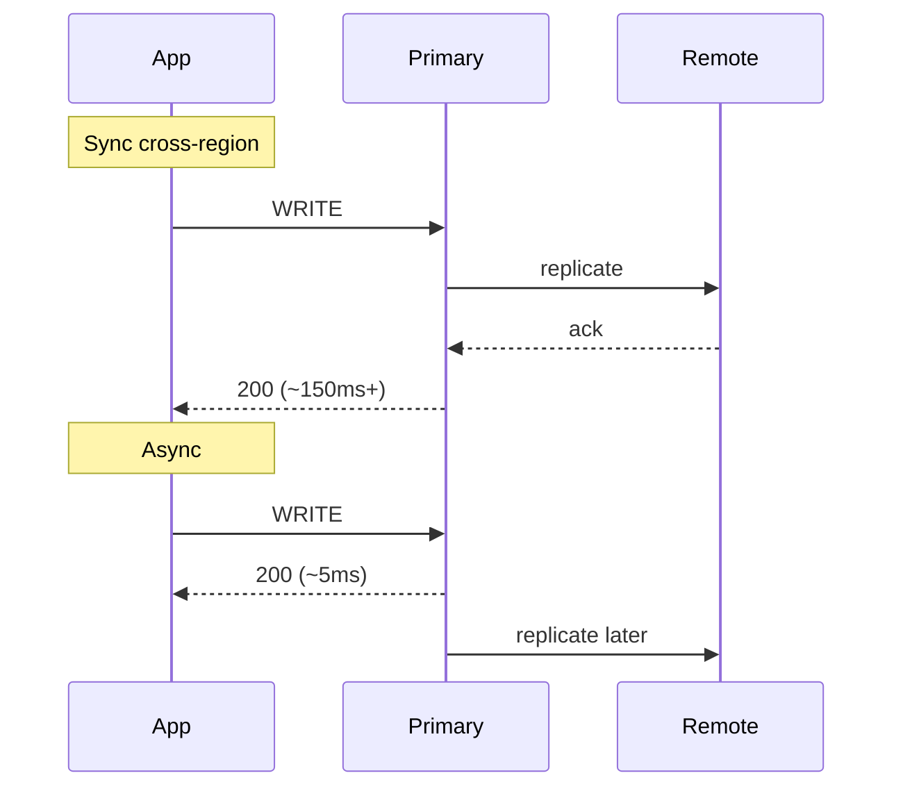

# Sync Async and Semi-Sync as Latency SLOs

## Overview

**Synchronous**, **asynchronous**, and **semi-synchronous** replication decide whether a write waits for remote durability/visibility before ack. From a product view these are **latency and RPO knobs**: sync buys smaller RPO at the cost of RTT in the p99 budget; async buys speed at the cost of potential data loss on failover; semi-sync sits between. Engine flags (`synchronous_commit`, ack levels) implement the knob; System Design assigns knobs to APIs via latency SLOs and failure policy.

## Learning Objectives

- Express sync/async/semi-sync as latency and RPO trade-offs
- Budget cross-AZ vs cross-region RTT into write SLOs
- Choose ack policies per endpoint class
- Relate semi-sync failure modes (degrade to async) to product promises
- Separate durability sync from read-visibility sync

## Prerequisites

- [[09-System-Design/07-Multi-Region-and-Geo/Single-Primary Multi-Primary and Leaderless Product Views|Single-Primary Multi-Primary and Leaderless Product Views]]
- [[09-System-Design/01-Capacity-Latency-and-Bottlenecks/Latency Budgets Percentiles and Tail Behavior|Latency Budgets Percentiles and Tail Behavior]]

## Difficulty

`advanced`

## Estimated Time

- Reading: 2 hours
- Exercises: 3 hours
- Mini project: 4 hours

## History

DBAs tuned fsync and sync replicas for banks; web apps defaulted async for speed. Semi-sync emerged to avoid full sync tax while reducing loss windows. Multi-region products rediscovered that **physics is the SLO**: ocean RTT cannot hide inside a 50 ms write budget.

## Problem It Solves

- **Unachievable write SLOs** across regions with sync replication
- **Surprise data loss** after async failover
- **Silent degrade** of semi-sync to async without product awareness
- **Confusing durability with replica read freshness**

## Internal Implementation



| Mode | Latency impact | Typical RPO | Product use |
| --- | --- | --- | --- |
| Async | Minimal | Seconds–minutes possible | Feeds, analytics |
| Semi-sync | +1 remote RTT | Near-zero if healthy | Default OLTP in-region |
| Sync / quorum | +N RTTs | Minimal | Cross-AZ critical; rare cross-region |

## Mermaid Diagrams

### Structure



### Sequence / Lifecycle — cross-region sync vs async



## Examples

### Minimal Example — can we meet SLO?

```typescript
export function writeBudgetFits(params: {
  localMs: number;
  remoteRttMs: number;
  remotesToWait: number;
  sloMs: number;
}): boolean {
  const wait = params.localMs + params.remotesToWait * params.remoteRttMs;
  return wait <= params.sloMs;
}

// writeBudgetFits({ localMs: 3, remoteRttMs: 80, remotesToWait: 1, sloMs: 50 }) === false
```

### Production-Shaped Example — per-endpoint ack policy

```typescript
export type AckPolicy = "async" | "semi" | "sync";

export const ENDPOINT_ACK: Record<string, { policy: AckPolicy; sloMs: number; rpoSec: number }> = {
  "POST /likes": { policy: "async", sloMs: 100, rpoSec: 60 },
  "POST /orders": { policy: "semi", sloMs: 200, rpoSec: 0 },
  "POST /ledger": { policy: "sync", sloMs: 400, rpoSec: 0 }, // same-region sync quorum only
};

export function assertPolicyFeasible(
  endpoint: keyof typeof ENDPOINT_ACK,
  remoteRttMs: number,
): void {
  const cfg = ENDPOINT_ACK[endpoint];
  const waits = cfg.policy === "async" ? 0 : cfg.policy === "semi" ? 1 : 2;
  if (!writeBudgetFits({ localMs: 5, remoteRttMs, remotesToWait: waits, sloMs: cfg.sloMs })) {
    throw new Error(`${endpoint} policy infeasible at RTT=${remoteRttMs}`);
  }
}
```

## Trade-offs

| Dimension | Upside | Downside | When it matters |
| --- | --- | --- | --- |
| Async | Fast ack | Failover loss | Loss-tolerant data |
| Semi-sync | Better RPO | Stall if remote unhealthy | In-region HA |
| Sync cross-region | Strongest durability story | Breaks latency SLOs | Usually wrong |
| Mixed policies | Fit per API | Ops complexity | Mature products |

### When to Use

- Semi-sync / sync **within region/AZ** for critical commits
- Async for cross-region replicas that serve reads
- Explicit degrade policy when semi-sync partner is down
- Separate “durable ack” from “visible on replica” requirements

### When Not to Use

- Do not put ocean RTT inside interactive write SLOs
- Do not market async multi-region as RPO zero
- Engine durability flags → [[08-Databases/07-Replication-Mechanics/Synchronous vs Asynchronous Durability|Synchronous vs Asynchronous Durability]]
- Failover RPO/RTO policy → [[09-System-Design/07-Multi-Region-and-Geo/Failover RPO RTO and Split-Brain Product Policy|Failover RPO RTO and Split-Brain Product Policy]]

## Exercises

1. Given RTTs (AZ 1 ms, region 80 ms), propose policies for cart vs like.
2. Model semi-sync degrade-to-async: what do you tell customers?
3. Split durability sync vs `remote_apply` visibility for RYW.
4. Chart p99 write latency vs number of sync standbys.
5. ADR: no sync cross-region writes—exceptions list.

## Mini Project

**Budget checker.** Config of endpoints + RTT table; CI fails infeasible sync policies.

## Portfolio Project

Latency/RPO matrix in [[09-System-Design/projects/Multi-Region Failover Playbook Lab/README|Multi-Region Failover Playbook Lab]].

## Interview Questions

1. Sync vs async replication for product latency?
2. What is semi-sync and how can it degrade?
3. Why is cross-region sync rarely viable for OLTP?
4. How do you encode this in SLOs?
5. Durability ack vs read visibility—difference?

### Stretch / Staff-Level

1. Design per-tenant sync policy with fairness under slow replicas.
2. Compare Spanner commit latency model vs Postgres semi-sync for ADRs.

## Common Mistakes

- One global sync mode for all writes
- Ignoring degrade paths in semi-sync
- Equating “replicated” with “safe across regions”
- Forgetting that sync increases blast radius of slow replicas

## Best Practices

- Publish **write p99 SLO + RPO** together per API class
- Prefer regional sync, cross-region async
- Alert when policy degrades
- Tie to active-passive/active-active → [[09-System-Design/07-Multi-Region-and-Geo/Multi-Region Active-Passive Active-Active Patterns|Multi-Region Active-Passive Active-Active Patterns]]
- Replica lag UX → [[09-System-Design/07-Multi-Region-and-Geo/Replica Lag as User-Facing Consistency Budget|Replica Lag as User-Facing Consistency Budget]]

## Summary

Sync, async, and semi-sync are latency/RPO controls on the write path. Product SLOs must respect RTT physics: keep strong durability waits inside a region, use async across oceans, and document degrade behavior. Engines provide knobs; System Design assigns them to user journeys.

## Further Reading

- [[00-References/System Design/README|System Design References]]
- PostgreSQL synchronous_commit levels
- Cloud multi-region latency case studies

## Related Notes

- [[09-System-Design/07-Multi-Region-and-Geo/Single-Primary Multi-Primary and Leaderless Product Views|Single-Primary Multi-Primary and Leaderless Product Views]]
- [[09-System-Design/07-Multi-Region-and-Geo/Failover RPO RTO and Split-Brain Product Policy|Failover RPO RTO and Split-Brain Product Policy]]
- [[08-Databases/07-Replication-Mechanics/Synchronous vs Asynchronous Durability|Synchronous vs Asynchronous Durability]]
- [[09-System-Design/01-Capacity-Latency-and-Bottlenecks/Latency Budgets Percentiles and Tail Behavior|Latency Budgets Percentiles and Tail Behavior]]
- [[09-System-Design/README|System Design]]

## Progress Checklist

- [ ] Explained from first principles
- [ ] Drew at least one Mermaid diagram
- [ ] Implemented a minimal version
- [ ] Documented trade-offs and non-goals
- [ ] Completed exercises
- [ ] Practiced interview questions aloud
- [ ] Linked prerequisites and dependents
