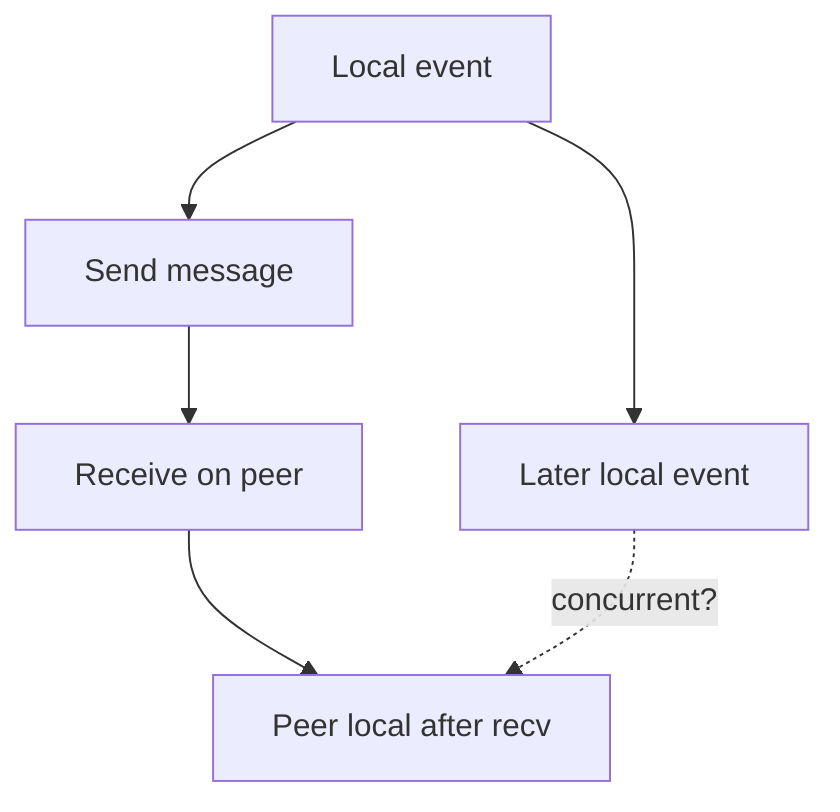
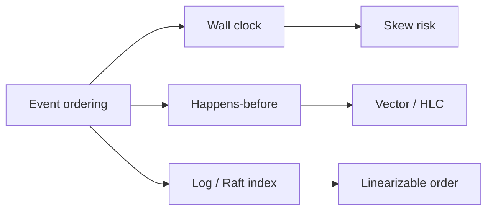
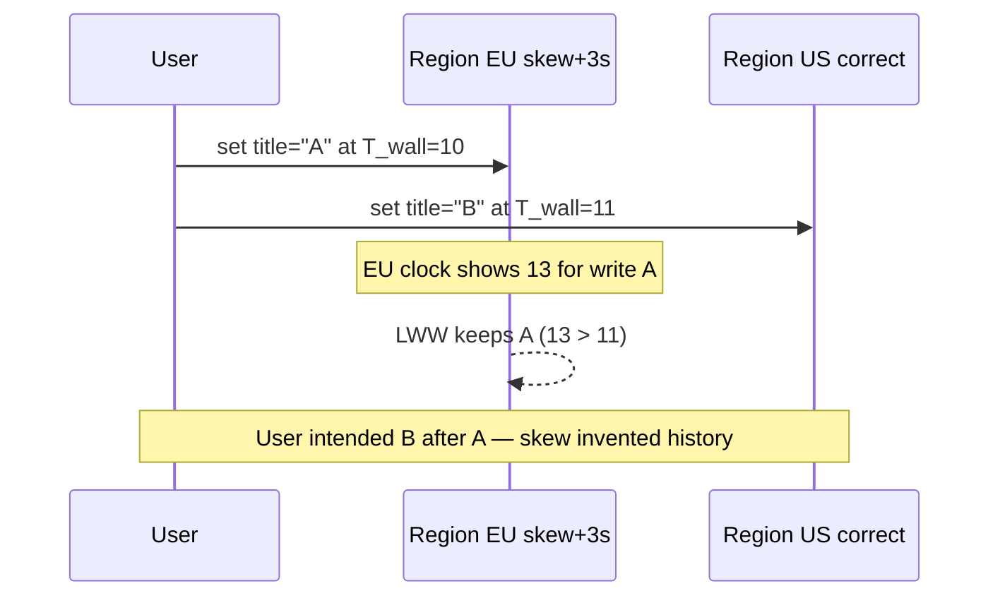

# Clocks Skew Ordering and Happens-Before

## Overview

Distributed systems do not share one true “now.” **Wall clocks** drift; **NTP** corrects with jumps; **leap seconds** and VM pauses surprise operators. **Happens-before** (Lamport) is the partial order induced by local sequence and message send/receive—not by timestamps alone. Product designers misuse clocks for LWW conflict resolution, lease expiry, and “who wrote last,” then discover skew invented false history. Safe designs use **causal metadata**, **hybrid logical clocks (HLC)**, or **consensus order**—and treat wall time as a UX/ops signal, not sole truth.

## Learning Objectives

- Explain clock skew, drift, and why absolute timestamps are not total order
- Define happens-before and when events are concurrent
- Choose among wall clock, Lamport, vector clocks, and HLC for a product invariant
- Show how LWW + skew creates lost updates users can see
- Sketch causal version checks in TypeScript

## Prerequisites

- [[09-System-Design/08-Coordination-Consensus-and-Locks/Consensus Intuition Raft and Paxos for Designers|Consensus Intuition Raft and Paxos for Designers]]
- [[09-System-Design/03-Consistency-Models-and-CAP/Strong Eventual Causal and Read-Your-Writes|Strong Eventual Causal and Read-Your-Writes]]
- [[09-System-Design/03-Consistency-Models-and-CAP/Conflict Policies LWW and CRDT Product Use|Conflict Policies LWW and CRDT Product Use]]
- [[09-System-Design/README|System Design]]

## Difficulty

`advanced`

## Estimated Time

- Reading: 2.5 hours
- Exercises: 3 hours
- Mini project: 4 hours

## History

Lamport’s 1978 clocks paper separated physical time from causal order. Vector clocks enabled concurrency detection in Dynamo-style stores. Google Spanner’s TrueTime bounded uncertainty with GPS/atomic clocks—an expensive special case. Most product stacks still ship NTP + LWW and inherit rare but severe ordering bugs across regions.

## Problem It Solves

- **Lost updates** when skewed LWW prefers an older write
- **Lease ghosts** when expiry uses unsynchronized clocks
- **Incorrect audit trails** sorted by `created_at` across services
- **False “after”** in support tooling for multi-region events

## Internal Implementation

### Clock types (designer cheat sheet)

| Clock | Provides | Does not provide |
| --- | --- | --- |
| Wall / NTP | Human time, SLOs | Causal order under skew |
| Monotonic (per process) | Local intervals | Cross-node compare |
| Lamport | Causal-ish total number | Concurrency detection |
| Vector | Concurrency detection | Compactness at huge N |
| HLC | Compact causal + physical | Perfect physical accuracy |
| Consensus log index | Total order of commits | Low latency always |

### Happens-before rules

1. Same process: earlier event → later event.
2. Send → corresponding receive.
3. Transitive closure.
4. If neither a→b nor b→a, events are **concurrent**.



## Mermaid Diagrams

### Structure



### Sequence / Lifecycle — LWW loss under skew



## Examples

### Minimal Example — concurrent vs ordered

```text
P1: write(x=1) then send m
P2: recv m then write(x=2)  ⇒ write1 → write2
P1: write(x=1)
P2: write(x=2) with no messages  ⇒ concurrent — need merge policy
```

### Production-Shaped Example — version vector gate

```typescript
// Node 20+ — causal check before applying remote update
type VV = Record<string, number>;

export function happensBefore(a: VV, b: VV): boolean {
  let strictlyLess = false;
  const ids = new Set([...Object.keys(a), ...Object.keys(b)]);
  for (const id of ids) {
    const av = a[id] ?? 0;
    const bv = b[id] ?? 0;
    if (av > bv) return false;
    if (av < bv) strictlyLess = true;
  }
  return strictlyLess;
}

export function concurrent(a: VV, b: VV): boolean {
  return !happensBefore(a, b) && !happensBefore(b, a) && JSON.stringify(a) !== JSON.stringify(b);
}

export function tick(local: VV, replicaId: string): VV {
  return { ...local, [replicaId]: (local[replicaId] ?? 0) + 1 };
}

export function merge(a: VV, b: VV): VV {
  const out: VV = { ...a };
  for (const [k, v] of Object.entries(b)) out[k] = Math.max(out[k] ?? 0, v);
  return out;
}
```

## Trade-offs

| Dimension | Upside | Downside | When it matters |
| --- | --- | --- | --- |
| LWW wall clock | Trivial | Skew lost updates | multi-region edits |
| Vector clocks | Detect concurrency | Metadata growth | collaborative state |
| HLC | Compact + physical | Implementation care | modern NewSQL / CRDTs |
| TrueTime-style | Bounded uncertainty | Cost / ops | global SQL |
| Raft order | Clear total order | Coordination latency | control plane |

### When to Use

- Causal metadata for multi-master document merges
- Monotonic process clocks for local timeouts (not cross-node)
- Consensus index for config and leadership

### When Not to Use

- Do not expire distributed leases solely by comparing remote wall clocks
- Do not sort cross-service audits by `timestamp` alone for legal truth
- Do not claim “last write wins” without stating clock assumptions

## Exercises

1. Given two writes with timestamps 100 and 101 but reverse causal order, show LWW failure.
2. Draw happens-before for a request spanning API → queue → worker → DB.
3. When would you pick HLC over full vector clocks?
4. Explain why `Date.now()` for idempotency keys is dangerous.
5. Relate Spanner commit wait to uncertainty intervals (intuition only).

## Mini Project

**Skew injector.** Two Node processes with artificial clock offset; CRDT/LWW store; demonstrate lost update; fix with version vectors.

## Portfolio Project

Document clock assumptions in ADRs inside [[09-System-Design/projects/Distributed Systems Workbench/README|Distributed Systems Workbench]].

## Interview Questions

1. What is happens-before?
2. Why can’t wall clocks alone order distributed events?
3. Vector clock vs Lamport clock—what can each detect?
4. How does clock skew break LWW?
5. Safe ways to implement lease expiry across nodes?

### Stretch / Staff-Level

1. Design an HLC for a multi-region KV and specify what “read your writes” requires.
2. Compare Cockroach/Yugabyte HLC usage to application-level vector clocks.

## Common Mistakes

- Using `ORDER BY created_at` as causal truth across services
- Mixing NTP step adjustments into lease logic
- Assuming monotonic clocks are comparable across hosts
- Ignoring concurrency and forcing LWW silently

## Best Practices

- Store causal metadata with multi-master records
- Prefer server-assigned consensus/HLC timestamps for conflicts
- Bound acceptable skew in runbooks; alert on NTP failures
- For UX “posted at,” show wall time; for merge, use versions
- Cross-link [[09-System-Design/07-Multi-Region-and-Geo/Replica Lag as User-Facing Consistency Budget|Replica Lag as User-Facing Consistency Budget]]

## Summary

Ordering in distributed products is a causal problem first and a clock problem second. Happens-before, vector/HLC metadata, or consensus log indexes establish truth; wall clocks serve humans and SLOs. Designs that sort by skewed time invent history—and users notice as lost edits and impossible timelines.

## Further Reading

- [[00-References/System Design/README|System Design References]]
- Lamport — Time, Clocks, and the Ordering of Events
- Hybrid Logical Clocks literature (Kulkarni et al.)

## Related Notes

- [[09-System-Design/README|System Design]]
- [[09-System-Design/03-Consistency-Models-and-CAP/Conflict Policies LWW and CRDT Product Use|Conflict Policies LWW and CRDT Product Use]]
- [[09-System-Design/08-Coordination-Consensus-and-Locks/Distributed Locks Leases and Fencing Tokens|Distributed Locks Leases and Fencing Tokens]]
- [[09-System-Design/07-Multi-Region-and-Geo/Multi-Region Active-Passive Active-Active Patterns|Multi-Region Active-Passive Active-Active Patterns]]
- [[08-Databases/README|Databases]]

## Progress Checklist

- [ ] Explained from first principles
- [ ] Drew at least one Mermaid diagram
- [ ] Implemented a minimal version
- [ ] Documented trade-offs and non-goals
- [ ] Completed exercises
- [ ] Practiced interview questions aloud
- [ ] Linked prerequisites and dependents
