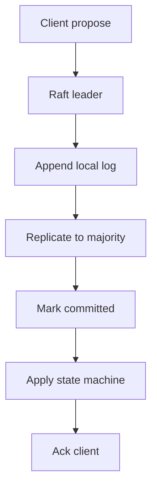
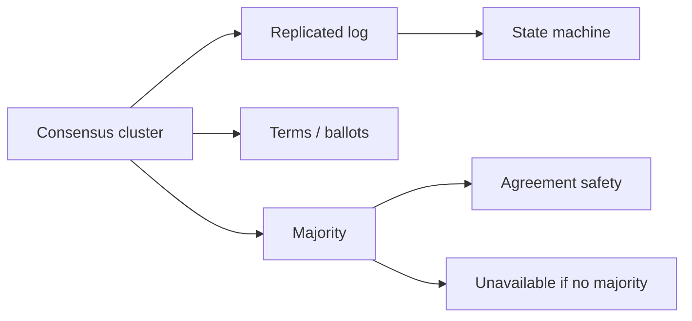
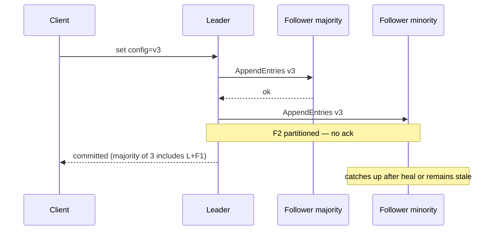

# Consensus Intuition Raft and Paxos for Designers

## Overview

**Consensus** lets a set of replicas agree on a single value (or an ordered log of values) despite crashes and network partitions—as long as a **majority (quorum)** remains. For product designers, Raft and Paxos are not proof systems; they are the reason etcd, Consul, ZooKeeper, and many control planes can offer **linearizable** config, leases, and metadata. You need the intuition: replicated log, terms/ballots, majority commit, and what becomes unavailable when you lose quorum.

This is **designer-level**: when to put a decision in consensus vs eventually consistent stores, and what latency/availability you buy. Kernel-level proofs and paper line-by-line stay out of scope.

## Learning Objectives

- State what consensus guarantees (agreement, validity, termination under majority)
- Map Raft roles (leader, follower, candidate) to product control-plane duties
- Explain why majority commit implies “unavailable without quorum,” not “AP”
- Contrast consensus metadata with quorum data stores (R+W) and CRDTs
- Sketch a tiny log-append acceptance check in TypeScript

## Prerequisites

- [[09-System-Design/08-Coordination-Consensus-and-Locks/Leader Election Use Cases and Failure Modes|Leader Election Use Cases and Failure Modes]]
- [[09-System-Design/03-Consistency-Models-and-CAP/Quorums R plus W and Tunable Consistency|Quorums R plus W and Tunable Consistency]]
- [[09-System-Design/03-Consistency-Models-and-CAP/CAP and PACELC as Product Constraints|CAP and PACELC as Product Constraints]]
- [[09-System-Design/README|System Design]]

## Difficulty

`advanced`

## Estimated Time

- Reading: 3 hours
- Exercises: 3 hours
- Mini project: 5 hours

## History

Paxos (Lamport) formalized agreement under asynchrony; industry found it hard to teach. Raft (Ongaro/Ousterhout) reorganized the same ideas around a **strong leader** and a **replicated log**, becoming the default mental model for etcd, Consul, and many databases’ control planes. Product teams still misuse consensus by putting high-QPS user data through a 3–5 node Raft cluster.

## Problem It Solves

- **Conflicting configs** — two control planes apply different cluster membership
- **Unsafe failover** — promote without majority acknowledgment of prior commits
- **Metadata split-brain** — service discovery pointing to dual primaries
- **False “exactly-once”** — claiming consensus for pipelines that only need idempotent queues

## Internal Implementation

### Designer model (Raft-shaped)

1. **Leader** accepts client proposals, appends to local log.
2. **Replicates** entries to followers.
3. Entry is **committed** when a majority of nodes have stored it for that term.
4. Leader applies committed entries to state machine; followers apply in order.
5. On leader loss, **election** with higher term; only majority can elect.

Paxos intuition maps similarly: ballots ≈ terms, acceptors ≈ replicas, chosen value ≈ committed log entry. Multi-Paxos / Raft optimize repeated agreement into a log.

### What belongs in consensus

| Put in Raft/etcd | Keep elsewhere |
| --- | --- |
| Cluster membership, shard map versions | Bulk user payloads |
| Leader leases, fencing epochs | High-QPS event streams |
| Feature-flag *authority* (small) | CDN edge caches of flags |
| DDL / migration locks | OLTP row data |



## Mermaid Diagrams

### Structure



### Sequence / Lifecycle — commit under partition



## Examples

### Minimal Example — majority rule

```text
N = 5 replicas → tolerate 2 failures
Commit requires 3 copies of the log entry
2-node “cluster” cannot lose 1 node and still make progress safely
```

### Production-Shaped Example — reject stale term writes

```typescript
// Node 20+ — educational: commit only if term matches current leadership
type LogEntry = { term: number; index: number; value: string };

export class TinyRaftLog {
  currentTerm = 0;
  log: LogEntry[] = [];
  commitIndex = -1;

  appendAsLeader(value: string, acksFromFollowers: number, clusterSize: number): boolean {
    const majority = Math.floor(clusterSize / 2) + 1;
    const entry: LogEntry = { term: this.currentTerm, index: this.log.length, value };
    this.log.push(entry);
    const copies = 1 + acksFromFollowers; // leader + followers
    if (copies >= majority) {
      this.commitIndex = entry.index;
      return true;
    }
    return false; // not yet committed — caller must retry replication
  }

  vote(candidateTerm: number): boolean {
    if (candidateTerm <= this.currentTerm) return false;
    this.currentTerm = candidateTerm;
    return true;
  }
}
```

## Trade-offs

| Dimension | Upside | Downside | When it matters |
| --- | --- | --- | --- |
| Strong leader (Raft) | Simple mental model | Leader hotspot | metadata control planes |
| Majority commit | Dual-writer safety | Unavail. without quorum | partitions |
| Small consensus cluster | Low ops cost | Not for bulk data | etcd-sized keys |
| Embedding Raft in app | No external DCS | Hard to operate | rarely justified |

### When to Use

- Cluster membership, leases, and linearizable config
- Coordination primitives backing locks and elections
- Small, critical metadata with modest QPS

### When Not to Use

- User timeline payloads, media blobs, analytics events
- Cross-region chatty consensus for every request (PACELC latency)
- Replacing idempotent queue consumers with “consensus exactly-once”

## Exercises

1. For N=3 and N=5, compute failure tolerance and minimum commit acknowledgments.
2. Explain why a minority partition must not accept writes even if clients can reach it.
3. Map “etcd key update” to log append → commit → apply.
4. Contrast R+W quorum on a data store vs Raft commit for the same key.
5. List three product bugs caused by putting high-cardinality data in ZooKeeper/etcd.

## Mini Project

**Term + majority simulator.** Simulate 5 nodes, kill the leader, elect, attempt write on minority partition—assert it cannot commit. Log a Mermaid sequence from the run.

## Portfolio Project

Document a control-plane ADR in [[09-System-Design/projects/Distributed Systems Workbench/README|Distributed Systems Workbench]]: what lives in consensus vs the data plane.

## Interview Questions

1. What does consensus agree on in Raft?
2. Why does losing quorum make the cluster unavailable for writes?
3. How do terms prevent stale leaders from committing?
4. When is Paxos/Raft the wrong tool versus CRDTs or R+W?
5. Why are consensus clusters usually odd-sized (3, 5)?

### Stretch / Staff-Level

1. Explain leader lease optimizations and read linearizability shortcuts (and their risks).
2. Design multi-region etcd/Raft topology: one global cluster vs regional clusters + async.

## Common Mistakes

- Treating Raft as “AP availability magic”
- Storing large values or high QPS in the consensus store
- Assuming followers can serve linearizable reads without care
- Equating “Kafka replication” with consensus without understanding ISR/commit semantics

## Best Practices

- Keep consensus keys tiny and low-churn
- Monitor leader elections, commit latency, and quorum health as SLIs
- Separate data-plane quorums from control-plane Raft
- Read [[09-System-Design/08-Coordination-Consensus-and-Locks/Clocks Skew Ordering and Happens-Before|Clocks Skew Ordering]] before inventing custom consensus

## Summary

Raft/Paxos give designers a replicated log with majority commit: strong agreement for metadata and leadership, unavailability without quorum, and poor fit for bulk product data. Use consensus where dual writers would corrupt the control plane; use quorums, sharding, and async topologies where user-scale throughput and latency dominate.

## Further Reading

- [[00-References/System Design/README|System Design References]]
- Ongaro & Ousterhout — In Search of an Understandable Consensus Algorithm (Raft)
- etcd raft library operational docs

## Related Notes

- [[09-System-Design/README|System Design]]
- [[09-System-Design/08-Coordination-Consensus-and-Locks/Leader Election Use Cases and Failure Modes|Leader Election Use Cases and Failure Modes]]
- [[09-System-Design/08-Coordination-Consensus-and-Locks/Distributed Locks Leases and Fencing Tokens|Distributed Locks Leases and Fencing Tokens]]
- [[09-System-Design/03-Consistency-Models-and-CAP/Quorums R plus W and Tunable Consistency|Quorums R plus W and Tunable Consistency]]
- [[08-Databases/07-Replication-Mechanics/Failover Promote and Split-Brain Mechanics|Failover Promote and Split-Brain Mechanics]]

## Progress Checklist

- [ ] Explained from first principles
- [ ] Drew at least one Mermaid diagram
- [ ] Implemented a minimal version
- [ ] Documented trade-offs and non-goals
- [ ] Completed exercises
- [ ] Practiced interview questions aloud
- [ ] Linked prerequisites and dependents
