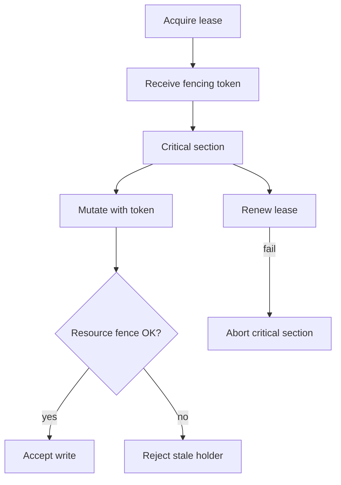
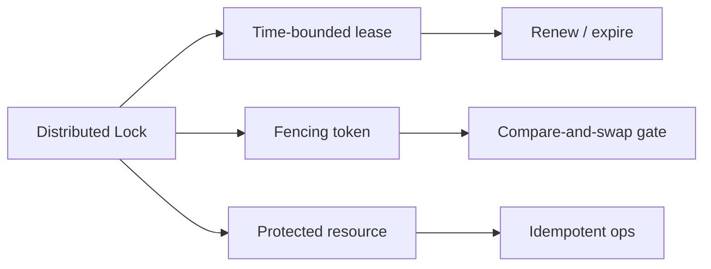
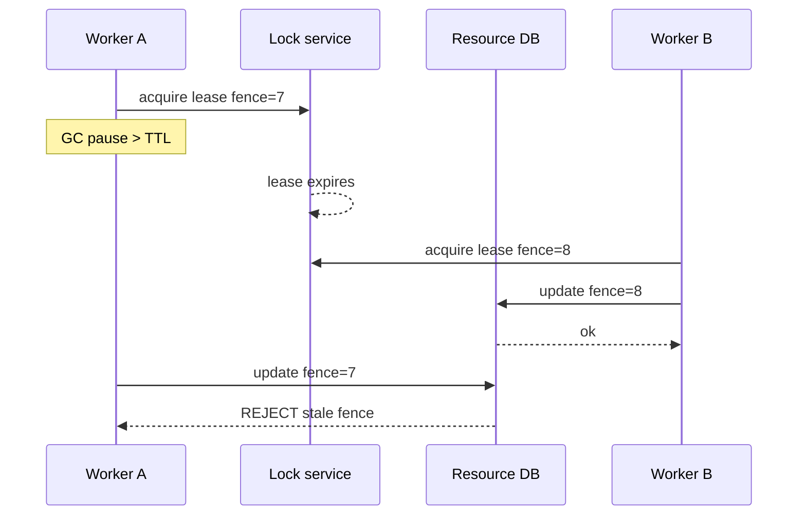

# Distributed Locks Leases and Fencing Tokens

## Overview

A **distributed lock** tries to ensure mutual exclusion across processes. A **lease** is a time-bounded lock that expires if the holder fails to renew. A **fencing token** (monotone epoch) is checked by the **resource itself** so that a holder whose lease expired—but who still thinks it owns the lock—cannot apply late mutations. Without fencing, Redis/`SET NX`, ZooKeeper ephemeral nodes, and DB advisory locks all share the same failure class: **lock liveness ≠ mutation safety**.

In-process mutexes and single-DB `SELECT FOR UPDATE` belong to Backend/Databases. This note is the **multi-service, multi-node** contract.

## Learning Objectives

- Distinguish lock acquisition from safe critical-section execution under GC and partitions
- Design lease TTL, renew cadence, and expiry races
- Require fencing tokens at the durable resource boundary
- Critique lock-only designs (including naive Redlock) for correctness claims
- Prefer per-resource leases or idempotent ownership over global locks

## Prerequisites

- [[09-System-Design/08-Coordination-Consensus-and-Locks/Leader Election Use Cases and Failure Modes|Leader Election Use Cases and Failure Modes]]
- [[09-System-Design/08-Coordination-Consensus-and-Locks/Consensus Intuition Raft and Paxos for Designers|Consensus Intuition Raft and Paxos for Designers]]
- [[08-Databases/06-Concurrency-Internals/Latches Locks and Lock Managers|Latches Locks and Lock Managers]]
- [[09-System-Design/README|System Design]]

## Difficulty

`advanced`

## Estimated Time

- Reading: 2.5 hours
- Exercises: 3 hours
- Mini project: 4 hours

## History

Chubby and ZooKeeper popularized coarse distributed locking. Redis lock blogs promised simplicity; Kleppmann’s Redlock critique made **fencing** mainstream. Cloud APIs (DynamoDB conditional writes, GCS generation numbers, Kubernetes resourceVersion) encode fencing as compare-and-swap versions rather than “lock servers.”

## Problem It Solves

- **Double processing** of payments, emails, or inventory decrements
- **Zombie workers** continuing after lease expiry
- **False mutual exclusion** when the lock service and storage disagree
- **Thundering herds** when a popular lock key expires under load

## Internal Implementation

### Correctness stack

1. Acquire lease from a linearizable store (etcd/ZooKeeper/consensus) **or** use conditional write on the resource.
2. Receive **monotone fence** (ZXID, etcd mod_revision, integer epoch).
3. Every mutation to protected state includes the fence; storage rejects lower fences.
4. Renew lease well before TTL; on renew failure, **stop mutating** even if work remains.
5. Prefer **per-item leases** (job id) over one global “payments lock.”



## Mermaid Diagrams

### Structure



### Sequence / Lifecycle — zombie after pause



## Examples

### Minimal Example — token gate

```text
UPDATE inventory
SET qty = qty - 1, fence_epoch = $fence
WHERE sku = $sku AND fence_epoch <= $fence
-- rowcount 0 ⇒ stale lock holder
```

### Production-Shaped Example — lease + fence in TypeScript

```typescript
// Node 20+ — educational lock manager; production uses etcd/ZooKeeper CAS
type Lease = { key: string; owner: string; fence: number; expiresAt: number };

const leases = new Map<string, Lease>();
let nextFence = 1;

export function tryAcquire(key: string, owner: string, ttlMs: number, now = Date.now()): Lease | null {
  const cur = leases.get(key);
  if (cur && cur.expiresAt > now && cur.owner !== owner) return null;
  const lease: Lease = { key, owner, fence: nextFence++, expiresAt: now + ttlMs };
  leases.set(key, lease);
  return lease;
}

export function renew(lease: Lease, ttlMs: number, now = Date.now()): boolean {
  const cur = leases.get(lease.key);
  if (!cur || cur.owner !== lease.owner || cur.fence !== lease.fence) return false;
  if (cur.expiresAt <= now) return false;
  cur.expiresAt = now + ttlMs;
  return true;
}

export function applyWithFence(
  resourceEpoch: { value: number },
  fence: number,
  mutate: () => void,
): void {
  if (fence < resourceEpoch.value) throw new Error("stale_fence");
  resourceEpoch.value = Math.max(resourceEpoch.value, fence);
  mutate();
}
```

## Trade-offs

| Dimension | Upside | Downside | When it matters |
| --- | --- | --- | --- |
| Coarse global lock | Simple reasoning | Hotspot, herd | almost never at scale |
| Per-key lease | Parallelism | More keys to manage | job/queue ownership |
| Short TTL | Fast failover | Renew chatter; false expiry | pair with fencing |
| Lock without fence | Easy to code | Incorrect under pause | correctness-critical money paths |
| Conditional write only | No lock server | App must speak CAS | preferred when possible |

### When to Use

- Short critical sections with fencing at storage
- Leader election and singleton schedulers
- Migrating shared resources with explicit epochs

### When Not to Use

- Long-running business workflows (use sagas / idempotent steps)
- “Lock the world” before a batch job
- Redis locks without a fencing story for financial mutations
- Prefer [[09-System-Design/08-Coordination-Consensus-and-Locks/When Not to Coordinate Avoid Shared Mutable State|When Not to Coordinate]] when ownership can be sharded

## Exercises

1. Show a timeline where lock acquisition succeeds twice concurrently without fencing—name the bug.
2. Choose TTL and renew interval for p99 pause=2s and network RTT=50ms; justify margins.
3. Redesign a “lock then charge card” flow to “idempotency key + CAS.”
4. Compare etcd lock vs Postgres advisory lock for cross-service exclusion.
5. Argue for/against Redlock for inventory decrement with a single Redis primary.

## Mini Project

**Fencing clinic.** Two workers; inject artificial pause after acquire. Assert resource rejects stale fence. Log rejected write count as a metric.

## Portfolio Project

Add a “unsafe lock vs fenced lease” scenario to [[09-System-Design/projects/Distributed Systems Workbench/README|Distributed Systems Workbench]].

## Interview Questions

1. Why can a process hold a lock in memory after the lock service expired it?
2. Where must fencing tokens be validated?
3. Lease vs lock without expiry—operational differences?
4. When is a database conditional update better than a distributed lock service?
5. What goes wrong with long critical sections under leases?

### Stretch / Staff-Level

1. Formalize the dual-holder window as a function of TTL, detection delay, and clock skew.
2. Design fencing for object stores using generation numbers / ETags end-to-end.

## Common Mistakes

- Checking the lock only at start, never renewing
- Using wall-clock equality across hosts for lock expiry
- Treating lock acquisition as proof of exclusive durable effect
- One mega-lock for an entire microservice domain

## Best Practices

- Fence at the resource; treat lock service as optimization + discovery
- Keep critical sections tiny; push work to idempotent queues
- Alert on renew failures and stale-fence rejects
- Document lock key cardinality to avoid etcd/ZK overload
- Hand off engine row locks to [[08-Databases/06-Concurrency-Internals/Latches Locks and Lock Managers|Latches Locks and Lock Managers]]

## Summary

Distributed locks without leases are operationally brittle; leases without fencing are correctness-brittle. Product-safe mutual exclusion is **lease + monotone token checked by the resource**, or better, **idempotent CAS** that removes the lock server from the trust path. Reach for coordination only after sharding and idempotency fail.

## Further Reading

- [[00-References/System Design/README|System Design References]]
- Martin Kleppmann — How to do distributed locking
- etcd concurrency / lock recipes

## Related Notes

- [[09-System-Design/README|System Design]]
- [[09-System-Design/08-Coordination-Consensus-and-Locks/Leader Election Use Cases and Failure Modes|Leader Election Use Cases and Failure Modes]]
- [[09-System-Design/08-Coordination-Consensus-and-Locks/Consensus Intuition Raft and Paxos for Designers|Consensus Intuition Raft and Paxos for Designers]]
- [[09-System-Design/08-Coordination-Consensus-and-Locks/When Not to Coordinate Avoid Shared Mutable State|When Not to Coordinate Avoid Shared Mutable State]]
- [[08-Databases/05-Transactions-and-Isolation/Locking vs MVCC|Locking vs MVCC]]
- [[07-Backend/README|Backend]]

## Progress Checklist

- [ ] Explained from first principles
- [ ] Drew at least one Mermaid diagram
- [ ] Implemented a minimal version
- [ ] Documented trade-offs and non-goals
- [ ] Completed exercises
- [ ] Practiced interview questions aloud
- [ ] Linked prerequisites and dependents
