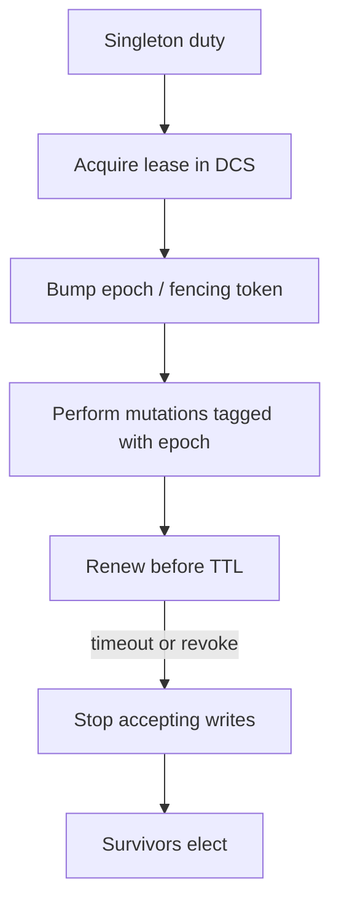
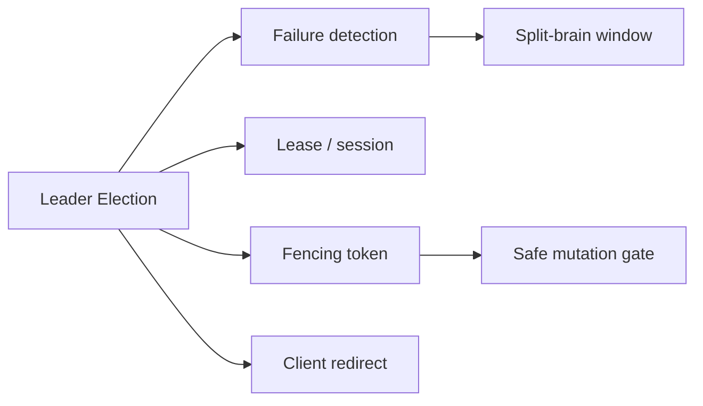
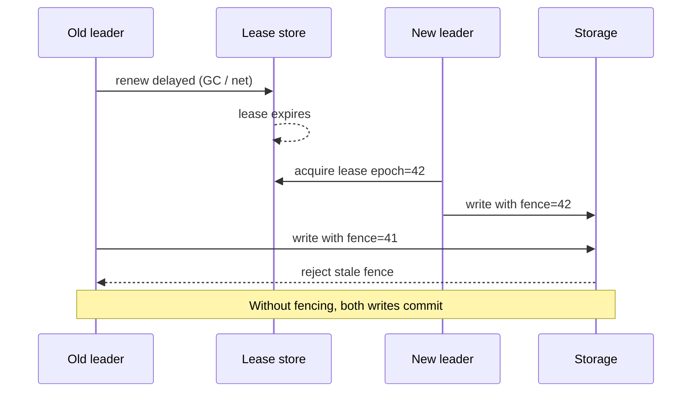

# Leader Election Use Cases and Failure Modes

## Overview

**Leader election** selects exactly one process (or one replica set) to own a critical duty—accepting writes, scheduling batch jobs, owning a shard primary, or coordinating a control-plane action. At product scale, election is not “pick a winner”; it is a **lease + fencing** contract so that after partitions, timeouts, and GC pauses, **at most one** owner can still mutate durable state. Designer-level focus: when you need a leader, how you detect loss of leadership, and how dual-leader windows destroy invariants.

Engine promotion mechanics live in [[08-Databases/07-Replication-Mechanics/Failover Promote and Split-Brain Mechanics|Failover Promote and Split-Brain]]; this note owns the **product topology** of leadership across services and regions.

## Learning Objectives

- Name product use cases that justify a single leader vs leaderless designs
- Model failure detection timeouts vs false positives under load and GC
- Explain split-brain windows and why DNS TTL is not fencing
- Sketch lease renew + epoch/fencing token handoff in TypeScript
- Decide when election is mandatory vs an avoidable coordination tax

## Prerequisites

- [[09-System-Design/07-Multi-Region-and-Geo/Failover RPO RTO and Split-Brain Product Policy|Failover RPO RTO and Split-Brain Product Policy]]
- [[08-Databases/07-Replication-Mechanics/Failover Promote and Split-Brain Mechanics|Failover Promote and Split-Brain Mechanics]]
- [[09-System-Design/03-Consistency-Models-and-CAP/CAP and PACELC as Product Constraints|CAP and PACELC as Product Constraints]]
- [[09-System-Design/README|System Design]]

## Difficulty

`advanced`

## Estimated Time

- Reading: 2.5 hours
- Exercises: 3 hours
- Mini project: 4 hours

## History

Early HA stacks elected leaders with heartbeats and sticky VIPs. False positives under network blips produced dual primaries. Consensus stores (ZooKeeper, etcd, Consul) and Raft-based control planes made leases first-class. Cloud managed DBs and Kubernetes lease APIs hid election but still expose the same failure modes: stale leaders, slow demotion, and application writes that ignore fencing.

## Problem It Solves

- **Duplicate side effects** — two schedulers fire the same cron
- **Divergent writes** — two shard primaries accept mutations
- **Stuck availability** — election never completes because quorum is lost
- **Silent corruption** — old leader returns from STONITH-less pause and writes again

## Internal Implementation

### When products elect a leader

| Duty | Why singleton | Alternative |
| --- | --- | --- |
| DB / log shard primary | Linearizable write path | Leaderless quorums (higher coordination cost per write) |
| Partitioned job scheduler | Exactly-once *attempt* ownership | Work queues with lease per item |
| Schema / config migrator | Ordered DDL | Versioned migrations with advisory locks |
| Global rate-limit aggregator | Single accounting view | Sharded tokens with eventual reconciliation |

### Failure modes (designer checklist)

1. **False failure** — leader alive but heartbeats delayed → new election → dual leaders until fence.
2. **Partial partition** — A sees B dead; C still reaches B → asymmetric view.
3. **Lease length vs GC** — pause longer than lease without fencing → zombie leader.
4. **Clients cache old leader** — sticky LB / DNS / long-lived gRPC → writes land on demoted node.
5. **Quorum loss** — majority down → no new leader (correct unavailability vs unsafe promote).



## Mermaid Diagrams

### Structure



### Sequence / Lifecycle — false-positive promote



## Examples

### Minimal Example — conceptual lease record

```text
key: /leaders/shard-7
value: { owner: "pod-b", epoch: 42, expires_at: T+15s }
```

Only the holder of `epoch=42` may mutate shard-7 until expiry or explicit revoke.

### Production-Shaped Example — fence at the write boundary

```typescript
// Node 20+ — storage rejects stale fencing tokens after leadership change
type WriteOp = { shardId: string; fence: number; payload: unknown };

const shardFence = new Map<string, number>(); // durable in real systems

export function applyWrite(op: WriteOp): void {
  const current = shardFence.get(op.shardId) ?? 0;
  if (op.fence < current) {
    throw new Error(`stale_leader fence=${op.fence} current=${current}`);
  }
  if (op.fence > current) shardFence.set(op.shardId, op.fence);
  // apply payload under current fence
}

export async function withLeadership<T>(
  renew: () => Promise<{ fence: number; ttlMs: number }>,
  work: (fence: number) => Promise<T>,
): Promise<T> {
  const { fence, ttlMs } = await renew();
  const deadline = Date.now() + ttlMs * 0.5;
  if (Date.now() > deadline) throw new Error("lease_too_short");
  return work(fence);
}
```

## Trade-offs

| Dimension | Upside | Downside | When it matters |
| --- | --- | --- | --- |
| Single leader | Simple linearizability | Hotspot; failover latency | write-primary stores |
| Aggressive timeouts | Faster failover | False promotes | noisy networks |
| Long leases | Fewer renewals | Longer dual-leader risk | must pair with fencing |
| Quorum election | Safe under partitions | Unavailable without majority | correct CAP choice |

### When to Use

- One writer per shard or one global scheduler with side effects
- Control-plane actions that must be totally ordered
- Failover of stateful primaries with explicit fencing

### When Not to Use

- Stateless request handlers behind LB (no election needed)
- Work that can be leased per item on a queue
- Prefer [[09-System-Design/08-Coordination-Consensus-and-Locks/When Not to Coordinate Avoid Shared Mutable State|When Not to Coordinate]] when CRDTs or sharding remove the singleton

## Exercises

1. List three product features that look like they need a leader; redesign one without election.
2. Given lease TTL=10s and p99 GC pause=12s, argue whether fencing is mandatory and why.
3. Draw client redirect paths after promote: DNS, gRPC resolver, sticky cookie.
4. Simulate asymmetric partition: who should remain leader and who must refuse writes?
5. Write a runbook step that verifies “exactly one primary” after failover.

## Mini Project

**Lease + fence demo.** Two TypeScript processes contend for a file- or Redis-backed lease; a mock store rejects stale epochs. Measure dual-write window with and without fencing.

## Portfolio Project

Fold into [[09-System-Design/projects/Distributed Systems Workbench/README|Distributed Systems Workbench]] as a leadership failure scenario with metrics on promote latency and rejected stale writes.

## Interview Questions

1. Why is “the old leader is probably dead” insufficient for safe failover?
2. What is a fencing token and where must it be checked?
3. How do lease TTL and detection timeout interact with availability?
4. When would you choose leaderless quorum writes instead of a primary?
5. How do clients learn the new leader without long dual-write windows?

### Stretch / Staff-Level

1. Compare Kubernetes Lease, etcd session, and DB advisory-lock “leaders” for side-effect safety.
2. Design multi-region leadership: regional leaders vs global leader, and CAP implications.

## Common Mistakes

- Electing without fencing at the durable write path
- Using wall-clock alone to decide “I’m still leader”
- Caching leadership in clients longer than lease TTL
- Promoting during quorum loss to “restore availability”

## Best Practices

- Treat leadership as a **lease**, not a permanent role
- Increment epoch on every successful acquire; reject lower epochs forever
- Bound client discovery (short TTL, push notify) after promote
- Game-day false-positive heartbeats quarterly
- Pair with [[09-System-Design/08-Coordination-Consensus-and-Locks/Distributed Locks Leases and Fencing Tokens|Distributed Locks Leases and Fencing Tokens]]

## Summary

Leader election is justified only when a singleton duty protects a hard invariant. Safe products combine failure detection, time-bounded leases, and fencing tokens so demoted leaders cannot mutate state. Most “we need a leader” requests are really “we need idempotent work ownership”—prefer narrower leases or avoid shared mutable state before introducing fleet-wide election.

## Further Reading

- [[00-References/System Design/README|System Design References]]
- etcd / Raft lease documentation
- Martin Kleppmann — “How to do distributed locking” (fencing discussion)

## Related Notes

- [[09-System-Design/README|System Design]]
- [[09-System-Design/08-Coordination-Consensus-and-Locks/Consensus Intuition Raft and Paxos for Designers|Consensus Intuition Raft and Paxos for Designers]]
- [[09-System-Design/08-Coordination-Consensus-and-Locks/Distributed Locks Leases and Fencing Tokens|Distributed Locks Leases and Fencing Tokens]]
- [[09-System-Design/07-Multi-Region-and-Geo/Failover RPO RTO and Split-Brain Product Policy|Failover RPO RTO and Split-Brain Product Policy]]
- [[08-Databases/07-Replication-Mechanics/Failover Promote and Split-Brain Mechanics|Failover Promote and Split-Brain Mechanics]]
- [[07-Backend/06-Reliability-and-Abuse-Resistance/Circuit Breakers and Bulkheads|Circuit Breakers and Bulkheads]]

## Progress Checklist

- [ ] Explained from first principles
- [ ] Drew at least one Mermaid diagram
- [ ] Implemented a minimal version
- [ ] Documented trade-offs and non-goals
- [ ] Completed exercises
- [ ] Practiced interview questions aloud
- [ ] Linked prerequisites and dependents
