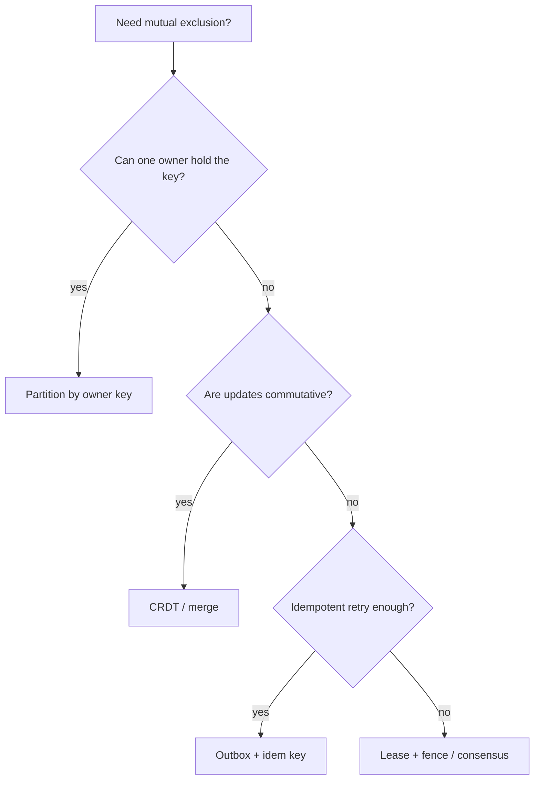
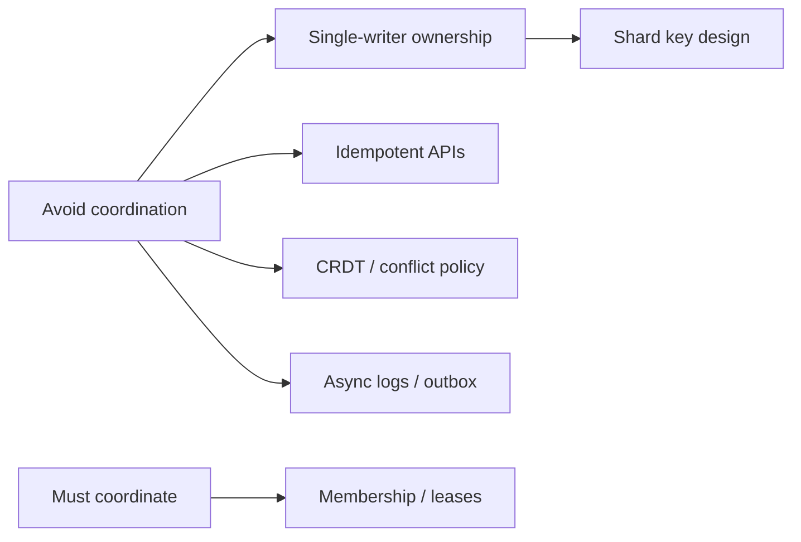
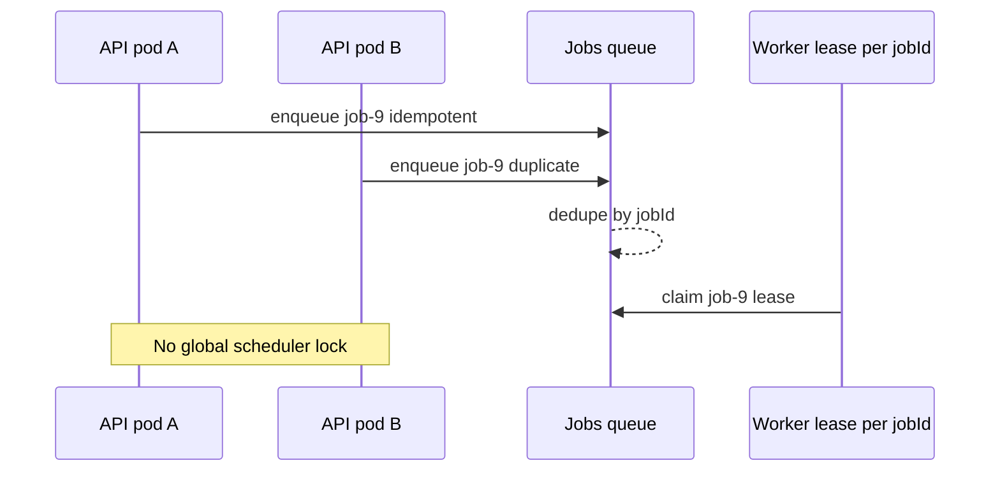

# When Not to Coordinate Avoid Shared Mutable State

## Overview

Every lock, election, and consensus round is a **coordination tax**: latency, failure coupling, and operational complexity. The highest-leverage system design move is often **not coordinating**—by eliminating **shared mutable state**. Give each shard, tenant, or message a single owner; make updates **idempotent**; merge with **CRDTs** or deterministic conflict policies; move side effects to **append-only logs**. Coordination remains for true singletons (membership, rare DDL). Everything else should be designed so two nodes can proceed without talking.

## Learning Objectives

- Recognize coordination as a product cost, not a default safety feature
- Refactor shared counters, inventories, and schedules into owned partitions
- Choose idempotency, outbox, and CRDT patterns over global locks
- State when consensus is still mandatory
- Sketch an ownership map that removes a distributed lock

## Prerequisites

- [[09-System-Design/08-Coordination-Consensus-and-Locks/Distributed Locks Leases and Fencing Tokens|Distributed Locks Leases and Fencing Tokens]]
- [[09-System-Design/04-Partitioning-Sharding-and-Placement/Partition Keys Hotspots and Skew|Partition Keys Hotspots and Skew]]
- [[09-System-Design/06-Messaging-Streams-and-Async-Topologies/Ordering Partitions Idempotency and Exactly-Once Claims|Ordering Partitions Idempotency and Exactly-Once Claims]]
- [[09-System-Design/README|System Design]]

## Difficulty

`advanced`

## Estimated Time

- Reading: 2 hours
- Exercises: 3 hours
- Mini project: 4 hours

## History

Early distributed apps copied single-node mutexes into ZooKeeper. Large outages taught teams that lock servers become SEVs. Uniswap-scale and social-scale systems survived by **sharding ownership** and **event sourcing**. “Coordination avoidance” (Bailis et al.) formalized when invariants allow commutative, associative updates without runtime consensus.

## Problem It Solves

- **Lock stampedes** and etcd/ZK overload under traffic spikes
- **Cross-region latency** on every write that grabs a global lock
- **Cascading unavailability** when the coordination plane dies
- **False safety** from locks that don’t fence (see prior notes)

## Internal Implementation

### Coordination avoidance toolkit

| Smell | Replace with |
| --- | --- |
| Global `inventory` lock | Shard by `sku` or warehouse; CAS per row |
| Singleton cron in 20 pods | Queue with per-job lease or partitioned scheduler |
| Shared rate-limit counter | Token buckets per key + local approx + async reconcile |
| Multi-writer document | CRDT or last-writer with causal versions |
| Sync “exactly once” RPC | Outbox + idempotency keys |

### Invariants that *require* coordination

- Unique global sequential IDs that must never gap *and* be contiguous (rare—usually don’t need contiguous)
- Single primary for a shard’s linearizable log
- Cluster membership changes
- Cross-shard serializable transactions (consider avoiding the invariant)



## Mermaid Diagrams

### Structure



### Sequence / Lifecycle — lock removed via ownership



## Examples

### Minimal Example — sharded counter

```text
Wrong: LOCK global_likes; likes++
Better: shard likes by post_id; UPDATE posts SET likes = likes + 1 WHERE id = $id
Best for multi-region: per-region deltas + periodic aggregate
```

### Production-Shaped Example — replace lock with CAS

```typescript
// Node 20+ — inventory without distributed lock service
type Stock = { sku: string; qty: number; version: number };

export function reserve(stock: Stock, n: number): Stock {
  if (stock.qty < n) throw new Error("insufficient");
  return { ...stock, qty: stock.qty - n, version: stock.version + 1 };
}

export async function reserveWithCas(
  read: () => Promise<Stock>,
  writeIfVersion: (s: Stock, expected: number) => Promise<boolean>,
  n: number,
  attempts = 5,
): Promise<Stock> {
  for (let i = 0; i < attempts; i++) {
    const cur = await read();
    const next = reserve(cur, n);
    if (await writeIfVersion(next, cur.version)) return next;
  }
  throw new Error("cas_conflict");
}
```

## Trade-offs

| Dimension | Upside | Downside | When it matters |
| --- | --- | --- | --- |
| Single-writer shard | No lock server | Resharding complexity | high write QPS |
| CRDT merge | Offline / multi-region | Semantics limits | collaborative data |
| Idempotent APIs | Safe retries | Key design discipline | all RPC edges |
| Global lock | Easy to explain | Coordination tax | almost never at fleet scale |
| Cross-shard txn | Strong invariant | Latency + failure coupling | avoid if product allows |

### When to Use

- Default: partition ownership and idempotency
- CRDTs for concurrent commutative state
- Consensus only for metadata and true singletons

### When Not to Use

- Do not “avoid coordination” by accepting silent dual primaries on money ledgers
- Do not shard so finely that secondary indexes and joins become impossible without a plan
- Legal uniqueness constraints may still need a linearizable uniqueness service

## Exercises

1. Take a design that uses ZooKeeper for “user profile updates”; remove the lock.
2. Identify three invariants in a checkout flow; mark which need coordination.
3. Design like-counts for a viral post without a single hot lock key.
4. Compare outbox+idempotency vs distributed lock for email sends.
5. Write an ADR: “We will not use a global distributed lock for X because…”

## Mini Project

**Coordination tax ledger.** Instrument two implementations (global lock vs sharded CAS) under partition; report p99 and error rates.

## Portfolio Project

Ownership maps and ADRs in [[09-System-Design/projects/Distributed Systems Workbench/README|Distributed Systems Workbench]].

## Interview Questions

1. What is coordination avoidance?
2. How does sharding remove the need for a lock?
3. When are CRDTs insufficient?
4. Why is a lock service a failure domain?
5. Examples where consensus is still required?

### Stretch / Staff-Level

1. Apply invariant confluence (CALM) intuition to a shopping-cart design.
2. Design multi-region unique username allocation without a global lock (pre-shards, claim tokens).

## Common Mistakes

- Adding Redis locks “just in case” on every write path
- Confusing “we used a lock” with “we proved correctness”
- Creating one partition so hot it recreates a singleton
- Ignoring idempotency and retry storms

## Best Practices

- Start from data ownership diagrams before lock diagrams
- Prefer append-only + projectors for workflows
- Budget coordination QPS separately from data-plane QPS
- Review every new etcd/ZK key for cardinality and necessity
- Read [[09-System-Design/06-Messaging-Streams-and-Async-Topologies/Outbox at System Scale Cross-Service Contracts|Outbox at System Scale]]

## Summary

The best distributed lock is the one you delete by assigning a single writer, making effects idempotent, or merging commutatively. Reserve consensus and leases for membership, fencing, and rare linearizable metadata. Product scale favors **ownership and logs** over **mutexes across the network**.

## Further Reading

- [[00-References/System Design/README|System Design References]]
- Bailis et al. — Coordination Avoidance in Database Systems (CALM intuition)
- Kleppmann — Designing Data-Intensive Applications (chapters on partitioning & derived data)

## Related Notes

- [[09-System-Design/README|System Design]]
- [[09-System-Design/08-Coordination-Consensus-and-Locks/Distributed Locks Leases and Fencing Tokens|Distributed Locks Leases and Fencing Tokens]]
- [[09-System-Design/04-Partitioning-Sharding-and-Placement/Partition Keys Hotspots and Skew|Partition Keys Hotspots and Skew]]
- [[09-System-Design/03-Consistency-Models-and-CAP/Conflict Policies LWW and CRDT Product Use|Conflict Policies LWW and CRDT Product Use]]
- [[09-System-Design/06-Messaging-Streams-and-Async-Topologies/Outbox at System Scale Cross-Service Contracts|Outbox at System Scale Cross-Service Contracts]]
- [[07-Backend/README|Backend]]

## Progress Checklist

- [ ] Explained from first principles
- [ ] Drew at least one Mermaid diagram
- [ ] Implemented a minimal version
- [ ] Documented trade-offs and non-goals
- [ ] Completed exercises
- [ ] Practiced interview questions aloud
- [ ] Linked prerequisites and dependents
