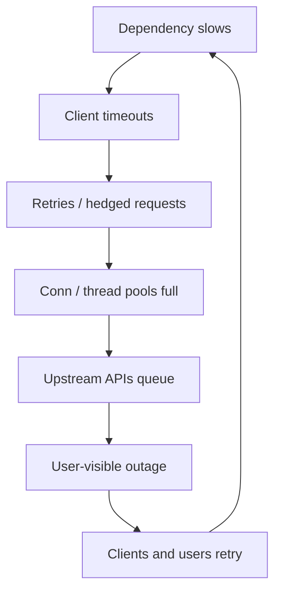
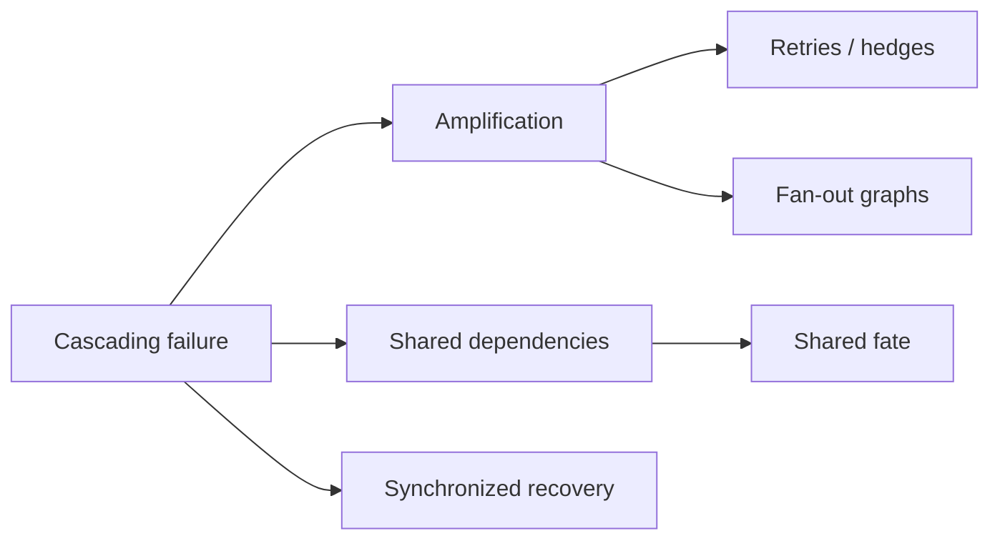
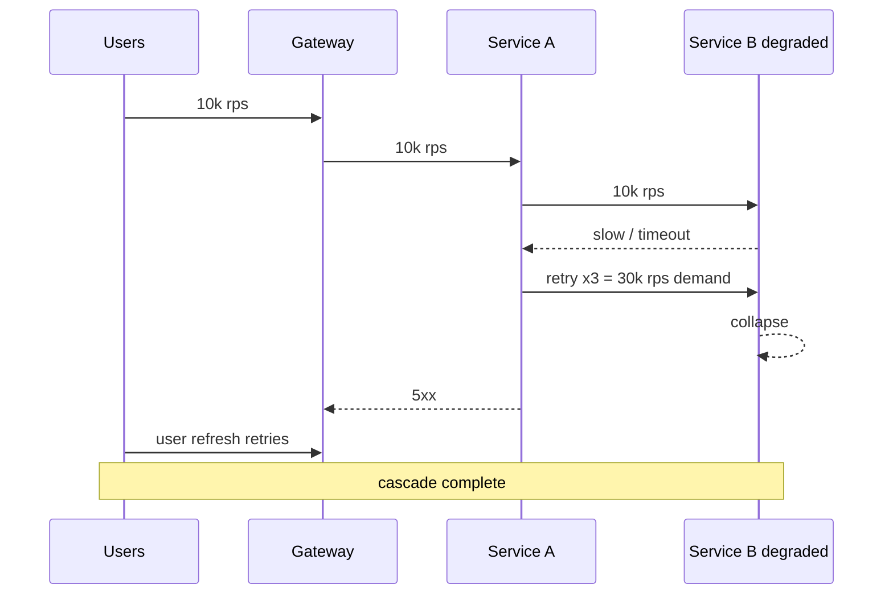

# Cascading Multi-Service Failure

## Overview

A **cascading multi-service failure** starts as a localized slowdown or outage and amplifies through **retries, queue buildup, thread/connection exhaustion, and synchronized recovery** until healthy services fail. Backend circuit breakers protect a *process*; product-scale cascades cross **fleets, regions, and shared dependencies** (auth, DNS, databases, message buses). Designers must budget amplification factors, shed load at the edge, and isolate failure domains—not only wrap clients in libraries.

## Learning Objectives

- Trace amplification paths: retry storms, thundering herds, shared pools
- Quantify fan-out and retry multipliers against capacity headroom
- Separate in-process breakers from fleet bulkheads and admission control
- Design backpressure and deadlines that stop cascades
- Sketch a cascade simulation with TypeScript retry/backoff

## Prerequisites

- [[09-System-Design/00-Orientation-and-Boundaries/Failure Domains and Blast Radius Budgets|Failure Domains and Blast Radius Budgets]]
- [[07-Backend/06-Reliability-and-Abuse-Resistance/Circuit Breakers and Bulkheads|Circuit Breakers and Bulkheads]]
- [[09-System-Design/06-Messaging-Streams-and-Async-Topologies/Backpressure Consumer Lag and Load Shedding|Backpressure Consumer Lag and Load Shedding]]
- [[09-System-Design/README|System Design]]

## Difficulty

`advanced`

## Estimated Time

- Reading: 2.5 hours
- Exercises: 3 hours
- Mini project: 4 hours

## History

Classic telephony and early web outages showed synchronized retries after brownouts. Large cloud SEVs repeatedly cite: dependency latency → client retries → DB connection pools maxed → unrelated apps fail. SRE literature (latency amplification, load shedding) made cascade design a first-class product concern.

## Problem It Solves

- **Healthy tiers dying** because clients retry a slow dependency
- **Retry storms** after deploy or DNS blip
- **Shared fate** via one Redis/DB for many product surfaces
- **Recovery collapse** when all instances warm caches simultaneously

## Internal Implementation

### Amplification model

For each hop: effective load ≈ offered load × (1 + retries) × fan-out.

If dependency capacity is C and amplified demand exceeds C, latency rises → more timeouts → more retries → positive feedback.



### Cascade stoppers (fleet level)

1. **Deadlines** — absolute time budget end-to-end, not infinite per-hop timeouts.
2. **Admission control** — shed at edge/gateway before deep stack.
3. **Bulkheads** — separate pools per dependency and per tenant.
4. **Backoff + jitter** — break synchronized retry waves.
5. **Feature shedding** — drop non-critical calls first (next notes).
6. **Queue bounds** — drop or DLQ rather than unbounded buffering.

## Mermaid Diagrams

### Structure



### Sequence / Lifecycle — retry storm



## Examples

### Minimal Example — capacity math

```text
B capacity = 20k rps
A fan-out = 1 call to B
Client retries = 2 on timeout
Offered = 12k → demand on B ≈ 12k × 3 = 36k > 20k → cascade
```

### Production-Shaped Example — deadline + bounded retries

```typescript
// Node 20+ — stop cascade with deadline budget and jittered backoff
export type Attempt = { signal: AbortSignal };

export async function callWithBudget<T>(
  fn: (a: Attempt) => Promise<T>,
  budgetMs: number,
  maxAttempts = 2,
): Promise<T> {
  const deadline = Date.now() + budgetMs;
  let lastErr: unknown;
  for (let i = 0; i < maxAttempts; i++) {
    const remaining = deadline - Date.now();
    if (remaining <= 0) break;
    const ac = new AbortController();
    const t = setTimeout(() => ac.abort(), remaining);
    try {
      return await fn({ signal: ac.signal });
    } catch (err) {
      lastErr = err;
      const jitter = Math.random() * Math.min(100 * 2 ** i, remaining);
      await new Promise((r) => setTimeout(r, jitter));
    } finally {
      clearTimeout(t);
    }
  }
  throw lastErr ?? new Error("deadline_exceeded");
}
```

## Trade-offs

| Dimension | Upside | Downside | When it matters |
| --- | --- | --- | --- |
| Aggressive retries | Mask blips | Amplify outages | default off for non-idempotent |
| Hedged requests | Lower tail latency | Extra load | only with caps |
| Deep timeouts | Wait for success | Hold resources | prefer short + shed |
| Edge shedding | Protect core | User errors | brownouts |
| Unbounded queues | Smooth spikes | Delayed doom | always bound |

### When to Use

- Model amplification in capacity reviews for every new dependency
- Default idempotent retries with jitter and attempt caps
- Edge admission when error budget burns fast

### When Not to Use

- Do not “fix” cascades only with more replicas of the failing dependency
- Do not infinite-retry payment captures
- In-process breaker alone is insufficient for fleet cascades—add bulkheads

## Exercises

1. Draw a 4-service call graph; compute worst-case retry amplification.
2. Given pool size 100 and p99=2s, estimate saturation under 3× retries.
3. Design hedge policy that never exceeds 10% extra QPS.
4. Write cascade symptoms checklist for on-call (latency, pool wait, queue depth).
5. Compare sync fan-out vs async queue for blast radius.

## Mini Project

**Cascade simulator.** TypeScript model of A→B with retries; sweep retry count vs survival. Plot when shed-at-A saves B.

## Portfolio Project

Failure scenario pack in [[09-System-Design/projects/Distributed Systems Workbench/README|Distributed Systems Workbench]].

## Interview Questions

1. What turns a dependency blip into a fleet outage?
2. Why is retry amplification dangerous?
3. How do deadlines differ from per-hop timeouts?
4. Role of jitter in recovery?
5. Difference between Backend circuit breakers and System Design bulkheads?

### Stretch / Staff-Level

1. Model adaptive concurrency limits (AIMD) across a service mesh.
2. Design brownout response: which 3 signals trigger edge shedding first?

## Common Mistakes

- Same retry policy on all clients including browsers
- No distinction between idempotent GETs and POSTs
- Shared thread pool across critical and non-critical deps
- Celebrating autoscaling during a retry storm (scales the fire)

## Best Practices

- Budget retries in capacity plans explicitly
- Prefer fail-fast + degrade over deep waiting
- Isolate connection pools per dependency
- Load-test failure injection, not only happy QPS
- Continue with [[09-System-Design/09-Failure-Modes-at-Product-Scale/Zone and Fleet Bulkheads|Zone and Fleet Bulkheads]]

## Summary

Cascades are amplification plus shared fate. Product-scale defense is deadlines, admission control, bulkheads, bounded queues, and disciplined retries—layered above in-process breakers. If your capacity model ignores retry multipliers, you have not modeled failure.

## Further Reading

- [[00-References/System Design/README|System Design References]]
- Google SRE — addressing cascading failures / load shedding
- Amazon Builders' Library — timeouts, retries, and backoff with jitter

## Related Notes

- [[09-System-Design/README|System Design]]
- [[09-System-Design/09-Failure-Modes-at-Product-Scale/Zone and Fleet Bulkheads|Zone and Fleet Bulkheads]]
- [[09-System-Design/09-Failure-Modes-at-Product-Scale/Graceful Degradation and Feature Shedding|Graceful Degradation and Feature Shedding]]
- [[07-Backend/06-Reliability-and-Abuse-Resistance/Circuit Breakers and Bulkheads|Circuit Breakers and Bulkheads]]
- [[09-System-Design/02-Load-Balancing-and-Edge-Entry/Edge Admission Control and Global Traffic Steering|Edge Admission Control and Global Traffic Steering]]

## Progress Checklist

- [ ] Explained from first principles
- [ ] Drew at least one Mermaid diagram
- [ ] Implemented a minimal version
- [ ] Documented trade-offs and non-goals
- [ ] Completed exercises
- [ ] Practiced interview questions aloud
- [ ] Linked prerequisites and dependents
