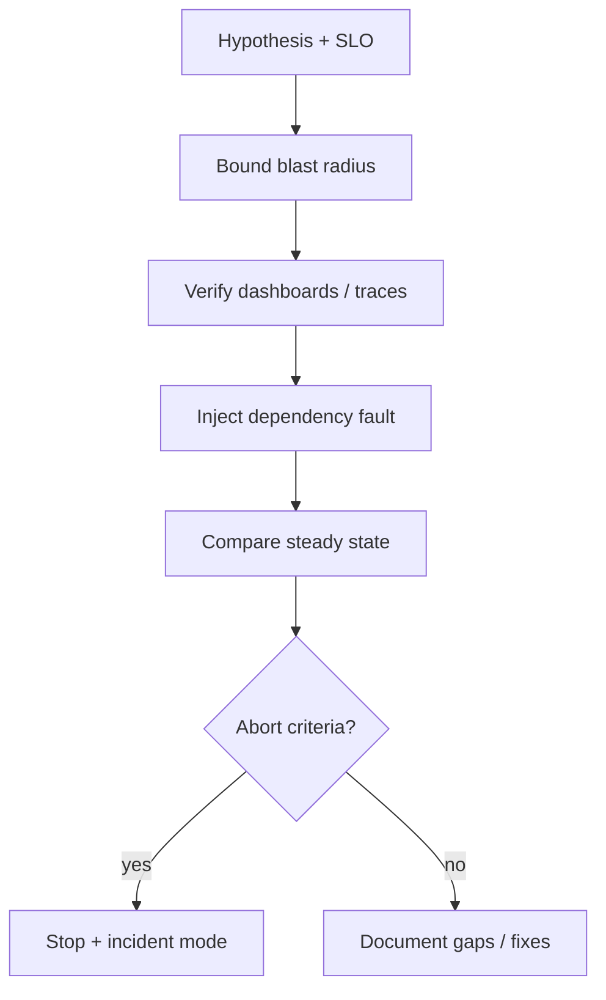
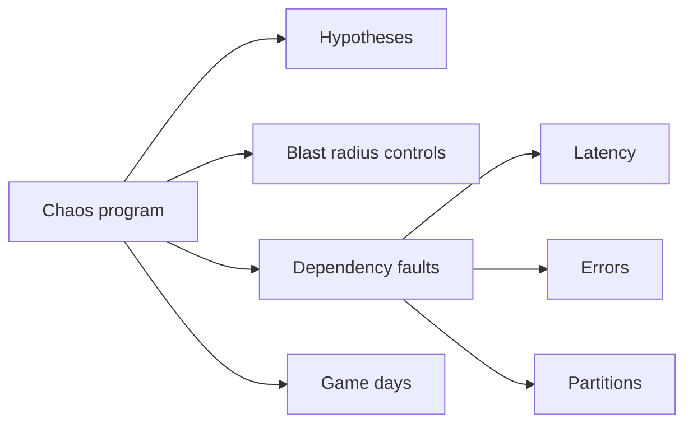
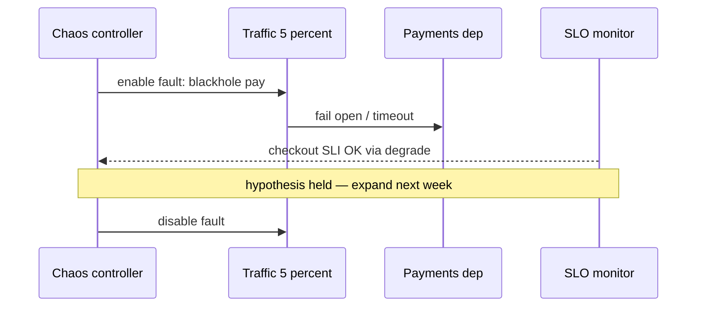

# Chaos Blast Radius and Dependency Failure

## Overview

**Chaos engineering** validates that real failure modes stay inside **blast-radius budgets**—not “break prod for fun.” At product scale, experiments target **dependency failure** (latency, errors, partitions), zone loss, and poisoned deploys, with explicit abort criteria and customer impact caps. This note is about designing experiments and interpreting results for multi-service systems; it is not a tool tutorial for one chaos vendor. In-process fault injection belongs partly to Backend; **fleet hypotheses** belong here.

## Learning Objectives

- Write falsifiable chaos hypotheses tied to SLOs and blast-radius budgets
- Rank dependency failure modes (timeout, corrupt, slow, flap)
- Bound experiment scope: cell, %, region, time window
- Define abort criteria and observability needed before running chaos
- Sketch an experiment planner in TypeScript

## Prerequisites

- [[09-System-Design/09-Failure-Modes-at-Product-Scale/Zone and Fleet Bulkheads|Zone and Fleet Bulkheads]]
- [[09-System-Design/00-Orientation-and-Boundaries/Failure Domains and Blast Radius Budgets|Failure Domains and Blast Radius Budgets]]
- [[09-System-Design/09-Failure-Modes-at-Product-Scale/Graceful Degradation and Feature Shedding|Graceful Degradation and Feature Shedding]]
- [[09-System-Design/README|System Design]]

## Difficulty

`advanced`

## Estimated Time

- Reading: 2 hours
- Exercises: 3 hours
- Mini project: 4 hours

## History

Netflix Chaos Monkey popularized instance killing; the field matured into **hypothesis-driven** experiments with steady-state metrics. Regulatory and customer pressure forced blast-radius controls: percentage traffic, synthetic tenants, and staging-first. Modern practice pairs chaos with progressive delivery and error budgets.

## Problem It Solves

- **Untested failover** that only fails in true SEVs
- **Unknown shared fate** discovered during peak traffic
- **Overconfident SLOs** without dependency failure evidence
- **Unsafe chaos** that becomes an unplanned incident

## Internal Implementation

### Experiment template

1. **Steady state** — SLIs that must hold (availability, latency, correctness).
2. **Hypothesis** — “If deps X latency +500ms, checkout success ≥ 99% via shed ladder.”
3. **Blast radius** — 1 cell / 5% traffic / synthetic cohort.
4. **Method** — inject latency, blackhole, kill instances, partition.
5. **Abort** — burn rate, error spikes, SEV pager.
6. **Learn** — ADR/fix or gap ticket.



## Mermaid Diagrams

### Structure



### Sequence / Lifecycle — bounded dependency blackhole



## Examples

### Minimal Example — hypothesis card

```text
Steady state: p99 home < 300ms, error rate < 0.1%
Hypothesis: kill 1 AZ of cache tier → p99 < 500ms using origin
Blast radius: staging cell C2 only, 20 minutes
Abort: error rate > 1% for 2 minutes
```

### Production-Shaped Example — radius gate

```typescript
// Node 20+ — refuse experiments that exceed blast-radius policy
export type ChaosPlan = {
  name: string;
  trafficFraction: number;
  cells: string[];
  maxMinutes: number;
  abortErrorRate: number;
};

export function assertSafePlan(plan: ChaosPlan, policy: { maxFraction: number; maxCells: number }): void {
  if (plan.trafficFraction > policy.maxFraction) {
    throw new Error(`traffic ${plan.trafficFraction} exceeds ${policy.maxFraction}`);
  }
  if (plan.cells.length > policy.maxCells) {
    throw new Error(`cells ${plan.cells.length} exceeds ${policy.maxCells}`);
  }
  if (plan.maxMinutes > 60) throw new Error("maxMinutes too long without break");
}

export function shouldAbort(errorRate: number, plan: ChaosPlan): boolean {
  return errorRate >= plan.abortErrorRate;
}
```

## Trade-offs

| Dimension | Upside | Downside | When it matters |
| --- | --- | --- | --- |
| Prod chaos | Real traffic truth | Customer risk | only with tight radius |
| Staging only | Safe | Misses prod scale effects | complement with prod % |
| Kill instance | Simple | Shallow vs dep latency | vary fault types |
| Continuous chaos | Always learning | Noise / alert fatigue | start scheduled |
| Game days | Human practice | Cost | quarterly minimum |

### When to Use

- Before declaring multi-AZ or multi-region readiness
- After adding critical dependencies
- To validate shed ladders and bulkheads

### When Not to Use

- Do not run unbounded prod chaos without abort automation
- Do not chaos during error-budget exhaustion without exec approval
- Do not confuse “we killed a pod once” with a chaos program

## Exercises

1. Write three hypotheses for a chat or checkout system.
2. Map top 10 dependencies; pick fault types per dependency.
3. Define blast-radius policy for prod vs staging.
4. List observability must-haves before first experiment.
5. Design a game-day agenda with inject → detect → mitigate → recover.

## Mini Project

**Fault menu.** Simulate latency/error injection on a typed client; verify abort and degraded mode metrics.

## Portfolio Project

Chaos hypothesis backlog in [[09-System-Design/projects/Distributed Systems Workbench/README|Distributed Systems Workbench]].

## Interview Questions

1. What makes a good chaos hypothesis?
2. How do you bound blast radius?
3. Why inject latency, not only kill processes?
4. When do you abort an experiment?
5. How does chaos relate to error budgets?

### Stretch / Staff-Level

1. Design automated chaos that follows progressive delivery (see module 10).
2. Dependency criticality scoring feeding experiment priority.

## Common Mistakes

- No steady-state definition
- Experimenting without traces/metrics coverage
- Expanding to 100% after one success
- Ignoring data-plane vs control-plane faults

## Best Practices

- Tie every experiment to an SLO and a fix owner
- Start in one cell; promote gradually
- Prefer dependency faults that match historical SEVs
- Record results as ADRs or reliability tickets
- Continue with [[09-System-Design/09-Failure-Modes-at-Product-Scale/Multi-Service Incident Playbooks|Multi-Service Incident Playbooks]]

## Summary

Chaos engineering proves blast-radius and dependency assumptions under controlled conditions. Hypotheses, scoped impact, abort criteria, and learning loops matter more than tooling. If failure modes are untested, your SLO is a wish.

## Further Reading

- [[00-References/System Design/README|System Design References]]
- Principles of Chaos Engineering
- Google SRE — disaster recovery testing / diRT-style practices

## Related Notes

- [[09-System-Design/README|System Design]]
- [[09-System-Design/09-Failure-Modes-at-Product-Scale/Zone and Fleet Bulkheads|Zone and Fleet Bulkheads]]
- [[09-System-Design/09-Failure-Modes-at-Product-Scale/Multi-Service Incident Playbooks|Multi-Service Incident Playbooks]]
- [[09-System-Design/10-Observability-and-Control-Planes/Progressive Delivery of Distributed Systems|Progressive Delivery of Distributed Systems]]
- [[16-DevOps/README|DevOps]]

## Progress Checklist

- [ ] Explained from first principles
- [ ] Drew at least one Mermaid diagram
- [ ] Implemented a minimal version
- [ ] Documented trade-offs and non-goals
- [ ] Completed exercises
- [ ] Practiced interview questions aloud
- [ ] Linked prerequisites and dependents
