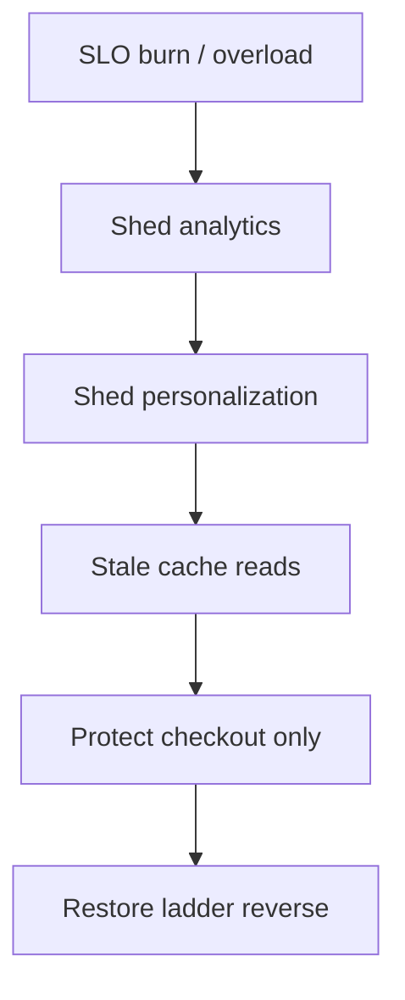
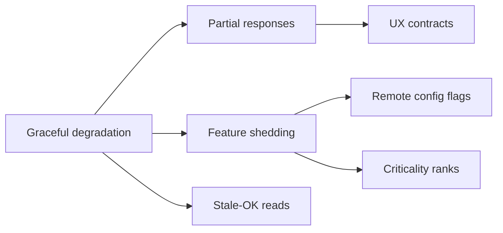
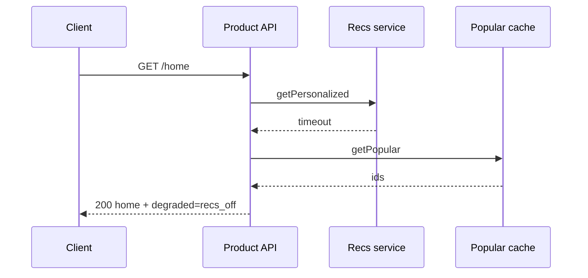

# Graceful Degradation and Feature Shedding

## Overview

**Graceful degradation** keeps core user journeys alive when dependencies or capacity fail—by returning partial results, stale caches, or simplified UX. **Feature shedding** intentionally disables non-critical capabilities (recommendations, personalization, analytics, previews) to protect critical path SLOs. Unlike binary up/down, brownout modes are **product contracts**: which features drop first, who decides (auto vs human), and how users are informed. Backend timeouts help; System Design owns the **priority ladder across services**.

## Learning Objectives

- Rank product features by criticality and dependency cost
- Design automatic shed triggers from SLIs and capacity signals
- Prefer partial success over total failure on fan-out reads
- Specify UX and API error semantics during brownout
- Implement a shed ladder sketch in TypeScript

## Prerequisites

- [[09-System-Design/09-Failure-Modes-at-Product-Scale/Cascading Multi-Service Failure|Cascading Multi-Service Failure]]
- [[09-System-Design/09-Failure-Modes-at-Product-Scale/Zone and Fleet Bulkheads|Zone and Fleet Bulkheads]]
- [[09-System-Design/10-Observability-and-Control-Planes/SLIs SLOs Error Budgets for Multi-Service Systems|SLIs SLOs Error Budgets for Multi-Service Systems]]
- [[09-System-Design/README|System Design]]

## Difficulty

`advanced`

## Estimated Time

- Reading: 2 hours
- Exercises: 2.5 hours
- Mini project: 4 hours

## History

Telecom brownouts and HTTP 503 Retry-After taught partial service. Large web properties codified “mode 1/2/3” feature flags for holidays and incidents. Modern stacks use remote config and progressive delivery to shed without redeploying.

## Problem It Solves

- **All-or-nothing outages** when a non-critical dependency fails
- **Holiday traffic** that needs capacity for checkout, not recommendations
- **Error-budget burn** without a planned response
- **Inconsistent per-service** ad-hoc disables during incidents

## Internal Implementation

### Shed ladder (example e-commerce)

1. Drop debug/tracing high-cardinality, secondary analytics
2. Drop personalized recommendations → popular fallback
3. Drop social proof / reviews fan-out
4. Serve catalog from cache only (stale OK)
5. Block anonymous browse; preserve authenticated checkout
6. Read-only mode / queue writes

Each step must be **tested**, **observable**, and **reversible**.



## Mermaid Diagrams

### Structure



### Sequence / Lifecycle — recommendations shed



## Examples

### Minimal Example — partial JSON contract

```json
{
  "items": ["..."],
  "degraded": ["recommendations"],
  "cache": "stale-while-revalidate"
}
```

### Production-Shaped Example — shed ladder evaluation

```typescript
// Node 20+ — evaluate which features remain given pressure score
export type Feature = "analytics" | "recs" | "reviews" | "checkout";

const LADDER: Feature[] = ["analytics", "recs", "reviews"]; // shed order; checkout never shed here

export function activeFeatures(pressure: number): Set<Feature> {
  // pressure 0..1 from lag, CPU, error budget burn
  const shedCount = pressure < 0.5 ? 0 : pressure < 0.75 ? 1 : pressure < 0.9 ? 2 : 3;
  const shed = new Set(LADDER.slice(0, shedCount));
  const all: Feature[] = ["analytics", "recs", "reviews", "checkout"];
  return new Set(all.filter((f) => !shed.has(f)));
}

export async function withOptional<T>(
  enabled: boolean,
  fn: () => Promise<T>,
  fallback: T,
): Promise<{ value: T; degraded: boolean }> {
  if (!enabled) return { value: fallback, degraded: true };
  try {
    return { value: await fn(), degraded: false };
  } catch {
    return { value: fallback, degraded: true };
  }
}
```

## Trade-offs

| Dimension | Upside | Downside | When it matters |
| --- | --- | --- | --- |
| Auto shed | Fast response | Wrong trigger flapping | tune hysteresis |
| Manual shed | Human judgment | Slow at 3am | pair with auto |
| Stale reads | Availability | Consistency UX | declare stale-OK |
| Hard 503 | Simple | Poor UX | last resort |
| Per-tenant shed | Fairness | Complexity | multi-tenant |

### When to Use

- Fan-out pages with optional widgets
- Peak events (launches, holidays)
- Dependency failure on non-critical paths

### When Not to Use

- Do not shed auth or payment authorization silently
- Do not hide data loss as “degradation”
- Do not invent per-engineer snowflake modes undocumented

## Exercises

1. Build a criticality matrix for a social feed or checkout.
2. Define API fields for degraded mode and client behavior.
3. Choose signals for auto shed with hysteresis (on/off thresholds).
4. Design read-only mode for a collaborative editor.
5. Write user-facing status copy for each ladder step.

## Mini Project

**Brownout demo.** Home page aggregator with injectable failures; verify ladder order and `degraded` metadata.

## Portfolio Project

Degradation runbook + flags in [[09-System-Design/projects/Distributed Systems Workbench/README|Distributed Systems Workbench]].

## Interview Questions

1. Graceful degradation vs load shedding—related how?
2. What belongs on a shed ladder first?
3. How do you avoid flapping shed modes?
4. How should APIs advertise partial success?
5. When is stale data acceptable?

### Stretch / Staff-Level

1. Multi-service coordinated shed via control plane without thundering restore.
2. Error-budget-driven automatic shed with product approval gates.

## Common Mistakes

- Optional calls on the critical path without timeouts
- Shedding randomly per instance (inconsistent UX)
- No metrics for “% requests degraded”
- Restoring all features at once → secondary cascade

## Best Practices

- Encode ladder in remote config; game-day each step
- Restore gradually (reverse ladder)
- Track degraded-mode SLIs separately from hard errors
- Align with [[09-System-Design/05-Caching-at-Product-Scale/Cache Coherence vs Acceptable Staleness|Acceptable Staleness]]
- Pair edge shedding with [[09-System-Design/02-Load-Balancing-and-Edge-Entry/Edge Admission Control and Global Traffic Steering|Edge Admission Control]]

## Summary

Graceful degradation and feature shedding convert overload and dependency loss into intentional, ranked product modes. Critical journeys stay up; optional value drops first; APIs and UX tell the truth. Without a tested ladder, incidents invent chaos-mode in Slack.

## Further Reading

- [[00-References/System Design/README|System Design References]]
- Google SRE — load shedding and graceful degradation
- Stripe / commerce engineering posts on read-only modes

## Related Notes

- [[09-System-Design/README|System Design]]
- [[09-System-Design/09-Failure-Modes-at-Product-Scale/Cascading Multi-Service Failure|Cascading Multi-Service Failure]]
- [[09-System-Design/09-Failure-Modes-at-Product-Scale/Chaos Blast Radius and Dependency Failure|Chaos Blast Radius and Dependency Failure]]
- [[09-System-Design/10-Observability-and-Control-Planes/SLIs SLOs Error Budgets for Multi-Service Systems|SLIs SLOs Error Budgets]]
- [[07-Backend/06-Reliability-and-Abuse-Resistance/Circuit Breakers and Bulkheads|Circuit Breakers and Bulkheads]]

## Progress Checklist

- [ ] Explained from first principles
- [ ] Drew at least one Mermaid diagram
- [ ] Implemented a minimal version
- [ ] Documented trade-offs and non-goals
- [ ] Completed exercises
- [ ] Practiced interview questions aloud
- [ ] Linked prerequisites and dependents
