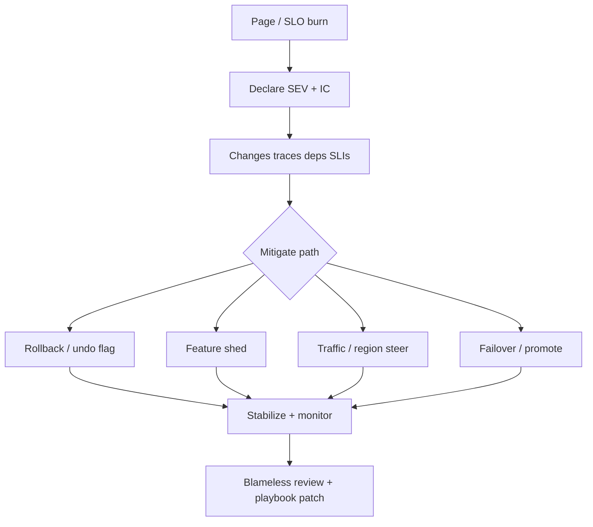
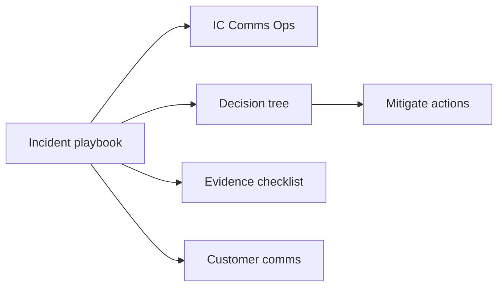
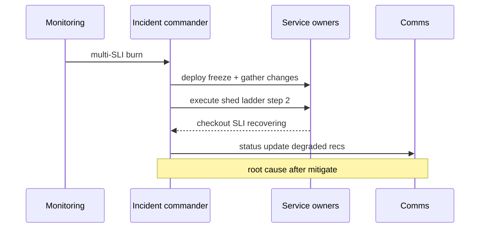

# Multi-Service Incident Playbooks

## Overview

A **multi-service incident playbook** is a pre-agreed procedure for detecting, coordinating, mitigating, and learning from outages that span services, regions, or shared dependencies. Single-service runbooks (“restart pod X”) fail when the graph is the problem: cascades, bad deploys across cells, or dependency brownouts. Playbooks define **roles** (incident commander, comms, ops), **decision trees** (rollback vs shed vs failover), **evidence sources** (SLIs, traces, change lists), and **customer messaging**. Platforms/DevOps own tooling; System Design owns the **cross-service mitigation topology**.

## Learning Objectives

- Structure IR roles and communication for cross-team outages
- Build decision trees for rollback, traffic shift, shed, and failover
- Assemble a first-15-minutes evidence checklist
- Separate mitigate-now from root-cause-later
- Encode a playbook skeleton as data in TypeScript

## Prerequisites

- [[09-System-Design/09-Failure-Modes-at-Product-Scale/Cascading Multi-Service Failure|Cascading Multi-Service Failure]]
- [[09-System-Design/09-Failure-Modes-at-Product-Scale/Chaos Blast Radius and Dependency Failure|Chaos Blast Radius and Dependency Failure]]
- [[09-System-Design/10-Observability-and-Control-Planes/SLIs SLOs Error Budgets for Multi-Service Systems|SLIs SLOs Error Budgets for Multi-Service Systems]]
- [[09-System-Design/README|System Design]]

## Difficulty

`advanced`

## Estimated Time

- Reading: 2 hours
- Exercises: 3 hours
- Mini project: 3 hours

## History

Pager-driven restarts evolved into Incident Command System adaptations for tech. Large orgs published severity taxonomies (SEV0–SEV3), status page contracts, and blameless postmortems. Distributed products forced **graph-aware** playbooks: which dependency to shed, which region to shift, which deploy to freeze—before anyone has a root cause.

## Problem It Solves

- **Parallel thrash** — five teams redeploying blindly
- **Slow mitigate** — root-causing while customers burn
- **Missing comms** — support and status page lag
- **Repeat SEVs** — no durable playbook updates after learnings

## Internal Implementation

### First 15 minutes (template)

1. Declare severity; name IC and comms.
2. Freeze risky changes (deploy lock) unless rollback is the mitigate.
3. Check: error budget burn, top traces, recent changes, dependency health, traffic shifts.
4. Pick mitigate path: rollback / shed ladder / steer traffic / failover / scale+admit.
5. Time-box investigations; revisit mitigate every 10 minutes.
6. Customer update cadence by severity.



## Mermaid Diagrams

### Structure



### Sequence / Lifecycle — cross-service SEV



## Examples

### Minimal Example — severity rubric (sketch)

```text
SEV1: core journey down for >5% users or payments broken
SEV2: major feature degraded, workaround exists
SEV3: limited impact / single cell
```

### Production-Shaped Example — playbook as data

```typescript
// Node 20+ — machine-readable playbook steps for drills
export type Action = "rollback" | "shed" | "steer" | "failover" | "page_deps";

export type Playbook = {
  id: string;
  symptom: string;
  evidence: string[];
  actionsInOrder: Action[];
  abortIf: string;
  customerCadenceMin: number;
};

export const checkoutCascade: Playbook = {
  id: "checkout-cascade",
  symptom: "checkout success SLI burn + payments latency",
  evidence: ["trace payment spans", "deploy list 2h", "queue depth", "AZ health"],
  actionsInOrder: ["page_deps", "shed", "rollback", "steer"],
  abortIf: "data corruption suspected — stop writes",
  customerCadenceMin: 15,
};

export function nextAction(pb: Playbook, done: Action[]): Action | undefined {
  return pb.actionsInOrder.find((a) => !done.includes(a));
}
```

## Trade-offs

| Dimension | Upside | Downside | When it matters |
| --- | --- | --- | --- |
| Strong IC | Focused mitigate | Bus factor | all SEV1 |
| Automate rollback | Speed | Wrong rollback | need signals |
| Long war room | Collaboration | Noise | keep roles tight |
| Early status page | Trust | Incomplete info | use “investigating” |
| Deep RCA mid-SEV | Curiosity | Delayed mitigate | forbid |

### When to Use

- Any multi-team dependency graph
- After chaos/game days—update playbooks with gaps
- Payments, auth, and data-loss-adjacent paths

### When Not to Use

- Do not replace on-call engineering judgment with unread 40-page PDFs
- Do not keep secret playbooks only in one hero’s head
- Single-process crash loops may need only a service runbook

## Exercises

1. Write a playbook for “auth latency cascade.”
2. Define SEV rubric for your product’s top three journeys.
3. Draft first customer status messages for investigating/identified/monitoring.
4. List deploy-freeze exceptions (e.g., emergency hotfix).
5. Run a tabletop: IC assigns roles; time to first mitigate decision.

## Mini Project

**Tabletop automation.** CLI that loads playbook JSON, prompts evidence checks, and records timeline for postmortem.

## Portfolio Project

Playbook set + drill notes in [[09-System-Design/projects/Multi-Region Failover Playbook Lab/README|Multi-Region Failover Playbook Lab]] / Workbench.

## Interview Questions

1. What does an incident commander do?
2. Mitigate vs root cause—order and why?
3. Evidence you check in the first 15 minutes?
4. When rollback vs feature shed vs traffic steer?
5. What belongs in a postmortem action item?

### Stretch / Staff-Level

1. Design multi-region IR with regional ICs and global IC.
2. Automate playbook suggestions from SLI + change correlation.

## Common Mistakes

- No clear IC; everyone changes prod
- Debugging without a deploy/change freeze
- Skipping customer comms until “we know exact bug”
- Postmortems without playbook updates

## Best Practices

- Keep playbooks short, linked to dashboards and flags
- Drill quarterly; measure time-to-mitigate
- Blameless reviews; track action items to owners
- Align with [[09-System-Design/10-Observability-and-Control-Planes/Distributed Tracing Correlation Across Regions|Distributed Tracing]]
- Hand off CI/CD freeze tooling to [[16-DevOps/README|DevOps]]

## Summary

Multi-service incidents are coordination problems under uncertainty. Playbooks pre-decide roles, evidence, and mitigate paths so teams stop thrashing and start containing blast radius. Update them after every drill and SEV—or the next outage will reinvent the procedure badly.

## Further Reading

- [[00-References/System Design/README|System Design References]]
- Google SRE — managing incidents / postmortems
- PagerDuty / incident command guides for software

## Related Notes

- [[09-System-Design/README|System Design]]
- [[09-System-Design/09-Failure-Modes-at-Product-Scale/Cascading Multi-Service Failure|Cascading Multi-Service Failure]]
- [[09-System-Design/09-Failure-Modes-at-Product-Scale/Graceful Degradation and Feature Shedding|Graceful Degradation and Feature Shedding]]
- [[09-System-Design/07-Multi-Region-and-Geo/Failover RPO RTO and Split-Brain Product Policy|Failover RPO RTO and Split-Brain Product Policy]]
- [[09-System-Design/10-Observability-and-Control-Planes/SLIs SLOs Error Budgets for Multi-Service Systems|SLIs SLOs Error Budgets]]
- [[16-DevOps/README|DevOps]]

## Progress Checklist

- [ ] Explained from first principles
- [ ] Drew at least one Mermaid diagram
- [ ] Implemented a minimal version
- [ ] Documented trade-offs and non-goals
- [ ] Completed exercises
- [ ] Practiced interview questions aloud
- [ ] Linked prerequisites and dependents
