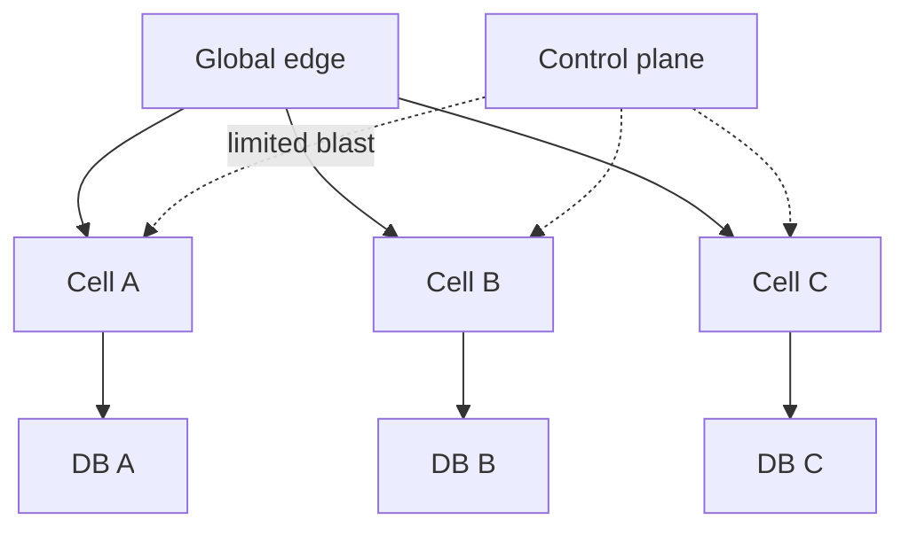
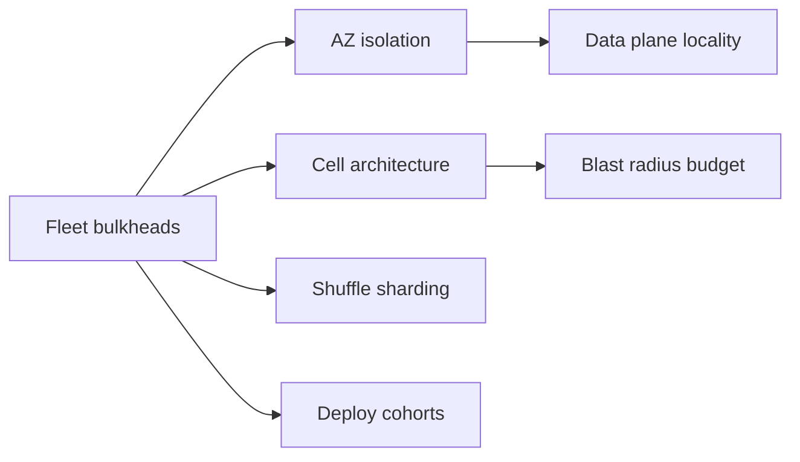
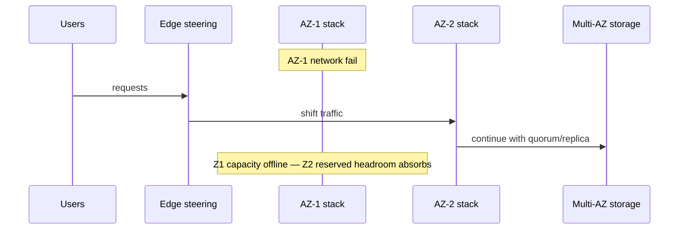

# Zone and Fleet Bulkheads

## Overview

A **bulkhead** limits how far damage spreads by partitioning capacity—threads, connections, deploy cohorts, availability zones, or **cells** (self-contained customer shards). Backend bulkheads isolate pools inside one process; **zone and fleet bulkheads** isolate *product topology*: AZ-independent stacks, regional cells, tenant shuffle sharding, and separate control planes. The goal is a hard **blast-radius budget**: one bad deploy, noisy tenant, or AZ outage must not take the whole product.

## Learning Objectives

- Distinguish process bulkheads from zone/cell/fleet isolation
- Design AZ-independent data and traffic paths
- Apply shuffle sharding / cells for tenant blast radius
- Trade operational cost of cells vs monolith fleets
- Sketch capacity reservation across bulkheads in TypeScript

## Prerequisites

- [[09-System-Design/09-Failure-Modes-at-Product-Scale/Cascading Multi-Service Failure|Cascading Multi-Service Failure]]
- [[09-System-Design/00-Orientation-and-Boundaries/Failure Domains and Blast Radius Budgets|Failure Domains and Blast Radius Budgets]]
- [[07-Backend/06-Reliability-and-Abuse-Resistance/Circuit Breakers and Bulkheads|Circuit Breakers and Bulkheads]]
- [[09-System-Design/README|System Design]]

## Difficulty

`advanced`

## Estimated Time

- Reading: 2.5 hours
- Exercises: 3 hours
- Mini project: 4 hours

## History

Ship bulkheads inspired software isolation. Cloud AZ design forced multi-AZ thinking; large outages still crossed AZs via **regional singletons** (one Redis, one schema migrator). Cell-based architectures (many small copies of the stack) and shuffle sharding became standard at hyperscale for tenant isolation.

## Problem It Solves

- **One AZ outage** sinking a “multi-AZ” app that shared a primary
- **Noisy neighbor** tenants exhausting shared pools
- **Bad deploy** rolling to 100% before detection
- **Control-plane SEV** taking all data-plane cells with it

## Internal Implementation

### Bulkhead layers

| Layer | Mechanism | Failure contained |
| --- | --- | --- |
| Process | Separate thread/conn pools | One dependency |
| Instance | cgroup / pod limits | One host noisy |
| AZ | AZ-local caches, multi-AZ DB | AZ loss |
| Cell | N independent stacks | Cell-sized blast radius |
| Shuffle shard | Tenant → subset of workers | Bad tenant |
| Deploy | Canaries / staged fleets | Bad binary |



## Mermaid Diagrams

### Structure



### Sequence / Lifecycle — AZ failure with true bulkhead



## Examples

### Minimal Example — blast radius math

```text
100 cells, random tenant placement
Bad cell config affects ≈ 1% of tenants
vs single fleet: bad config affects 100%
```

### Production-Shaped Example — shuffle shard assignment

```typescript
// Node 20+ — map tenant to a subset of workers (shuffle shard)
import { createHash } from "node:crypto";

export function shuffleShard(
  tenantId: string,
  workers: string[],
  shardSize: number,
): string[] {
  const scored = workers
    .map((w) => ({
      w,
      score: createHash("sha256").update(`${tenantId}:${w}`).digest("hex"),
    }))
    .sort((a, b) => a.score.localeCompare(b.score));
  return scored.slice(0, shardSize).map((x) => x.w);
}

export function reservePerBulkhead(
  totalCap: number,
  bulkheads: number,
  headroom = 0.2,
): number {
  // each bulkhead sized so remaining can absorb one loss
  return Math.floor((totalCap / (bulkheads - 1)) * (1 - headroom));
}
```

## Trade-offs

| Dimension | Upside | Downside | When it matters |
| --- | --- | --- | --- |
| Many cells | Tiny blast radius | Ops + tooling cost | large multi-tenant |
| Few fat fleets | Simple | Huge SEVs | early stage OK |
| Strict AZ isolation | Survives AZ loss | Latency / cost | HA SLOs |
| Shuffle sharding | Noisy neighbor control | Uneven load | platforms |
| Shared cache region-wide | Hit rate | Shared fate | avoid for critical path |

### When to Use

- Multi-tenant SaaS with noisy-neighbor risk
- Products with hard availability SLOs across AZ loss
- Deploy isolation with cell-by-cell rollout

### When Not to Use

- Do not claim multi-AZ if the primary DB or lock service is zonal singleton without failover
- Do not over-cell before automation for deploys/metrics exists
- Process pool bulkheads alone ≠ fleet bulkheads

## Exercises

1. Inventory shared singletons in a sample architecture; mark bulkhead gaps.
2. Compute headroom so one AZ of three can fail without overload.
3. Design tenant→cell mapping and migration story.
4. Separate control-plane blast radius from data-plane cells.
5. Compare sticky sessions vs cell affinity for failure isolation.

## Mini Project

**Cell router.** Route tenants to cells; inject cell failure; measure % users impacted vs monolith.

## Portfolio Project

Cell topology ADR in [[09-System-Design/projects/Distributed Systems Workbench/README|Distributed Systems Workbench]].

## Interview Questions

1. What is a bulkhead at fleet scale?
2. How do cells reduce blast radius?
3. What is shuffle sharding?
4. Why do regional singletons defeat multi-AZ designs?
5. How much capacity headroom for N-zone survival?

### Stretch / Staff-Level

1. Design cell split/merge operations with zero global lock.
2. Control-plane HA that cannot take down all cells simultaneously.

## Common Mistakes

- One “global” Redis for all cells
- Deploying all cells in lockstep from one pipeline without gates
- Ignoring DNS/auth as cross-cutting shared fate
- Sizing without loss-of-AZ headroom

## Best Practices

- Budget blast radius as an NFR (% users, % revenue)
- Keep cell tooling: metrics, deploys, paging—templated
- Test AZ loss and cell loss in game days
- Pair with [[09-System-Design/02-Load-Balancing-and-Edge-Entry/Edge Admission Control and Global Traffic Steering|Global Traffic Steering]]
- Hand off in-process pools to [[07-Backend/06-Reliability-and-Abuse-Resistance/Circuit Breakers and Bulkheads|Backend Bulkheads]]

## Summary

Zone and fleet bulkheads turn reliability into topology: cells, AZ-independent paths, shuffle shards, and deploy cohorts with reserved headroom. Without them, cascades and bad deploys share fate across the product. Isolation is purchased with operational complexity—spend it where blast-radius budgets demand.

## Further Reading

- [[00-References/System Design/README|System Design References]]
- AWS — shuffle sharding / cell-based architecture posts
- Google SRE — addressing cascading failures

## Related Notes

- [[09-System-Design/README|System Design]]
- [[09-System-Design/09-Failure-Modes-at-Product-Scale/Cascading Multi-Service Failure|Cascading Multi-Service Failure]]
- [[09-System-Design/09-Failure-Modes-at-Product-Scale/Graceful Degradation and Feature Shedding|Graceful Degradation and Feature Shedding]]
- [[09-System-Design/07-Multi-Region-and-Geo/Multi-Region Active-Passive Active-Active Patterns|Multi-Region Active-Passive Active-Active Patterns]]
- [[07-Backend/06-Reliability-and-Abuse-Resistance/Circuit Breakers and Bulkheads|Circuit Breakers and Bulkheads]]

## Progress Checklist

- [ ] Explained from first principles
- [ ] Drew at least one Mermaid diagram
- [ ] Implemented a minimal version
- [ ] Documented trade-offs and non-goals
- [ ] Completed exercises
- [ ] Practiced interview questions aloud
- [ ] Linked prerequisites and dependents
