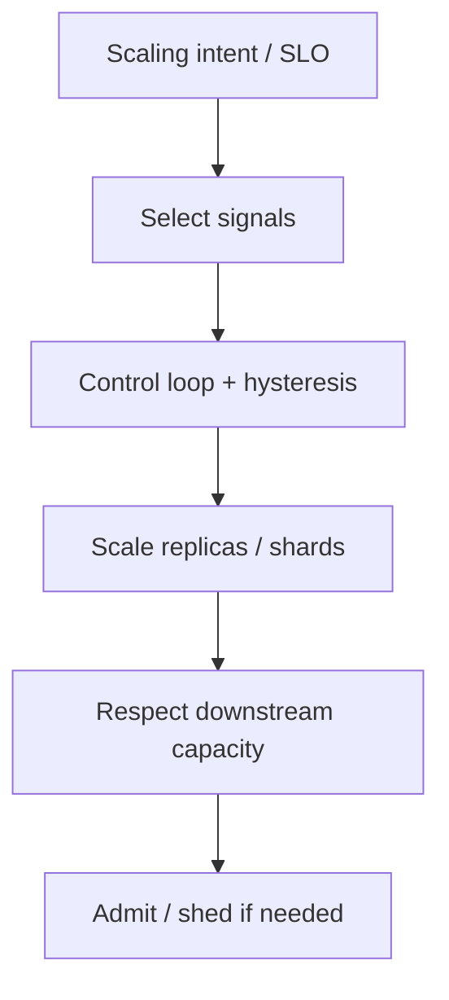
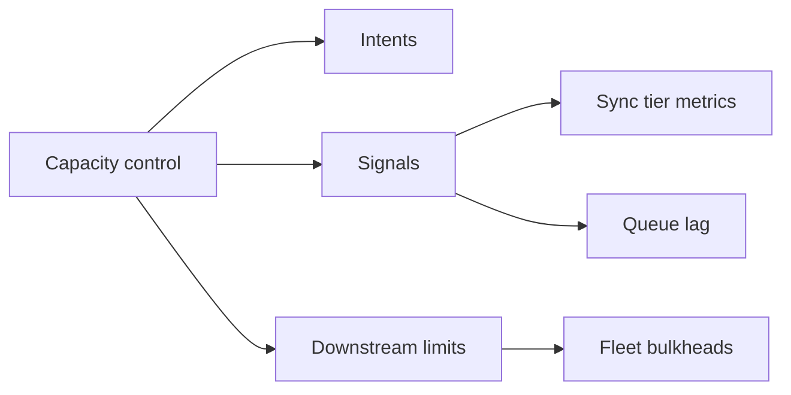
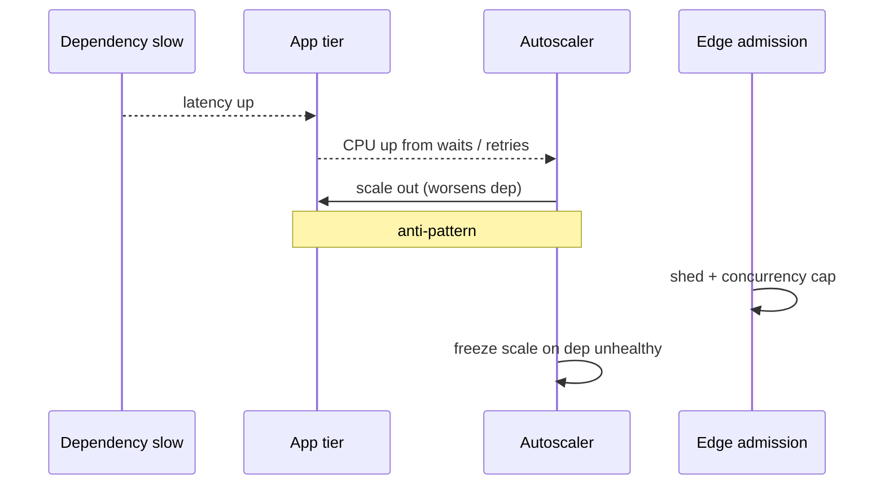

# Capacity Signals and Autoscaling Intents

## Overview

**Autoscaling** changes replica or shard capacity from **signals**—CPU, RPS, concurrency, queue lag, custom SLIs. An **intent** is the control-plane statement of *what should be true* (“keep p99 < 200ms”, “lag < 30s”), not merely “CPU > 70%.” At product scale, wrong signals amplify cascades (scale on retry storms), thrash (no hysteresis), or ignore the real bottleneck (scale web while DB saturates). DevOps owns scaler mechanics; System Design owns **which signals encode product capacity intent** across services and regions.

## Learning Objectives

- Choose signals that match the bottleneck (CPU vs IO vs queue vs saturation)
- Express scaling intents tied to SLOs and lag budgets
- Prevent feedback loops with retries, caches, and warm-up
- Coordinate multi-tier scaling (edge, app, worker, DB limits)
- Sketch a control loop with hysteresis in TypeScript

## Prerequisites

- [[09-System-Design/01-Capacity-Latency-and-Bottlenecks/Throughput Queuing and Littles Law Intuition|Throughput Queuing and Littles Law Intuition]]
- [[09-System-Design/10-Observability-and-Control-Planes/SLIs SLOs Error Budgets for Multi-Service Systems|SLIs SLOs Error Budgets for Multi-Service Systems]]
- [[09-System-Design/06-Messaging-Streams-and-Async-Topologies/Backpressure Consumer Lag and Load Shedding|Backpressure Consumer Lag and Load Shedding]]
- [[09-System-Design/README|System Design]]

## Difficulty

`advanced`

## Estimated Time

- Reading: 2 hours
- Exercises: 3 hours
- Mini project: 4 hours

## History

Early cloud autoscaling chased CPU. Queue-driven and concurrency-driven scalers (Knative, KEDA, custom HPA metrics) aligned better with user latency. Incidents taught that scaling *into* a shared DB or during a dependency outage makes things worse—admission control must precede elastic compute.

## Problem It Solves

- **Lagging workers** while web tiers look idle (wrong signal)
- **Thrashing** scale up/down every minute
- **Retry-driven scale-out** that multiplies load on a sick dependency
- **Regional imbalance** when global traffic shifts without regional intents

## Internal Implementation

### Signal menu

| Signal | Good for | Failure mode |
| --- | --- | --- |
| CPU | CPU-bound compute | Misses IO wait / queueing |
| RPS / QPS | Steady request load | Ignores request cost variance |
| In-flight concurrency | Saturation control | Needs app instrumentation |
| Queue lag / age | Async pipelines | Scale without consumer efficiency |
| p99 latency | SLO-aligned | Noisy; needs smoothing |
| Custom business | Checkouts/sec | Gaming / seasonality |

### Intent examples

- “Maintain consumer lag < 60s at p95, max 100 pods, cool-down 5m.”
- “Hold gateway concurrency ≤ 80% of limit; shed before scale if DB near saturation.”



## Mermaid Diagrams

### Structure



### Sequence / Lifecycle — bad vs good response to brownout



## Examples

### Minimal Example — lag intent

```text
desired_lag = 30s
scale_up if lag_p95 > 45s for 3m
scale_down if lag_p95 < 15s for 15m
max_replicas = floor(db_conn_budget / conns_per_pod)
```

### Production-Shaped Example — hysteresis controller

```typescript
// Node 20+ — educational scale decision with hysteresis and freeze
export type ScaleState = { replicas: number; frozenUntil: number };

export function decideReplicas(opts: {
  now: number;
  state: ScaleState;
  signal: number;
  upThreshold: number;
  downThreshold: number;
  max: number;
  min: number;
  depHealthy: boolean;
}): ScaleState {
  if (opts.now < opts.state.frozenUntil) return opts.state;
  if (!opts.depHealthy) {
    return { ...opts.state, frozenUntil: opts.now + 5 * 60_000 };
  }
  let { replicas } = opts.state;
  if (opts.signal > opts.upThreshold) replicas = Math.min(opts.max, replicas + 1);
  else if (opts.signal < opts.downThreshold) replicas = Math.max(opts.min, replicas - 1);
  return { replicas, frozenUntil: opts.now + 60_000 };
}

export function maxReplicasFromDbBudget(connBudget: number, perPod: number): number {
  return Math.max(1, Math.floor(connBudget / perPod));
}
```

## Trade-offs

| Dimension | Upside | Downside | When it matters |
| --- | --- | --- | --- |
| CPU scaling | Ubiquitous | Wrong bottleneck | simple services |
| Lag scaling | Protects async SLOs | Needs good consumers | pipelines |
| Latency scaling | User-aligned | Oscillation risk | with smoothing |
| Fast cool-down | Cheap | Thrash | avoid |
| Scale during incidents | Instinct | Amplifies cascades | freeze policies |

### When to Use

- Explicit intents documented per service
- Caps derived from downstream budgets (DB, dependency QPS)
- Predictive scale for known events + reactive for surprises

### When Not to Use

- Do not autoscale stateful primaries without shard story
- Do not scale on error rate alone (can scale failure)
- Do not ignore cold-start / connection stampede on scale-up

## Exercises

1. Pick signals for API, worker, and WebSocket gateway—justify.
2. Given DB `max_connections=5000`, size HPA max.
3. Design freeze rules when dependency error rate > 5%.
4. Compare concurrency limit vs replica scale for brownout.
5. Model thrashing with tight thresholds; fix with hysteresis.

## Mini Project

**Scaler simulator.** Feed synthetic lag/CPU; compare CPU-only vs lag+freeze policies on dependency slowdown.

## Portfolio Project

Scaling intent ADRs in [[09-System-Design/projects/Distributed Systems Workbench/README|Distributed Systems Workbench]].

## Interview Questions

1. Why is CPU often a poor sole autoscaling signal?
2. What is a scaling intent?
3. How does queue lag relate to Little’s Law?
4. How can autoscaling worsen cascading failure?
5. What caps should bound max replicas?

### Stretch / Staff-Level

1. Multi-region traffic shift + regional HPA coordination.
2. Autosharding intents when vertical/horizontal pod scale is insufficient.

## Common Mistakes

- No cool-down / flapping
- Scaling web tiers past DB capacity
- Ignoring JVM/Node warm-up after scale-out
- Treating autoscaling as a substitute for load shedding

## Best Practices

- Document bottleneck and signal in the same ADR
- Pair with [[09-System-Design/09-Failure-Modes-at-Product-Scale/Graceful Degradation and Feature Shedding|Feature Shedding]]
- Alert on approaching max replicas (intent cannot be met)
- Load-test scale-up storms
- Hand off HPA/KEDA wiring to [[16-DevOps/README|DevOps]]

## Summary

Autoscaling is a control loop over product capacity intents. Choose signals that reflect true bottlenecks, bound them by downstream limits, and freeze or shed when scaling would amplify failure. Elastic compute without intent is just expensive chaos.

## Further Reading

- [[00-References/System Design/README|System Design References]]
- Kubernetes HPA / custom metrics docs
- Amazon Builders' Library — scaling and queueing

## Related Notes

- [[09-System-Design/README|System Design]]
- [[09-System-Design/01-Capacity-Latency-and-Bottlenecks/Throughput Queuing and Littles Law Intuition|Little's Law Intuition]]
- [[09-System-Design/06-Messaging-Streams-and-Async-Topologies/Backpressure Consumer Lag and Load Shedding|Backpressure and Load Shedding]]
- [[09-System-Design/10-Observability-and-Control-Planes/Cardinality and Metric Topology Risks|Cardinality Risks]]
- [[09-System-Design/10-Observability-and-Control-Planes/Progressive Delivery of Distributed Systems|Progressive Delivery]]
- [[08-Databases/12-Production-Database-Ops/Connection Pooling at Engine and Proxy|Connection Pooling]]

## Progress Checklist

- [ ] Explained from first principles
- [ ] Drew at least one Mermaid diagram
- [ ] Implemented a minimal version
- [ ] Documented trade-offs and non-goals
- [ ] Completed exercises
- [ ] Practiced interview questions aloud
- [ ] Linked prerequisites and dependents
