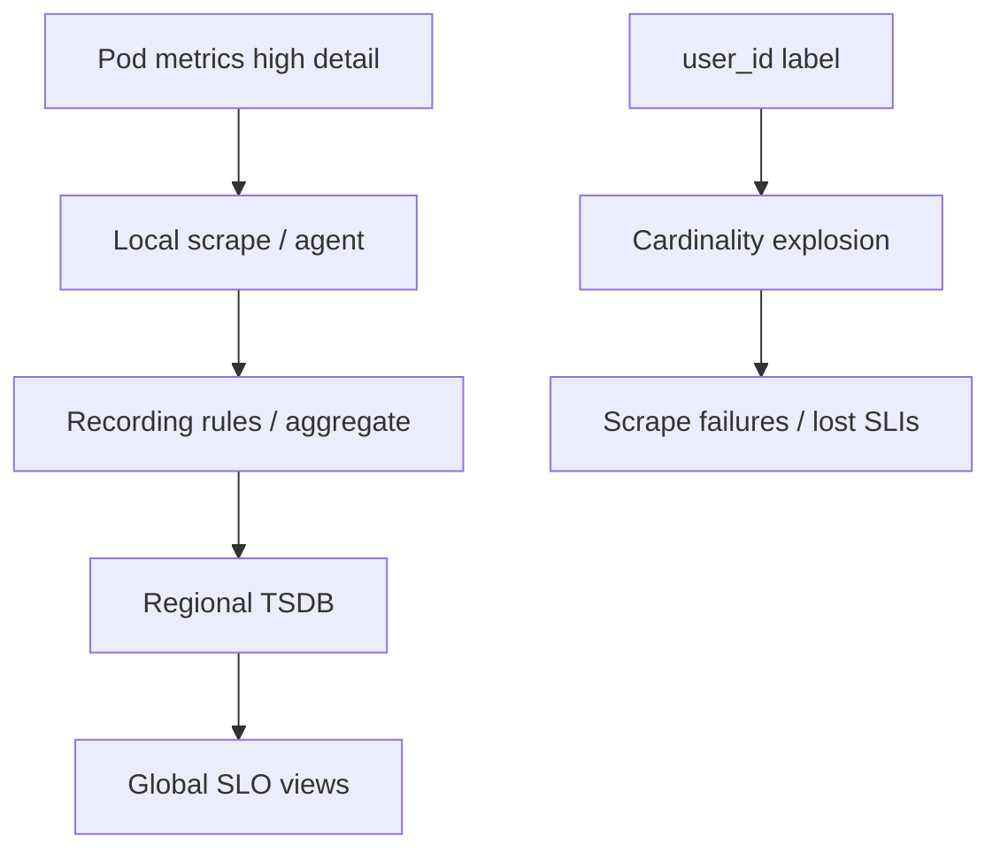
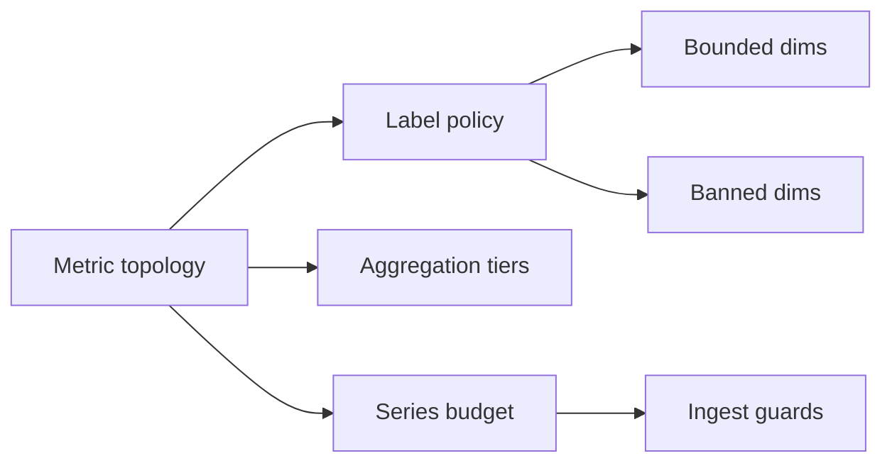
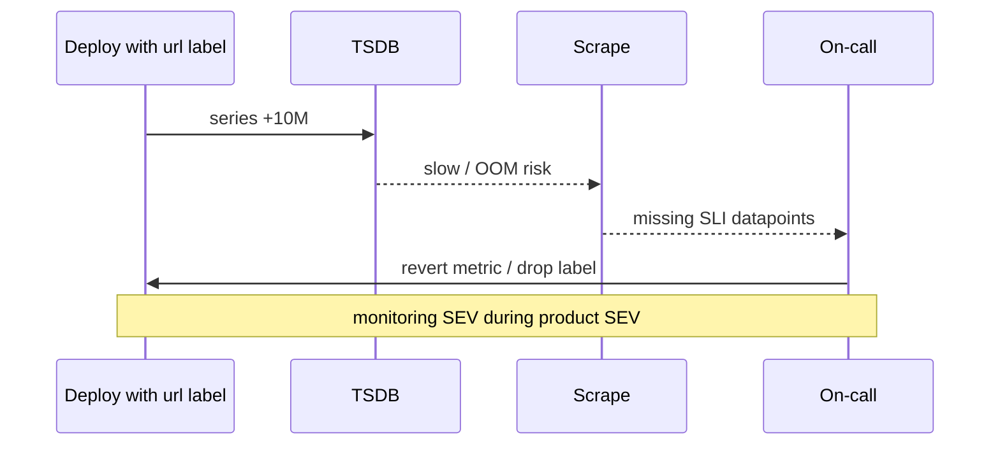

# Cardinality and Metric Topology Risks

## Overview

**Cardinality** is the number of unique time series produced by a metric name and its label/tag combinations. Unbounded labels (`user_id`, `url`, `request_id`) create **metric explosions** that melt Prometheus/TSDB budgets, slow queries, and drop critical SLIs under scrape pressure. **Metric topology** is how metrics fan in from pods → services → cells → regions. System Design sets **label policies and aggregation boundaries** so observability remains a reliable control plane—not a self-inflicted outage.

## Learning Objectives

- Estimate series count from labels and fleet size
- Ban or hash high-cardinality dimensions; prefer exemplars/traces
- Design aggregation tiers (local scrape → recording rules → global)
- Detect cardinality incidents before TSDB death
- Sketch a cardinality estimator in TypeScript

## Prerequisites

- [[09-System-Design/10-Observability-and-Control-Planes/SLIs SLOs Error Budgets for Multi-Service Systems|SLIs SLOs Error Budgets for Multi-Service Systems]]
- [[09-System-Design/10-Observability-and-Control-Planes/Distributed Tracing Correlation Across Regions|Distributed Tracing Correlation Across Regions]]
- [[09-System-Design/04-Partitioning-Sharding-and-Placement/Partition Keys Hotspots and Skew|Partition Keys Hotspots and Skew]]
- [[09-System-Design/README|System Design]]

## Difficulty

`advanced`

## Estimated Time

- Reading: 2 hours
- Exercises: 2.5 hours
- Mini project: 3 hours

## History

Prometheus’s pull model made label misuse a rite of passage: one PR adding `path` without normalization took down monitoring. Vendors introduced cardinality guards; OpenTelemetry pushed exemplars linking metrics to traces so you need not label every unique. Cells and multi-region multiplied topology complexity.

## Problem It Solves

- **Monitoring outages** during product incidents (worst timing)
- **Query latency** that makes dashboards useless for IR
- **Cost blowups** in hosted metric backends
- **False security** when scrape failures drop SLI data

## Internal Implementation

### Series estimate

`series ≈ product over labels of (unique values) × metric count × targets`

Example: 5 metrics × 500 pods × 10k raw paths = 25M series from one mistake.

### Safe label set (typical)

`service`, `route_template`, `region`, `cell`, `status_class`, `dependency` — not raw IDs.



## Mermaid Diagrams

### Structure



### Sequence / Lifecycle — cardinality incident



## Examples

### Minimal Example — normalize routes

```text
Bad:  path=/users/33829/orders/12
Good: route=/users/:id/orders/:orderId
```

### Production-Shaped Example — cardinality estimator

```typescript
// Node 20+ — estimate time series before shipping a metric
export function estimateSeries(opts: {
  metrics: number;
  targets: number;
  labelUniques: number[];
}): number {
  const labelProduct = opts.labelUniques.reduce((a, b) => a * b, 1);
  return opts.metrics * opts.targets * labelProduct;
}

const SAFE = new Set(["service", "region", "cell", "route", "code_class"]);

export function assertLabels(labels: string[]): void {
  for (const l of labels) {
    if (!SAFE.has(l)) throw new Error(`label not allowlisted: ${l}`);
  }
}

export function statusClass(code: number): string {
  if (code < 400) return "2xx3xx";
  if (code < 500) return "4xx";
  return "5xx";
}
```

## Trade-offs

| Dimension | Upside | Downside | When it matters |
| --- | --- | --- | --- |
| Fine labels | Debug detail | Cardinality | use traces instead |
| Heavy aggregation | Cheap global | Lose drill-down | keep raw short retention |
| Recording rules | Fast dashboards | Stale definitions | own as code |
| Global scrape | Simple | Doesn’t scale | prefer hierarchy |
| Strict allowlist | Safety | Friction | worth it |

### When to Use

- Allowlists and series budgets from day one
- Route templates and status classes for HTTP SLIs
- Exemplars / traces for per-user debugging

### When Not to Use

- Do not put `user_id` or `email` on metrics
- Do not ship unbounded `url` or `query_hash` without caps
- Do not scale monitoring by “just buy more” without topology

## Exercises

1. Estimate series for a 2k-pod service with labels `{service,pod,path}` vs `{service,route}`.
2. Design a 3-tier metric topology for 10 cells × 3 regions.
3. Write a PR checklist for new metrics.
4. Plan retention: raw 7d, aggregated 1y.
5. Detect cardinality via top-N metrics query—document playbook.

## Mini Project

**Label linter.** CI script rejects metrics with banned labels; unit-test estimator against fixtures.

## Portfolio Project

Observability budget ADR in [[09-System-Design/projects/Distributed Systems Workbench/README|Distributed Systems Workbench]].

## Interview Questions

1. What is metric cardinality?
2. Why are high-cardinality labels dangerous?
3. How do you monitor HTTP paths safely?
4. Metrics vs traces for per-request debug?
5. What is a recording rule for?

### Stretch / Staff-Level

1. Design multi-tenant metrics isolation so one team cannot explode the shared TSDB.
2. Adaptive keep-lists for “interesting” label values with caps.

## Common Mistakes

- Labeling exceptions with full stack hashes
- Per-pod metrics scraped globally without aggregation
- No ownership of series budget
- Using logs as a substitute for unbounded metrics (also costly)

## Best Practices

- Series budget as an NFR alongside QPS
- Prefer histograms with bounded buckets for latency SLIs
- Guard ingest; alert on series growth rate
- Teach allowlists in service templates
- Continue with [[09-System-Design/10-Observability-and-Control-Planes/Capacity Signals and Autoscaling Intents|Capacity Signals]]

## Summary

Cardinality and metric topology are reliability features of the control plane. Bounded labels, hierarchical aggregation, and clear budgets keep SLIs queryable during incidents. Unbounded dimensions turn observability into the outage.

## Further Reading

- [[00-References/System Design/README|System Design References]]
- Prometheus docs — instrumentation and cardinality
- Grafana/Mimir or vendor cardinality guidance

## Related Notes

- [[09-System-Design/README|System Design]]
- [[09-System-Design/10-Observability-and-Control-Planes/SLIs SLOs Error Budgets for Multi-Service Systems|SLIs SLOs Error Budgets]]
- [[09-System-Design/10-Observability-and-Control-Planes/Distributed Tracing Correlation Across Regions|Distributed Tracing]]
- [[09-System-Design/01-Capacity-Latency-and-Bottlenecks/Back-of-Envelope Capacity Estimation|Back-of-Envelope Capacity Estimation]]
- [[16-DevOps/README|DevOps]]

## Progress Checklist

- [ ] Explained from first principles
- [ ] Drew at least one Mermaid diagram
- [ ] Implemented a minimal version
- [ ] Documented trade-offs and non-goals
- [ ] Completed exercises
- [ ] Practiced interview questions aloud
- [ ] Linked prerequisites and dependents
