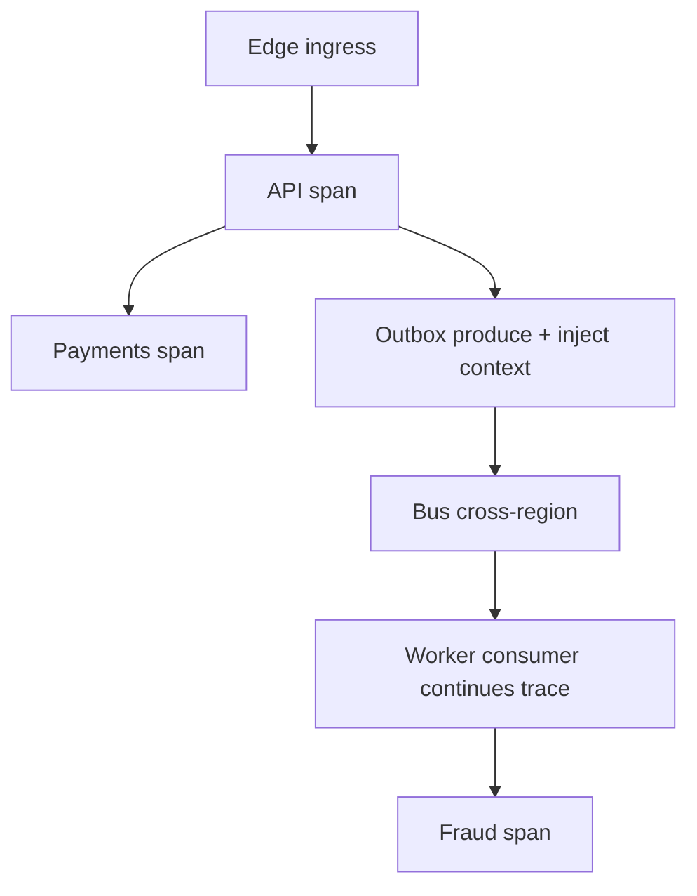
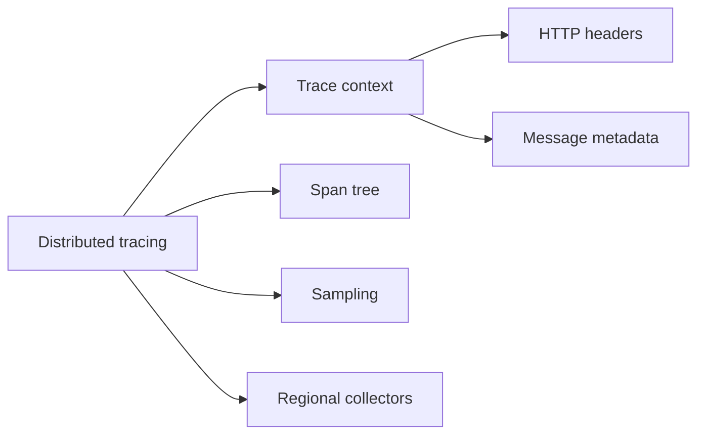
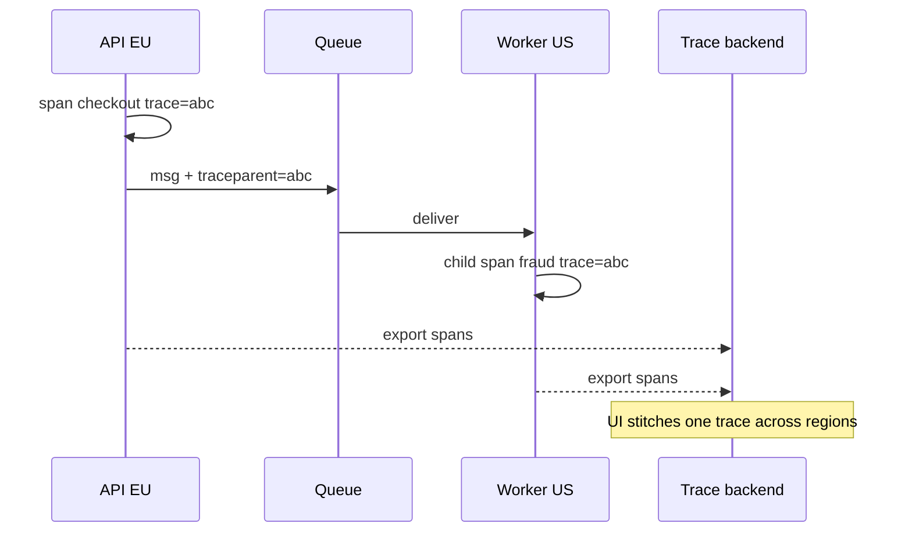

# Distributed Tracing Correlation Across Regions

## Overview

**Distributed tracing** records a request’s path as a tree of **spans** under a shared **trace ID**, enabling latency attribution and dependency debugging across services. **Cross-region correlation** requires propagating context (`traceparent` / baggage) through HTTP, queues, and async workers, and stitching spans when work continues in another region after a message delay. Local APM on one service is Backend/DevOps plumbing; System Design owns **propagation contracts**, sampling strategies at fleet scale, and regional collector topologies.

## Learning Objectives

- Propagate W3C trace context across sync and async boundaries
- Design sampling that preserves rare errors without drowning storage
- Correlate multi-region async workflows (outbox → consumer)
- Use traces to explain journey SLI failures
- Sketch context propagation helpers in TypeScript

## Prerequisites

- [[09-System-Design/10-Observability-and-Control-Planes/SLIs SLOs Error Budgets for Multi-Service Systems|SLIs SLOs Error Budgets for Multi-Service Systems]]
- [[09-System-Design/07-Multi-Region-and-Geo/Multi-Region Active-Passive Active-Active Patterns|Multi-Region Active-Passive Active-Active Patterns]]
- [[09-System-Design/06-Messaging-Streams-and-Async-Topologies/Outbox at System Scale Cross-Service Contracts|Outbox at System Scale Cross-Service Contracts]]
- [[09-System-Design/README|System Design]]

## Difficulty

`advanced`

## Estimated Time

- Reading: 2.5 hours
- Exercises: 3 hours
- Mini project: 4 hours

## History

Dapper and Zipkin established span models; OpenTelemetry unified APIs. Early microservices lost traces at queue boundaries and region hop. Modern incidents demand “show me the trace for this checkout” across EU→US replication and async fraud checks—without exporting 100% of spans at global QPS.

## Problem It Solves

- **Blind hops** where a service calls another without headers
- **Async black holes** when consumers start new traces
- **Cross-region orphans** that never join parent traces
- **Cost explosions** from unsampled high-cardinality spans

## Internal Implementation

### Propagation rules

1. Ingress extracts `traceparent`; egress injects it.
2. Message envelopes carry trace context + optional baggage (tenant, journey).
3. Consumers **continue** the trace (link or child span), not always a new root.
4. Region collectors may be local; query layer federates by trace ID.
5. Tail-based sampling keeps error/slow traces after the fact when possible.



## Mermaid Diagrams

### Structure



### Sequence / Lifecycle — cross-region async



## Examples

### Minimal Example — W3C header shape

```text
traceparent: 00-<trace-id-32hex>-<span-id-16hex>-01
tracestate: vendor-specific optional
```

### Production-Shaped Example — inject/extract for messages

```typescript
// Node 20+ — minimal trace context for queue payloads
export type TraceContext = {
  traceId: string;
  spanId: string;
  sampled: boolean;
};

export function inject(
  headers: Record<string, string>,
  ctx: TraceContext,
): void {
  const flags = ctx.sampled ? "01" : "00";
  headers["traceparent"] = `00-${ctx.traceId}-${ctx.spanId}-${flags}`;
}

export function extract(headers: Record<string, string>): TraceContext | null {
  const raw = headers["traceparent"];
  if (!raw) return null;
  const parts = raw.split("-");
  if (parts.length < 4) return null;
  return {
    traceId: parts[1],
    spanId: parts[2],
    sampled: parts[3] === "01",
  };
}

export function childSpanId(): string {
  return crypto.randomUUID().replace(/-/g, "").slice(0, 16);
}
```

## Trade-offs

| Dimension | Upside | Downside | When it matters |
| --- | --- | --- | --- |
| 100% sampling | Complete | Cost/latency | tiny fleets only |
| Head sampling | Cheap | Miss rare bugs | add tail/error keep |
| Wide events | Rich debug | PII / cardinality | scrub carefully |
| Per-region collectors | Locality | Federated query complexity | multi-region |
| New root per consumer | Simple | Broken journeys | avoid for user flows |

### When to Use

- Any multi-service user journey
- Async workflows that affect SLIs
- Cross-region failover debugging

### When Not to Use

- Do not log full payloads inside spans by default
- Do not rely on traces alone without metrics SLIs
- Do not invent proprietary context if W3C works

## Exercises

1. List all hop types in a checkout (HTTP, DB, queue, cron); mark propagation gaps.
2. Design sampling: 1% baseline + keep errors + keep p99.
3. Explain child span vs span link for fan-out.
4. Plan PII policy for baggage and span attributes.
5. Debug a fictional orphan span across regions—checklist.

## Mini Project

**Async trace stitcher.** Producer/consumer TypeScript demo that preserves `traceparent` and prints a reconstructed tree.

## Portfolio Project

Tracing ADR + screenshots in [[09-System-Design/projects/Distributed Systems Workbench/README|Distributed Systems Workbench]].

## Interview Questions

1. What is a trace vs a span?
2. How do you propagate context over a queue?
3. Head vs tail sampling?
4. Why do multi-region traces break?
5. How do traces support SLO investigations?

### Stretch / Staff-Level

1. Design federated trace query across regional backends with retention tiers.
2. Correlate traces with change events and feature flags for IR.

## Common Mistakes

- Missing middleware on one language/runtime
- Dropping context on gRPC ↔ HTTP bridges
- Sampling out all errors accidentally
- Clock skew confusing Gantt views (use span ids, not wall order alone)

## Best Practices

- Standardize on OpenTelemetry + W3C
- Include `service`, `region`, `cell` attributes for bulkheads
- Alert from SLIs; use traces for diagnosis
- Pair with [[09-System-Design/10-Observability-and-Control-Planes/Cardinality and Metric Topology Risks|Cardinality Risks]]
- Cross-link [[09-System-Design/08-Coordination-Consensus-and-Locks/Clocks Skew Ordering and Happens-Before|Clocks Skew]]

## Summary

Cross-region distributed tracing is a propagation and sampling design problem: keep one journey identity across HTTP and async hops, collect locally, query globally, and retain the rare painful traces. Without correlation contracts, multi-service SLOs cannot be explained—only mourned.

## Further Reading

- [[00-References/System Design/README|System Design References]]
- W3C Trace Context
- OpenTelemetry documentation — context propagation & sampling

## Related Notes

- [[09-System-Design/README|System Design]]
- [[09-System-Design/10-Observability-and-Control-Planes/SLIs SLOs Error Budgets for Multi-Service Systems|SLIs SLOs Error Budgets]]
- [[09-System-Design/10-Observability-and-Control-Planes/Cardinality and Metric Topology Risks|Cardinality and Metric Topology Risks]]
- [[09-System-Design/06-Messaging-Streams-and-Async-Topologies/Outbox at System Scale Cross-Service Contracts|Outbox at System Scale]]
- [[07-Backend/README|Backend]]
- [[16-DevOps/README|DevOps]]

## Progress Checklist

- [ ] Explained from first principles
- [ ] Drew at least one Mermaid diagram
- [ ] Implemented a minimal version
- [ ] Documented trade-offs and non-goals
- [ ] Completed exercises
- [ ] Practiced interview questions aloud
- [ ] Linked prerequisites and dependents
