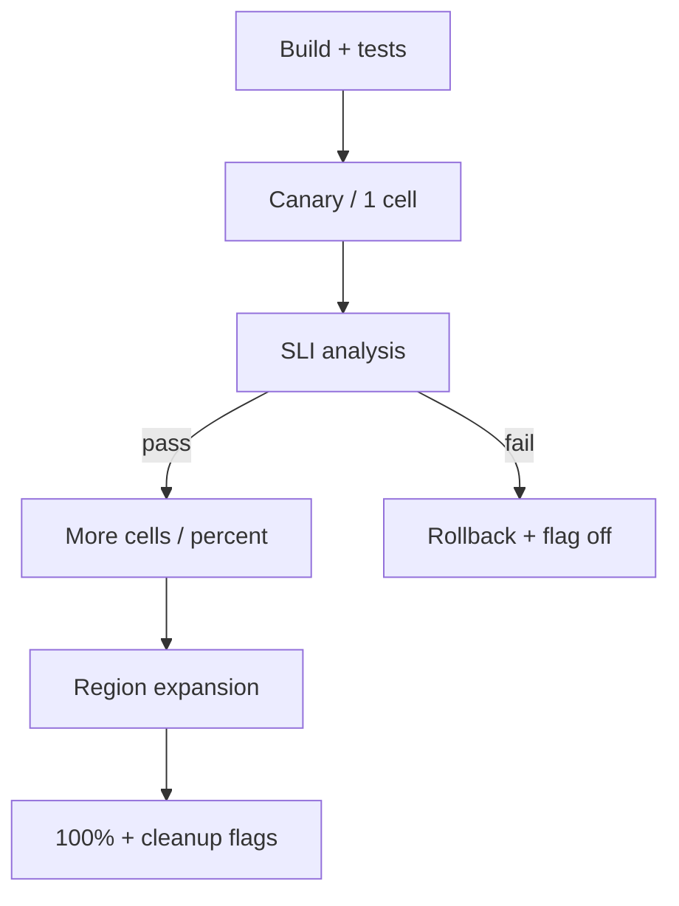
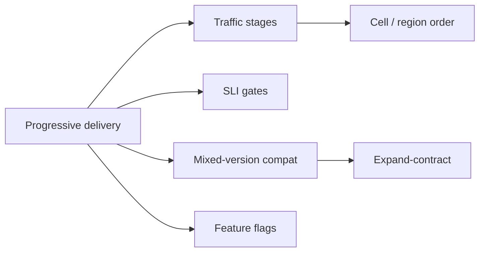
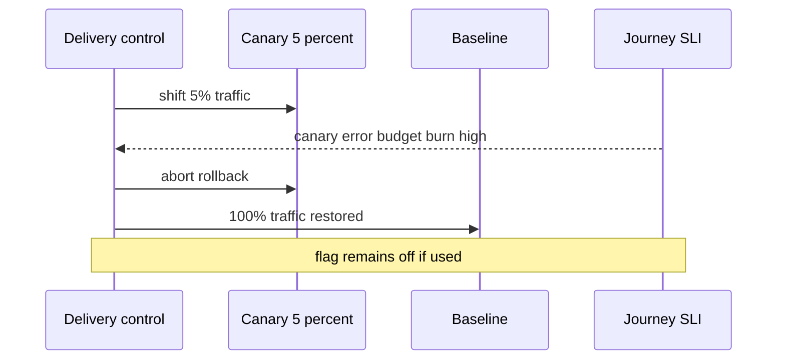

# Progressive Delivery of Distributed Systems

## Overview

**Progressive delivery** releases change gradually—canaries, percentage rollouts, cell-by-cell deploys, and flag-gated features—while **automated analysis** of SLIs decides promote or rollback. For distributed systems, the hard part is **compatibility across versions**: mixed fleets, schema migrations, multi-service contracts, and regional skew. CI/CD machinery lives in DevOps; System Design owns **blast-radius-aware rollout topology**, metric gates, and dual-write/dual-read windows that keep journeys safe while many versions coexist.

## Learning Objectives

- Design rollout stages: build → canary → cells → regions → 100%
- Gate promotion on journey SLIs and error budgets, not only green tests
- Plan mixed-version compatibility for APIs and schemas
- Coordinate feature flags with binary deploys
- Sketch a promote/abort controller in TypeScript

## Prerequisites

- [[09-System-Design/10-Observability-and-Control-Planes/SLIs SLOs Error Budgets for Multi-Service Systems|SLIs SLOs Error Budgets for Multi-Service Systems]]
- [[09-System-Design/09-Failure-Modes-at-Product-Scale/Zone and Fleet Bulkheads|Zone and Fleet Bulkheads]]
- [[09-System-Design/09-Failure-Modes-at-Product-Scale/Chaos Blast Radius and Dependency Failure|Chaos Blast Radius and Dependency Failure]]
- [[09-System-Design/README|System Design]]

## Difficulty

`advanced`

## Estimated Time

- Reading: 2.5 hours
- Exercises: 3 hours
- Mini project: 4 hours

## History

Blue/green and canaries predate microservices; service graphs made “one canary pod” insufficient when contracts span teams. Feature flags decoupled deploy from release. Modern platforms (Argo Rollouts, Flagger, LaunchDarkly-style) automate analysis—yet multi-region and cell topologies still need explicit design.

## Problem It Solves

- **Big-bang deploys** that SEV the fleet
- **Canaries that lie** because traffic sticky or too little
- **Schema vs code order** wrong → mixed-fleet corruption
- **Flag debt** leaving permanent dual paths

## Internal Implementation

### Rollout dimensions

1. **Binary** — old vs new process versions
2. **Config / flags** — behavior without redeploy
3. **Data** — expand/contract schema migrations
4. **Topology** — cell, AZ, region order
5. **Traffic** — % split, shadow, sticky cohorts

### Analysis gates

Compare canary vs baseline on journey SLIs, saturation, and custom correctness checks; abort on burn-rate or regression threshold.



## Mermaid Diagrams

### Structure



### Sequence / Lifecycle — canary abort



## Examples

### Minimal Example — expand/contract

```text
1. Deploy code that reads new+old schema (expand)
2. Migrate data / dual-write
3. Switch flag to new path
4. Remove old read path (contract)
Never: migrate destructive column before readers updated
```

### Production-Shaped Example — promote controller

```typescript
// Node 20+ — decide promote vs abort from canary vs baseline SLIs
export type Slice = { successRate: number; p99Ms: number };

export function analyze(opts: {
  canary: Slice;
  baseline: Slice;
  minSuccessDelta: number; // allow canary this much worse
  maxP99Ratio: number;
}): "promote" | "abort" | "wait" {
  const successOk = opts.canary.successRate >= opts.baseline.successRate - opts.minSuccessDelta;
  const latOk = opts.canary.p99Ms <= opts.baseline.p99Ms * opts.maxP99Ratio;
  if (!successOk || !latOk) return "abort";
  return "promote";
}

export function nextPercent(current: number, ladder: number[]): number | null {
  const i = ladder.indexOf(current);
  if (i < 0 || i === ladder.length - 1) return null;
  return ladder[i + 1];
}

export const DEFAULT_LADDER = [1, 5, 25, 50, 100];
```

## Trade-offs

| Dimension | Upside | Downside | When it matters |
| --- | --- | --- | --- |
| Canary % | Low blast radius | Slow + weak signal if tiny | tune sample size |
| Cell-by-cell | Hard isolation | Longer global rollout | multi-tenant |
| Flags | Instant off | Complexity / debt | behavior changes |
| Blue/green | Simple cutover | 2× resources | smaller systems |
| Auto analysis | Speed | Bad metrics → bad gates | invest in SLIs |

### When to Use

- Any production distributed change with user impact
- Schema changes with expand/contract
- Multi-region promotions after regional soak

### When Not to Use

- Do not canary a required cluster-wide membership change without a dedicated protocol
- Do not leave dual-write forever
- Do not promote on “no pages” without journey SLIs

## Exercises

1. Design a rollout plan for a breaking API field addition.
2. Choose canary traffic: random % vs sticky cohort vs one cell—trade-offs.
3. Write abort thresholds for checkout SLI.
4. Order region promotion for active-active product.
5. Inventory flags older than 90 days—cleanup plan.

## Mini Project

**Rollout simulator.** Ladder percentages with injected canary regressions; assert abort before 25%.

## Portfolio Project

Delivery topology ADR in [[09-System-Design/projects/Distributed Systems Workbench/README|Distributed Systems Workbench]]; link chaos experiments to canary stages.

## Interview Questions

1. What is progressive delivery?
2. Canary vs blue/green vs feature flag?
3. Why must schema migrations be expand/contract?
4. What metrics gate a promote decision?
5. How do cells change rollout strategy?

### Stretch / Staff-Level

1. Multi-service lockstep vs independent deploy with contract testing.
2. Automated rollback that also disables flags and reverts traffic steer.

## Common Mistakes

- Canary too small or not receiving representative traffic
- Ignoring cold-start effects on canary latency
- Rolling all cells in parallel “to go faster”
- No ownership of flag removal

## Best Practices

- Tie every stage to journey SLIs and error budgets
- Prefer cell soak before global %
- Contract tests between services before canary
- Pair with [[09-System-Design/09-Failure-Modes-at-Product-Scale/Multi-Service Incident Playbooks|Incident Playbooks]] for abort
- Pipeline implementation → [[16-DevOps/README|DevOps]]

## Summary

Progressive delivery is blast-radius control for change: staged traffic, SLI gates, mixed-version compatibility, and fast abort. Distributed products fail releases when topology and contracts are ignored—even if the unit tests passed. Promote only what the error budget can afford.

## Further Reading

- [[00-References/System Design/README|System Design References]]
- Progressive Delivery literature / Flagship & Flagger concepts
- Expand/contract migration patterns

## Related Notes

- [[09-System-Design/README|System Design]]
- [[09-System-Design/10-Observability-and-Control-Planes/SLIs SLOs Error Budgets for Multi-Service Systems|SLIs SLOs Error Budgets]]
- [[09-System-Design/10-Observability-and-Control-Planes/Capacity Signals and Autoscaling Intents|Capacity Signals and Autoscaling Intents]]
- [[09-System-Design/09-Failure-Modes-at-Product-Scale/Zone and Fleet Bulkheads|Zone and Fleet Bulkheads]]
- [[09-System-Design/09-Failure-Modes-at-Product-Scale/Chaos Blast Radius and Dependency Failure|Chaos Blast Radius]]
- [[16-DevOps/README|DevOps]]

## Progress Checklist

- [ ] Explained from first principles
- [ ] Drew at least one Mermaid diagram
- [ ] Implemented a minimal version
- [ ] Documented trade-offs and non-goals
- [ ] Completed exercises
- [ ] Practiced interview questions aloud
- [ ] Linked prerequisites and dependents
