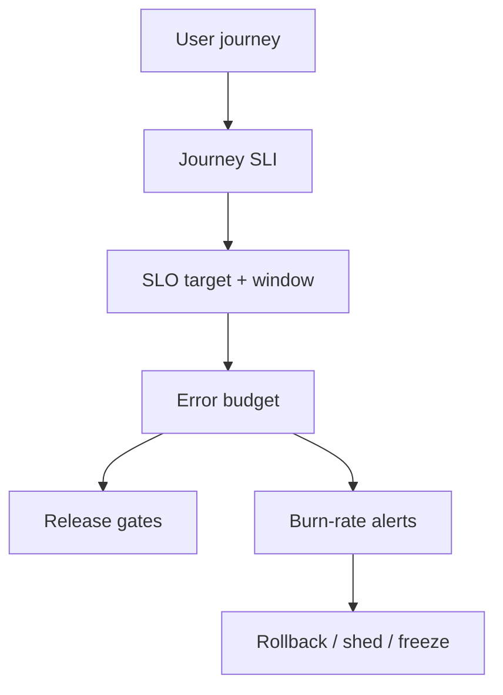
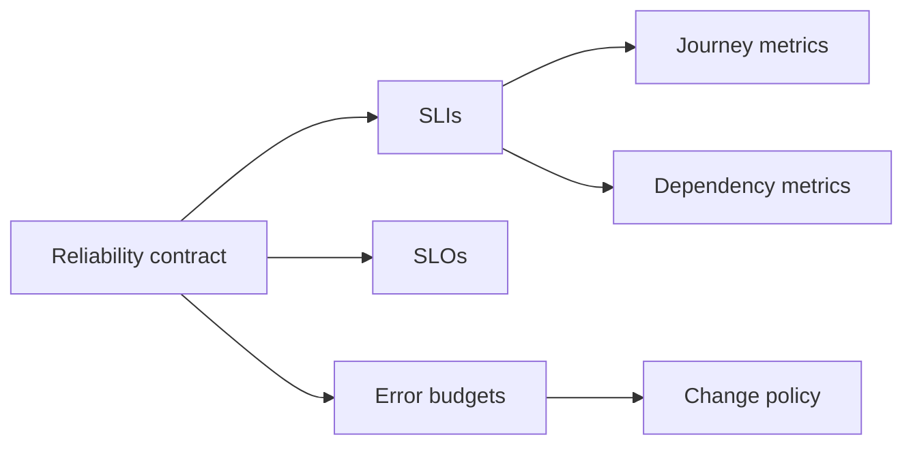
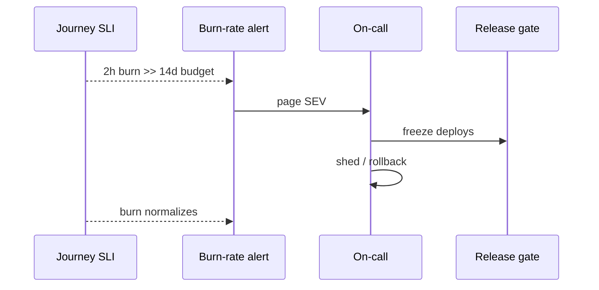

# SLIs SLOs Error Budgets for Multi-Service Systems

## Overview

An **SLI** is a quantitative measure of user-visible reliability (availability, latency, correctness). An **SLO** is a target on that SLI over a window. An **error budget** is the allowed unreliability (`1 − SLO`) that buys change velocity. In **multi-service** systems, naive per-service 99.9% multiplies into worse user journeys; designers must define **journey SLIs**, dependency budgets, and burn-rate alerts that drive shed/rollback—not vanity dashboards. Single-process metrics stay in Backend/DevOps tooling; this note owns **product-level reliability contracts**.

## Learning Objectives

- Define journey-level SLIs across service graphs
- Compose dependency SLOs without impossible multiplication
- Use error budgets to gate releases and trigger degradation
- Choose windows, burn rates, and multi-window alerts
- Sketch budget accounting in TypeScript

## Prerequisites

- [[09-System-Design/01-Capacity-Latency-and-Bottlenecks/Latency Budgets Percentiles and Tail Behavior|Latency Budgets Percentiles and Tail Behavior]]
- [[09-System-Design/09-Failure-Modes-at-Product-Scale/Cascading Multi-Service Failure|Cascading Multi-Service Failure]]
- [[09-System-Design/00-Orientation-and-Boundaries/Requirements Non-Functional and Workload Modeling|Requirements Non-Functional and Workload Modeling]]
- [[09-System-Design/README|System Design]]

## Difficulty

`advanced`

## Estimated Time

- Reading: 2.5 hours
- Exercises: 3 hours
- Mini project: 4 hours

## History

Google SRE popularized SLIs/SLOs/error budgets to replace “five nines theater.” Product orgs learned that microservice sprawl made **request success at the edge** the only honest availability story. Burn-rate alerting (multi-window) reduced pager noise while catching fast and slow burns.

## Problem It Solves

- **99.9% × 99.9% × 99.9%** → user journey fails more often than any one SLO admits
- **Paging on CPU** instead of user pain
- **Unlimited deploys** during active customer pain
- **No shared language** between product and platform for reliability spend

## Internal Implementation

### Journey SLI pattern

Measure what the user attempts: `checkout_success / checkout_attempts`, not `payments_pod_restarts`.

Latency SLI: fraction of requests faster than threshold (or distribution vs budget).

Correctness SLI: durable invariants (balance non-negative)—harder, higher value.

### Dependency budget allocation

If journey SLO is 99.9%, allocate budget slices to edge, app, DB, payments—sum of planned unreliability ≤ budget, with reserve.



## Mermaid Diagrams

### Structure



### Sequence / Lifecycle — fast burn response



## Examples

### Minimal Example — budget math

```text
SLO = 99.9% over 30 days
Budget = 0.1% ≈ 43 minutes of complete downtime
or equivalent partial failure weighted by impact
```

### Production-Shaped Example — multi-window burn

```typescript
// Node 20+ — simplified burn-rate check (SRE workbook intuition)
export function errorBudget(slo: number, windowSeconds: number): number {
  return (1 - slo) * windowSeconds;
}

export function burnRate(
  badSeconds: number,
  elapsedSeconds: number,
  slo: number,
): number {
  const allowed = (1 - slo) * elapsedSeconds;
  return allowed === 0 ? Infinity : badSeconds / allowed;
}

/** Page if short window burns fast AND longer window confirms */
export function shouldPage(opts: {
  burn1h: number;
  burn6h: number;
  fastThreshold: number;
  slowThreshold: number;
}): boolean {
  return opts.burn1h >= opts.fastThreshold && opts.burn6h >= opts.slowThreshold;
}

export function journeyAvailability(success: number, attempts: number): number {
  return attempts === 0 ? 1 : success / attempts;
}
```

## Trade-offs

| Dimension | Upside | Downside | When it matters |
| --- | --- | --- | --- |
| Journey SLIs | User truth | Harder instrumentation | always prefer |
| Per-service SLOs | Ownership | Composition lies | use as dependencies |
| Tight SLO | Higher trust | Slower change | revenue-critical |
| Loose SLO | Velocity | User pain | early stage |
| Many alert windows | Less noise | Tuning cost | production paging |

### When to Use

- Any user-facing distributed product
- Release trains gated on budget
- Dependency onboarding with explicit budget carve-outs

### When Not to Use

- Do not SLO internal batch jobs as if they were checkout
- Do not set 100% SLO (zero budget → no changes)
- Do not alert on every dependency’s CPU

## Exercises

1. Define SLIs for home, search, checkout for a retail app.
2. Allocate a 99.95% journey budget across 4 dependencies.
3. Compute minutes of budget for 99.9% / 30d and 99.99% / 30d.
4. Design a release gate policy when budget < 20% remaining.
5. Explain why stacking three 99.9% services is not 99.9% for users.

## Mini Project

**Budget dashboard sketch.** Ingest success/fail events; compute 1h/6h burn; emit page vs ticket.

## Portfolio Project

SLO/ADR pack in [[09-System-Design/projects/Distributed Systems Workbench/README|Distributed Systems Workbench]].

## Interview Questions

1. SLI vs SLO vs SLA?
2. What is an error budget for?
3. Why journey SLIs beat per-pod restarts?
4. How do burn-rate alerts work at a high level?
5. How should dependency owners share a journey budget?

### Stretch / Staff-Level

1. Design correctness SLIs for money movement.
2. Multi-region SLOs: global vs regional customer experience.

## Common Mistakes

- Availability only, ignoring latency and quality
- Alerting on burn without mitigate playbooks
- Gaming SLIs by shrinking the denominator
- No ownership of journey metrics across teams

## Best Practices

- Few SLOs that product leaders can recite
- Pair budgets with [[09-System-Design/09-Failure-Modes-at-Product-Scale/Graceful Degradation and Feature Shedding|Feature Shedding]]
- Review SLO tightness quarterly with data
- Trace-driven SLI validation → next note
- Platform recording → [[16-DevOps/README|DevOps]]

## Summary

Multi-service reliability is a journey-level contract: SLIs that mirror user attempts, SLOs that set targets, and error budgets that govern change and incident response. Composition across dependencies must be designed explicitly—or the product silently inherits a worse SLO than any dashboard shows.

## Further Reading

- [[00-References/System Design/README|System Design References]]
- Google SRE Book — Service Level Objectives
- SRE Workbook — Alerting on SLOs

## Related Notes

- [[09-System-Design/README|System Design]]
- [[09-System-Design/01-Capacity-Latency-and-Bottlenecks/Latency Budgets Percentiles and Tail Behavior|Latency Budgets Percentiles and Tail Behavior]]
- [[09-System-Design/09-Failure-Modes-at-Product-Scale/Multi-Service Incident Playbooks|Multi-Service Incident Playbooks]]
- [[09-System-Design/10-Observability-and-Control-Planes/Distributed Tracing Correlation Across Regions|Distributed Tracing Correlation Across Regions]]
- [[09-System-Design/10-Observability-and-Control-Planes/Progressive Delivery of Distributed Systems|Progressive Delivery of Distributed Systems]]

## Progress Checklist

- [ ] Explained from first principles
- [ ] Drew at least one Mermaid diagram
- [ ] Implemented a minimal version
- [ ] Documented trade-offs and non-goals
- [ ] Completed exercises
- [ ] Practiced interview questions aloud
- [ ] Linked prerequisites and dependents
