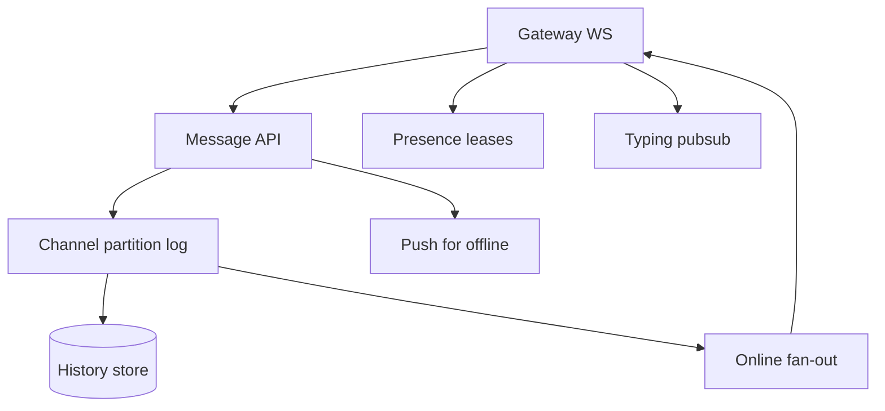
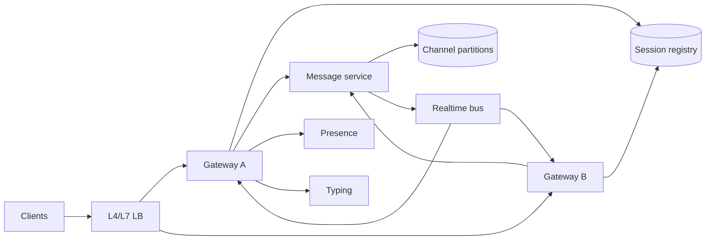
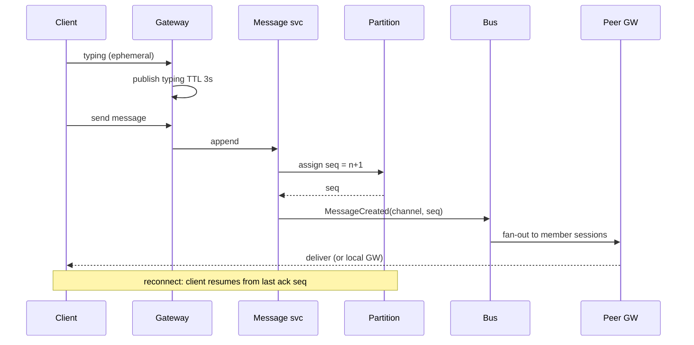

# Chat Presence Typing and Message Ordering

## Overview

Realtime **chat** combines durable message history, **presence** (online/away), **typing** indicators, and **ordering** guarantees users notice immediately ("messages jump"). Unlike feeds, chat often needs **per-channel causal or total order**, fan-out to connected sessions, and ephemeral signals that must not overload the durable path.

This note synthesizes messaging topology, coordination clocks, multi-region sticky sessions, and failure degradation for a WhatsApp/Slack/Discord-class message plane (media attachments deferred to media sketches).

## Learning Objectives

- Separate durable messages from ephemeral presence/typing planes
- Choose partition keys that preserve per-channel order
- Define consistency contracts users can understand (and test)
- Estimate gateway connection and fan-out capacity
- Sketch TypeScript ordering and presence lease logic

## Prerequisites

- [[09-System-Design/06-Messaging-Streams-and-Async-Topologies/Fan-out Broadcast and Notification Architectures|Fan-out Broadcast]]
- [[09-System-Design/08-Coordination-Consensus-and-Locks/Clocks Skew Ordering and Happens-Before|Clocks Skew Ordering]]
- [[09-System-Design/02-Load-Balancing-and-Edge-Entry/Health Checks Drain and Connection Management|Health Checks Drain]]
- [[09-System-Design/07-Multi-Region-and-Geo/Multi-Region Active-Passive Active-Active Patterns|Multi-Region Patterns]]
- [[09-System-Design/README|System Design]]

## Difficulty

`advanced`

## Estimated Time

- Reading: 2.5 hours
- Exercises: 3 hours
- Mini project: 6 hours

## History

IRC was a single ordered stream per channel. Mobile chat added multi-device sync, offline queues, and end-to-end encryption overlays. Modern designs use **connection gateways** + **channel partitions** + **ephemeral pub/sub** so typing never touches the message database.

## Problem It Solves

- **Out-of-order delivery** across devices and reconnects
- **Presence flapping** from mobile networks
- **Typing storms** drowning message brokers
- **Sticky session loss** on gateway drain causing duplicate or missed push

## Capacity Back-of-Envelope

| Variable | Value | Implication |
| --- | --- | --- |
| MAU | 100M | — |
| Concurrent connections peak | 10M | gateway memory + LB |
| Avg messages / connected user / day | 50 | durable write QPS |
| Typing events / message | ~5 | ephemeral >> durable |
| Channel fan-out (p50 / p99) | 5 / 5k | watch large rooms |

Durable: \(10\text{M} \times 50 / 86400 \approx 6\text{k}\) msg/s average (peak higher). Typing at 5× → **30k+/s** ephemeral — must be **pubsub with TTL**, not WAL'd rows.

Gateway: 10M conns × ~10 KB state ≈ **100 GB** RAM fleet-wide → many gateway pods; consistent hashing by `user_id` or `channel_id` for fan-out locality.

## Internal Implementation

### Planes

1. **Edge gateways** — WebSocket/HTTP2; session registry
2. **Message service** — append to channel partition; assign monotonic `channel_seq`
3. **History store** — messages by `(channel_id, seq)` 
4. **Fan-out / pubsub** — deliver to online members; push notify offline
5. **Presence service** — leases with heartbeat; last-writer with grace period
6. **Typing service** — ephemeral keys / pubsub; 3–5s TTL

Ordering: **total order per channel** via single-writer partition or consensus log; **causal order across channels** usually not required. Device clocks are untrusted — use server seq ([[09-System-Design/08-Coordination-Consensus-and-Locks/Clocks Skew Ordering and Happens-Before|Clocks]]).



## Mermaid Diagrams

### Structure — end-to-end chat topology



### Sequence — send, order, presence, typing



## Consistency and Failure Contract

| Signal | Guarantee | Failure |
| --- | --- | --- |
| Message durability | Persisted before ACK to sender | Sender retries with client `msg_id` idempotency |
| Channel order | Monotonic `seq` per channel | On partition failover, fence old primary ([[09-System-Design/08-Coordination-Consensus-and-Locks/Distributed Locks Leases and Fencing Tokens|Fencing Tokens]]) |
| Cross-device sync | Catch-up by seq gap fill | Temporary gaps → client gap-fetch |
| Presence | Soft state; lease expiry ⇒ offline | Prefer false offline over false online for auth-sensitive UIs |
| Typing | Best-effort; lossy under load | Shed typing before messages |
| Multi-region | Channel sticky to home region or CRDT-unsafe merge avoided | Split-brain policy: single primary per channel |

Never claim "exactly-once delivery" without defining idempotent consumer + durable inbox; prefer **at-least-once + dedupe** ([[09-System-Design/06-Messaging-Streams-and-Async-Topologies/Ordering Partitions Idempotency and Exactly-Once Claims|Exactly-Once Claims]]).

## Examples

### Minimal Example — seq check

```typescript
export function assertNextSeq(prev: number, incoming: number): void {
  if (incoming !== prev + 1) throw new Error(`gap or reorder: expected ${prev + 1}, got ${incoming}`);
}
```

### Production-Shaped Example — ADR sketch

```typescript
/**
 * ADR-002: Per-channel total order via single partition leader.
 * Ephemeral typing/presence on separate pubsub with TTL; not in message WAL.
 */
export type ChatMessage = {
  channelId: string;
  clientMsgId: string; // idempotency
  seq?: number;        // assigned by server
  body: string;
  tsServer: number;
};

export type PresenceLease = {
  userId: string;
  expiresAt: number;
  status: "online" | "away";
};

export function renewPresence(lease: PresenceLease, now: number, ttlMs: number): PresenceLease {
  return { ...lease, expiresAt: now + ttlMs };
}

export function isOnline(lease: PresenceLease, now: number): boolean {
  return now < lease.expiresAt;
}

const seen = new Set<string>();
export function acceptIdempotent(clientMsgId: string): boolean {
  if (seen.has(clientMsgId)) return false;
  seen.add(clientMsgId);
  return true;
}
```

## Trade-offs

| Dimension | Upside | Downside | When it matters |
| --- | --- | --- | --- |
| Per-channel single writer | Simple total order | Hot large channels | Discord-scale rooms |
| Client timestamps | Easy UX sort | Clock skew lies | never authoritative |
| Sticky GW by user | Fewer hops | Drain complexity | rolling deploys |
| Persist typing | Debug history | Cost explosion | anti-pattern |
| Global message order | Simpler mental model | Impossible at scale | don't |

### When to Use

- 1:1 and group messaging, Slack-like channels, gaming chat

### When Not to Use

- Feed-style broadcast to millions (use feed hybrid)
- Collaborative CRDT docs (different conflict model)

## Exercises

1. Size gateway fleet for 20M connections at 8 KB state each + 30% headroom.
2. Design resume protocol after WS disconnect (last ack seq, gap fill).
3. Large channel (100k members): fan-out topology and load shed plan.
4. Multi-device: one device reads, another sends — ordering rules.
5. Compare channel-primary vs leaderless append with vector clocks.

## Mini Project

TypeScript chat simulator: channels with seq, idempotent client IDs, presence leases, typing TTL, and intentional network reorder tests.

## Portfolio Project

Extend toward [[09-System-Design/12-Clone-Case-Studies-and-Portfolio/Discord Clone Realtime Fan-out and Presence|Discord Clone]] with gateway drain playbooks.

## Interview Questions

1. How do you guarantee message order in a channel?
2. Why are typing indicators a separate plane?
3. Presence: leases vs last-write-wins without expiry?
4. What happens on gateway crash mid-send?
5. How does offline push interact with online WS delivery (dupes)?

### Stretch / Staff-Level

1. E2E encryption with server-side fan-out constraints.
2. Active-active multi-region channels without split-brain duplicates.

## Common Mistakes

- Ordering by `Date.now()` on clients
- Writing typing rows to the message table
- No idempotency key → duplicate messages on retry
- Treating presence as strongly consistent global truth

## Best Practices

- Server seq as source of order; client ID for idempotency
- Shed ephemeral before durable under overload
- Explicit drain + session migration ([[09-System-Design/02-Load-Balancing-and-Edge-Entry/Health Checks Drain and Connection Management|Drain]])
- Observability: channel lag, gateway conn count, presence churn ([[09-System-Design/10-Observability-and-Control-Planes/SLIs SLOs Error Budgets for Multi-Service Systems|SLIs SLOs]])

## Summary

Chat is three systems sharing a UX: **durable ordered messages**, **lease-based presence**, and **lossy typing**. Partition for per-channel order, fan-out via realtime bus to gateways, and write failure contracts that drop ephemeral load before losing messages. Clocks and "exactly-once" claims are where interviews go wrong—keep seq + idempotency explicit.

## Further Reading

- [[00-References/System Design/README|System Design References]]
- [[09-System-Design/09-Failure-Modes-at-Product-Scale/Cascading Multi-Service Failure|Cascading Multi-Service Failure]]
- [[09-System-Design/08-Coordination-Consensus-and-Locks/When Not to Coordinate Avoid Shared Mutable State|When Not to Coordinate]]

## Related Notes

- [[09-System-Design/README|System Design]]
- [[09-System-Design/06-Messaging-Streams-and-Async-Topologies/Ordering Partitions Idempotency and Exactly-Once Claims|Ordering Partitions Idempotency]]
- [[09-System-Design/11-Reference-Architectures/Feed Timeline Fan-out Push Pull Hybrid|Feed Timeline Fan-out]]
- [[09-System-Design/11-Reference-Architectures/Search Notify Media and Payments Topology Sketches|Search Notify Media and Payments]]
- [[09-System-Design/12-Clone-Case-Studies-and-Portfolio/Discord Clone Realtime Fan-out and Presence|Discord Clone]]

## Progress Checklist

- [ ] Explained from first principles
- [ ] Drew at least one Mermaid diagram
- [ ] Implemented a minimal version
- [ ] Documented trade-offs and non-goals
- [ ] Completed exercises
- [ ] Practiced interview questions aloud
- [ ] Linked prerequisites and dependents
