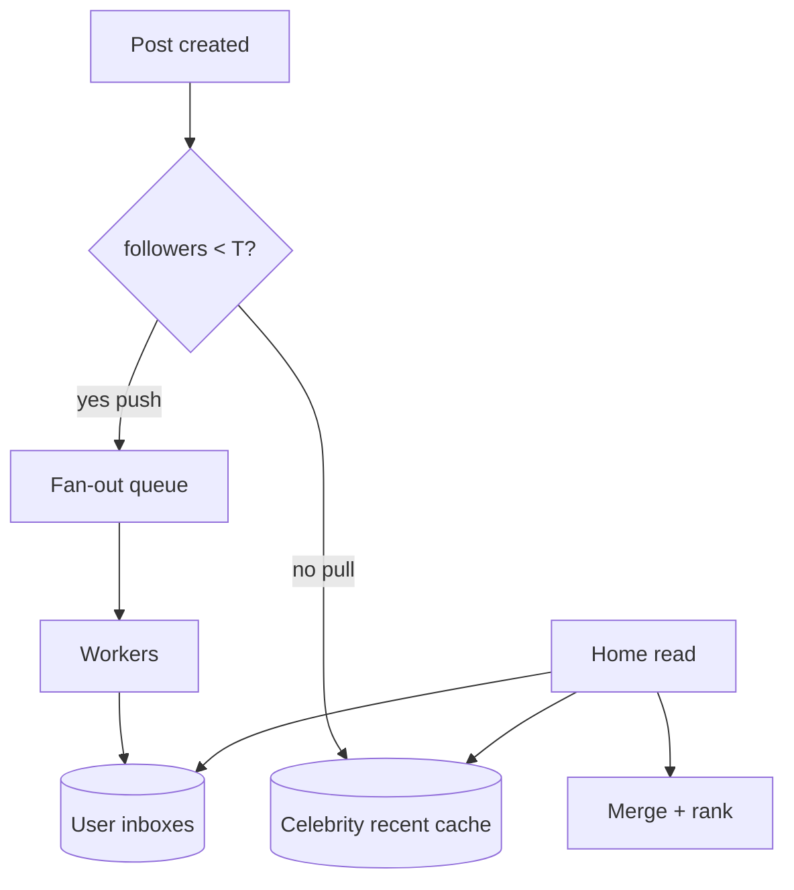
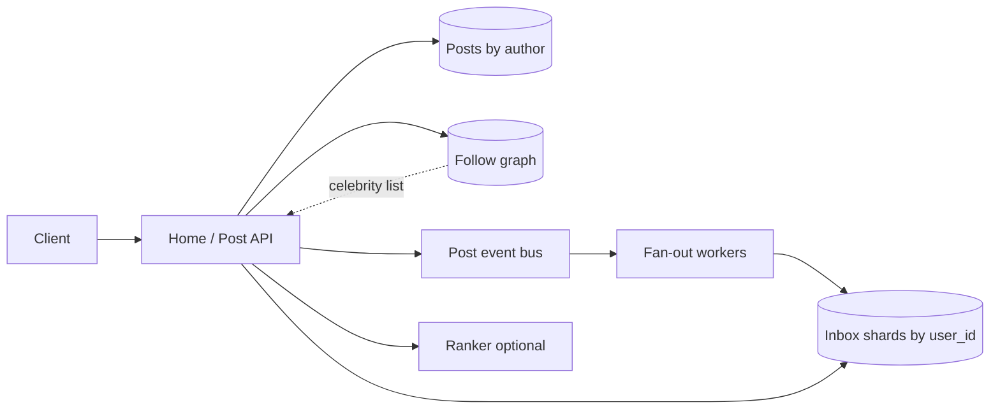

# Feed Timeline Fan-out Push Pull Hybrid

## Overview

A **home timeline** (Instagram/Twitter-style) assembles recent posts from accounts a user follows. The core design axis is **fan-out on write (push)** vs **fan-out on read (pull)** vs a **hybrid** that pushes for normal users and pulls for celebrities. This note is a messaging + partitioning + capacity synthesis: write amplification, inbox storage, ranking, and cache invalidation.

Product ranking ML is out of scope; topology and consistency contracts are in scope.

## Learning Objectives

- Compute write amplification for push vs pull under follower skew
- Design hybrid celebrity thresholds with explicit capacity math
- Partition user inboxes and post stores without cross-shard joins on the hot path
- Specify consistency for "post appears in followers' feeds" and failure/degradation modes
- Produce a TypeScript simulation of push/pull hybrid routing

## Prerequisites

- [[09-System-Design/01-Capacity-Latency-and-Bottlenecks/Throughput Queuing and Littles Law Intuition|Throughput Queuing and Little's Law]]
- [[09-System-Design/06-Messaging-Streams-and-Async-Topologies/Fan-out Broadcast and Notification Architectures|Fan-out Broadcast and Notification Architectures]]
- [[09-System-Design/04-Partitioning-Sharding-and-Placement/Partition Keys Hotspots and Skew|Partition Keys Hotspots and Skew]]
- [[09-System-Design/05-Caching-at-Product-Scale/Cache Hierarchies CDN Edge Regional App|Cache Hierarchies]]
- [[09-System-Design/README|System Design]]

## Difficulty

`advanced`

## Estimated Time

- Reading: 2.5 hours
- Exercises: 3 hours
- Mini project: 6 hours

## History

Early Twitter pushed every tweet into every follower inbox—celebrity tweets melted write capacity. The industry converged on **hybrid fan-out**: precompute inboxes for the long tail; merge celebrity posts at read time. Ranking moved from chronological to scored, but the push/pull topology remained the backbone.

## Problem It Solves

- **Celebrity write storms** (one post × 100M followers)
- **Cold-start empty inboxes** after new follows
- **Read fan-out latency** when every home request scans all followees
- **Skewed partition keys** (`user_id` of celebrities)

## Capacity Back-of-Envelope

Assumptions:

| Variable | Value |
| --- | --- |
| DAU | 200M |
| Posts/day | 100M |
| Avg follows / user | 200 |
| Median followers / poster | 200 |
| Celebrity followers | 50M (top 0.01%) |
| Home refreshes / DAU / day | 20 |

Push-only write amplification (median): \(100\text{M} \times 200 = 20\text{B}\) inbox inserts/day \(\approx 230\text{k}\) QPS average. One celebrity post: **50M** inserts → must not be synchronous push.

Pull-only read cost: each refresh merges ~200 followee timelines → \(200\text{M} \times 20 \times 200\) post lookups/day — feasible only with heavy caching and bounded merge.

Hybrid rule of thumb: **push if followers < T** (e.g. 10k); **pull if ≥ T**.

## Internal Implementation

### Data planes

1. **Post service** — authoritative post store keyed by `author_id` + `post_id`
2. **Graph service** — follow edges; celebrity flag / follower count
3. **Fan-out workers** — consume post events; write to follower inboxes (async)
4. **Inbox store** — per-user timeline (Redis list / Cassandra wide row / similar)
5. **Home API** — read inbox + merge celebrity pulls + optional ranker
6. **Cache** — recent home pages, celebrity recent posts

Messaging: post-created → log/queue → fan-out consumers with lag SLO ([[09-System-Design/06-Messaging-Streams-and-Async-Topologies/Backpressure Consumer Lag and Load Shedding|Backpressure]]).



## Mermaid Diagrams

### Structure — hybrid topology



### Sequence — post then home read

```mermaid
sequenceDiagram
    participant A as Author
    participant P as Post API
    participant Bus as Event bus
    participant W as Fan-out worker
    participant I as Inbox store
    participant H as Home API
    participant F as Follower

    A->>P: create post
    P->>P: persist post
    P->>Bus: PostCreated
    P-->>A: 201
    Bus->>W: deliver
    alt normal author
        W->>I: LPUSH follower inboxes (batched)
    else celebrity
        W->>W: skip push; warm celebrity cache
    end
    F->>H: GET home
    H->>I: read inbox
    H->>H: pull celebrity recent + merge
    H-->>F: timeline page
```

## Consistency and Failure Contract

| Concern | Contract |
| --- | --- |
| Author sees own post | Read-your-writes on post store / author timeline (strong within region) |
| Follower sees post | **Eventual** via fan-out lag SLO (e.g. p99 < 30s); not synchronous |
| Unfollow | Stop new pushes; inbox may retain historical entries until trim |
| Delete / undelete | Async tombstones to inboxes; home must filter deleted IDs |
| Worker lag spike | Degrade: pull-more on read; shed non-home notifications first |
| Shard loss | Inbox rebuild from posts + graph (expensive); RPO on inbox is rebuildable |

Invariants are user-visible "freshness" budgets, not linearizability of all timelines. See [[09-System-Design/03-Consistency-Models-and-CAP/Strong Eventual Causal and Read-Your-Writes|Strong Eventual Causal and Read-Your-Writes]].

## Examples

### Minimal Example — hybrid router

```typescript
export function shouldPush(followerCount: number, threshold = 10_000): boolean {
  return followerCount < threshold;
}
```

### Production-Shaped Example — simulation sketch

```typescript
type PostEvent = { postId: string; authorId: string; followerCount: number; ts: number };

export function routeFanout(
  ev: PostEvent,
  threshold: number,
): { mode: "push" | "pull"; estimatedWrites: number } {
  if (shouldPush(ev.followerCount, threshold)) {
    return { mode: "push", estimatedWrites: ev.followerCount };
  }
  return { mode: "pull", estimatedWrites: 0 };
}

/** Home merge: inbox IDs + celebrity pulls, newest-first, dedupe. */
export function mergeTimeline(
  inbox: string[],
  celebrityRecent: string[],
  limit: number,
): string[] {
  const seen = new Set<string>();
  const out: string[] = [];
  for (const id of [...celebrityRecent, ...inbox]) {
    if (seen.has(id)) continue;
    seen.add(id);
    out.push(id);
    if (out.length >= limit) break;
  }
  return out;
}

/** Capacity sketch: daily inbox writes under hybrid. */
export function estimatePushWritesPerDay(
  posts: { followerCount: number }[],
  threshold: number,
): number {
  return posts.reduce(
    (sum, p) => sum + (shouldPush(p.followerCount, threshold) ? p.followerCount : 0),
    0,
  );
}
```

## Trade-offs

| Dimension | Upside | Downside | When it matters |
| --- | --- | --- | --- |
| Pure push | Fast home reads | Celebrity meltdown | high follower skew |
| Pure pull | Cheap writes | Expensive / slow home | large follow graphs |
| Hybrid | Bounded write amp | Complex merge + celebrity cache | production default |
| Pre-rank on write | Cheaper read | Stale ranking, heavy workers | ML-heavy feeds |
| Long inbox | Offline scroll | Storage cost | retention policy |

### When to Use

- Social/home timelines with power-law follower graphs

### When Not to Use

- Small team feeds (pull or simple query is enough)
- Strict causal delivery to all followers before ACK (chat-like product)

## Exercises

1. Find threshold T that keeps push writes under 100k QPS given a follower histogram.
2. Design backfill when user follows 5k accounts at once.
3. Partition inbox by `user_id`; explain celebrity author partition heat on **post** store.
4. Specify lag SLIs and a degradation playbook ([[09-System-Design/09-Failure-Modes-at-Product-Scale/Multi-Service Incident Playbooks|Incident Playbooks]]).
5. Compare queue vs log for fan-out ([[09-System-Design/06-Messaging-Streams-and-Async-Topologies/Queue vs Log vs Pub-Sub Topology Choice|Queue vs Log vs Pub-Sub]]).

## Mini Project

Simulate 1M users, power-law followers, and hybrid fan-out; plot write QPS vs T.

## Portfolio Project

Feed ADRs + capacity charts in the Distributed Systems Workbench; contrast with [[09-System-Design/12-Clone-Case-Studies-and-Portfolio/Instagram Clone Capacity and Media Plane|Instagram Clone]].

## Interview Questions

1. Push vs pull vs hybrid—when each?
2. How do you handle a 50M-follower account posting?
3. What is fan-out lag and how do users perceive it?
4. How do deletes propagate?
5. Where does caching sit relative to inbox and post store?

### Stretch / Staff-Level

1. Multi-region feeds: home affinity vs global celebrity pull ([[09-System-Design/04-Partitioning-Sharding-and-Placement/Data Locality Geo Placement and Affinity|Data Locality Geo Placement]]).
2. Exactly-once inbox inserts vs idempotent `(user_id, post_id)` keys.

## Common Mistakes

- Synchronous push in the create request path
- One threshold with no measurement of follower histogram
- Ranking every post on write for all followers
- Ignoring unfollow/delete as second-class events

## Best Practices

- Async fan-out with visible lag SLO
- Celebrity list as a first-class control-plane input
- Idempotent inbox writes; trim policies
- Feature-shed ranking before shedding timeline availability

## Summary

Feed timelines are a **fan-out capacity problem** shaped by follower skew. Hybrid push/pull bounds write amplification while keeping home reads cheap for the long tail. Consistency is **eventual freshness** with read-your-writes for authors; messaging lag and cache design determine user experience more than SQL isolation.

## Further Reading

- [[00-References/System Design/README|System Design References]]
- [[09-System-Design/11-Reference-Architectures/Read-Heavy vs Write-Heavy Template Matrices|Read-Heavy vs Write-Heavy Template Matrices]]
- [[09-System-Design/06-Messaging-Streams-and-Async-Topologies/Ordering Partitions Idempotency and Exactly-Once Claims|Ordering Partitions Idempotency]]

## Related Notes

- [[09-System-Design/README|System Design]]
- [[09-System-Design/01-Capacity-Latency-and-Bottlenecks/Back-of-Envelope Capacity Estimation|Back-of-Envelope Capacity Estimation]]
- [[09-System-Design/05-Caching-at-Product-Scale/Invalidation Strategies TTL Write-Through Write-Back|Invalidation Strategies]]
- [[09-System-Design/11-Reference-Architectures/Chat Presence Typing and Message Ordering|Chat Presence Typing and Message Ordering]]
- [[09-System-Design/12-Clone-Case-Studies-and-Portfolio/Instagram Clone Capacity and Media Plane|Instagram Clone Capacity and Media Plane]]
- [[09-System-Design/12-Clone-Case-Studies-and-Portfolio/Discord Clone Realtime Fan-out and Presence|Discord Clone Realtime Fan-out and Presence]]

## Progress Checklist

- [ ] Explained from first principles
- [ ] Drew at least one Mermaid diagram
- [ ] Implemented a minimal version
- [ ] Documented trade-offs and non-goals
- [ ] Completed exercises
- [ ] Practiced interview questions aloud
- [ ] Linked prerequisites and dependents
