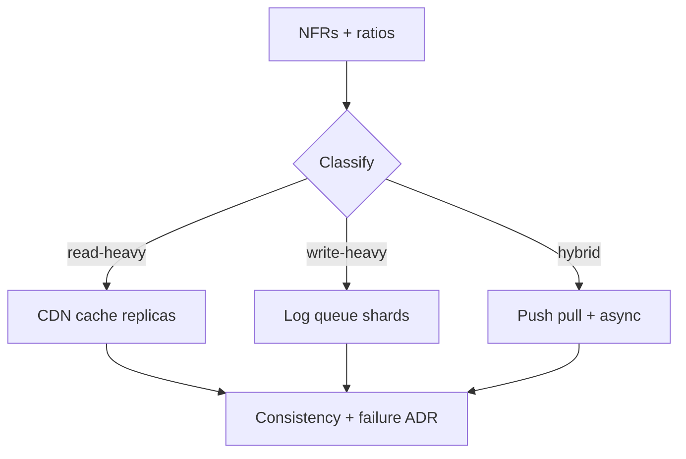
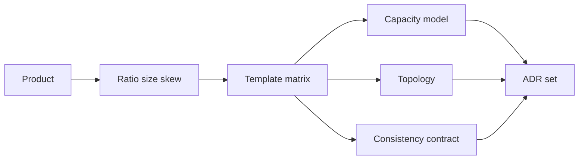
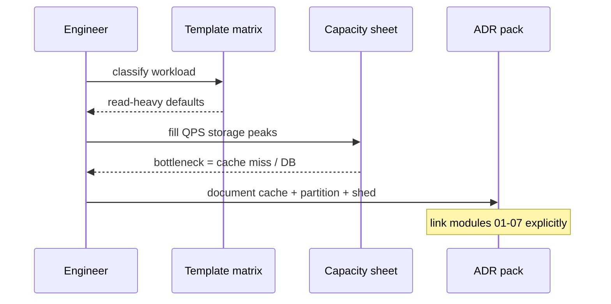

# Read-Heavy vs Write-Heavy Template Matrices

## Overview

Most interview and production designs collapse into a few **workload templates**: read-heavy (URL shortener, catalog, CDN playback), write-heavy (ingest, IoT, chat append), and **asymmetric** hybrids (feed push, search index). This note is a **decision matrix** that maps workload shape → capacity focus → caching → partitioning → messaging → multi-region → consistency defaults, tying modules 01–07 together.

Use it before diving into a clone case study; update the matrix when NFRs change.

## Learning Objectives

- Classify products along read/write ratio, payload size, and skew
- Select default topology patterns from a matrix without cargo-culting
- Attach consistency and failure contracts to each template
- Estimate which bottleneck appears first under 10× growth
- Encode a TypeScript selector that recommends patterns from inputs

## Prerequisites

- [[09-System-Design/01-Capacity-Latency-and-Bottlenecks/Cost Performance and Capacity Trade-offs|Cost Performance and Capacity Trade-offs]]
- [[09-System-Design/03-Consistency-Models-and-CAP/Choosing Consistency from User-Visible Invariants|Choosing Consistency from User-Visible Invariants]]
- [[09-System-Design/07-Multi-Region-and-Geo/Sync Async and Semi-Sync as Latency SLOs|Sync Async and Semi-Sync]]
- [[09-System-Design/README|System Design]]

## Difficulty

`intermediate`

## Estimated Time

- Reading: 2 hours
- Exercises: 2 hours
- Mini project: 3 hours

## History

"Just add Redis" and "just shard" were cargo-cult responses to every scale problem. Mature teams keep **workload templates** so URL-shortener thinking is not applied to payment ledgers and vice versa.

## Problem It Solves

- Misapplied caching that violates read-your-writes
- Sharding write-heavy ingest by a low-cardinality key
- Multi-region sync replication on a read-heavy global catalog without measuring lag needs
- Interview designs that skip capacity and jump to buzzwords

## Capacity Back-of-Envelope — classification axes

| Axis | Read-heavy signal | Write-heavy signal |
| --- | --- | --- |
| QPS ratio | reads ≫ writes (10:1–1000:1) | writes ≥ reads |
| Payload | small keys / cached objects | append streams, large ingest |
| Skew | hot keys / celebrity reads | hot partitions on writers |
| Storage growth | metadata + cache RAM | durable log/table growth |
| First cliff | origin/DB CPU on miss storm | disk, WAL, queue lag |

Always compute both average and peak; Little's Law for in-flight ([[09-System-Design/01-Capacity-Latency-and-Bottlenecks/Throughput Queuing and Littles Law Intuition|Little's Law]]).

## Internal Implementation — template matrix

| Concern | Read-heavy template | Write-heavy template | Hybrid (feed/search) |
| --- | --- | --- | --- |
| Capacity focus | Cache hit ratio, p99 read | Ingest QPS, durable commit | Write amp + lag |
| Edge / LB | CDN + L7 cache | L4/L7 to ingest gateways | Mixed |
| Partition key | hash(id), watch hot keys | high cardinality writer/time | user + celebrity split |
| Cache | Aggressive TTL / edge | Minimal on write path | Inbox + celebrity cache |
| Messaging | Async analytics | Primary ingest log/queue | Fan-out workers |
| Consistency | Eventual OK on public reads | Durable before ACK | Author RYW + follower lag |
| Multi-region | Active-active reads, single writer meta | Region ingest + ship | Home region + global celebs |
| Failure shed | Stale cache / disable personalization | Reject ingest / buffer | Pull-more, shed rank |



## Mermaid Diagrams

### Structure — template selection flow



### Sequence — applying the matrix in a design review



## Consistency and Failure Contract (by template)

| Template | Default invariant | Default degradation |
| --- | --- | --- |
| Read-heavy public | Stale ≤ TTL acceptable | Serve stale; shed secondary widgets |
| Read-heavy private | Read-your-writes for owner | Sticky region / primary read |
| Write-heavy ingest | No silent drop after ACK | Buffer then reject; never ACK then lose |
| Hybrid feed | Freshness lag SLO | Expand pull; delay non-critical notify |
| Payments (special) | Idempotent money effects | Reconcile; not a read-heavy template |

Cross-check [[09-System-Design/05-Caching-at-Product-Scale/When Caching Lies Read-Your-Writes Cross-Region|When Caching Lies]].

## Examples

### Minimal Example — ratio classifier

```typescript
export type WorkloadClass = "read-heavy" | "write-heavy" | "hybrid";

export function classify(readQps: number, writeQps: number): WorkloadClass {
  if (writeQps <= 0) return "read-heavy";
  const ratio = readQps / writeQps;
  if (ratio >= 10) return "read-heavy";
  if (ratio <= 1) return "write-heavy";
  return "hybrid";
}
```

### Production-Shaped Example — recommendation sketch

```typescript
export type PatternRec = {
  cache: "cdn+redis" | "minimal" | "inbox+celebrity";
  messaging: "analytics-only" | "primary-log" | "fanout-workers";
  consistency: "eventual-public" | "durable-ack" | "ryw-plus-lag";
  multiRegion: "active-read" | "ingest-ship" | "home-affinity";
};

export function recommend(cls: WorkloadClass): PatternRec {
  switch (cls) {
    case "read-heavy":
      return {
        cache: "cdn+redis",
        messaging: "analytics-only",
        consistency: "eventual-public",
        multiRegion: "active-read",
      };
    case "write-heavy":
      return {
        cache: "minimal",
        messaging: "primary-log",
        consistency: "durable-ack",
        multiRegion: "ingest-ship",
      };
    case "hybrid":
      return {
        cache: "inbox+celebrity",
        messaging: "fanout-workers",
        consistency: "ryw-plus-lag",
        multiRegion: "home-affinity",
      };
  }
}

/** First-cliff hint under 10x traffic. */
export function firstCliff(cls: WorkloadClass): string {
  if (cls === "read-heavy") return "origin/DB on cache stampede";
  if (cls === "write-heavy") return "commit latency / consumer lag";
  return "fan-out write amplification or merge latency";
}
```

## Trade-offs

| Dimension | Upside of templates | Downside | When it matters |
| --- | --- | --- | --- |
| Speed of design | Shared vocabulary | Oversimplification | early ADRs |
| Caching defaults | Hit ratio wins | Wrong for money/inbox | always re-check invariants |
| Write-heavy log | Durable scale | Read path harder | analytics vs OLTP |
| Hybrid | Matches social reality | Operational complexity | skew |

### When to Use

- Kickoff design reviews, interview frameworks, clone case studies

### When Not to Use

- As a substitute for measuring the actual follower histogram or payment regs
- Forcing one template onto multi-plane products (use per-plane classification — [[09-System-Design/11-Reference-Architectures/Search Notify Media and Payments Topology Sketches|Search Notify Media Payments]])

## Exercises

1. Classify URL shortener, chat, payments, and Netflix playback; fill the matrix row for each.
2. Take a read-heavy system; list what breaks if you add user-editable profiles (RYW).
3. For write-heavy ingest, choose partition key and explain skew failure.
4. Propose multi-region for each class with RPO/RTO ([[09-System-Design/07-Multi-Region-and-Geo/Failover RPO RTO and Split-Brain Product Policy|Failover Policy]]).
5. Red-team: applying CDN-heavy template to bank transfers.

## Mini Project

Build a one-page "template card" generator (markdown or TS CLI) from NFR inputs.

## Portfolio Project

Include the matrix as a living doc in [[09-System-Design/projects/Distributed Systems Workbench/README|Distributed Systems Workbench]]; update after each clone lab.

## Interview Questions

1. How do you know a system is read-heavy?
2. First optimization for read-heavy vs write-heavy?
3. Where does caching hurt consistency?
4. Hybrid feed—which template pieces apply?
5. Walk a 10× growth bottleneck story per class.

### Stretch / Staff-Level

1. Cost model: cache RAM vs DB replicas vs multi-region traffic ([[09-System-Design/01-Capacity-Latency-and-Bottlenecks/Cost Performance and Capacity Trade-offs|Cost Performance]]).
2. Progressive delivery of a topology change ([[09-System-Design/10-Observability-and-Control-Planes/Progressive Delivery of Distributed Systems|Progressive Delivery]]).

## Common Mistakes

- Cache-first for all designs
- Sharding on `status` or `country` with low cardinality
- Ignoring skew in "average" capacity
- One global consistency level for all planes

## Best Practices

- Classify per plane, not per company
- Write capacity numbers before drawing boxes
- Attach a failure shed list to every template
- Cross-link concrete refs: shortener, feed, chat

## Summary

Read-heavy systems win with **cache hierarchies and replica reads**; write-heavy systems win with **durable logs, careful partitions, and lag budgets**; hybrids need **explicit fan-out policy**. The matrix is a starting prior—validate with capacity math and user-visible invariants before locking ADRs.

## Further Reading

- [[00-References/System Design/README|System Design References]]
- [[09-System-Design/11-Reference-Architectures/URL Shortener Design End-to-End|URL Shortener]]
- [[09-System-Design/11-Reference-Architectures/Feed Timeline Fan-out Push Pull Hybrid|Feed Fan-out]]

## Related Notes

- [[09-System-Design/README|System Design]]
- [[09-System-Design/01-Capacity-Latency-and-Bottlenecks/Bottleneck Finding CPU Memory Disk Network|Bottleneck Finding]]
- [[09-System-Design/04-Partitioning-Sharding-and-Placement/Partition Keys Hotspots and Skew|Partition Keys Hotspots]]
- [[09-System-Design/05-Caching-at-Product-Scale/Hot Keys Stampede and Thundering Herd at Scale|Hot Keys Stampede]]
- [[09-System-Design/06-Messaging-Streams-and-Async-Topologies/Backpressure Consumer Lag and Load Shedding|Backpressure]]
- [[09-System-Design/12-Clone-Case-Studies-and-Portfolio/Instagram Clone Capacity and Media Plane|Instagram Clone]]

## Progress Checklist

- [ ] Explained from first principles
- [ ] Drew at least one Mermaid diagram
- [ ] Implemented a minimal version
- [ ] Documented trade-offs and non-goals
- [ ] Completed exercises
- [ ] Practiced interview questions aloud
- [ ] Linked prerequisites and dependents
