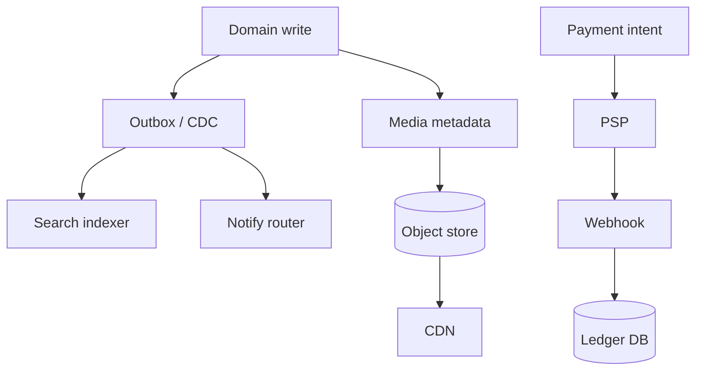
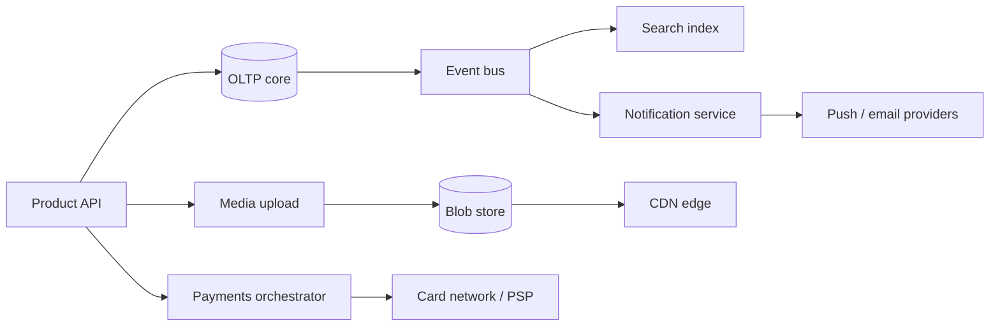
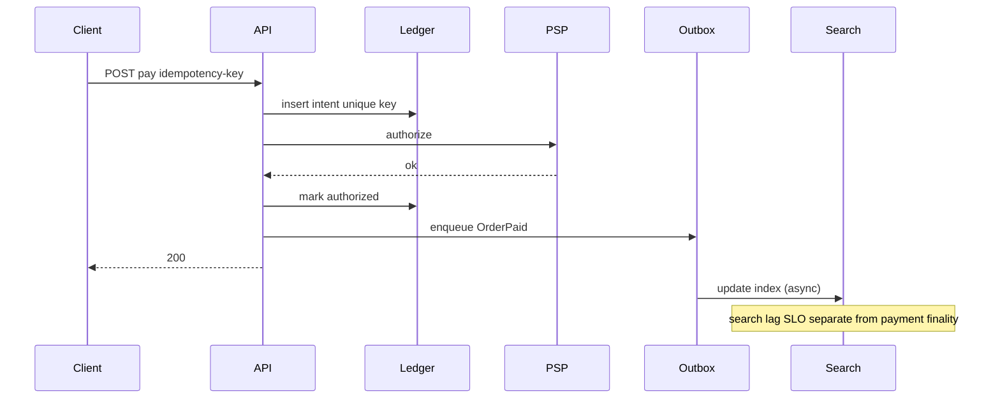

# Search Notify Media and Payments Topology Sketches

## Overview

Four recurring product planes—**search indexing**, **notifications**, **media delivery**, and **payments**—appear inside almost every large consumer or B2B system. Each has a distinct capacity shape, consistency contract, and failure blast radius. This note sketches **reference topologies** and how they compose with URL shortener, feed, and chat designs rather than deep-diving one product.

Hand off: payment ledger ACID → [[08-Databases/README|Databases]]; CDN config platforms → [[16-DevOps/README|DevOps]]; domain modularity → [[17-Architecture/README|Architecture]].

## Learning Objectives

- Draw four topologies with explicit sync vs async boundaries
- State user-visible consistency for search freshness, notify delivery, media availability, payment finality
- Estimate rough capacity drivers per plane
- Avoid coupling payments or media upload to feed fan-out paths
- Produce TypeScript ADR stubs for outbox-driven index and payment intents

## Prerequisites

- [[09-System-Design/06-Messaging-Streams-and-Async-Topologies/Queue vs Log vs Pub-Sub Topology Choice|Queue vs Log vs Pub-Sub]]
- [[09-System-Design/03-Consistency-Models-and-CAP/Choosing Consistency from User-Visible Invariants|User-Visible Invariants]]
- [[09-System-Design/07-Multi-Region-and-Geo/Failover RPO RTO and Split-Brain Product Policy|Failover RPO RTO]]
- [[09-System-Design/01-Capacity-Latency-and-Bottlenecks/Back-of-Envelope Capacity Estimation|Capacity Estimation]]
- [[09-System-Design/README|System Design]]

## Difficulty

`advanced`

## Estimated Time

- Reading: 2.5 hours
- Exercises: 2.5 hours
- Mini project: 5 hours

## History

Monoliths indexed in-process, emailed synchronously, stored blobs on app disks, and charged cards in the request thread. Scale forced **CQRS-ish search**, **notification preference + fan-out**, **object storage + CDN**, and **payment orchestrators** with idempotent intents—each with its own SLO.

## Problem It Solves

- Search results that **lie forever** after writes (no index pipeline)
- Notification storms without preference/bulkheads
- Origin bandwidth melted by media without CDN
- Double-charges from naive payment retries

## Capacity Back-of-Envelope Sketches

| Plane | Driver | Sketch |
| --- | --- | --- |
| Search | docs indexed / queries QPS | 10M writes/day → ~100 index updates/s; 5k query QPS → replica search cluster |
| Notify | events × channel fan-out | 50M events/day × 1.2 channels ≈ busy queue; push provider rate limits dominate |
| Media | bytes egress | 1M uploads/day × 2 MB × 100 views → CDN must absorb; origin only on miss |
| Payments | intents / captures | Low QPS (hundreds–thousands) but **zero ambiguity** on money |

Rule: **QPS does not equal risk**. Payments are write-light and consistency-heavy; media is bandwidth-heavy and consistency-light on bytes (immutable objects).

## Internal Implementation

### Search

Source of truth DB → outbox/CDC → indexer → search engine. Queries never mutate primary. Freshness SLO: e.g. p99 index lag < 60s.

### Notifications

Event → preference service → template → channel adapters (push/email/SMS/in-app) with per-user rate limits and quiet hours. Dedup keys mandatory.

### Media

Client → upload API (presigned URL) → object store → async transcoder → CDN. Metadata in DB; bytes never through app forever.

### Payments

API → **Payment Intent** (idempotency key) → PSP → webhooks → ledger update. State machine: `created → authorized → captured | voided`.



## Mermaid Diagrams

### Structure — composed product sketch



### Sequence — payment intent + search eventual



## Consistency and Failure Contract

| Plane | Success meaning | Failure / degradation |
| --- | --- | --- |
| Search | Queryable; may lag | Stale results OK within SLO; rebuild from source |
| Notify | Best-effort per channel after preference check | Drop low-priority; never block checkout |
| Media | Object immutable after commit; CDN TTL | Serve stale encode; retry transcoder |
| Payments | **Exactly-once business effect** via idempotent intent | Ambiguous PSP timeout → reconcile job, not blind retry charge |

Payments PACELC: choose **C** over latency. Search/notify: **L** / eventual. See [[09-System-Design/03-Consistency-Models-and-CAP/CAP and PACELC as Product Constraints|CAP and PACELC]].

## Examples

### Minimal Example — idempotency key

```typescript
export function paymentIntentId(userId: string, orderId: string): string {
  return `pay_${userId}_${orderId}`;
}
```

### Production-Shaped Example — ADR sketches

```typescript
/**
 * ADR-010 Search: CDC/outbox → indexer; queries hit search replicas only.
 * ADR-011 Notify: at-least-once with dedupeKey; shed marketing before transactional.
 * ADR-012 Media: presigned PUT; app stores metadata + content hash only.
 * ADR-013 Payments: intent row unique(idempotency_key); webhook is source of capture truth.
 */

export type OutboxEvent = {
  id: string;
  type: "EntityUpserted" | "OrderPaid" | "MediaReady";
  payload: unknown;
  createdAt: number;
};

export type PaymentIntent = {
  idempotencyKey: string;
  state: "created" | "authorized" | "captured" | "failed";
  amountCents: number;
};

export function transitionPay(p: PaymentIntent, event: "authorize_ok" | "capture_ok" | "fail"): PaymentIntent {
  if (event === "authorize_ok" && p.state === "created") return { ...p, state: "authorized" };
  if (event === "capture_ok" && p.state === "authorized") return { ...p, state: "captured" };
  if (event === "fail") return { ...p, state: "failed" };
  return p; // illegal transitions ignored / logged
}

export function shouldIndexLagAlert(lagSeconds: number, slo = 60): boolean {
  return lagSeconds > slo;
}
```

## Trade-offs

| Plane choice | Upside | Downside | When it matters |
| --- | --- | --- | --- |
| Sync index on write | Immediate search | Write latency / availability coupling | small catalogs |
| Async index | Decoupled | Stale search | default at scale |
| In-app media proxy | Simple auth | Bandwidth cliff | never at CDN scale |
| Presigned upload | Scales | Client complexity / abuse | production default |
| Direct PSP from client | Less backend | Weaker ledger control | usually avoid |

### When to Use These Sketches

- Any product with discovery, alerts, blobs, or money

### When Not to Use

- Collapsing all four into one "event service" without bulkheads ([[09-System-Design/09-Failure-Modes-at-Product-Scale/Zone and Fleet Bulkheads|Fleet Bulkheads]])

## Exercises

1. Set search lag SLO and notification priority tiers for an e-commerce checkout.
2. Draw blast radius if the notification provider is down during a payment capture.
3. Size CDN vs origin for 10 PB egress / month.
4. Design webhook reconciliation when capture response is lost.
5. Map each plane to queue vs log vs pubsub ([[09-System-Design/06-Messaging-Streams-and-Async-Topologies/Queue vs Log vs Pub-Sub Topology Choice|Topology Choice]]).

## Mini Project

One-page ADRs for all four planes for a fictional marketplace; include capacity table and failure matrix.

## Portfolio Project

Compose with [[09-System-Design/12-Clone-Case-Studies-and-Portfolio/Jira Clone Search Consistency and Workflow Topology|Jira Clone]] (search) and [[09-System-Design/12-Clone-Case-Studies-and-Portfolio/Netflix Clone Catalog Playback and CDN|Netflix Clone]] (media).

## Interview Questions

1. How does search stay consistent enough with OLTP?
2. Notification architecture for millions of users?
3. Why presigned uploads?
4. How do you prevent double charge?
5. Which plane can be eventually consistent and which cannot?

### Stretch / Staff-Level

1. Multi-region payments with regulatory data residency.
2. Search index dual-write windows during engine migration ([[09-System-Design/04-Partitioning-Sharding-and-Placement/Resharding Rebalancing and Dual-Write Windows|Dual-Write Windows]]).

## Common Mistakes

- Calling search the system of record
- Retrying payment HTTP without idempotency keys
- Serving all media from application servers
- One shared queue for payments + marketing email

## Best Practices

- Outbox/CDC for search and notify; never dual-write blindly without a plan
- Bulkhead providers; feature-shed marketing notify first
- Immutable media objects addressed by hash
- Payment state machine + reconciliation jobs
- Separate SLOs per plane ([[09-System-Design/10-Observability-and-Control-Planes/SLIs SLOs Error Budgets for Multi-Service Systems|SLIs SLOs]])

## Summary

Search, notify, media, and payments are **four topologies** with different capacity and consistency physics. Compose them via events and bulkheads: money stays strongly intentional and idempotent; search and notify ride async freshness SLOs; media lives at the CDN. Use these sketches as templates when cloning products in module 12.

## Further Reading

- [[00-References/System Design/README|System Design References]]
- [[08-Databases/11-Modeling-and-Engine-Selection/PostgreSQL vs MongoDB vs Redis Decision Matrix|Engine Decision Matrix]]
- [[07-Backend/06-Reliability-and-Abuse-Resistance/Circuit Breakers and Bulkheads|Circuit Breakers and Bulkheads]]

## Related Notes

- [[09-System-Design/README|System Design]]
- [[09-System-Design/06-Messaging-Streams-and-Async-Topologies/Outbox at System Scale Cross-Service Contracts|Outbox at System Scale]]
- [[09-System-Design/11-Reference-Architectures/URL Shortener Design End-to-End|URL Shortener]]
- [[09-System-Design/11-Reference-Architectures/Read-Heavy vs Write-Heavy Template Matrices|Read-Heavy vs Write-Heavy Matrices]]
- [[09-System-Design/12-Clone-Case-Studies-and-Portfolio/GitHub Clone Storage Notifications and Scale Limits|GitHub Clone]]

## Progress Checklist

- [ ] Explained from first principles
- [ ] Drew at least one Mermaid diagram
- [ ] Implemented a minimal version
- [ ] Documented trade-offs and non-goals
- [ ] Completed exercises
- [ ] Practiced interview questions aloud
- [ ] Linked prerequisites and dependents
