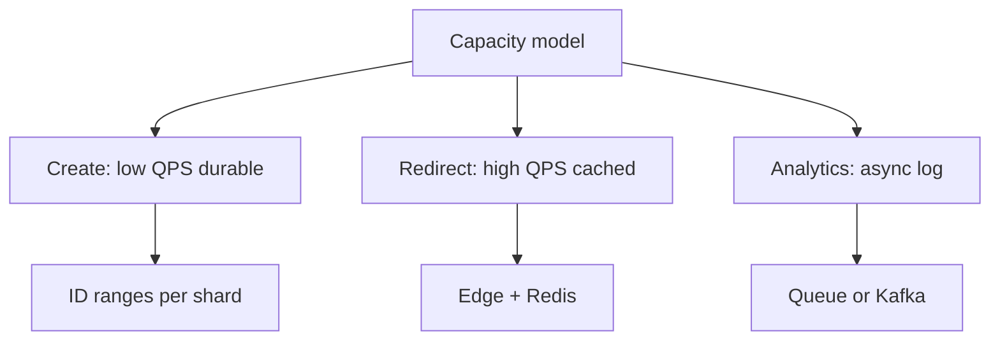
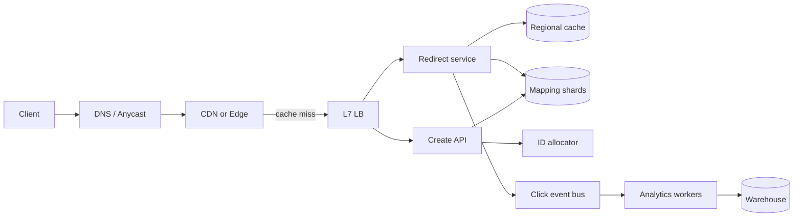
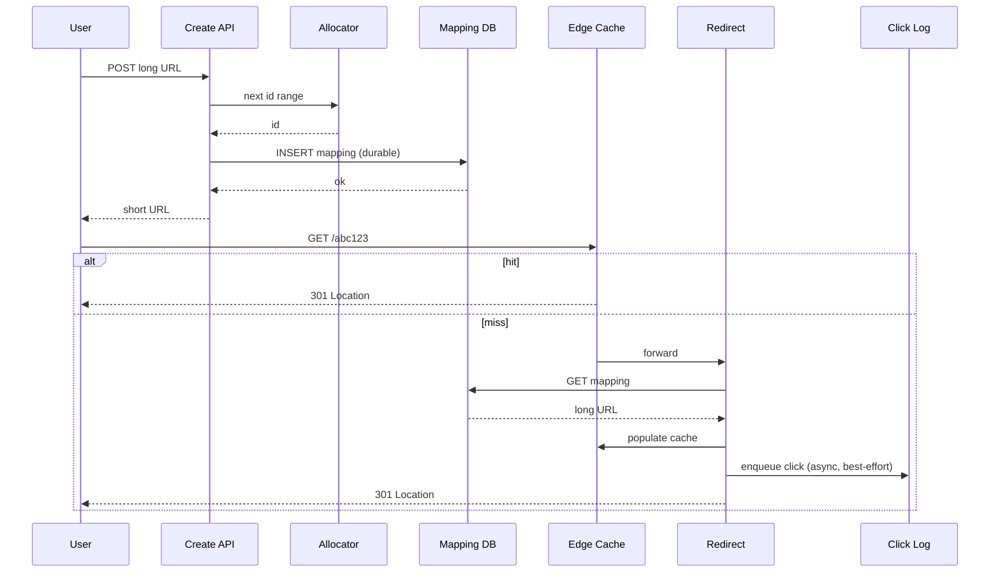

# URL Shortener Design End-to-End

## Overview

A **URL shortener** maps a short opaque code to a long destination URL, serves redirects at edge scale, and optionally records click analytics. It is the canonical **read-heavy, write-moderate** reference: tiny keys, enormous GET/redirect QPS, strict latency budgets on the redirect path, and a durable mapping store that must not lose codes once issued.

This note synthesizes capacity estimation, edge/LB entry, partitioning, caching, and multi-region policy into one production-shaped topology. Engine internals (B-trees, WAL) stay in [[08-Databases/README|Databases]]; client HTTP and outbox patterns stay in [[07-Backend/README|Backend]].

## Learning Objectives

- Estimate create vs redirect capacity and storage growth from explicit assumptions
- Choose key generation, partition key, and cache hierarchy without hot-shard traps
- State consistency/failure contracts for create, redirect, and analytics
- Sketch a TypeScript ADR for ID allocation and cache-aside redirect
- Defend trade-offs against feed, chat, and payments topologies in the same module

## Prerequisites

- [[09-System-Design/01-Capacity-Latency-and-Bottlenecks/Back-of-Envelope Capacity Estimation|Back-of-Envelope Capacity Estimation]]
- [[09-System-Design/02-Load-Balancing-and-Edge-Entry/Edge Admission Control and Global Traffic Steering|Edge Admission Control and Global Traffic Steering]]
- [[09-System-Design/04-Partitioning-Sharding-and-Placement/Partition Keys Hotspots and Skew|Partition Keys Hotspots and Skew]]
- [[09-System-Design/05-Caching-at-Product-Scale/Cache Hierarchies CDN Edge Regional App|Cache Hierarchies CDN Edge Regional App]]
- [[09-System-Design/README|System Design]]

## Difficulty

`intermediate`

## Estimated Time

- Reading: 2 hours
- Exercises: 2 hours
- Mini project: 4 hours

## History

Short links predate modern CDNs: early services used SQL `AUTO_INCREMENT` and single-region caches. Viral campaigns and global mobile traffic forced **pre-allocated ID ranges**, **edge redirect caches**, and **async analytics** so the redirect path never waits on a warehouse write.

## Problem It Solves

- **Redirect latency** blowing p99 when every hit goes to a primary DB
- **ID collisions** or sequential IDs leaking creation volume
- **Hot keys** when a celebrity link dominates one shard or cache node
- **Analytics coupling** that turns a 20 ms redirect into a 200 ms dependency chain

## Capacity Back-of-Envelope

Assumptions (interview-grade; adjust per product):

| Variable | Value | Notes |
| --- | --- | --- |
| Daily creates | 100M | write writes |
| Daily redirects | 10B | 100:1 read/write |
| Avg code + URL row | 500 B | metadata, expiry, owner |
| Retention | 5 years | active + cold archive |

Rough math:

- Creates: \(100\text{M}/86400 \approx 1{,}160\) QPS average; peak \(\times 3\)–\(5\) \(\approx 5\text{k}\) QPS
- Redirects: \(10\text{B}/86400 \approx 116\text{k}\) QPS average; peak \(\approx 500\text{k}\) QPS
- Storage year-1: \(100\text{M} \times 365 \times 500\text{B} \approx 18\) TB raw before indexes/replication
- Analytics events: same order as redirects → **must be async** (queue/log), not sync on redirect

Bottleneck intuition: redirect path is **network + cache**; create path is **ID allocator + durable write**; analytics is **ingest bandwidth**. See [[09-System-Design/01-Capacity-Latency-and-Bottlenecks/Bottleneck Finding CPU Memory Disk Network|Bottleneck Finding]].

## Internal Implementation

### Components

1. **API / create service** — auth, rate limits, validation, ID allocation, durable insert
2. **Redirect service** — resolve code → URL, emit click event, 301/302
3. **ID allocator** — Snowflake-style or pre-sharded ranges (avoid global `MAX(id)+1`)
4. **Mapping store** — partitioned KV or SQL by `hash(code)`
5. **Cache hierarchy** — CDN / edge → regional Redis → origin
6. **Analytics pipeline** — append-only log → workers → warehouse

Encoding: base62 of 64-bit ID → ~11 characters; custom aliases are a separate uniqueness domain.

### Capacity → Topology Mapping



## Mermaid Diagrams

### Structure — end-to-end topology



### Sequence — create then redirect with failure contract



## Consistency and Failure Contract

| Path | Guarantee | Failure behavior |
| --- | --- | --- |
| Create | Durable before return; unique code | On allocator/DB failure → 503; never return a code not persisted |
| Redirect | Read-your-writes for creator within region (sticky or primary read) | Cache miss → origin; origin down → 503 or stale edge TTL if policy allows |
| Custom alias | Strong uniqueness (conditional write / unique index) | Conflict → 409 |
| Click analytics | At-least-once eventual | Drop under overload after queue full; never block redirect |
| Multi-region | Active-passive mapping primary **or** region-local creates with global code namespace via allocator ranges | Failover per [[09-System-Design/07-Multi-Region-and-Geo/Failover RPO RTO and Split-Brain Product Policy|Failover RPO RTO]] |

PACELC: prefer **latency** on redirect (AP + cache), **consistency** on create (CP for uniqueness). See [[09-System-Design/03-Consistency-Models-and-CAP/CAP and PACELC as Product Constraints|CAP and PACELC]].

## Examples

### Minimal Example — base62 sketch

```typescript
const ALPHABET = "0123456789abcdefghijklmnopqrstuvwxyzABCDEFGHIJKLMNOPQRSTUVWXYZ";

export function encodeBase62(n: bigint): string {
  if (n === 0n) return ALPHABET[0];
  let x = n;
  let out = "";
  while (x > 0n) {
    out = ALPHABET[Number(x % 62n)] + out;
    x /= 62n;
  }
  return out;
}
```

### Production-Shaped Example — ADR-style allocator + cache-aside

```typescript
/**
 * ADR-001: Pre-allocated ID ranges per create-shard.
 * Rejected: global SQL sequence (single hotspot).
 * Rejected: random UUID in URL (longer, worse cache locality).
 */
export type IdRange = { shard: number; start: bigint; end: bigint; cursor: bigint };

export function allocate(range: IdRange): { id: bigint; range: IdRange } {
  if (range.cursor >= range.end) throw new Error("range exhausted — refill from coordinator");
  const id = range.cursor;
  return { id, range: { ...range, cursor: range.cursor + 1n } };
}

export type Mapping = { code: string; url: string; expiresAt?: number };

/** Redirect path: never await analytics. */
export async function resolveRedirect(
  code: string,
  cache: { get(k: string): Promise<string | null>; set(k: string, v: string, ttl: number): Promise<void> },
  db: { get(code: string): Promise<Mapping | null> },
  clicks: { offer(ev: { code: string; ts: number }): boolean },
): Promise<string | null> {
  const cached = await cache.get(code);
  if (cached) {
    clicks.offer({ code, ts: Date.now() }); // best-effort
    return cached;
  }
  const row = await db.get(code);
  if (!row) return null;
  await cache.set(code, row.url, 3600);
  clicks.offer({ code, ts: Date.now() });
  return row.url;
}
```

## Trade-offs

| Dimension | Upside | Downside | When it matters |
| --- | --- | --- | --- |
| Edge cache TTL | Absorbs viral spikes | Stale after update/revoke | mutable destinations |
| 301 vs 302 | 301 caches in browsers | Harder to reclaim / retarget | analytics, affiliate |
| Hash shards | Even create load | Celebrity code still hot on one key | need key-level replication / CDN |
| Sync analytics | Exact counts | Redirect SLO dies | never at peak QPS |
| Custom aliases | Branding | Hot uniqueness path | rate-limit + separate table |

### When to Use

- Mapping + redirect products, referral codes, internal link shorteners at web scale

### When Not to Use

- Treating shortener as general KV for large blobs (use object storage + CDN; see media notes)
- Strong global consistency on every redirect across regions

## Exercises

1. Recompute capacity for 1B creates/day and 50:1 read/write; identify new bottlenecks.
2. Design a revoke flow that invalidates edge + Redis without thundering herd ([[09-System-Design/05-Caching-at-Product-Scale/Hot Keys Stampede and Thundering Herd at Scale|Hot Keys Stampede]]).
3. Compare Snowflake IDs vs pre-allocated ranges for multi-region creates.
4. Write SLOs for create p99, redirect p99, and analytics lag.
5. Sketch partition key if custom aliases are case-insensitive and sharded.

## Mini Project

Implement a single-process TypeScript shortener: in-memory ranges, Map store, LRU cache, and a bounded click queue that drops under backpressure ([[09-System-Design/06-Messaging-Streams-and-Async-Topologies/Backpressure Consumer Lag and Load Shedding|Backpressure]]).

## Portfolio Project

Document full ADRs (ID, cache, multi-region) inside [[09-System-Design/projects/Distributed Systems Workbench/README|Distributed Systems Workbench]] and attach a capacity spreadsheet.

## Interview Questions

1. Walk through create and redirect paths; where do you put the cache?
2. How do you generate unique short codes without a single DB sequence?
3. What happens when one link gets 1M QPS?
4. 301 vs 302 — product and systems impact?
5. How do analytics stay accurate enough without blocking redirects?

### Stretch / Staff-Level

1. Active-active multi-region creates with zero code collision and bounded RPO on mapping failover.
2. Abuse: open redirects, malware URLs, and edge admission ([[09-System-Design/02-Load-Balancing-and-Edge-Entry/Edge Admission Control and Global Traffic Steering|Edge Admission]]).

## Common Mistakes

- Putting click writes on the redirect critical path
- Sequential public IDs enabling scraping and volume inference
- Single Redis node as the only redirect store (memory + availability cliff)
- Ignoring expiry/GC until storage is the outage

## Best Practices

- Separate **create**, **redirect**, and **analytics** SLOs
- Cache hierarchy with explicit TTL and purge API
- Allocator ranges with monitoring for exhaustion
- Load-shed clicks before shedding redirects ([[09-System-Design/09-Failure-Modes-at-Product-Scale/Graceful Degradation and Feature Shedding|Graceful Degradation]])

## Summary

A production URL shortener is a **capacity and caching problem** first: durable unique mapping on create, aggressively cached redirects, and async analytics. Partition by code hash, allocate IDs in ranges, and write failure contracts that protect the redirect SLO. Cross-check consistency choices against [[09-System-Design/03-Consistency-Models-and-CAP/Choosing Consistency from User-Visible Invariants|User-Visible Invariants]] and multi-region policy against module 07.

## Further Reading

- [[00-References/System Design/README|System Design References]]
- [[09-System-Design/11-Reference-Architectures/Read-Heavy vs Write-Heavy Template Matrices|Read-Heavy vs Write-Heavy Template Matrices]]
- [[08-Databases/10-Redis-and-In-Memory-Engines/Redis as Cache vs Primary Store|Redis as Cache vs Primary Store]]

## Related Notes

- [[09-System-Design/README|System Design]]
- [[09-System-Design/01-Capacity-Latency-and-Bottlenecks/Cost Performance and Capacity Trade-offs|Cost Performance and Capacity Trade-offs]]
- [[09-System-Design/04-Partitioning-Sharding-and-Placement/Range Hash and Directory-Based Sharding|Range Hash and Directory-Based Sharding]]
- [[09-System-Design/05-Caching-at-Product-Scale/When Caching Lies Read-Your-Writes Cross-Region|When Caching Lies]]
- [[09-System-Design/07-Multi-Region-and-Geo/Replica Lag as User-Facing Consistency Budget|Replica Lag as User-Facing Consistency Budget]]
- [[09-System-Design/12-Clone-Case-Studies-and-Portfolio/Netflix Clone Catalog Playback and CDN|Netflix Clone Catalog Playback and CDN]]

## Progress Checklist

- [ ] Explained from first principles
- [ ] Drew at least one Mermaid diagram
- [ ] Implemented a minimal version
- [ ] Documented trade-offs and non-goals
- [ ] Completed exercises
- [ ] Practiced interview questions aloud
- [ ] Linked prerequisites and dependents
