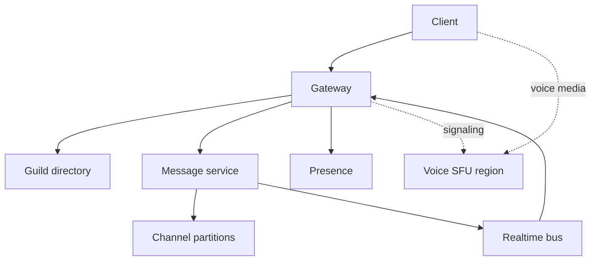
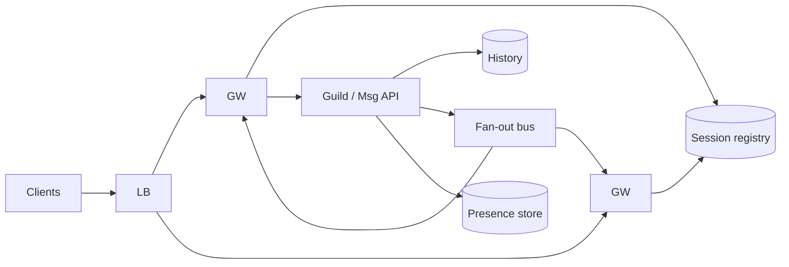
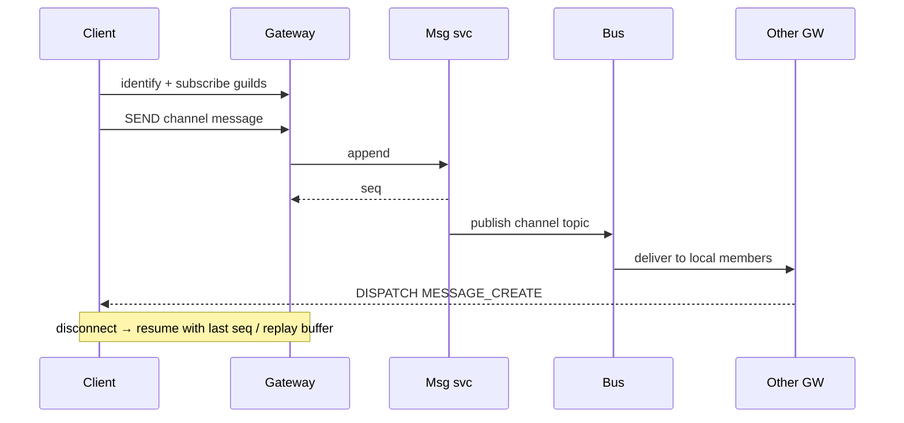

# Discord Clone Realtime Fan-out and Presence

## Overview

A **Discord-class clone** centers on **guild/server membership**, many channels, persistent history, **gateway WebSockets**, large-room fan-out, and **presence** at millions of concurrent connections. Voice/video SFU design is sketched only at the boundary; the portfolio core is **realtime message + presence topology**.

Synthesizes chat reference architecture with connection drain, partitioning for hot channels, and multi-region guild affinity.

## Learning Objectives

- Size gateway fleets and fan-out for large guilds
- Preserve per-channel ordering while scaling guild membership
- Design presence at fleet scale with lease churn budgets
- Define failure contracts for gateway drain and bus partitions
- Produce TypeScript simulation sketches for routing and presence

## Prerequisites

- [[09-System-Design/11-Reference-Architectures/Chat Presence Typing and Message Ordering|Chat Presence Typing]]
- [[09-System-Design/08-Coordination-Consensus-and-Locks/Clocks Skew Ordering and Happens-Before|Clocks Skew Ordering]]
- [[09-System-Design/04-Partitioning-Sharding-and-Placement/Partition Keys Hotspots and Skew|Partition Keys Hotspots]]
- [[09-System-Design/07-Multi-Region-and-Geo/Multi-Region Active-Passive Active-Active Patterns|Multi-Region Patterns]]
- [[09-System-Design/README|System Design]]

## Difficulty

`advanced`

## Estimated Time

- Reading: 2.5 hours
- Exercises: 3 hours
- Mini project: 8 hours

## History

IRC-style communities moved to always-on mobile sockets. Discord-like systems popularized **a single gateway connection per client** multiplexing many channels, with server-side fan-out and separate voice regions—optimizing for huge membership lists that most users never scroll fully.

## Problem It Solves

- Naive per-channel TCP connections exploding client and server state
- Hot guild announcements fan-out to hundreds of thousands online
- Presence updates from every mobile network blip saturating the bus
- Rolling deploys dropping messages without resume tokens

## Capacity Back-of-Envelope

| Variable | Value |
| --- | --- |
| Concurrent GW connections | 15M |
| State / connection | 8–16 KB |
| Guilds | 50M |
| Large guild online members p99 | 50k |
| Messages / sec cluster-wide peak | 200k |
| Presence updates / sec | millions if unaggregated |

Gateway RAM order: \(15\text{M} \times 12\text{KB} \approx 180\) GB → hundreds of GW nodes. Large-room fan-out: one message × 50k sockets ⇒ **topic sharding + tree fan-out** or membership sampling for non-critical events.

Presence: heartbeat every 30–60s; **aggregate** status by guild rather than broadcast every typing-equivalent event globally.

## Internal Implementation

1. **Gateway layer** — sticky sessions; resume tokens; zlib stream optional
2. **Guild directory** — membership, roles, channel list (control plane)
3. **Channel message partitions** — total order per channel
4. **Realtime bus** — guild/channel topics; GW subscribe set
5. **Presence service** — leases + guild online sets (approximate OK)
6. **Push** — offline DM/mention path
7. **Voice edge** (sketch) — separate region UDP/SFU; signaling via GW



## Mermaid Diagrams

### Structure — Discord-clone topology



### Sequence — guild message fan-out + resume



## Consistency and Failure Contract

| Concern | Contract |
| --- | --- |
| Channel messages | Durable + monotonic seq before ACK; at-least-once to GW with client dedupe |
| Guild membership change | Strong enough that unauthorized users lose subscribe ASAP (revoke) |
| Presence | Approximate; grace period; false offline preferred |
| Typing | Best-effort; shed first |
| GW drain | Stop new sessions; resume handoff; in-flight replay buffer TTL |
| Hot guild | Slow-mode / rate limits; collapse presence; do not block smaller guilds ([[09-System-Design/09-Failure-Modes-at-Product-Scale/Zone and Fleet Bulkheads|Bulkheads]]) |

## Examples

### Minimal Example — resume window

```typescript
export function canResume(lastSeq: number, bufferStart: number, bufferEnd: number): boolean {
  return lastSeq >= bufferStart && lastSeq <= bufferEnd;
}
```

### Production-Shaped Example — ADR + routing sketch

```typescript
/**
 * ADR-DC-01: One multiplexed GW connection per client; server tracks guild subscriptions.
 * ADR-DC-02: Per-channel leader/partition for seq; guild bus for fan-out.
 * ADR-DC-03: Presence leases 45s; guild online set sharded by guild_id.
 */

export type GatewaySession = {
  userId: string;
  guildIds: string[];
  lastAckSeq: number;
};

export function shouldFanoutToGateway(
  session: GatewaySession,
  guildId: string,
  channelGuildId: string,
): boolean {
  return channelGuildId === guildId && session.guildIds.includes(guildId);
}

export type PresenceAgg = { guildId: string; onlineApprox: number; updatedAt: number };

export function bumpOnline(agg: PresenceAgg, delta: number, now: number): PresenceAgg {
  return { ...agg, onlineApprox: Math.max(0, agg.onlineApprox + delta), updatedAt: now };
}
```

## Trade-offs

| Dimension | Upside | Downside | When it matters |
| --- | --- | --- | --- |
| Multiplexed GW | Fewer conns | Fat sessions / blast on GW loss | always |
| Exact online lists | Nice UI | Cost at 50k+ | large guilds → approximate |
| Sync fan-out in Msg | Simple | Couples durability to sockets | use bus |
| Voice colocated | Low latency | Ops complexity | regional SFU |

### When to Use

- Community chat, gaming social, large rooms

### When Not to Use

- 1:1 SMS-style only (simpler chat ref is enough)
- Feed products (wrong fan-out model)

## Exercises

1. Size GW nodes for 20M conns at 10 KB with 40% headroom.
2. Design slow-mode and priority for @everyone in a 200k guild.
3. Drain playbook: 10% GW fleet per 10 minutes ([[09-System-Design/02-Load-Balancing-and-Edge-Entry/Health Checks Drain and Connection Management|Drain]]).
4. Compare pubsub vs log for channel fan-out.
5. Multi-region: guild home region vs global roaming users.

## Mini Project

Simulate N gateways, guild subscriptions, and message fan-out CPU; plot cost vs guild size.

## Portfolio Project

Full Discord-clone design doc + chaos: kill GW under load; prove resume. Link [[09-System-Design/projects/Distributed Systems Workbench/README|Workbench]].

## Interview Questions

1. How does a client receive messages from 200 channels on one socket?
2. Order guarantees?
3. Presence at millions of users?
4. What happens when a gateway crashes?
5. How are very large servers special-cased?

### Stretch / Staff-Level

1. Authorization caching vs revoke latency for banned users.
2. Cross-region voice with split signaling/media.

## Common Mistakes

- Broadcasting all presence globally
- No resume → reconnect storms ([[09-System-Design/05-Caching-at-Product-Scale/Hot Keys Stampede and Thundering Herd at Scale|Herd]] related pattern)
- Ordering by client time
- Sharing one bus topic for all guilds (hot partition)

## Best Practices

- Subscribe-set fan-out; topic cardinality planning
- Shed typing/presence before message dispatch
- Explicit fencing on channel partition failover
- SLIs: GW connect success, dispatch lag, resume success rate ([[09-System-Design/10-Observability-and-Control-Planes/SLIs SLOs Error Budgets for Multi-Service Systems|SLIs]])

## Summary

A Discord clone is a **gateway and fan-out** problem wrapped around ordered channel logs. Multiplex connections, partition messages per channel, approximate presence, and bulkhead large guilds. Voice is a separate media plane; do not conflate it with message durability.

## Further Reading

- [[00-References/System Design/README|System Design References]]
- [[09-System-Design/09-Failure-Modes-at-Product-Scale/Cascading Multi-Service Failure|Cascading Failure]]
- [[09-System-Design/08-Coordination-Consensus-and-Locks/Distributed Locks Leases and Fencing Tokens|Fencing Tokens]]

## Related Notes

- [[09-System-Design/README|System Design]]
- [[09-System-Design/11-Reference-Architectures/Chat Presence Typing and Message Ordering|Chat Reference]]
- [[09-System-Design/11-Reference-Architectures/Feed Timeline Fan-out Push Pull Hybrid|Feed Fan-out]] (contrast)
- [[09-System-Design/12-Clone-Case-Studies-and-Portfolio/Instagram Clone Capacity and Media Plane|Instagram Clone]]
- [[09-System-Design/12-Clone-Case-Studies-and-Portfolio/GitHub Clone Storage Notifications and Scale Limits|GitHub Clone]]

## Progress Checklist

- [ ] Explained from first principles
- [ ] Drew at least one Mermaid diagram
- [ ] Implemented a minimal version
- [ ] Documented trade-offs and non-goals
- [ ] Completed exercises
- [ ] Practiced interview questions aloud
- [ ] Linked prerequisites and dependents
