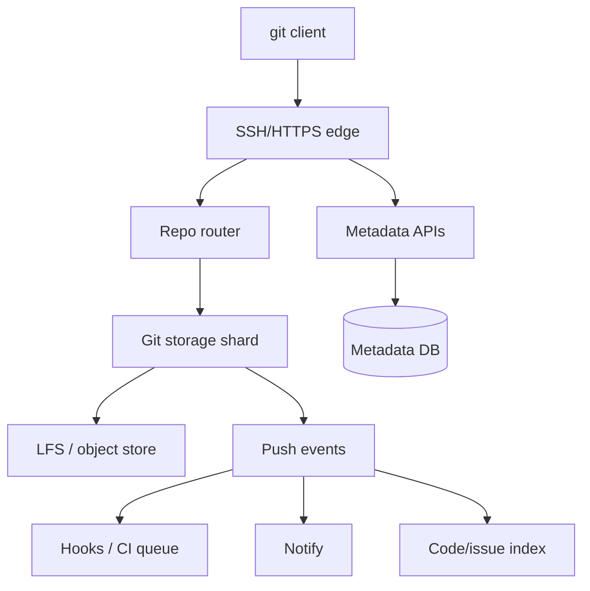
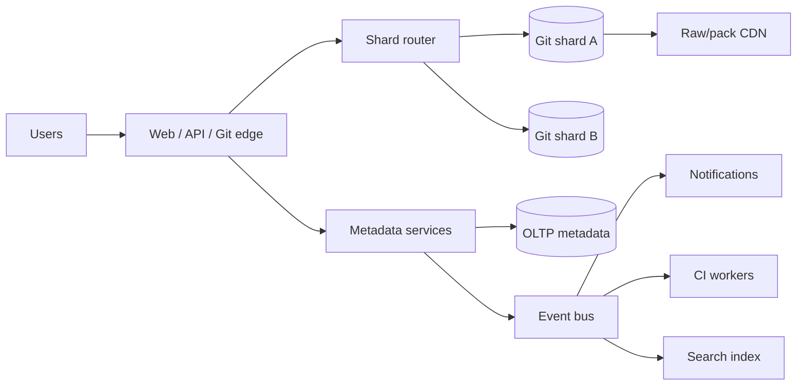
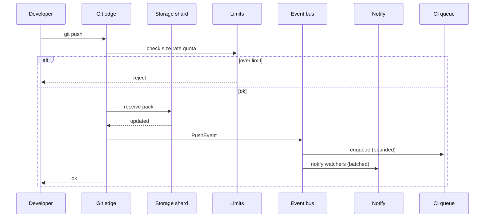

# GitHub Clone Storage Notifications and Scale Limits

## Overview

A **GitHub-class clone** hosts **Git repositories**, pull requests, issues, Actions-like CI, packages, and **notification** fan-out for watches/mentions. The differentiating systems problem is **Git object storage and packfile serving** under extreme skew (linux.git vs empty repos), plus **metadata** services that look like a Jira/social hybrid.

This case study focuses on **storage topology**, **scale limits** (repo size, LFS, rate limits), and **notification** design—tying capacity, partitioning, messaging, and caching together for portfolio depth.

## Learning Objectives

- Separate Git data plane from metadata control plane
- Estimate storage and pack bandwidth under celebrity repos
- Place limits (size, push rate, hooks) as product bulkheads
- Design watch/mention notifications without coupling to `git push`
- Produce TypeScript ADR sketches for shard routing and notify dedupe

## Prerequisites

- [[09-System-Design/11-Reference-Architectures/Read-Heavy vs Write-Heavy Template Matrices|Read-Heavy vs Write-Heavy Matrices]]
- [[09-System-Design/06-Messaging-Streams-and-Async-Topologies/Fan-out Broadcast and Notification Architectures|Fan-out Broadcast]]
- [[09-System-Design/05-Caching-at-Product-Scale/Cache Hierarchies CDN Edge Regional App|Cache Hierarchies]]
- [[09-System-Design/09-Failure-Modes-at-Product-Scale/Zone and Fleet Bulkheads|Zone and Fleet Bulkheads]]
- [[09-System-Design/README|System Design]]

## Difficulty

`advanced`

## Estimated Time

- Reading: 2.5 hours
- Exercises: 3 hours
- Mini project: 8 hours

## History

Early Git hosts put repos on NFS near app servers. Monoliths and mega-repos forced **sharded storage**, **pack caching**, **LFS** for large binaries, and async workers for webhooks/CI. Notifications became a dedicated plane when every push emailed thousands of watchers synchronously.

## Problem It Solves

- One noisy repo exhausting shared disk or CPU
- `git clone` of huge histories melting edge without pack cache
- Webhooks/CI storms on push
- Metadata search drifting from repo state
- Unbounded notification fan-out on popular repos

## Capacity Back-of-Envelope

| Variable | Value |
| --- | --- |
| Repositories | 200M |
| Push QPS peak | 10k |
| Clone/fetch bandwidth peak | multi-Tbps with CDN/pack cache |
| Avg repo size | tens of MB; p99.9 → tens of GB+ |
| Watchers on hot repo | 100k+ |

Storage: not "200M × avg" alone—**heavy tail** dominates disks and backup windows. Fetch traffic is **read-heavy** on packs; pushes are **write-heavy** on specific shards.

Scale limits (product + systems): max repo size, max LFS quota, max refs push, concurrent jobs per org—these are **bulkheads**, not afterthoughts.

## Internal Implementation

### Planes

1. **AuthN/Z + routing** — map `owner/repo` → storage shard
2. **Git storage nodes** — bare repos / object stores; pack generation
3. **LFS store** — large blobs in object storage + CDN
4. **Metadata DB** — issues, PRs, permissions, stars
5. **Search** — code search / issues via indexers (outbox)
6. **Notifications** — watch, assign, CI status; async
7. **Hooks / CI** — queue per repo with concurrency caps
8. **CDN / edge cache** — public pack/raw content where allowed



## Mermaid Diagrams

### Structure — GitHub-clone topology



### Sequence — push → limits → notify



## Consistency and Failure Contract

| Concern | Contract |
| --- | --- |
| Git refs update | Atomic ref update on storage node; push ACK ⇒ durable objects needed for refs |
| PR/issue metadata | OLTP strong; may reference SHAs that exist after push event ordering |
| Code search | Eventual; lag after push |
| Notifications | At-least-once, batched; shed marketing-like digests first |
| Webhooks | At-least-once with signed payloads; customer endpoint failures isolated |
| Shard outage | Repos on shard unavailable; others healthy (bulkhead) |
| Celebrity repo | Dedicated shard / higher tier; rate limits protect neighbors |

Do not claim linearizability of "web UI stars count" with Git refs; separate planes. Multi-region: repo home shard affinity ([[09-System-Design/04-Partitioning-Sharding-and-Placement/Data Locality Geo Placement and Affinity|Data Locality Geo Placement]]).

## Examples

### Minimal Example — soft limit

```typescript
export function assertRepoSize(bytes: number, maxBytes: number): void {
  if (bytes > maxBytes) throw new Error("repository size limit exceeded");
}
```

### Production-Shaped Example — ADR + routing sketch

```typescript
/**
 * ADR-GH-01: Repo routing table owner/repo → shard; reshard with read-only window.
 * ADR-GH-02: Push path enforces size/rate limits before hook fan-out.
 * ADR-GH-03: Notifications batched per user; never sync SMTP on push thread.
 * ADR-GH-04: CI concurrency cap per repo/org; queue with lag SLO.
 */

export type RepoId = { owner: string; name: string };

export function shardFor(repo: RepoId, shardCount: number): number {
  const key = `${repo.owner}/${repo.name}`;
  let h = 0;
  for (let i = 0; i < key.length; i++) h = (h * 31 + key.charCodeAt(i)) >>> 0;
  return h % shardCount;
}

export type PushLimits = { maxBytes: number; maxPushesPerHour: number };

export function acceptPush(
  sizeBytes: number,
  pushesLastHour: number,
  limits: PushLimits,
): boolean {
  return sizeBytes <= limits.maxBytes && pushesLastHour < limits.maxPushesPerHour;
}

export function notifyBatchKey(userId: string, windowMin: number, nowMs: number): string {
  return `${userId}:${Math.floor(nowMs / (windowMin * 60_000))}`;
}
```

## Trade-offs

| Dimension | Upside | Downside | When it matters |
| --- | --- | --- | --- |
| Many small shards | Blast radius | Ops / routing complexity | noisy neighbors |
| CDN public packs | Clone speed | Cache invalidation / auth | public repos |
| Sync webhooks | Instant integrations | Push latency / abuse | prefer async |
| Soft limits | Protect fleet | Power-user friction | enterprise tiers |

### When to Use

- Git hosting portfolios; "design GitHub" interviews

### When Not to Use

- Generic file share without Git semantics
- Applying Instagram fan-out math to `git fetch`

## Exercises

1. Place linux-scale repo: dedicated shard, LFS policy, clone cache.
2. Resharding plan when shard disk at 80% ([[09-System-Design/04-Partitioning-Sharding-and-Placement/Resharding Rebalancing and Dual-Write Windows|Resharding]]).
3. Notification matrix: push vs mention vs CI failure priorities.
4. Outage playbook: single shard disk failure.
5. Compare code search freshness vs issue search (Jira note).

## Mini Project

Write scale-limit policy table + shard routing ADR + notify batching design for portfolio.

## Portfolio Project

Simulate shard heat and push rejects; hook queue lag under thundering CI. Workbench integration.

## Interview Questions

1. How do you store and serve Git data at scale?
2. What happens on `git push` end-to-end?
3. How do notifications scale for a popular repo?
4. Why soft/hard limits?
5. How is metadata related to Git objects?

### Stretch / Staff-Level

1. Monorepo partial clone / sparse checkout support impact on edge.
2. Multi-region active-active Git (usually avoided—explain why).

## Common Mistakes

- Shared NFS for all repos without isolation
- Synchronous watcher email on push
- Unlimited CI concurrency per push
- Using search as proof of push success

## Best Practices

- Shard + noisy-neighbor limits as first-class
- Async hooks/notify/index from push events
- Pack/CDN caching for public read path
- Explicit RPO for storage backups ([[09-System-Design/07-Multi-Region-and-Geo/Failover RPO RTO and Split-Brain Product Policy|RPO RTO]])
- Observe shard disk, push reject rate, notify lag, CI queue depth ([[09-System-Design/10-Observability-and-Control-Planes/Cardinality and Metric Topology Risks|Metric Topology]])

## Summary

A GitHub clone is **skewed storage + async side effects**. Git shards and limits protect the fleet; metadata and search follow OLTP/outbox patterns; notifications and CI must be queued and capped. Celebrity repositories define your real capacity story—averages lie.

## Further Reading

- [[00-References/System Design/README|System Design References]]
- [[09-System-Design/01-Capacity-Latency-and-Bottlenecks/Cost Performance and Capacity Trade-offs|Cost Performance]]
- [[09-System-Design/11-Reference-Architectures/URL Shortener Design End-to-End|URL Shortener]] (contrast small-key read-heavy)

## Related Notes

- [[09-System-Design/README|System Design]]
- [[09-System-Design/11-Reference-Architectures/Search Notify Media and Payments Topology Sketches|Search Notify Media Payments]]
- [[09-System-Design/12-Clone-Case-Studies-and-Portfolio/Jira Clone Search Consistency and Workflow Topology|Jira Clone]]
- [[09-System-Design/12-Clone-Case-Studies-and-Portfolio/Discord Clone Realtime Fan-out and Presence|Discord Clone]]
- [[09-System-Design/12-Clone-Case-Studies-and-Portfolio/Netflix Clone Catalog Playback and CDN|Netflix Clone]]
- [[09-System-Design/04-Partitioning-Sharding-and-Placement/Partition Keys Hotspots and Skew|Hotspots and Skew]]

## Progress Checklist

- [ ] Explained from first principles
- [ ] Drew at least one Mermaid diagram
- [ ] Implemented a minimal version
- [ ] Documented trade-offs and non-goals
- [ ] Completed exercises
- [ ] Practiced interview questions aloud
- [ ] Linked prerequisites and dependents
