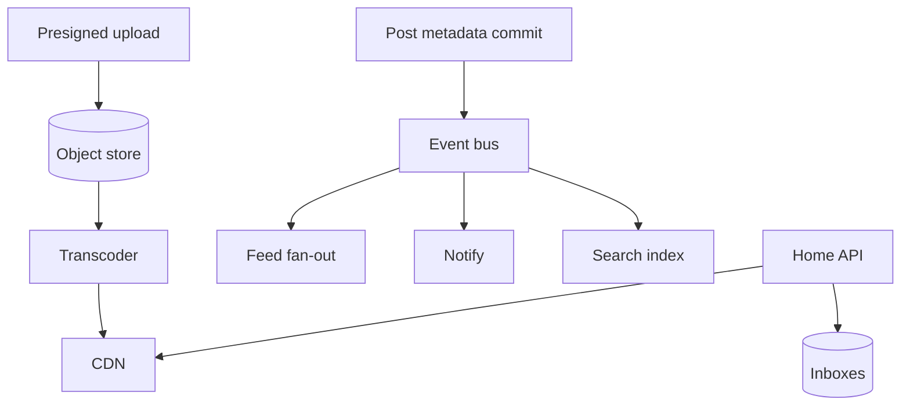
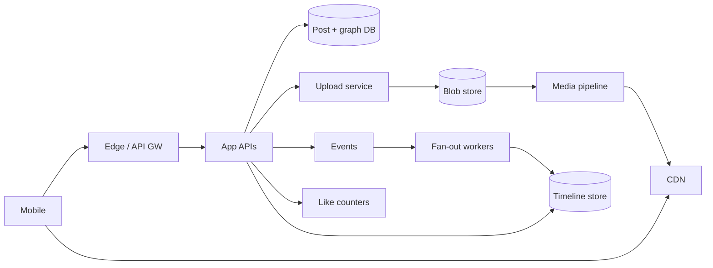
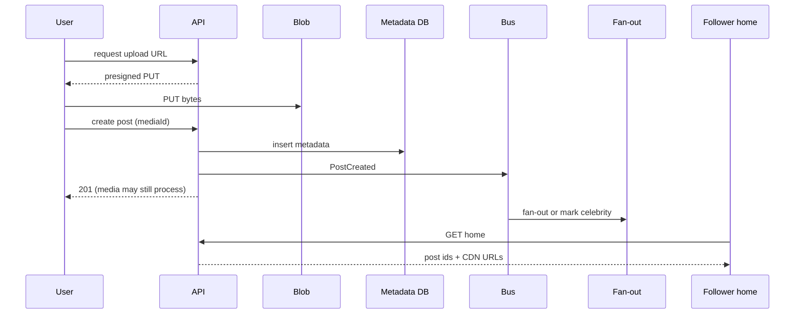

# Instagram Clone Capacity and Media Plane

## Overview

An **Instagram-class clone** combines a hybrid **home feed**, a **media plane** (upload → object store → variants → CDN), social graph, likes/comments, and notifications. This case study synthesizes capacity estimation, feed fan-out, caching, and media topology into a portfolio-grade design—not a pixel-perfect Instagram replica.

Focus: **bytes and feed write amplification** dominate cost; likes are high-QPS counters with weaker consistency.

## Learning Objectives

- Produce a coherent capacity sheet for users, posts, media bytes, and feed fan-out
- Separate media byte path from metadata/feed path with clear SLOs
- Apply hybrid push/pull to follow graphs with influencer skew
- State consistency for upload visibility, feed freshness, and like counts
- Deliver TypeScript ADR sketches suitable for a portfolio write-up

## Prerequisites

- [[09-System-Design/11-Reference-Architectures/Feed Timeline Fan-out Push Pull Hybrid|Feed Fan-out Hybrid]]
- [[09-System-Design/11-Reference-Architectures/Read-Heavy vs Write-Heavy Template Matrices|Read-Heavy vs Write-Heavy Matrices]]
- [[09-System-Design/05-Caching-at-Product-Scale/Cache Hierarchies CDN Edge Regional App|Cache Hierarchies]]
- [[09-System-Design/04-Partitioning-Sharding-and-Placement/Partition Keys Hotspots and Skew|Partition Keys Hotspots]]
- [[09-System-Design/README|System Design]]

## Difficulty

`advanced`

## Estimated Time

- Reading: 2.5 hours
- Exercises: 3 hours
- Mini project: 8 hours (portfolio doc)

## History

Photo apps shifted from app-server disk to **S3 + CDN + async image pipelines** as mobile cameras and Stories multiplied object counts. Feed fan-out lessons from Twitter applied directly; media egress became the bill that forced CDN-first design.

## Problem It Solves

- Designing "Instagram" as a single SQL table of images
- Coupling upload HTTP to feed fan-out completion
- Underestimating storage/egress vs compute
- Treating like counters as strongly consistent finance-grade data

## Capacity Back-of-Envelope

Assumptions (interview portfolio scale):

| Variable | Value |
| --- | --- |
| MAU | 500M |
| DAU | 100M |
| Posts / DAU / day | 0.2 → 20M posts/day |
| Avg original image | 2 MB |
| Derived variants | 3 × 0.3 MB ≈ 0.9 MB |
| Follow graph avg | 200 |
| Celebrity threshold T | 10k followers |
| Home opens / DAU / day | 15 |
| Likes / post avg | 50 |

Media ingest/day: \(20\text{M} \times 2\text{MB} \approx 40\) TB originals (+ variants). Egress: if each post viewed 200 times via CDN, egress ≫ origin.

Feed: hybrid push writes ≈ posts below T × followers; celebs pull. Likes: \(20\text{M} \times 50 = 1\text{B}\)/day → counter service / Redis, async to OLTP.

## Internal Implementation

### Planes

1. **Identity + graph** — users, follow edges, celebrity flag
2. **Post metadata** — caption, media IDs, author, privacy
3. **Media plane** — presigned upload, virus scan, transcoder, CDN
4. **Feed plane** — hybrid fan-out + home merge
5. **Engagement** — likes/comments; counters eventual
6. **Notify** — async, preference-aware



## Mermaid Diagrams

### Structure — end-to-end Instagram-clone topology



### Sequence — post create to follower home



## Consistency and Failure Contract

| Action | Contract |
| --- | --- |
| Upload bytes | Object durable in blob store before post can be `active` |
| Post create | Metadata durable; media state `processing \| ready`; feed may wait for `ready` |
| Follower feed | Eventual; lag SLO e.g. 30s p99 for push users |
| Like count | Eventual; ±1 OK; owner RYW optional via sticky |
| Delete post | Tombstone metadata; CDN purge best-effort; inbox filter |
| Region outage | Serve CDN cached media; degrade home to following-tab pull |

Payments (if shopping) follow payments sketch—not eventual likes. See [[09-System-Design/11-Reference-Architectures/Search Notify Media and Payments Topology Sketches|Payments Topology]].

## Examples

### Minimal Example — media readiness gate

```typescript
export type MediaState = "uploaded" | "processing" | "ready" | "failed";

export function canShowInFeed(state: MediaState): boolean {
  return state === "ready";
}
```

### Production-Shaped Example — capacity + ADR sketch

```typescript
/**
 * ADR-IG-01: Presigned upload; app never streams bytes long-term.
 * ADR-IG-02: Hybrid feed with T=10_000; celebrity pull on home read.
 * ADR-IG-03: Likes as Redis counters + async durable samples; not in post row hot update.
 */

export function dailyIngestTb(posts: number, mbPerPost: number): number {
  return (posts * mbPerPost) / 1_000_000; // TB if mb is decimal MB-ish for interview math
}

export function estimatePushWrites(
  posts: { followers: number }[],
  t: number,
): number {
  return posts.reduce((s, p) => s + (p.followers < t ? p.followers : 0), 0);
}

export type HomeItem = { postId: string; cdnUrl: string; likeCount: number };

export function attachCdn(postId: string, variant: string, host: string): string {
  return `https://${host}/${postId}/${variant}.jpg`;
}
```

## Trade-offs

| Dimension | Upside | Downside | When it matters |
| --- | --- | --- | --- |
| Many image variants | Bandwidth save | Transcode cost / lag | mobile nets |
| Push feed | Fast scroll | Influencer storms | skew |
| Sync show after encode | No broken images | Slower create UX | product choice |
| Strong like counts | Accurate UI | Write hotspot | viral posts |

### When to Use

- Portfolio social/media designs; interview "design Instagram"

### When Not to Use

- Copying this for document collaboration or banking

## Exercises

1. Recalculate storage for Stories (ephemeral 24h) vs permanent posts.
2. Design CDN purge on delete for GDPR-like requests.
3. Choose partition keys for posts, inboxes, and graph.
4. Write SLOs: upload success, encode lag, home p99, feed lag.
5. Compare counter designs under 100k likes/sec on one post ([[09-System-Design/05-Caching-at-Product-Scale/Hot Keys Stampede and Thundering Herd at Scale|Hot Keys]]).

## Mini Project

Markdown portfolio: capacity sheet + 3 ADRs + Mermaid topology + failure playbook excerpt.

## Portfolio Project

Implement simulators (fan-out + media state machine) in [[09-System-Design/projects/Distributed Systems Workbench/README|Distributed Systems Workbench]].

## Interview Questions

1. End-to-end path of a photo from camera to follower screen?
2. How do you handle celebrity accounts?
3. Where does CDN sit; what is origin?
4. Like counter design at viral scale?
5. Multi-region: where is user home; what is global?

### Stretch / Staff-Level

1. Live Stories + notifications without melting notify plane.
2. Active-active metadata with media residency constraints.

## Common Mistakes

- Storing images in Postgres BYTEA at scale
- Fan-out inside the upload request
- Ignoring encode lag in UX/consistency
- One Redis for cache + like counters + sessions without isolation

## Best Practices

- Immutable objects; metadata state machine
- Hybrid feed with measured T
- Separate SLOs for media vs feed vs notify
- Feature-shed Stories/ranker before core home ([[09-System-Design/09-Failure-Modes-at-Product-Scale/Graceful Degradation and Feature Shedding|Graceful Degradation]])

## Summary

An Instagram clone is a **media egress + hybrid feed** problem. Capacity math should foreground terabytes and CDN; topology must isolate upload/transcode from fan-out; consistency should be strict for media durability and loose for likes and follower freshness. Tie back to feed and media reference architectures explicitly in portfolio ADRs.

## Further Reading

- [[00-References/System Design/README|System Design References]]
- [[09-System-Design/04-Partitioning-Sharding-and-Placement/Data Locality Geo Placement and Affinity|Data Locality Geo Placement]]
- [[09-System-Design/06-Messaging-Streams-and-Async-Topologies/Fan-out Broadcast and Notification Architectures|Fan-out Broadcast]]

## Related Notes

- [[09-System-Design/README|System Design]]
- [[09-System-Design/11-Reference-Architectures/Feed Timeline Fan-out Push Pull Hybrid|Feed Fan-out]]
- [[09-System-Design/11-Reference-Architectures/Search Notify Media and Payments Topology Sketches|Media Topology Sketches]]
- [[09-System-Design/12-Clone-Case-Studies-and-Portfolio/Netflix Clone Catalog Playback and CDN|Netflix Clone]]
- [[09-System-Design/12-Clone-Case-Studies-and-Portfolio/Discord Clone Realtime Fan-out and Presence|Discord Clone]]

## Progress Checklist

- [ ] Explained from first principles
- [ ] Drew at least one Mermaid diagram
- [ ] Implemented a minimal version
- [ ] Documented trade-offs and non-goals
- [ ] Completed exercises
- [ ] Practiced interview questions aloud
- [ ] Linked prerequisites and dependents
