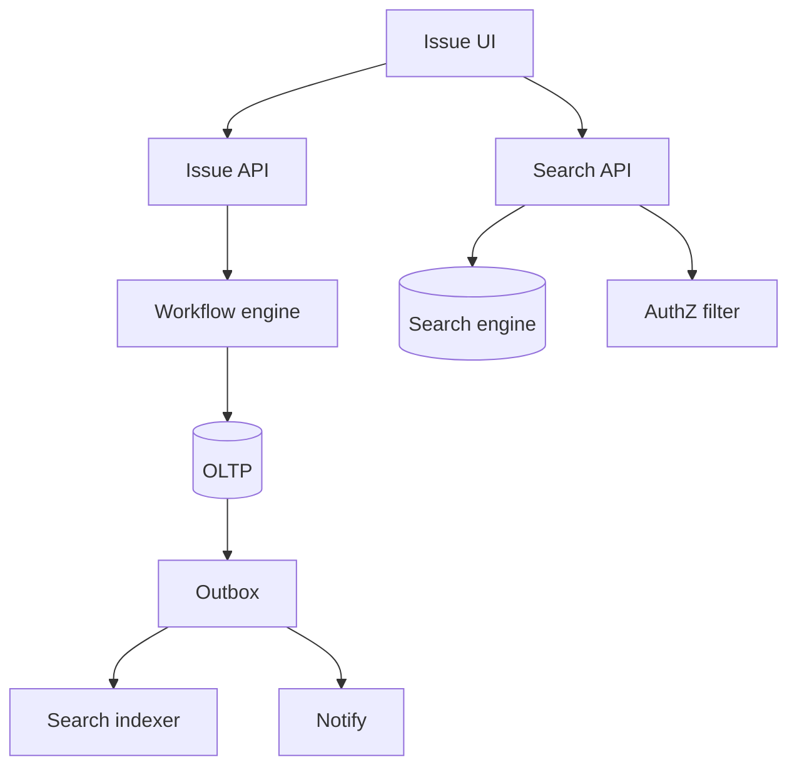
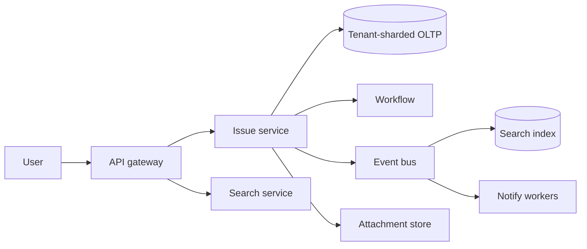
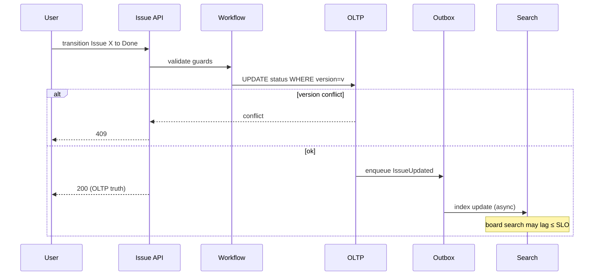

# Jira Clone Search Consistency and Workflow Topology

## Overview

A **Jira-class clone** is a B2B **issue tracker**: projects, issues, custom fields, **workflow state machines**, comments, permissions, JQL-like **search**, and notifications. Scale is lower QPS than social, but **correctness and search freshness** dominate: users notice wrong status, missing issues in filters, and permission leaks.

Synthesizes consistency selection, outbox/search indexing, partitioning by tenant/project, and notify topology for portfolio enterprise design.

## Learning Objectives

- Model workflow transitions as guarded state machines with audit
- Design search as a projection with explicit lag SLO vs OLTP truth
- Partition multi-tenant data without cross-tenant leakage
- Define permission-aware search and notify contracts
- Produce TypeScript ADR/workflow sketches

## Prerequisites

- [[09-System-Design/03-Consistency-Models-and-CAP/Strong Eventual Causal and Read-Your-Writes|Strong Eventual Causal and Read-Your-Writes]]
- [[09-System-Design/04-Partitioning-Sharding-and-Placement/Secondary Indexes Across Partitions|Secondary Indexes Across Partitions]]
- [[09-System-Design/06-Messaging-Streams-and-Async-Topologies/Ordering Partitions Idempotency and Exactly-Once Claims|Ordering and Idempotency]]
- [[09-System-Design/08-Coordination-Consensus-and-Locks/When Not to Coordinate Avoid Shared Mutable State|When Not to Coordinate]]
- [[09-System-Design/README|System Design]]

## Difficulty

`advanced`

## Estimated Time

- Reading: 2.5 hours
- Exercises: 3 hours
- Mini project: 8 hours

## History

Issue trackers began as single-DB apps with SQL filters. At enterprise scale, full-text and complex JQL forced **search engines**, while workflows and permissions stayed on OLTP. The classic bug: search returns an issue the user cannot see—or omits one just transitioned.

## Problem It Solves

- SQL `LIKE` filters dying on large tenants
- Dual-write to Elasticsearch without outbox (drift)
- Workflow transition races (two agents "Done" conflicting)
- Notification spam without issue-level watch semantics

## Capacity Back-of-Envelope

| Variable | Value |
| --- | --- |
| Tenants | 100k |
| Issues | 5B total |
| Active issues / large tenant | 5M |
| Write QPS cluster | 5k peak |
| Search QPS | 20k peak |
| Transitions / day | tens of millions |

Writes are modest vs consumer social; **index size, ACL-aware queries, and fan-out of watches** matter. Heavy tenant skew → shard by `tenant_id` / `project_id`.

## Internal Implementation

1. **OLTP issue store** — system of record; row version / optimistic lock
2. **Workflow engine** — transition graph + validators + post-functions
3. **Outbox / CDC** — issue events to search and notify
4. **Search index** — denormalized issue docs + ACL fields
5. **Watch / notify** — async; preference + batching
6. **Audit log** — append-only history of field changes
7. **Attachments** — blob store (media sketch); metadata in OLTP



## Mermaid Diagrams

### Structure — Jira-clone topology



### Sequence — transition with search lag contract



## Consistency and Failure Contract

| Concern | Contract |
| --- | --- |
| Issue fields / status | Strong on OLTP; optimistic concurrency (`version`) |
| Workflow | Only legal edges; side effects idempotent |
| Search | Eventual; lag SLO (e.g. 5–30s); never more privileged than ACL |
| Board view | Prefer OLTP or strongly consistent cache for **active sprint** if lag intolerable |
| Notify | At-least-once; dedupe by `(issueId, eventId, channel)` |
| Cross-tenant | Hard isolation; shared indexes must filter `tenant_id` first |

User-visible invariant: **after successful transition, detail page shows new status** (RYW). Search may lag—document it. See [[09-System-Design/03-Consistency-Models-and-CAP/Choosing Consistency from User-Visible Invariants|Invariants]].

## Examples

### Minimal Example — workflow edge

```typescript
export type Status = "Todo" | "InProgress" | "Done";

const EDGES: Record<Status, Status[]> = {
  Todo: ["InProgress"],
  InProgress: ["Todo", "Done"],
  Done: ["InProgress"],
};

export function canTransition(from: Status, to: Status): boolean {
  return EDGES[from].includes(to);
}
```

### Production-Shaped Example — ADR + versioned update

```typescript
/**
 * ADR-JR-01: OLTP is SoR; search is projection via outbox only.
 * ADR-JR-02: Optimistic locking on issue version for transitions.
 * ADR-JR-03: Search documents embed project roles / browse ASC for filter.
 */

export type Issue = {
  id: string;
  tenantId: string;
  status: Status;
  version: number;
  assignee?: string;
};

export function applyTransition(issue: Issue, to: Status, expectedVersion: number): Issue {
  if (issue.version !== expectedVersion) throw new Error("409 version conflict");
  if (!canTransition(issue.status, to)) throw new Error("400 illegal transition");
  return { ...issue, status: to, version: issue.version + 1 };
}

export type SearchDoc = {
  issueId: string;
  tenantId: string;
  status: Status;
  browseAcl: string[]; // role or user principals
  seq: number; // for idempotent index apply
};

export function shouldApplyIndex(currentSeq: number, incomingSeq: number): boolean {
  return incomingSeq > currentSeq;
}
```

## Trade-offs

| Dimension | Upside | Downside | When it matters |
| --- | --- | --- | --- |
| Async search | Write latency isolation | Stale boards | power users |
| Sync index | Fresher filters | Availability coupling | small deploys |
| Tenant shard | Isolation | Cross-tenant reporting hard | enterprise |
| Embed ACL in index | Fast filters | Reindex on permission change | large projects |

### When to Use

- Issue/work tracking, ITSM-lite, product management tools

### When Not to Use

- Treating search as SoR; social-scale fan-out assumptions

## Exercises

1. Permission change: 10k users lose browse—reindex strategy.
2. Design JQL: which clauses hit OLTP vs search.
3. Sprint board freshness: when to bypass search.
4. Outbox failure: rebuild index from OLTP watermark.
5. Multi-region: single primary per tenant vs read replicas ([[09-System-Design/07-Multi-Region-and-Geo/Replica Lag as User-Facing Consistency Budget|Replica Lag]]).

## Mini Project

Portfolio ADR pack: workflow, search lag SLO, tenant sharding, notify dedupe.

## Portfolio Project

Outbox→index simulator with intentional lag and ACL tests in the Workbench; contrast [[09-System-Design/12-Clone-Case-Studies-and-Portfolio/GitHub Clone Storage Notifications and Scale Limits|GitHub Clone]] search.

## Interview Questions

1. System of record for issue status?
2. How do you keep Elasticsearch consistent enough?
3. Concurrent edits / transitions?
4. Multi-tenant isolation approach?
5. Notification architecture for watchers?

### Stretch / Staff-Level

1. Custom fields schema evolution without breaking index mappings.
2. Automation rules engine isolation from OLTP hot path (bulkheads).

## Common Mistakes

- Dual-write API → DB and search in one request without transactional outbox
- Search without ACL → data leak
- Global sequential issue IDs as partition keys across tenants
- Synchronous email on every field edit

## Best Practices

- Optimistic concurrency + audit log
- Outbox/CDC only path to search
- Lag SLO + UI affordance ("may take a few seconds")
- Reindex pipelines as first-class ops
- Shed automation/notify before issue write path ([[09-System-Design/09-Failure-Modes-at-Product-Scale/Graceful Degradation and Feature Shedding|Feature Shedding]])

## Summary

A Jira clone is a **consistency and projection** problem: OLTP owns workflow truth; search and notify are async consumers with ACLs and lag budgets. Capacity is tenant-skewed, not celebrity-feed skewed. Portfolio quality means stating RYW on detail views and eventual consistency on JQL explicitly.

## Further Reading

- [[00-References/System Design/README|System Design References]]
- [[08-Databases/05-Transactions-and-Isolation/Snapshot Isolation and SSI Concepts|Snapshot Isolation]] (engine handoff)
- [[07-Backend/08-Data-Access-and-Persistence-Patterns/Handing Off to Database Engines|Backend Persistence Handoff]]

## Related Notes

- [[09-System-Design/README|System Design]]
- [[09-System-Design/11-Reference-Architectures/Search Notify Media and Payments Topology Sketches|Search Notify Sketches]]
- [[09-System-Design/06-Messaging-Streams-and-Async-Topologies/Outbox at System Scale Cross-Service Contracts|Outbox]]
- [[09-System-Design/12-Clone-Case-Studies-and-Portfolio/GitHub Clone Storage Notifications and Scale Limits|GitHub Clone]]
- [[09-System-Design/03-Consistency-Models-and-CAP/CAP and PACELC as Product Constraints|CAP and PACELC]]

## Progress Checklist

- [ ] Explained from first principles
- [ ] Drew at least one Mermaid diagram
- [ ] Implemented a minimal version
- [ ] Documented trade-offs and non-goals
- [ ] Completed exercises
- [ ] Practiced interview questions aloud
- [ ] Linked prerequisites and dependents
