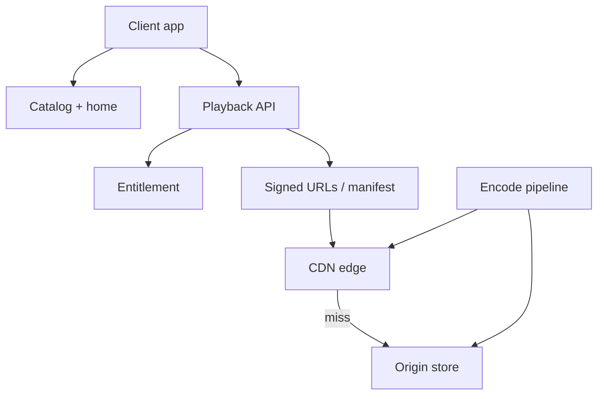
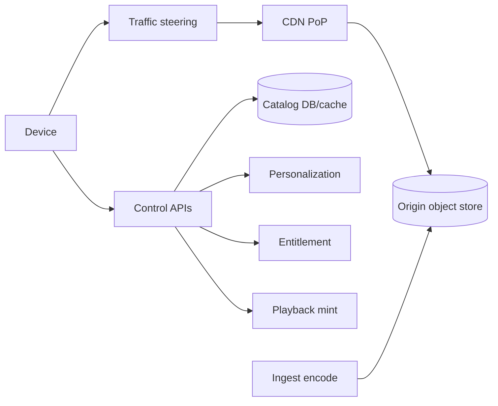
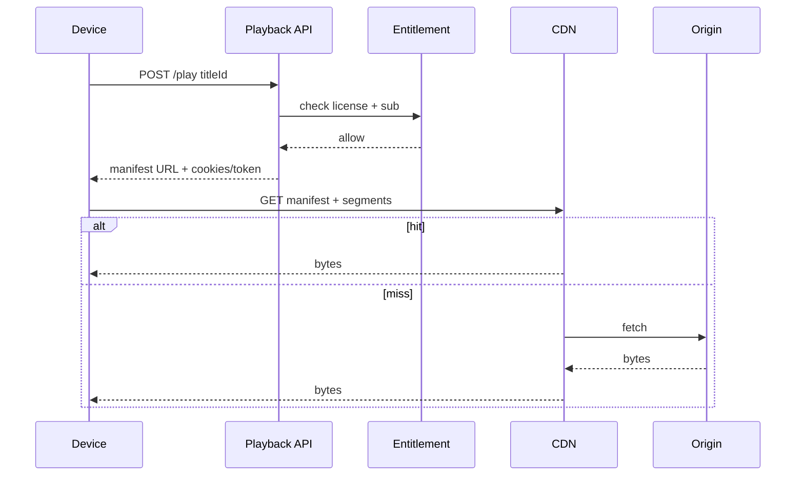

# Netflix Clone Catalog Playback and CDN

## Overview

A **Netflix-class clone** is the archetype of **read-heavy media at CDN scale**: catalog/metadata services, personalized homepage, entitlement/licensing checks, and **adaptive bitrate playback** from edge caches. Open-connect-style ISP caches are the production lesson: **move bytes next to users**; keep origin for misses and control plane.

This case study synthesizes capacity (egress), cache hierarchies, multi-region steering, and consistency for catalog vs playback tokens—not DRM crypto internals.

## Learning Objectives

- Estimate catalog QPS vs playback bandwidth separately
- Design CDN + origin topology with explicit miss paths
- Place entitlement checks without putting auth on every segment fetch naively
- State consistency for catalog updates vs in-flight playback
- Produce TypeScript ADR sketches for playback URL minting and cache keys

## Prerequisites

- [[09-System-Design/11-Reference-Architectures/Read-Heavy vs Write-Heavy Template Matrices|Read-Heavy vs Write-Heavy Matrices]]
- [[09-System-Design/01-Capacity-Latency-and-Bottlenecks/Cost Performance and Capacity Trade-offs|Cost Performance]]
- [[09-System-Design/07-Multi-Region-and-Geo/Multi-Region Active-Passive Active-Active Patterns|Multi-Region Patterns]]
- [[09-System-Design/05-Caching-at-Product-Scale/Invalidation Strategies TTL Write-Through Write-Back|Invalidation Strategies]]
- [[09-System-Design/README|System Design]]

## Difficulty

`advanced`

## Estimated Time

- Reading: 2.5 hours
- Exercises: 3 hours
- Mini project: 8 hours

## History

Streaming killed DVD mailers by solving **last-mile bandwidth**. Centralized data centers could not ship petabits; CDNs and ISP appliances absorbed hits. Catalog personalization stayed in app/control planes while the **data plane** became mostly static segment files.

## Problem It Solves

- Origin collapse during primetime
- Coupling recommendation services to segment delivery
- Catalog edits that break clients mid-play without versioned manifests
- Global users steered to distant edges

## Capacity Back-of-Envelope

| Variable | Value |
| --- | --- |
| Concurrent streams peak | 5M |
| Avg bitrate | 5 Mbps |
| Catalog page views | 50k QPS peak |
| Titles in catalog | 10k–100k |
| Segment size | ~2–10 s media |

Egress peak: \(5\text{M} \times 5\text{Mbps} = 25\) Tbps order — **impossible from one DC**; CDN hit ratio must be >95% for popular titles.

Catalog metadata: small, cacheable, higher churn than bytes. Personalization: per-user, **not** CDN-cached as full page globally without vary keys.

## Internal Implementation

1. **Catalog service** — titles, metadata, availability windows
2. **Personalization** — homepage rows (compute + cache per user segment)
3. **Entitlement** — subscription, region license
4. **Playback service** — mint signed manifest / URLs; device auth
5. **Encode pipeline** — mezzanine → ladder ABR renditions → packager
6. **CDN / Open Connect** — segments + manifests at edge
7. **Steering** — DNS/anycast to nearest healthy edge



## Mermaid Diagrams

### Structure — end-to-end playback topology



### Sequence — start playback



## Consistency and Failure Contract

| Concern | Contract |
| --- | --- |
| Catalog publish | Versioned title docs; CDN TTL + purge on takedown |
| Entitlement | Strong enough to deny promptly on cancel (short token TTL) |
| Playback token | Signed, expiring; refresh without re-encoding |
| Mid-play catalog edit | Immutable segment paths; new encode = new version prefix |
| Edge outage | Steer to next PoP; degrade bitrate before hard fail |
| Primetime overload | Admit control; shed 4K → HD ([[09-System-Design/02-Load-Balancing-and-Edge-Entry/Edge Admission Control and Global Traffic Steering|Admission]]) |

Bytes are **immutable content-addressed or version-prefixed**; metadata is **eventual at edge** with legal takedown as hard exception (purge).

## Examples

### Minimal Example — cache key

```typescript
export function segmentKey(titleId: string, version: string, bitrate: number, seq: number): string {
  return `${titleId}/${version}/${bitrate}/${seq}.m4s`;
}
```

### Production-Shaped Example — ADR sketch

```typescript
/**
 * ADR-NF-01: Control plane (catalog, entitlement, mint) separate from CDN data plane.
 * ADR-NF-02: Short-lived playback tokens; CDN validates token/cookie at edge when possible.
 * ADR-NF-03: Popular titles pre-positioned; origin protected by bulkhead + rate limit.
 */

export type PlaybackGrant = {
  titleId: string;
  version: string;
  expiresAt: number;
  allowedBitrates: number[];
};

export function mintGrant(
  titleId: string,
  version: string,
  now: number,
  ttlSec: number,
  bitrates: number[],
): PlaybackGrant {
  return { titleId, version, expiresAt: now + ttlSec * 1000, allowedBitrates: bitrates };
}

export function assertGrant(g: PlaybackGrant, now: number, bitrate: number): void {
  if (now > g.expiresAt) throw new Error("expired");
  if (!g.allowedBitrates.includes(bitrate)) throw new Error("bitrate denied");
}

export function egressTbps(concurrent: number, mbps: number): number {
  return (concurrent * mbps) / 1_000_000;
}
```

## Trade-offs

| Dimension | Upside | Downside | When it matters |
| --- | --- | --- | --- |
| Long CDN TTL | Hit ratio | Slow takedown without purge | licensing |
| Per-user homepage at edge | Fast | Cache fragmentation | personalization |
| Many ABR rungs | QoE | Storage × N | device diversity |
| Token on every segment | Secure | Edge CPU | piracy pressure |

### When to Use

- VOD streaming portfolios; "design Netflix" interviews

### When Not to Use

- User-generated live chat (Discord) or social feed bytes (Instagram still different encode path)

## Exercises

1. Compute origin request rate if CDN hit ratio drops from 99% to 90% at 25 Tbps effective.
2. Design takedown: purge + entitlement deny race.
3. Multi-region catalog: single writer vs CRDT (usually single writer).
4. Map to read-heavy template matrix row.
5. Chaos: lose one PoP during finale episode release ([[09-System-Design/09-Failure-Modes-at-Product-Scale/Chaos Blast Radius and Dependency Failure|Chaos Blast Radius]]).

## Mini Project

Capacity + steering ADR + manifest versioning write-up for portfolio.

## Portfolio Project

Simulate CDN hit/miss and origin bulkhead in the Workbench; compare to [[09-System-Design/12-Clone-Case-Studies-and-Portfolio/Instagram Clone Capacity and Media Plane|Instagram]] media plane.

## Interview Questions

1. Why can't one data center serve all video?
2. What is on the CDN vs origin?
3. How does personalization interact with caching?
4. Entitlement after subscription cancel?
5. Primetime degradation strategies?

### Stretch / Staff-Level

1. Live linear streaming vs VOD topology differences.
2. Cost model: ISP cache partnership vs pure commercial CDN.

## Common Mistakes

- Putting recommendation ML on the segment path
- Mutable segment URLs without versioning
- Infinite token lifetime
- Ignoring steering health (send users to saturated PoP)

## Best Practices

- Immutable versioned media keys
- Control vs data plane split
- Admit/shed by quality tier
- Purge path for legal/compliance with SLO
- Observe hit ratio, origin bandwidth, play start failure ([[09-System-Design/10-Observability-and-Control-Planes/Capacity Signals and Autoscaling Intents|Capacity Signals]])

## Summary

A Netflix clone is **CDN physics + control-plane entitlements**. Capacity is dominated by egress; architecture wins by pre-positioning immutable segments, minting short playback grants, and steering around bad PoPs. Catalog consistency is versioned documents; playback failure modes are bitrate and admission—not strong global consensus on every chunk.

## Further Reading

- [[00-References/System Design/README|System Design References]]
- [[09-System-Design/05-Caching-at-Product-Scale/Cache Coherence vs Acceptable Staleness|Cache Coherence vs Staleness]]
- [[09-System-Design/07-Multi-Region-and-Geo/Replica Lag as User-Facing Consistency Budget|Replica Lag Budget]]

## Related Notes

- [[09-System-Design/README|System Design]]
- [[09-System-Design/11-Reference-Architectures/URL Shortener Design End-to-End|URL Shortener]] (small-object read-heavy contrast)
- [[09-System-Design/11-Reference-Architectures/Search Notify Media and Payments Topology Sketches|Media Sketches]]
- [[09-System-Design/12-Clone-Case-Studies-and-Portfolio/Instagram Clone Capacity and Media Plane|Instagram Clone]]
- [[09-System-Design/02-Load-Balancing-and-Edge-Entry/Edge Admission Control and Global Traffic Steering|Global Traffic Steering]]

## Progress Checklist

- [ ] Explained from first principles
- [ ] Drew at least one Mermaid diagram
- [ ] Implemented a minimal version
- [ ] Documented trade-offs and non-goals
- [ ] Completed exercises
- [ ] Practiced interview questions aloud
- [ ] Linked prerequisites and dependents
