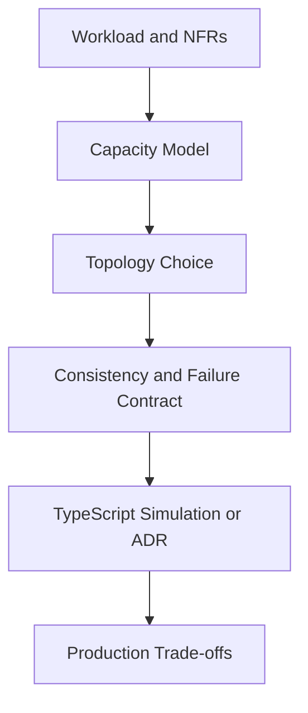
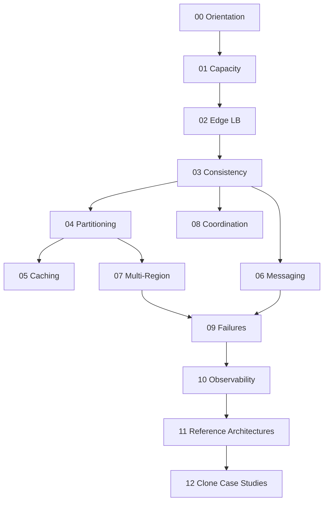

# 09 System Design

A first-principles track for **distributed product topology**: capacity and latency budgets, load balancing and edge entry, consistency models, partitioning, caching at fleet scale, messaging topologies, multi-region design, coordination, product-scale failure modes, observability of multi-service systems, and reference architectures—implemented with TypeScript simulations and ADR-heavy design artifacts.

## Objectives

- Estimate capacity and latency budgets from workload assumptions
- Choose edge, LB, and gateway topologies with explicit health/drain contracts
- Select consistency models from user-visible invariants (CAP/PACELC as product constraints)
- Design partition keys, resharding windows, and geo placement
- Compose caching, messaging, and multi-region patterns without confusing them with engine internals
- Reason about cascading failure, bulkheads, and graceful degradation across services
- Produce interview-grade and production-grade designs with ADRs and failure playbooks
- Hand off single-service patterns to Backend, engines to Databases, and platforms to DevOps

## Why This Track Matters

Backend APIs and database engines fail at *fleet* scale when topology is wrong: hot shards, multi-region split-brain policy gaps, caches that violate read-your-writes, queues without lag budgets, and “exactly-once” claims without fencing. System Design teaches the product contracts above services and engines.

## Teaching Contract

Every topic note follows:

## Scope Boundaries

| This track owns | Handoff |
| --- | --- |
| Capacity estimation, percentiles, bottleneck finding | — |
| L4/L7 LB, gateway/CDN *topology*, global traffic steering | Express middleware reliability → [[07-Backend/README\|Backend]] |
| CAP/PACELC *product* choices, quorums, conflict *policies* | Isolation/MVCC *engines* → [[08-Databases/README\|Databases]] |
| Sharding strategy, skew, resharding windows | Page/B+ layout → Databases; DS fanout pedagogy → [[04-Data-Structures/README\|Data Structures]] |
| Cache hierarchies and invalidation *at scale* | Cache-aside *client* patterns → Backend |
| Queue/log/pubsub *topology* selection | Outbox/client patterns → Backend; broker engines → Databases |
| Multi-region active-passive/active-active, RPO/RTO *product* policy | WAL shipping *mechanics* → Databases |
| Consensus/locks *for designers* | OS/kernel depth → CS; platforms → [[16-DevOps/README\|DevOps]] |
| Cascading failure, fleet bulkheads, degradation | In-process circuit breakers → Backend |
| Reference architectures and clone case studies | Enterprise DDD/modularity depth → [[17-Architecture/README\|Architecture]] |

## Prerequisites

- [[07-Backend/00-Orientation/Node Host vs Backend Product Boundary|Node Host vs Backend Product Boundary]]
- [[07-Backend/06-Reliability-and-Abuse-Resistance/Circuit Breakers and Bulkheads|Circuit Breakers and Bulkheads]]
- [[08-Databases/00-Orientation/Backend Databases and System Design Boundaries|Backend Databases and System Design Boundaries]]
- [[08-Databases/07-Replication-Mechanics/Failover Promote and Split-Brain Mechanics|Failover Promote and Split-Brain Mechanics]]
- [[05-Algorithms/13-Production-Selection-and-Interview-Patterns/From In-Memory Algorithms to Production Systems|From In-Memory Algorithms to Production Systems]]

## Roadmap

## Topics

### 00 — Orientation and Boundaries

- [[09-System-Design/00-Orientation-and-Boundaries/Why System Design Exists|Why System Design Exists]]
- [[09-System-Design/00-Orientation-and-Boundaries/Backend Databases and System Design Boundaries|Backend Databases and System Design Boundaries]]
- [[09-System-Design/00-Orientation-and-Boundaries/Requirements Non-Functional and Workload Modeling|Requirements Non-Functional and Workload Modeling]]
- [[09-System-Design/00-Orientation-and-Boundaries/Failure Domains and Blast Radius Budgets|Failure Domains and Blast Radius Budgets]]
- [[09-System-Design/00-Orientation-and-Boundaries/ADR Discipline for Distributed Decisions|ADR Discipline for Distributed Decisions]]

### 01 — Capacity Latency and Bottlenecks

- [[09-System-Design/01-Capacity-Latency-and-Bottlenecks/Back-of-Envelope Capacity Estimation|Back-of-Envelope Capacity Estimation]]
- [[09-System-Design/01-Capacity-Latency-and-Bottlenecks/Latency Budgets Percentiles and Tail Behavior|Latency Budgets Percentiles and Tail Behavior]]
- [[09-System-Design/01-Capacity-Latency-and-Bottlenecks/Throughput Queuing and Littles Law Intuition|Throughput Queuing and Littles Law Intuition]]
- [[09-System-Design/01-Capacity-Latency-and-Bottlenecks/Bottleneck Finding CPU Memory Disk Network|Bottleneck Finding CPU Memory Disk Network]]
- [[09-System-Design/01-Capacity-Latency-and-Bottlenecks/Cost Performance and Capacity Trade-offs|Cost Performance and Capacity Trade-offs]]

### 02 — Load Balancing and Edge Entry

- [[09-System-Design/02-Load-Balancing-and-Edge-Entry/Load Balancer Roles L4 vs L7|Load Balancer Roles L4 vs L7]]
- [[09-System-Design/02-Load-Balancing-and-Edge-Entry/Algorithms Round Robin Least Conn Consistent Hash|Algorithms Round Robin Least Conn Consistent Hash]]
- [[09-System-Design/02-Load-Balancing-and-Edge-Entry/Health Checks Drain and Connection Management|Health Checks Drain and Connection Management]]
- [[09-System-Design/02-Load-Balancing-and-Edge-Entry/API Gateway vs Reverse Proxy vs Service Mesh Concepts|API Gateway vs Reverse Proxy vs Service Mesh Concepts]]
- [[09-System-Design/02-Load-Balancing-and-Edge-Entry/Edge Admission Control and Global Traffic Steering|Edge Admission Control and Global Traffic Steering]]

### 03 — Consistency Models and CAP

- [[09-System-Design/03-Consistency-Models-and-CAP/CAP and PACELC as Product Constraints|CAP and PACELC as Product Constraints]]
- [[09-System-Design/03-Consistency-Models-and-CAP/Strong Eventual Causal and Read-Your-Writes|Strong Eventual Causal and Read-Your-Writes]]
- [[09-System-Design/03-Consistency-Models-and-CAP/Quorums R plus W and Tunable Consistency|Quorums R plus W and Tunable Consistency]]
- [[09-System-Design/03-Consistency-Models-and-CAP/Conflict Policies LWW and CRDT Product Use|Conflict Policies LWW and CRDT Product Use]]
- [[09-System-Design/03-Consistency-Models-and-CAP/Choosing Consistency from User-Visible Invariants|Choosing Consistency from User-Visible Invariants]]

### 04 — Partitioning Sharding and Placement

- [[09-System-Design/04-Partitioning-Sharding-and-Placement/Partition Keys Hotspots and Skew|Partition Keys Hotspots and Skew]]
- [[09-System-Design/04-Partitioning-Sharding-and-Placement/Range Hash and Directory-Based Sharding|Range Hash and Directory-Based Sharding]]
- [[09-System-Design/04-Partitioning-Sharding-and-Placement/Resharding Rebalancing and Dual-Write Windows|Resharding Rebalancing and Dual-Write Windows]]
- [[09-System-Design/04-Partitioning-Sharding-and-Placement/Data Locality Geo Placement and Affinity|Data Locality Geo Placement and Affinity]]
- [[09-System-Design/04-Partitioning-Sharding-and-Placement/Secondary Indexes Across Partitions|Secondary Indexes Across Partitions]]

### 05 — Caching at Product Scale

- [[09-System-Design/05-Caching-at-Product-Scale/Cache Hierarchies CDN Edge Regional App|Cache Hierarchies CDN Edge Regional App]]
- [[09-System-Design/05-Caching-at-Product-Scale/Invalidation Strategies TTL Write-Through Write-Back|Invalidation Strategies TTL Write-Through Write-Back]]
- [[09-System-Design/05-Caching-at-Product-Scale/Hot Keys Stampede and Thundering Herd at Scale|Hot Keys Stampede and Thundering Herd at Scale]]
- [[09-System-Design/05-Caching-at-Product-Scale/Cache Coherence vs Acceptable Staleness|Cache Coherence vs Acceptable Staleness]]
- [[09-System-Design/05-Caching-at-Product-Scale/When Caching Lies Read-Your-Writes Cross-Region|When Caching Lies Read-Your-Writes Cross-Region]]

### 06 — Messaging Streams and Async Topologies

- [[09-System-Design/06-Messaging-Streams-and-Async-Topologies/Queue vs Log vs Pub-Sub Topology Choice|Queue vs Log vs Pub-Sub Topology Choice]]
- [[09-System-Design/06-Messaging-Streams-and-Async-Topologies/Ordering Partitions Idempotency and Exactly-Once Claims|Ordering Partitions Idempotency and Exactly-Once Claims]]
- [[09-System-Design/06-Messaging-Streams-and-Async-Topologies/Backpressure Consumer Lag and Load Shedding|Backpressure Consumer Lag and Load Shedding]]
- [[09-System-Design/06-Messaging-Streams-and-Async-Topologies/Fan-out Broadcast and Notification Architectures|Fan-out Broadcast and Notification Architectures]]
- [[09-System-Design/06-Messaging-Streams-and-Async-Topologies/Outbox at System Scale Cross-Service Contracts|Outbox at System Scale Cross-Service Contracts]]

### 07 — Multi-Region and Geo

- [[09-System-Design/07-Multi-Region-and-Geo/Single-Primary Multi-Primary and Leaderless Product Views|Single-Primary Multi-Primary and Leaderless Product Views]]
- [[09-System-Design/07-Multi-Region-and-Geo/Sync Async and Semi-Sync as Latency SLOs|Sync Async and Semi-Sync as Latency SLOs]]
- [[09-System-Design/07-Multi-Region-and-Geo/Multi-Region Active-Passive Active-Active Patterns|Multi-Region Active-Passive Active-Active Patterns]]
- [[09-System-Design/07-Multi-Region-and-Geo/Failover RPO RTO and Split-Brain Product Policy|Failover RPO RTO and Split-Brain Product Policy]]
- [[09-System-Design/07-Multi-Region-and-Geo/Replica Lag as User-Facing Consistency Budget|Replica Lag as User-Facing Consistency Budget]]

### 08 — Coordination Consensus and Locks

- [[09-System-Design/08-Coordination-Consensus-and-Locks/Leader Election Use Cases and Failure Modes|Leader Election Use Cases and Failure Modes]]
- [[09-System-Design/08-Coordination-Consensus-and-Locks/Consensus Intuition Raft and Paxos for Designers|Consensus Intuition Raft and Paxos for Designers]]
- [[09-System-Design/08-Coordination-Consensus-and-Locks/Distributed Locks Leases and Fencing Tokens|Distributed Locks Leases and Fencing Tokens]]
- [[09-System-Design/08-Coordination-Consensus-and-Locks/Clocks Skew Ordering and Happens-Before|Clocks Skew Ordering and Happens-Before]]
- [[09-System-Design/08-Coordination-Consensus-and-Locks/When Not to Coordinate Avoid Shared Mutable State|When Not to Coordinate Avoid Shared Mutable State]]

### 09 — Failure Modes at Product Scale

- [[09-System-Design/09-Failure-Modes-at-Product-Scale/Cascading Multi-Service Failure|Cascading Multi-Service Failure]]
- [[09-System-Design/09-Failure-Modes-at-Product-Scale/Zone and Fleet Bulkheads|Zone and Fleet Bulkheads]]
- [[09-System-Design/09-Failure-Modes-at-Product-Scale/Graceful Degradation and Feature Shedding|Graceful Degradation and Feature Shedding]]
- [[09-System-Design/09-Failure-Modes-at-Product-Scale/Chaos Blast Radius and Dependency Failure|Chaos Blast Radius and Dependency Failure]]
- [[09-System-Design/09-Failure-Modes-at-Product-Scale/Multi-Service Incident Playbooks|Multi-Service Incident Playbooks]]

### 10 — Observability and Control Planes

- [[09-System-Design/10-Observability-and-Control-Planes/SLIs SLOs Error Budgets for Multi-Service Systems|SLIs SLOs Error Budgets for Multi-Service Systems]]
- [[09-System-Design/10-Observability-and-Control-Planes/Distributed Tracing Correlation Across Regions|Distributed Tracing Correlation Across Regions]]
- [[09-System-Design/10-Observability-and-Control-Planes/Cardinality and Metric Topology Risks|Cardinality and Metric Topology Risks]]
- [[09-System-Design/10-Observability-and-Control-Planes/Capacity Signals and Autoscaling Intents|Capacity Signals and Autoscaling Intents]]
- [[09-System-Design/10-Observability-and-Control-Planes/Progressive Delivery of Distributed Systems|Progressive Delivery of Distributed Systems]]

### 11 — Reference Architectures

- [[09-System-Design/11-Reference-Architectures/URL Shortener Design End-to-End|URL Shortener Design End-to-End]]
- [[09-System-Design/11-Reference-Architectures/Feed Timeline Fan-out Push Pull Hybrid|Feed Timeline Fan-out Push Pull Hybrid]]
- [[09-System-Design/11-Reference-Architectures/Chat Presence Typing and Message Ordering|Chat Presence Typing and Message Ordering]]
- [[09-System-Design/11-Reference-Architectures/Search Notify Media and Payments Topology Sketches|Search Notify Media and Payments Topology Sketches]]
- [[09-System-Design/11-Reference-Architectures/Read-Heavy vs Write-Heavy Template Matrices|Read-Heavy vs Write-Heavy Template Matrices]]

### 12 — Clone Case Studies and Portfolio

- [[09-System-Design/12-Clone-Case-Studies-and-Portfolio/Instagram Clone Capacity and Media Plane|Instagram Clone Capacity and Media Plane]]
- [[09-System-Design/12-Clone-Case-Studies-and-Portfolio/Discord Clone Realtime Fan-out and Presence|Discord Clone Realtime Fan-out and Presence]]
- [[09-System-Design/12-Clone-Case-Studies-and-Portfolio/Netflix Clone Catalog Playback and CDN|Netflix Clone Catalog Playback and CDN]]
- [[09-System-Design/12-Clone-Case-Studies-and-Portfolio/Jira Clone Search Consistency and Workflow Topology|Jira Clone Search Consistency and Workflow Topology]]
- [[09-System-Design/12-Clone-Case-Studies-and-Portfolio/GitHub Clone Storage Notifications and Scale Limits|GitHub Clone Storage Notifications and Scale Limits]]

## Suggested Study Order

1. Orientation (00) and Capacity (01) before edge and consistency
2. Edge/LB (02) and Consistency (03) before partitioning and caching
3. Partitioning (04), Caching (05), Messaging (06) as data-plane topology
4. Multi-Region (07) and Coordination (08) before product-scale failures
5. Failures (09) and Observability (10) before reference architectures
6. Reference Architectures (11) and Clone Case Studies (12) as synthesis

## Mini Projects

- [[09-System-Design/projects/Capacity Estimator Lab/README|Capacity Estimator Lab]]
- [[09-System-Design/projects/Load Balancer From Scratch/README|Load Balancer From Scratch]]
- [[09-System-Design/projects/Shard Router and Hotspot Clinic/README|Shard Router and Hotspot Clinic]]
- [[09-System-Design/projects/Consistency and Quorum Demo/README|Consistency and Quorum Demo]]
- [[09-System-Design/projects/Multi-Region Failover Playbook Lab/README|Multi-Region Failover Playbook Lab]]

## Portfolio Project

- [[09-System-Design/projects/Distributed Systems Workbench/README|Distributed Systems Workbench]]

## Exercises

Module sets live under [[09-System-Design/_exercises/README|System Design Exercises]].

## Interview Questions

Module sets live under [[09-System-Design/_interview/README|System Design Interview Questions]].

## Implementation Checklist

- [x] Capacity estimator + latency percentile aggregator
- [x] Consistent-hash ring + virtual nodes
- [x] Load balancer simulator (health/drain)
- [x] Quorum N/R/W consistency demo
- [x] Partition/skew simulator
- [x] Cache stampede at fleet scale sketch
- [x] Queue topology with lag/backpressure
- [x] Multi-region failover policy model (RPO/RTO)
- [x] Fencing-token lease demo
- [x] Five mini projects + Distributed Systems Workbench

## Code Labs

See [[09-System-Design/code/README|System Design code labs]].

## References

- [[00-References/System Design/README|System Design References]]

## Related Tracks

- [[07-Backend/README|Backend]]
- [[08-Databases/README|Databases]]
- [[05-Algorithms/README|Algorithms]]
- [[06-NodeJS/README|Node.js]]
- [[16-DevOps/README|DevOps]]
- [[17-Architecture/README|Architecture]]
- [[18-Security/README|Security]]
- [[Career/README|Career]]

## Stage Gate Checklist

- [ ] Can estimate capacity and set latency/error budgets from NFRs
- [ ] Can choose consistency, partitioning, and multi-region patterns with ADRs
- [ ] Can design LB/cache/messaging topologies without confusing them with engines
- [ ] Can reason about cascading failure and blast-radius budgets
- [ ] Labs green; at least three mini projects and portfolio docs completed
- [ ] Interview sets practiced with diagrams and production failure modes
