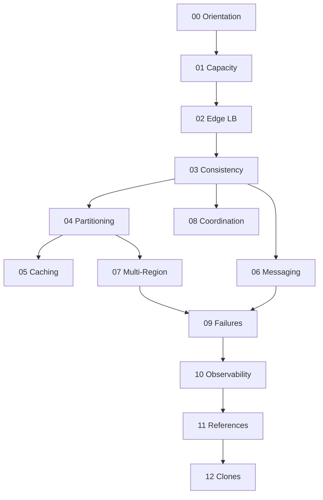

# System Design Exercises

Thirteen module sets move from product boundaries and ADRs through capacity and latency budgets, edge/LB topology, consistency, partitioning, caching, messaging, multi-region policy, coordination, fleet failure modes, observability control planes, reference architectures, and clone portfolio synthesis.

## Learning Path

## Exercise Sets

1. [[09-System-Design/_exercises/00-Orientation-and-Boundaries|00 Orientation and Boundaries]] — separate System Design from Backend/Databases, model NFRs and blast-radius budgets, draft ADRs before topology
2. [[09-System-Design/_exercises/01-Capacity-Latency-and-Bottlenecks|01 Capacity Latency and Bottlenecks]] — back-of-envelope capacity, percentile budgets, Little's Law, bottleneck finding, cost/performance trade-offs
3. [[09-System-Design/_exercises/02-Load-Balancing-and-Edge-Entry|02 Load Balancing and Edge Entry]] — L4/L7 roles, LB algorithms, health/drain, gateway vs mesh, global steering and admission control
4. [[09-System-Design/_exercises/03-Consistency-Models-and-CAP|03 Consistency Models and CAP]] — CAP/PACELC as product constraints, consistency models, quorums, conflict policies, user-visible invariants
5. [[09-System-Design/_exercises/04-Partitioning-Sharding-and-Placement|04 Partitioning Sharding and Placement]] — partition keys and skew, sharding strategies, resharding windows, geo affinity, cross-partition indexes
6. [[09-System-Design/_exercises/05-Caching-at-Product-Scale|05 Caching at Product Scale]] — cache hierarchies, invalidation, hot keys/stampedes, coherence vs staleness, read-your-writes across regions
7. [[09-System-Design/_exercises/06-Messaging-Streams-and-Async-Topologies|06 Messaging Streams and Async Topologies]] — queue vs log vs pub-sub, ordering/idempotency, backpressure, fan-out, outbox at system scale
8. [[09-System-Design/_exercises/07-Multi-Region-and-Geo|07 Multi-Region and Geo]] — primary topologies, sync modes as SLOs, active-passive/active-active, RPO/RTO and split-brain policy, lag budgets
9. [[09-System-Design/_exercises/08-Coordination-Consensus-and-Locks|08 Coordination Consensus and Locks]] — leader election, Raft/Paxos intuition, leases and fencing, clocks/ordering, when not to coordinate
10. [[09-System-Design/_exercises/09-Failure-Modes-at-Product-Scale|09 Failure Modes at Product Scale]] — cascading failure, fleet bulkheads, graceful degradation, chaos blast radius, multi-service playbooks
11. [[09-System-Design/_exercises/10-Observability-and-Control-Planes|10 Observability and Control Planes]] — multi-service SLOs, cross-region tracing, cardinality risks, autoscaling intents, progressive delivery
12. [[09-System-Design/_exercises/11-Reference-Architectures|11 Reference Architectures]] — URL shortener, feed fan-out, chat/presence, search/notify/media/payments sketches, read vs write matrices
13. [[09-System-Design/_exercises/12-Clone-Case-Studies-and-Portfolio|12 Clone Case Studies and Portfolio]] — Instagram, Discord, Netflix, Jira, and GitHub clone designs with capacity and failure contracts

## Completion Standard

- State NFRs, workload model, and failure domains before drawing boxes.
- Progress through **Understand → Model → Design → Stress Failure → Production Scenario** with diagrams and ADRs.
- Prefer product contracts over engine trivia; hand off to [[07-Backend/README|Backend]] and [[08-Databases/README|Databases]] where appropriate.
- Stress drills must name blast radius, degradation path, and rollback.
- Production scenarios include telemetry, rollout, and multi-region policy.

## Related Notes

- [[09-System-Design/README|System Design]]
- [[09-System-Design/code/README|System Design code labs]]
- [[09-System-Design/_interview/README|System Design Interview Questions]]
- [[Career/README|Career]]
