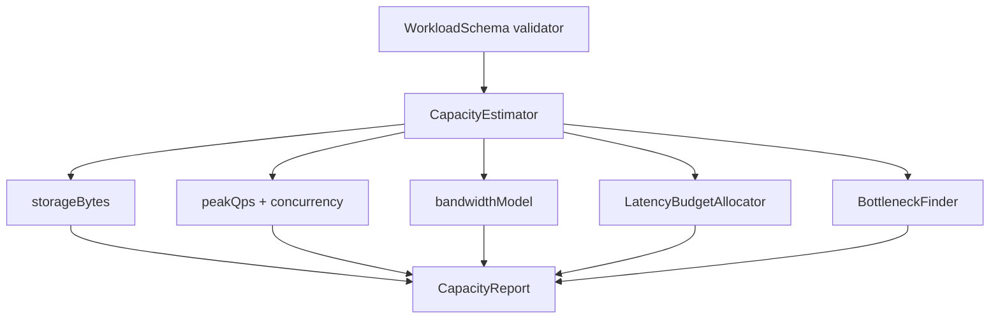

# Architecture — Capacity Estimator Lab

## Summary

A pure TypeScript estimator: no HTTP server, no cloud APIs. Workload JSON in → capacity/latency/bottleneck report out. Target module: `09-System-Design/code/src/capacity-estimator.ts`.

## Component Diagram

## Formula Boundaries (Scaffold)

| Model | Teaching formula | Explicit non-claim |
| --- | --- | --- |
| Storage | `writes/day × avgBytes × retention × RF × (1+headroom)` | Ignores compression, tombstones, index overhead unless opted in |
| Concurrency | `L = λ × W` (Little’s Law) | Assumes stable mean service time |
| Bandwidth | peak QPS × avg payload × direction factor | Ignores TLS/header overhead unless configured |
| Latency budget | fixed share table summing to ≤ SLO | Not a measured p99 trace |

## Scaffold Notes

1. Keep all math in pure functions with bigint or decimal-safe integers for byte counts.
2. Reject NaN/Infinity; clamp with `LIMIT_EXCEEDED` rather than silent wrap.
3. Export types from the Workbench facade; CLI only validates and serializes.
4. Pair with [[09-System-Design/01-Capacity-Latency-and-Bottlenecks/Back-of-Envelope Capacity Estimation|Back-of-Envelope Capacity Estimation]] for narrative method.

## Related Documents

- [[09-System-Design/projects/Capacity Estimator Lab/README|README]]
- [[09-System-Design/projects/Distributed Systems Workbench/API|Workbench API]]
