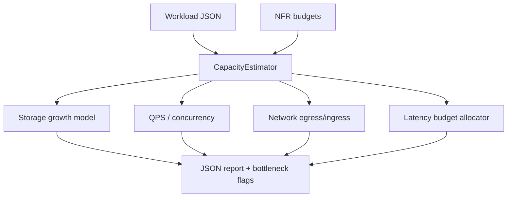

# Capacity Estimator Lab

## Overview

Turn workload assumptions (QPS, payload size, read/write mix, retention) into **back-of-envelope capacity models**: storage growth, request throughput, bandwidth, and latency budget allocation—with explicit uncertainty bands, not false precision.

## Goals

- Encode NFR-driven capacity estimation as typed inputs → deterministic JSON reports.
- Surface bottlenecks (CPU, memory, disk, network) from Little’s Law and queueing intuition.
- Link estimate outputs to percentile latency budgets and cost/performance trade-offs.
- Produce interview-grade and production-grade capacity narratives with stated assumptions.

## Prerequisites

- [[09-System-Design/00-Orientation-and-Boundaries/Requirements Non-Functional and Workload Modeling|Requirements Non-Functional and Workload Modeling]]
- [[09-System-Design/01-Capacity-Latency-and-Bottlenecks/Back-of-Envelope Capacity Estimation|Back-of-Envelope Capacity Estimation]]
- [[09-System-Design/01-Capacity-Latency-and-Bottlenecks/Latency Budgets Percentiles and Tail Behavior|Latency Budgets Percentiles and Tail Behavior]]
- [[09-System-Design/01-Capacity-Latency-and-Bottlenecks/Throughput Queuing and Littles Law Intuition|Throughput Queuing and Littles Law Intuition]]
- [[09-System-Design/01-Capacity-Latency-and-Bottlenecks/Bottleneck Finding CPU Memory Disk Network|Bottleneck Finding CPU Memory Disk Network]]
- [[09-System-Design/01-Capacity-Latency-and-Bottlenecks/Cost Performance and Capacity Trade-offs|Cost Performance and Capacity Trade-offs]]
- [[09-System-Design/code/README|System Design Code Labs]]

## Architecture

See [[09-System-Design/projects/Capacity Estimator Lab/Architecture|Architecture]] for input schema and formula boundaries.

## Spec

| Concern | Spec |
| --- | --- |
| Inputs | DAU/MAU or QPS, avg/p99 payload bytes, R/W ratio, retention days, replication factor, headroom % |
| Outputs | storage TiB, peak QPS, concurrent in-flight, bandwidth Gbps, latency budget table, bottleneck enum |
| Determinism | Same inputs → identical JSON (sorted keys); no wall-clock in report body |
| Honesty | Report lists assumptions and ± uncertainty; never claims measured production capacity |
| Limits | Cap retention days, replication factor, and QPS to prevent overflow / hang |
| Code targets | `capacity-estimator.ts`, percentile helpers; tests in `09-System-Design/code/tests` |

## Acceptance Criteria

- [ ] Estimator accepts typed workload + NFR JSON and rejects invalid schemas with stable error codes.
- [ ] Storage model includes payload × writes × retention × replication × headroom.
- [ ] Throughput model derives peak QPS and concurrent in-flight via Little’s Law given service time assumption.
- [ ] Latency budget allocator splits end-to-end SLO across edge, app, datastore, and async lag shares that sum ≤ 100%.
- [ ] Bottleneck finder flags at least one of CPU / memory / disk / network when utilization exceeds configured threshold.
- [ ] Report JSON is deterministic and includes `assumptions[]` and `uncertainty`.
- [ ] Unit tests cover happy path + overflow/limit rejection; no network I/O required.

## Stretch

1. Cost model: map capacity units to cloud SKU estimates with explicit FX/region disclaimer.
2. Sensitivity analysis: vary one input ±20% and rank which assumption moves storage/QPS most.
3. Import a clone case study workload (URL shortener or feed) and produce a portfolio capacity appendix.

## Related Notes

- [[09-System-Design/projects/Capacity Estimator Lab/Architecture|Architecture]]
- [[09-System-Design/projects/Distributed Systems Workbench/README|Distributed Systems Workbench]]
- [[09-System-Design/README|System Design MOC]]
- [[09-System-Design/code/README|System Design Code Labs]]
- [[09-System-Design/11-Reference-Architectures/URL Shortener Design End-to-End|URL Shortener Design End-to-End]]
- [[Career/README|Career]]

## Progress Checklist

- [ ] Scaffold `capacity-estimator` module + Vitest fixtures
- [ ] Wire CLI command `dsw capacity estimate --input … --json`
- [ ] Cross-link estimate report into Workbench reference architecture gallery
- [ ] Document formula limitations vs measured APM capacity
- [ ] Mark mini project complete in track Implementation Checklist
