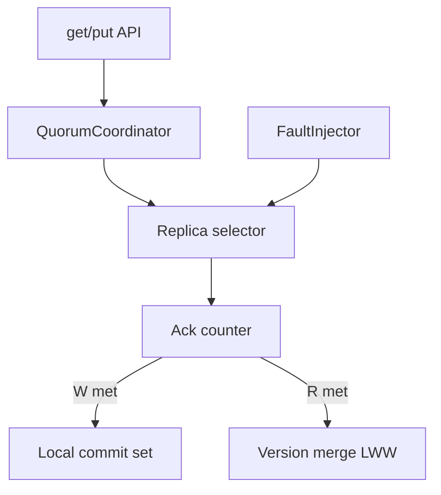

# Architecture — Consistency and Quorum Demo

## Summary

Simulated replica set with quorum coordinator. Teaches R+W vs N product contracts—not consensus internals (see [[09-System-Design/08-Coordination-Consensus-and-Locks/Consensus Intuition Raft and Paxos for Designers|Consensus Intuition]]).

## Component Diagram

## Teaching Defaults (ADR-003)

| Parameter | Default | Rationale |
| --- | --- | --- |
| N | 3 | Smallest odd production teaching set |
| R | 2 | Overlaps W for strong-ish reads |
| W | 2 | Survives one replica loss on write |
| Conflict | LWW by version | Simple, inspectable |

## Failure Injection (Scaffold)

| Fault | Effect |
| --- | --- |
| `down` | Replica never acks |
| `slow` | Ack after delay steps |
| `partition` | Subset unreachable from coordinator |

## Scaffold Notes

1. Use step clock; never sleep in unit tests.
2. Version compare must be total order for LWW (tie-break on replica id).
3. Keep CRDT out of v1 defaults—stretch only.
4. Document that `R+W>N` is necessary but not sufficient for linearizability under all timings.

## Related Documents

- [[09-System-Design/projects/Consistency and Quorum Demo/README|README]]
- [[09-System-Design/projects/Distributed Systems Workbench/ADR/ADR-003 Quorum Teaching Defaults|ADR-003]]
