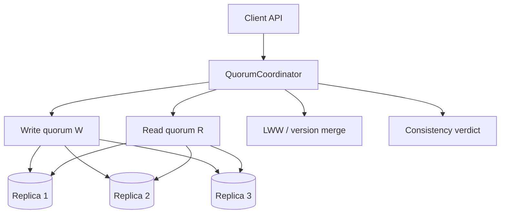

# Consistency and Quorum Demo

## Overview

Demonstrate **tunable consistency** with N/R/W quorums on a simulated replica set: show when `R + W > N` yields read-your-writes / strong-ish reads, when stale reads appear, and how conflict policies (LWW) interact with partial failures—without implementing Raft or a real database.

## Goals

- Make N, R, W configurable and observable in a step-clock replica simulator.
- Prove teaching defaults (per ADR-003) and contrast weaker/stronger quorum pairs.
- Surface stale read, write rejection, and replica lag scenarios with classified outcomes.
- Connect CAP/PACELC product language to concrete quorum math.

## Prerequisites

- [[09-System-Design/03-Consistency-Models-and-CAP/CAP and PACELC as Product Constraints|CAP and PACELC as Product Constraints]]
- [[09-System-Design/03-Consistency-Models-and-CAP/Strong Eventual Causal and Read-Your-Writes|Strong Eventual Causal and Read-Your-Writes]]
- [[09-System-Design/03-Consistency-Models-and-CAP/Quorums R plus W and Tunable Consistency|Quorums R plus W and Tunable Consistency]]
- [[09-System-Design/03-Consistency-Models-and-CAP/Conflict Policies LWW and CRDT Product Use|Conflict Policies LWW and CRDT Product Use]]
- [[09-System-Design/03-Consistency-Models-and-CAP/Choosing Consistency from User-Visible Invariants|Choosing Consistency from User-Visible Invariants]]
- [[09-System-Design/projects/Distributed Systems Workbench/ADR/ADR-003 Quorum Teaching Defaults|ADR-003 Quorum Teaching Defaults]]
- [[09-System-Design/code/README|System Design Code Labs]]

## Architecture

See [[09-System-Design/projects/Consistency and Quorum Demo/Architecture|Architecture]] for default N/R/W and failure injection.

## Spec

| Concern | Spec |
| --- | --- |
| Defaults | N=3, R=2, W=2 (ADR-003); configurable |
| Version | Monotonic logical clock or `(lamport, replicaId)` tuples |
| Conflict | Last-write-wins by version; CRDT optional stretch |
| Failures | Inject replica down / slow / partitioned for a step range |
| Verdicts | `ok`, `stale_read`, `write_rejected`, `quorum_unavailable` |
| Code targets | `quorum-store.ts`, `replica-set.ts`, `consistency-scenarios.ts` |

## Acceptance Criteria

- [ ] With defaults N=3,R=2,W=2, overlapping read/write quorums return latest value after successful write (no injected lag).
- [ ] With R=1,W=1, demo produces classified `stale_read` under replica lag or asymmetric visibility.
- [ ] Write fails with `quorum_unavailable` when fewer than W replicas acknowledge.
- [ ] Read fails or returns partial policy when fewer than R replicas respond (policy documented).
- [ ] Scenario runner executes named fixtures (`ryw`, `stale-read`, `write-reject`) deterministically.
- [ ] Does not implement Raft/Paxos commit protocol—quorum acknowledgements only.
- [ ] Tests assert version monotonicity and ADR-003 defaults as package defaults.

## Stretch

1. Causal consistency session store (vector clocks) for read-your-writes across clients.
2. Compare LWW vs simple OR-set CRDT on concurrent increments.
3. Tie quorum latency to multi-region RTT table from Failover lab.

## Related Notes

- [[09-System-Design/projects/Consistency and Quorum Demo/Architecture|Architecture]]
- [[09-System-Design/projects/Distributed Systems Workbench/README|Distributed Systems Workbench]]
- [[09-System-Design/README|System Design MOC]]
- [[09-System-Design/code/README|System Design Code Labs]]
- [[08-Databases/05-Transactions-and-Isolation/Isolation Levels and Product Defaults|Isolation Levels]] (engine handoff)
- [[Career/README|Career]]

## Progress Checklist

- [ ] Implement replica set + N/R/W coordinator
- [ ] Golden scenarios for stale vs quorum-strong reads
- [ ] Expose `dsw quorum run --scenario … --json`
- [ ] Document defaults in Workbench ADR-003 and API
- [ ] Mark mini project complete in track Implementation Checklist
