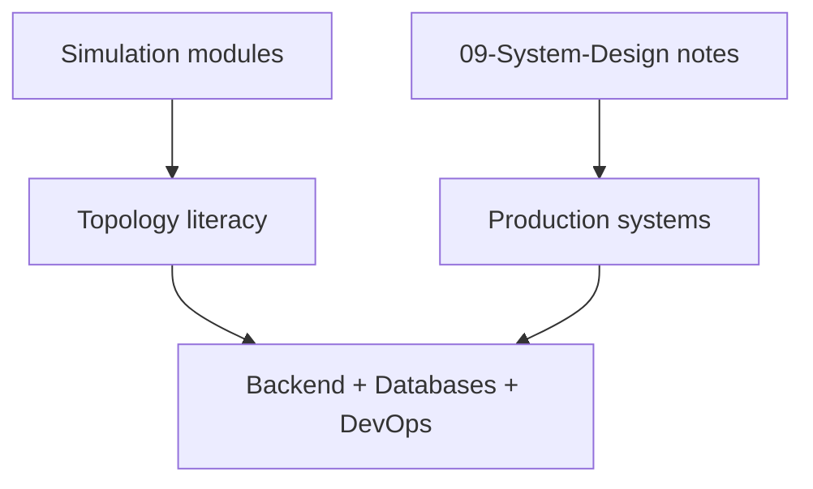

# ADR-001: Simulation Scope

## Status

Accepted on 2026-07-23.

## Context

Learners need inspectable implementations of capacity models, LB affinity, quorums, sharding, and failover policy—but rebuilding Express stacks, ORMs, database engines, or Kubernetes would imply false production parity and blur handoffs to [[07-Backend/README|Backend]], [[08-Databases/README|Databases]], and [[16-DevOps/README|DevOps]].

## Decision

Implement **small, testable TypeScript simulation modules** with explicit limits: deterministic step clocks, resource ceilings, JSON CLI, and documented gaps. **Exclude** Express/ORM reimplementation, DB engine internals, and container orchestration from this workbench.

## Options Considered

| Option | Pros | Cons |
| --- | --- | --- |
| Educational simulations (chosen) | Testable, honest, modular | Not production systems |
| Mini product stack (Express + ORM + k8s) | Feels “real” | Years of scope; wrong track ownership |
| Wiki-only, no code | Low maintenance | No executable evidence |
| Embed real Envoy/Postgres/k8s | Real behavior | Hides topology math; heavy platform coupling |

## Consequences

Tests lock simulation invariants, not vendor release notes. Documentation links Backend/Databases/DevOps for adjacent depth. Portfolio README states non-goals prominently.

## Follow-ups

- Track implemented vs target modules in [[09-System-Design/projects/Distributed Systems Workbench/Known Issues|Known Issues]].
- Revisit scope only via new ADR if adding real network proxies or orchestration APIs.

## Related Documents

- [[09-System-Design/projects/Distributed Systems Workbench/Architecture|Architecture]]
- [[09-System-Design/00-Orientation-and-Boundaries/Backend Databases and System Design Boundaries|Backend Databases and System Design Boundaries]]
