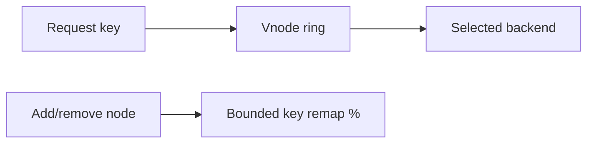

# ADR-002: Consistent-Hash Default

## Status

Accepted on 2026-07-23.

## Context

Load-balancing pedagogy often starts with round-robin because it is easy, but production sticky sessions, cache affinity, and shard-aware routing make **consistent hashing** the more important mental model. The workbench must pick one default algorithm so CLI demos and tests stay coherent.

## Decision

Default the load-balancer simulator to **consistent hashing with virtual nodes**. Round-robin and least-connections remain selectable strategies for contrast labs, but package and CLI defaults use the ring.

## Options Considered

| Option | Pros | Cons |
| --- | --- | --- |
| Consistent hash default (chosen) | Teaches affinity + bounded remap | Slightly harder first demo |
| Round-robin default | Simplest | Under-teaches production affinity |
| Least-connections default | Good for uneven backends | Weak remap story |
| Maglev-only | Modern L7 realism | Heavier; defer to Ideas |

## Consequences

Remap-ratio tests become first-class acceptance for membership changes. Health/drain must exclude unhealthy/draining nodes from the ring for **new** assignments. Maglev remains an optional stretch (I-001).

## Follow-ups

- Document vnode default count in API and LB mini project Architecture.
- Add golden remap fixtures with fixed sample size and seed.

## Related Documents

- [[09-System-Design/projects/Load Balancer From Scratch/README|Load Balancer From Scratch]]
- [[09-System-Design/02-Load-Balancing-and-Edge-Entry/Algorithms Round Robin Least Conn Consistent Hash|Algorithms Round Robin Least Conn Consistent Hash]]
