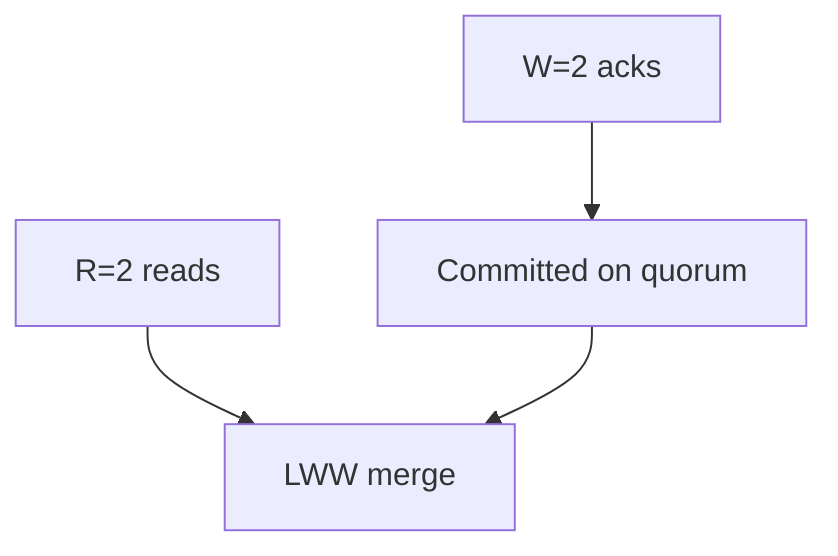

# ADR-003: Quorum Teaching Defaults

## Status

Accepted on 2026-07-23.

## Context

Tunable consistency confuses learners when every demo starts from arbitrary N/R/W. A small odd replica set with overlapping read/write quorums makes the `R + W > N` rule observable before exploring weaker pairs and conflict policies.

## Decision

Default quorum teaching parameters to **N=3, R=2, W=2** with **LWW-by-version** conflict resolution. Weaker pairs (e.g., R=1,W=1) and stronger pairs remain available as named scenarios, but are not package defaults.

## Options Considered

| Option | Pros | Cons |
| --- | --- | --- |
| N=3,R=2,W=2 (chosen) | Clear overlap; survives one failure | Not “maximum availability” |
| N=3,R=1,W=1 | Shows stale reads fast | Bad default—normalizes weak consistency |
| N=5,R=3,W=3 | Closer to some prod clusters | Slower demos; more fault matrix |
| Raft defaults instead of quorum KV | Real consensus | Wrong layer; conflicts with ADR-001 |

## Consequences

Scenario catalog must include both default success paths and weaker stale-read demos. Documentation states that overlapping quorums are not a full linearizability proof. CRDTs stay stretch-only.

## Follow-ups

- Encode defaults in `QuorumCoordinator` constructor and CLI schema.
- Golden fixtures: `ryw`, `stale-read`, `write-reject`, `quorum-unavailable`.

## Related Documents

- [[09-System-Design/projects/Consistency and Quorum Demo/README|Consistency and Quorum Demo]]
- [[09-System-Design/03-Consistency-Models-and-CAP/Quorums R plus W and Tunable Consistency|Quorums R plus W and Tunable Consistency]]
