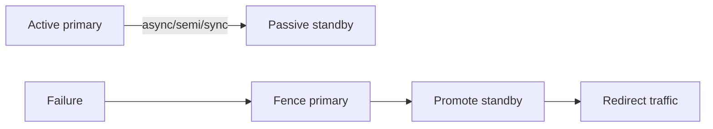

# ADR-004: Active-Passive vs Active-Active Teaching Default

## Status

Accepted on 2026-07-23.

## Context

Multi-region labs explode in complexity when active-active (conflict resolution, multi-primary writes, client stickiness) is the default. Most product failover playbooks still start from **active-passive** with explicit RPO/RTO and fencing. The workbench needs one default topology so playbook fixtures stay teachable.

## Decision

Default multi-region failover teaching to **active-passive**. Active-active is available behind an explicit topology flag and documented conflict expectations, but is not the package or CLI default.

## Options Considered

| Option | Pros | Cons |
| --- | --- | --- |
| Active-passive default (chosen) | Clear fence/promote story; RPO/RTO measurable | Less coverage of multi-primary conflicts |
| Active-active default | Modern “global write” buzz | Split-brain + conflict noise early |
| Leaderless default | Interesting quorum tie-in | Too many moving parts for first playbook |
| Cloud-provider specific HA | Real runbooks | Violates ADR-001; vendor lock pedagogy |

## Consequences

Playbook steps emphasize detect → fence → promote → redirect → verify. Active-active scenarios must declare conflict policy (e.g., LWW or reject) and are graded as stretch/advanced. Sync/async/semi-sync modes remain orthogonal to topology default.

## Follow-ups

- Default `FailoverPolicy.topology` to `active-passive` with `fenceRequired: true`.
- Add active-active fixture only after quorum conflict lab is stable.

## Related Documents

- [[09-System-Design/projects/Multi-Region Failover Playbook Lab/README|Multi-Region Failover Playbook Lab]]
- [[09-System-Design/07-Multi-Region-and-Geo/Multi-Region Active-Passive Active-Active Patterns|Multi-Region Active-Passive Active-Active Patterns]]
