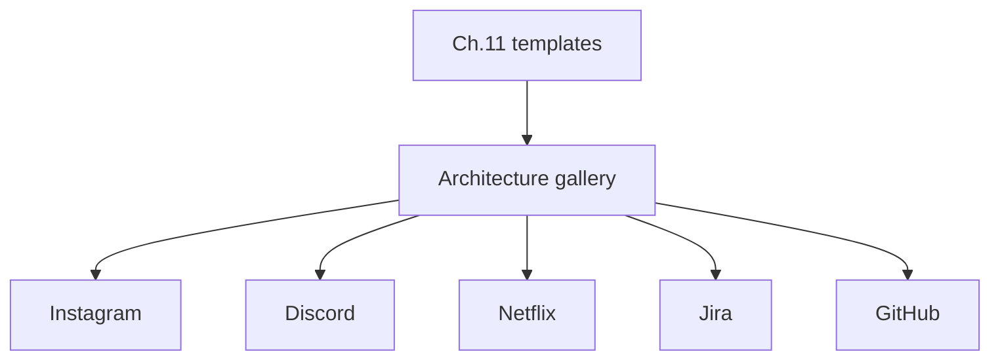

# ADR-005: Clone-Case Study Selection

## Status

Accepted on 2026-07-23.

## Context

Clone case studies are high-leverage portfolio artifacts but unbounded (“build every unicorn”) destroys focus. The track already defines five wiki clones; the workbench gallery must select and prioritize which topologies the sims and ADRs support first.

## Decision

Curate the reference architecture gallery and portfolio clone set to these **five** case studies (matching track chapter 12):

1. Instagram — capacity + media plane
2. Discord — realtime fan-out + presence
3. Netflix — catalog + playback + CDN
4. Jira — search consistency + workflow topology
5. GitHub — storage + notifications + scale limits

Gallery metadata links wiki notes; the workbench does **not** ship full clone applications. URL shortener / feed / chat sketches remain under reference architectures (chapter 11) as supporting templates.

## Options Considered

| Option | Pros | Cons |
| --- | --- | --- |
| Five track clones (chosen) | Aligns with MOC; covers media/realtime/CDN/workflow/storage | Omits many interview prompts |
| Unlimited clone backlog | Marketing breadth | No completion; shallow ADRs |
| Only URL shortener | Easy end-to-end | Misses multi-region/realtime depth |
| Full runnable clones in-repo | Impressive demos | Violates ADR-001; huge maintenance |

## Consequences

`architecture-gallery` exports only curated IDs. Mini projects map generically; clone-specific capacity/failover narratives attach as fixtures later. New clones require a superseding ADR or Ideas promotion with owner + learning outcome.

## Follow-ups

- Seed gallery JSON with wiki paths for all five clones + chapter 11 templates.
- Add one capacity fixture and one failover narrative per clone as stretch after P2.

## Related Documents

- [[09-System-Design/12-Clone-Case-Studies-and-Portfolio/Instagram Clone Capacity and Media Plane|Instagram Clone]]
- [[09-System-Design/12-Clone-Case-Studies-and-Portfolio/Discord Clone Realtime Fan-out and Presence|Discord Clone]]
- [[09-System-Design/12-Clone-Case-Studies-and-Portfolio/Netflix Clone Catalog Playback and CDN|Netflix Clone]]
- [[09-System-Design/12-Clone-Case-Studies-and-Portfolio/Jira Clone Search Consistency and Workflow Topology|Jira Clone]]
- [[09-System-Design/12-Clone-Case-Studies-and-Portfolio/GitHub Clone Storage Notifications and Scale Limits|GitHub Clone]]
- [[09-System-Design/README|System Design MOC]]
