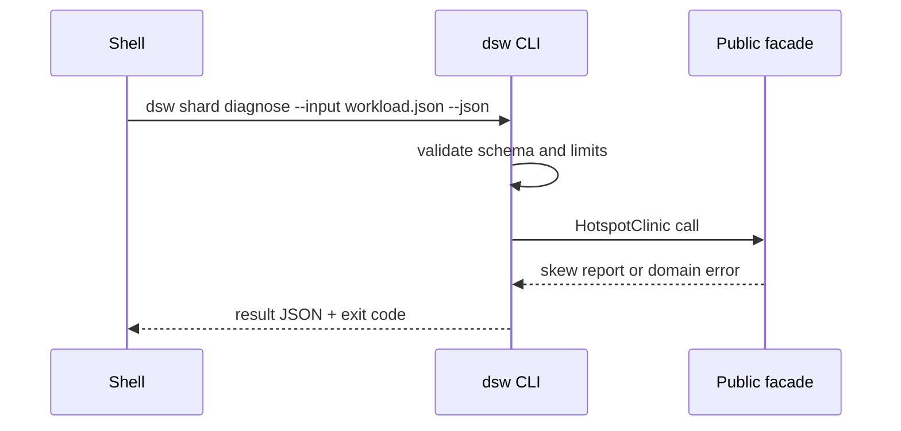

# API — Distributed Systems Workbench

## Library Surface

| Module | Symbols | Contract summary |
| --- | --- | --- |
| capacity-estimator | `estimateCapacity`, `allocateLatencyBudget` | workload → capacity report |
| consistent-hash | `ConsistentHashRing`, `remapRatio` | vnode ring placement |
| load-balancer | `LoadBalancer`, `selectBackend` | algorithm strategies + pool |
| health-drain | `HealthChecker`, `DrainController` | healthy/unhealthy/draining |
| shard-router | `ShardRouter`, `routeKey` | range/hash/directory |
| skew-metrics | `HotspotClinic`, `maxMeanRatio` | skew report |
| reshard-window | `ReshardPlanner`, `DualWriteWindow` | dual-write conflicts |
| quorum-store | `QuorumCoordinator`, `put`, `get` | N/R/W |
| replica-set | `ReplicaSet`, `injectFault` | fault injection |
| failover-policy | `FailoverPolicy`, `validatePolicy` | RPO/RTO |
| failover-playbook | `runPlaybook` | detect→fence→promote→verify |
| architecture-gallery | `listArchitectures`, `getCloneCase` | wiki-linked catalog |

Source: [[09-System-Design/code/src|09-System-Design/code/src]]. Educational APIs—not drop-in replacements for Envoy, DNS, or production datastores.

## CLI Contract (Target)

Syntax: `dsw <capacity|lb|shard|quorum|failover|gallery> --input <json> --json`

The adapter reads bounded JSON, writes one JSON result to stdout, diagnostics to stderr, and never executes input as code.

## Error Model

| Exit | Code | Meaning | Caller action |
| --- | --- | --- | --- |
| 0 | OK | Completed | Consume stdout |
| 2 | INVALID_INPUT | Parse/schema failure | Correct input |
| 3 | DOMAIN_ERROR | Quorum/failover/ring failure | Inspect details |
| 4 | IO_ERROR | Fixture/path failure | Check paths |
| 5 | LIMIT_EXCEEDED | Caps on keys/replicas/steps | Reduce workload |
| 70 | INTERNAL_ERROR | Unexpected defect | Preserve stderr and report |

## Compatibility

Semantic versioning applies after first tagged release. Export names, JSON fields, exit codes, and scenario names are compatibility surfaces. Production system parity is not.

## Related Documents

- [[09-System-Design/projects/Distributed Systems Workbench/Requirements|Requirements]]
- [[09-System-Design/projects/Distributed Systems Workbench/Testing|Testing]]
