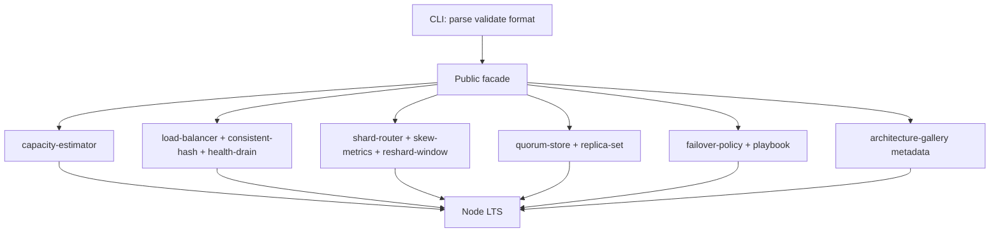
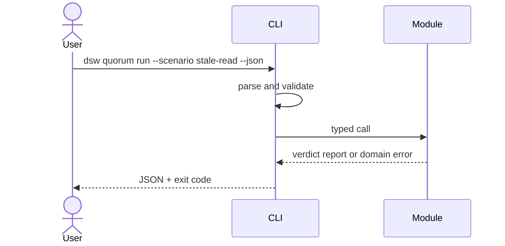

# Architecture — Distributed Systems Workbench

## Summary

A modular monolith: one installable package (`@seb/distributed-systems-workbench` target name in [[09-System-Design/code|09-System-Design/code]]), independent domain modules, no application server. The CLI validates and serializes input; domain modules own simulation behavior.

## Data Flow

## Key Components

| Component | Responsibility | Boundary |
| --- | --- | --- |
| Public facade | Stable exports and semver | No topology policy in CLI |
| CLI adapter (`dsw`) | Parsing, limits, JSON, exit codes | No domain logic |
| Capacity estimator | Storage/QPS/bandwidth/budgets | Not APM or cloud cost API |
| LB + consistent hash | Affinity, health, drain | Not Envoy/nginx |
| Shard router + clinic | Strategies + skew | Not DB partitioning DDL |
| Quorum demo | N/R/W + LWW | Not Raft/Paxos |
| Failover playbook | RPO/RTO policy sim | Not cloud DNS/k8s |
| Architecture gallery | Metadata + wiki links | Not deployable reference apps |

## Supporting Mini Projects

Each mini project README maps to one module family. Portfolio integrates them under one facade without merging unrelated invariants (capacity math ≠ quorum versions ≠ failover fencing).

## Quality Attributes

- **Correctness:** deterministic seeds/step clocks; golden scenario fixtures.
- **Security:** no `eval`, no required secrets; see [[09-System-Design/projects/Distributed Systems Workbench/Security|Security]].
- **Performance:** bounded keys, replicas, steps; benchmarks gate demonstrated regressions only.
- **Operability:** structured stderr diagnostics; stdout remains machine-readable JSON from CLI.

## Trade-offs

One package simplifies learning but couples releases. Consistent-hash default (ADR-002) prioritizes affinity pedagogy over round-robin simplicity. Quorum defaults N=3,R=2,W=2 (ADR-003) teach overlapping quorums first. Active-passive failover default (ADR-004) reduces split-brain teaching noise before active-active. Clone gallery selection (ADR-005) limits portfolio sprawl to five case studies.

## Decisions

- [[09-System-Design/projects/Distributed Systems Workbench/ADR/ADR-001 Simulation Scope|ADR-001: Simulation Scope]]
- [[09-System-Design/projects/Distributed Systems Workbench/ADR/ADR-002 Consistent-Hash Default|ADR-002: Consistent-Hash Default]]
- [[09-System-Design/projects/Distributed Systems Workbench/ADR/ADR-003 Quorum Teaching Defaults|ADR-003: Quorum Teaching Defaults]]
- [[09-System-Design/projects/Distributed Systems Workbench/ADR/ADR-004 Active-Passive vs Active-Active Teaching Default|ADR-004: Active-Passive vs Active-Active]]
- [[09-System-Design/projects/Distributed Systems Workbench/ADR/ADR-005 Clone-Case Study Selection|ADR-005: Clone-Case Study Selection]]

## Related Documents

- [[09-System-Design/projects/Distributed Systems Workbench/API|API]]
- [[09-System-Design/projects/Distributed Systems Workbench/Testing|Testing]]
