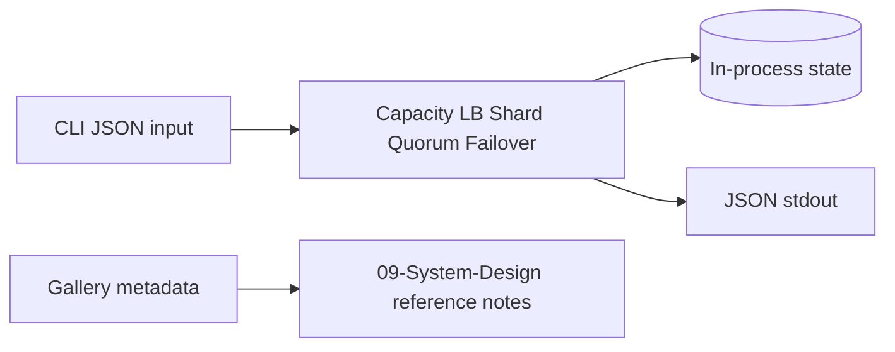

# Database — Distributed Systems Workbench

## Status: Simulation State Only (Not a Product Database)

This portfolio implements **in-memory topology simulations in TypeScript** for teaching. It does not ship a production database product, managed service, ORM schema, or replication engine.

## Data Stance

| Concern | Approach |
| --- | --- |
| Authoritative product DB | **N/A** — use real engines in production; study them in [[08-Databases/README\|Databases]] |
| Replica / shard state | In-memory maps with version/offset surrogates |
| Workload fixtures | JSON under `09-System-Design/code/tests/fixtures` |
| Gallery metadata | Static JSON/Markdown links to wiki reference architectures |
| Secrets | None required for core labs |
| Persistence | Optional lab export of reports only; not durability teaching |

## Module Storage Map

| Module | State |
| --- | --- |
| Capacity | Stateless pure functions |
| LB | Ring + backend health table |
| Shard | Partition maps + counters |
| Quorum | Replica key-value + versions |
| Failover | Region roles + lag offsets |
| Gallery | Read-only catalog |

## Related Documents

- [[09-System-Design/projects/Distributed Systems Workbench/ADR/ADR-001 Simulation Scope|ADR-001]]
- [[08-Databases/projects/Database Engines Workbench/README|Database Engines Workbench]] (engine literacy handoff)
