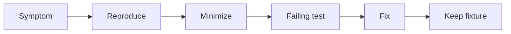

# Debug Diary — Distributed Systems Workbench

## Investigation Index

| Date | Observation | Finding | Prevention | Status |
| --- | --- | --- | --- | --- |
| 2026-07-23 | Portfolio requested integrated workbench while code tree is greenfield | Facade/CLI not yet present; module docs reference target paths under `09-System-Design/code/src` | Mark CLI as target; gate release claims on tarball smoke + contract tests | tracked |
| 2026-07-23 | Consistent-hash remap % easy to mis-test with tiny key samples | Need large fixed sample + seed | Golden remap fixtures with documented sample size | tracked |
| 2026-07-23 | Quorum scenarios can flake if wall clocks used | Need step clock only | Ban timers in unit tests | tracked |
| 2026-07-23 | Failover RTO easy to “pass” by omitting detection delay | Detection must consume budget | Include detection latency in playbook accounting | tracked |

## Debug Protocol

Reproduce with smallest fixture, capture Node/Vitest versions and exact command, classify contract versus implementation failure, add failing test, then fix without weakening assertions. Preserve ring dumps, quorum timelines, skew histograms, and playbook step traces when relevant.

## Related Documents

- [[09-System-Design/projects/Distributed Systems Workbench/Known Issues|Known Issues]]
- [[09-System-Design/projects/Distributed Systems Workbench/Testing|Testing]]
