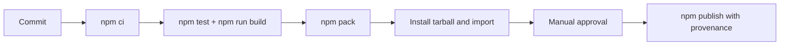

# Deployment — Distributed Systems Workbench

## Environments

| Environment | Purpose | Promotion rule |
| --- | --- | --- |
| local | implementation and focused tests | `npm install` and `npm test` pass |
| CI | reproducible multi-platform verification | required checks and package smoke pass |
| npm release | immutable library/CLI artifact | reviewed tag, provenance, manual approval |



## Release and Rollback

Build from [[09-System-Design/code|09-System-Design/code]] using `package.json` exports map. Inspect `npm pack` contents before publishing. Pin CI Node LTS versions; use least-privilege publish tokens. npm versions are immutable: rollback means deprecating the bad version, restoring last known-good recommendation, and publishing a corrected semver.

## Local Bootstrap

```bash
cd 09-System-Design/code
npm install
npm test
npm run build
# target: npx dsw --help
```

## Non-Deployment Clarification

This package is **not** deployed as a multi-region service. Simulations run locally or in CI. Production topology deployment belongs to [[16-DevOps/README|DevOps]] and product ops.

## Related Documents

- [[09-System-Design/projects/Distributed Systems Workbench/Security|Security]]
- [[09-System-Design/projects/Distributed Systems Workbench/Monitoring|Monitoring]]
