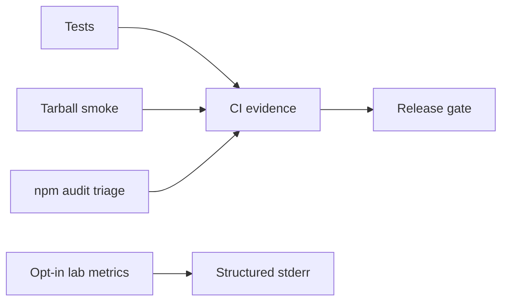

# Monitoring — Distributed Systems Workbench

## Operability Model

This is a local library/CLI, not an always-on multi-region service; uptime SLOs would be misleading. Release health is measured through CI, tarball smoke tests, issue trends, and opt-in lab diagnostics.

| Signal | Target | Evidence |
| --- | --- | --- |
| Supported-platform verification | 100% required jobs pass | CI checks |
| Tarball smoke success | 100% before publish | install/import run |
| Deterministic CLI errors | 100% contract tests | exit-code suite |
| Critical dependency exposure | 0 unmitigated releasable findings | audit record |
| Scenario regression | golden fixtures unchanged | quorum/failover/skew suites |

## Lab Diagnostics (Opt-In)

With explicit `DSW_DEBUG=1`, report command, duration bucket, workload size bucket, module, and stable error code—never raw secrets or oversized key dumps on stdout.

## Related Documents

- [[09-System-Design/projects/Distributed Systems Workbench/Deployment|Deployment]]
- [[09-System-Design/10-Observability-and-Control-Planes/SLIs SLOs Error Budgets for Multi-Service Systems|SLIs SLOs Error Budgets]]
